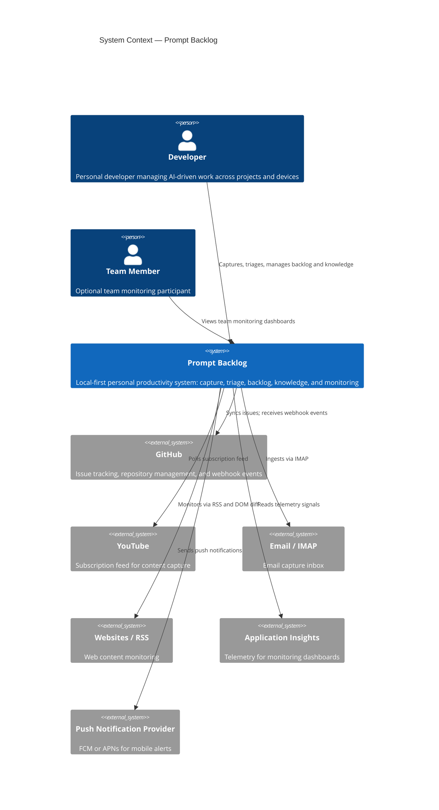

# 03. Context and Scope

```meta
status: active
```

Prompt Backlog's boundary, the external systems it depends on, and the internal
domain boundaries that shape its scope.

## Business Context

```meta
status: active
related: [".arc42/01-introduction-and-goals.md#requirements-overview"]
```



### Domain boundary: Capture vs. Inbox

The most important internal boundary distinguishes *how items enter* from *what
happens after arrival*:

| Concern | Owner |
|---|---|
| How items enter the system (sources, polling, syncing) | **Capture** |
| What happens to items after arrival (triage, classify, route) | **Inbox** |

Capture delivers normalized `InboxItem`s to the Inbox incoming queue. The current
recommendation keeps capture tightly coupled to Inbox as one pipeline
(raw input → triage → route), with an optional future split if capture tooling
becomes independently owned (tracked in
`.arc42/11-risks-and-technical-debt.md`).

## External Interfaces

```meta
status: active
```

| External system | Direction | Interface | Purpose |
|---|---|---|---|
| **GitHub** | out / in | HTTPS, `gh` CLI, webhooks | Issue sync (out), webhook events forwarded via cloud (in) |
| **YouTube** | in | HTTPS (API) | Poll subscribed channels for content capture |
| **Websites / RSS** | in | HTTPS (RSS, DOM diff) | Monitor sites for new content |
| **Email / IMAP** | in | IMAP | Ingest configured mailboxes as inbox items |
| **Package Registries** (npm, NuGet, PyPI) | in | HTTPS | Dependency scanning for Repository Management |
| **Application Insights** | in | HTTPS | Read telemetry signals for monitoring dashboards |
| **Push Provider** (FCM / APNs) | out | HTTPS | Deliver push notifications to the mobile app |

All inbound polling interfaces (YouTube, Websites, Email) are driven by **local
desktop workers**, so their credentials never leave the user's machine.

## Access Channels (Scope)

```meta
status: active
related: [".arc42/05-building-block-view.md#container-view"]
```

Three cross-domain access channels plus one optional platform component are in scope:

| Channel / component | Role |
|---|---|
| **Desktop App** | Local-first full client; runs all fetch workers and manages all domains. |
| **Mobile App** | Mobile-first, offline-first capture; syncs via cloud. |
| **IDE Extensions** | VS Code & Visual Studio integration for backlog/knowledge browsing and capture. |
| **Cloud Service** (optional) | Thin sync/coordination layer: device sync, webhook forwarding, push, machine registry. |
