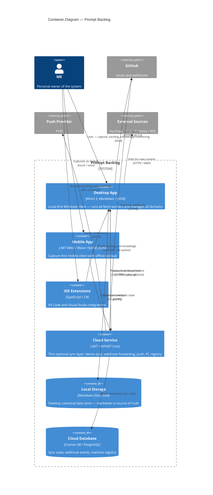
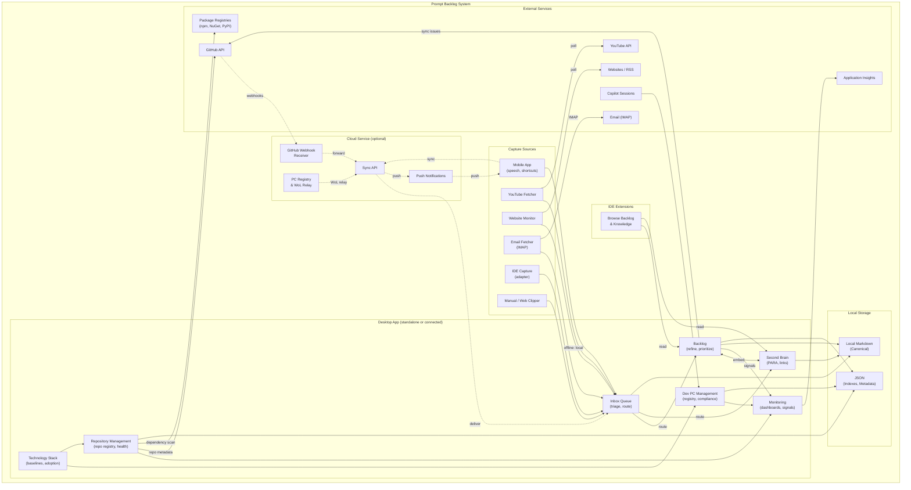
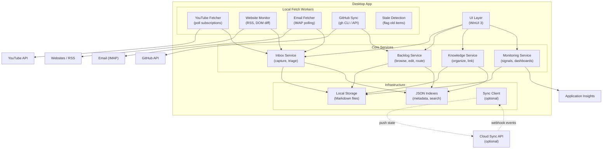
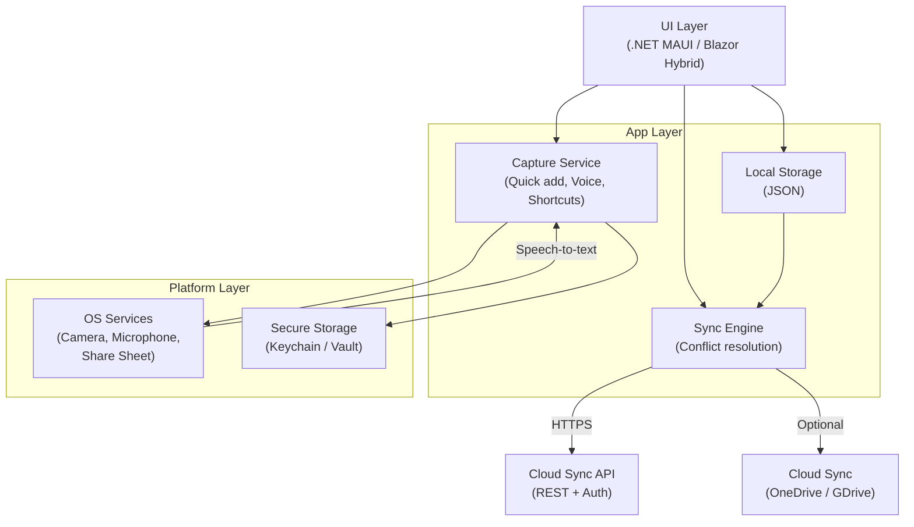
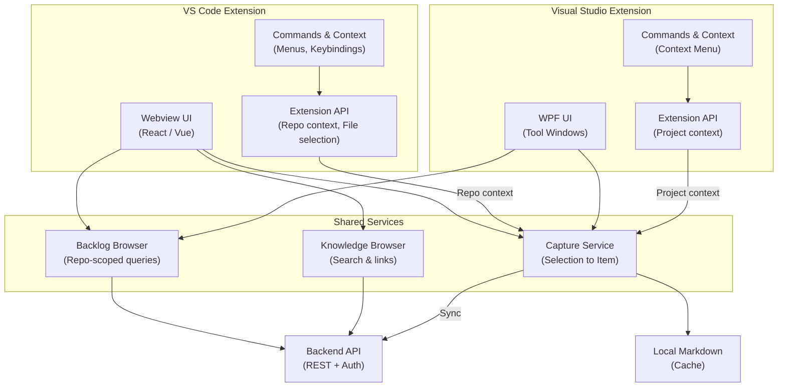
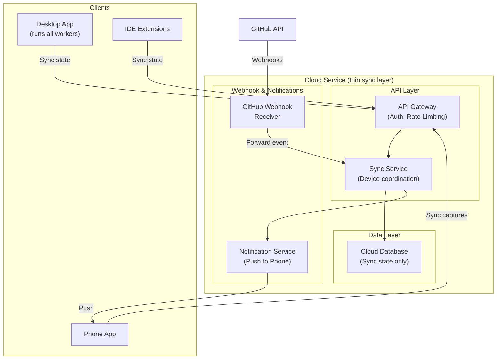

# 05. Building Block View

```meta
status: active
```

Static decomposition of Prompt Backlog, from the system-level container view down to
the internal structure of each access channel.

## Container View

```meta
status: active
related: [".arc42/03-context-and-scope.md#access-channels-scope", ".domain/context-map.md"]
```

Container boundaries below are the deployable/runtime split; the domains they
serve (Capture, Inbox, Backlog Management, Second Brain, Monitoring, Technology
Stack, Dev PC Management, Repository Management) are defined in
`.domain/context-map.md` and each context's own `.domain/<context>/domain.md` —
this view does not restate domain responsibilities.



### System-level flow



## Desktop App

```meta
status: active
related: [".arc42/06-runtime-view.md#backlog-entry-to-github-issue"]
```

Local-first Windows client. Serves Capture, Inbox, Backlog Management, Second Brain, Monitoring, Technology Stack, Dev PC Management, and Repository Management. It runs in two seamless modes: **Standalone** (no cloud) and
**Connected** (adds cloud sync, phone access, and webhook forwarding).



Local fetch workers keep external credentials on the machine, work offline (queuing
fetches), and give the user full control over frequency and retry behavior.

## Mobile App

```meta
status: active
related: [".arc42/06-runtime-view.md#mobile-capture-and-sync", ".arc42/06-runtime-view.md#sync-item-lifecycle"]
```

Android-first, offline-first capture app. Serves Capture, Inbox,
and lightweight Backlog Management. It owns mobile UI, push plumbing, and sync
transport, but not domain lifecycle rules.



## IDE Extensions

```meta
status: active
related: [".arc42/06-runtime-view.md#ide-context-aware-capture"]
```

Repo-aware integrations for VS Code and Visual Studio. Serve Inbox (capture intake),
Backlog Management, and Second Brain browsing. IDE packaging, extension-host APIs, and
release cadence are architecture concerns; domain lifecycle rules stay with the
owning domains.



## Cloud Service

```meta
status: active
related: [".arc42/06-runtime-view.md#state-sync-and-webhook-forwarding", ".arc42/07-deployment-view.md#cloud-deployment-azure"]
```

A thin sync and coordination layer — deliberately not the backbone. It coordinates
device sync, receives and forwards GitHub webhooks, sends push notifications, and hosts a Remote PC registry / Wake-on-LAN relay. It stores minimal, mostly TTL-based state — never domain data or external credentials.



Cloud components:

| Component | Responsibility |
|---|---|
| **API Gateway & Auth** | Minimal REST surface; GitHub OAuth for webhook registration; JWT device sessions; rate limiting. |
| **Sync Service** | The only domain-aware service; stores sync *state* (not domain data); delta push/pull, conflict listing/resolution. |
| **GitHub Webhook Receiver** | Validates HMAC-SHA256, stores events (TTL 24h), forwards to desktop; never processes domain data. |
| **Notification Service** | Push to phone (FCM); SSE/WebSocket to desktop for real-time forwarding. |
| **Remote PC Registry & WoL Relay** | Register machines, heartbeat, Wake-on-LAN relay, connection details. |


