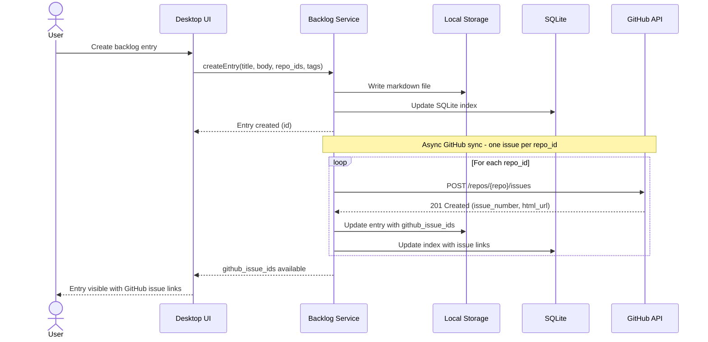
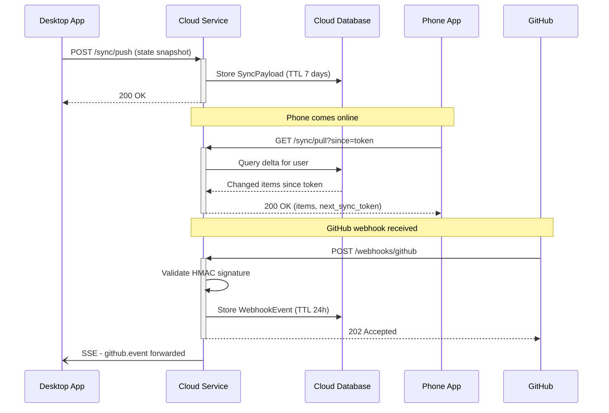
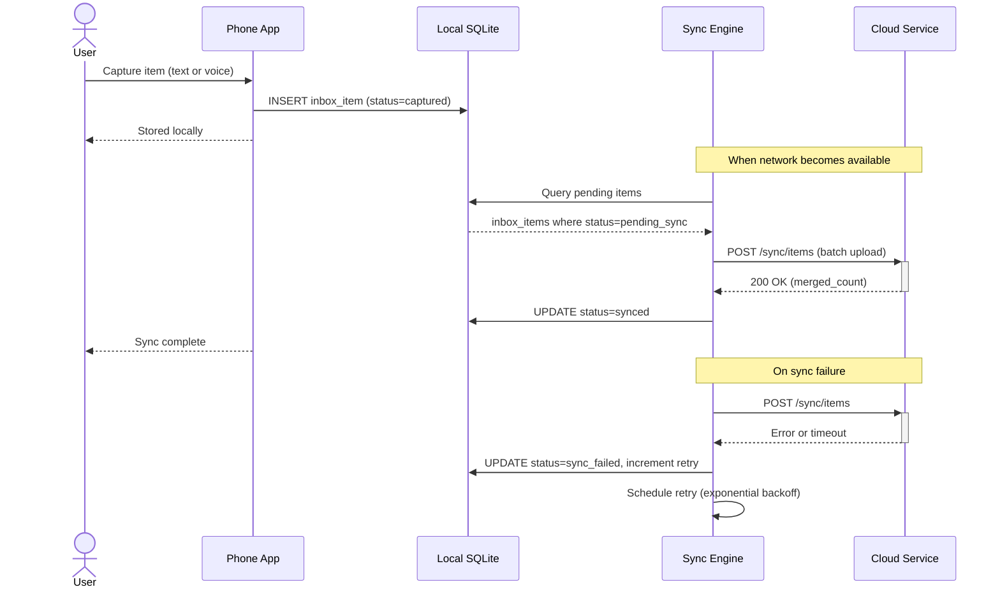
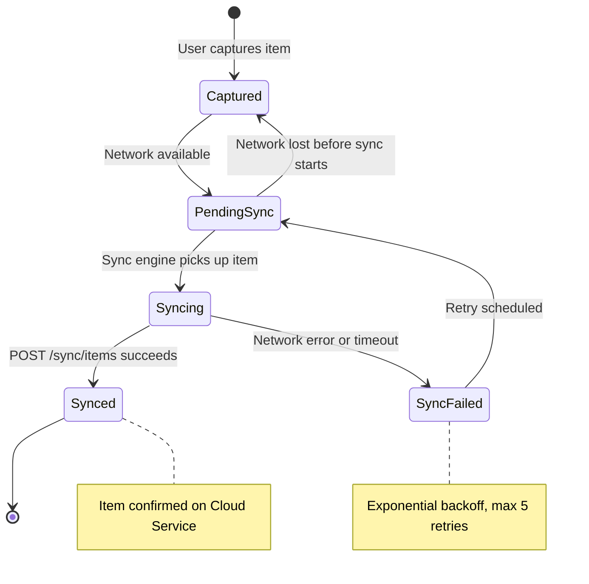
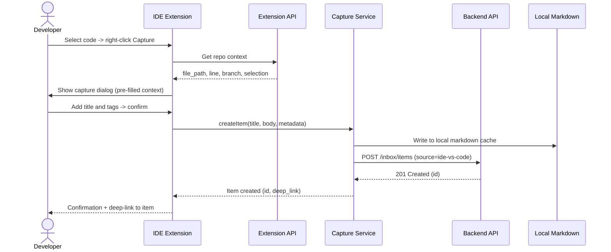
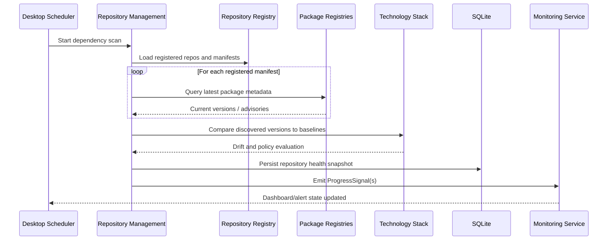
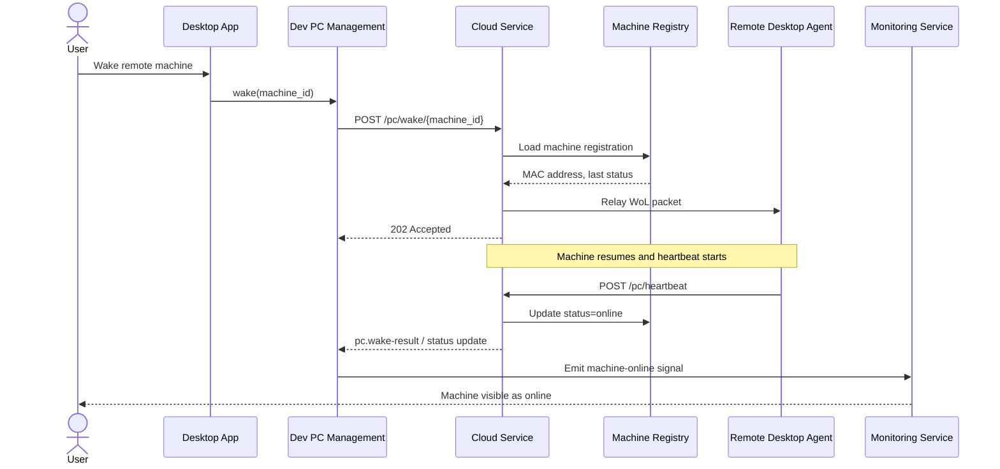

# 06. Runtime View

```meta
status: active
related: [".arc42/05-building-block-view.md"]
```

Key runtime scenarios that exercise the building blocks from chapter 05 and show how
the local-first and thin-cloud strategies play out dynamically.

## Backlog Entry to GitHub Issue

```meta
status: active
related: [".arc42/05-building-block-view.md#desktop-app"]
```

Creating a backlog entry writes markdown locally first, then asynchronously creates
one GitHub issue per targeted repo.



## State Sync and Webhook Forwarding

```meta
status: active
related: [".arc42/05-building-block-view.md#cloud-service"]
```

In connected mode the desktop pushes state snapshots to the cloud, the phone pulls
deltas, and GitHub webhooks are validated and forwarded to the desktop.



## Mobile Capture and Sync

```meta
status: active
related: [".arc42/05-building-block-view.md#mobile-app"]
```

Captures are stored locally first and flushed to the cloud when the network is
available, with exponential-backoff retry on failure.



## Sync Item Lifecycle

```meta
status: active
related: [".arc42/05-building-block-view.md#mobile-app"]
```



## IDE Context-aware Capture

```meta
status: active
related: [".arc42/05-building-block-view.md#ide-extensions"]
```

Selecting code in the IDE captures it with repo context (file, line, branch) into the
local markdown cache and posts it to the inbox.



## Repository Baseline Scan and Health Signal

```meta
status: active
related: [".arc42/05-building-block-view.md#desktop-app", ".arc42/08-crosscutting-concepts.md#shared-data-types"]
```

Repository Management scans registered repositories, compares discovered package
versions with Technology Stack baselines, and emits monitoring signals when drift is
found.



## Remote PC Wake and Status Update

```meta
status: active
related: [".arc42/05-building-block-view.md#desktop-app", ".arc42/05-building-block-view.md#cloud-service"]
```

Dev PC Management uses the optional cloud registry to wake a registered machine and
reconcile its status when the target desktop comes back online.


