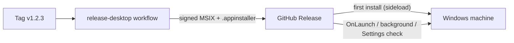
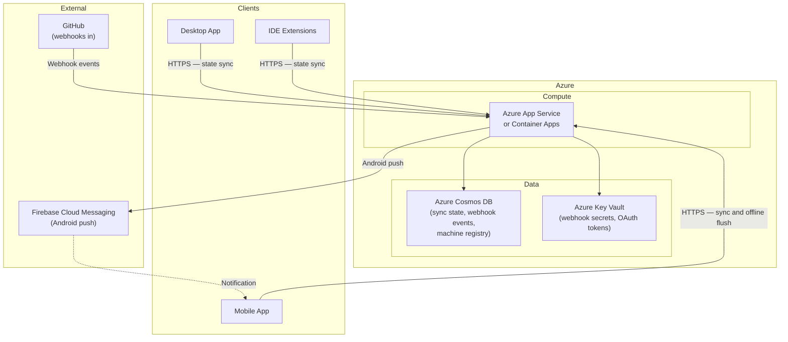

# 07. Deployment View

```meta
status: active
```

How Prompt Backlog's containers map onto infrastructure. There are two deployment
domains: the **user's local machines** (canonical) and the **optional Azure-hosted
cloud service** (additive).

## Local Deployment (Desktop)

```meta
status: active
related: [".arc42/05-building-block-view.md#desktop-app", ".arc42/08-crosscutting-concepts.md#storage-and-sync"]
```

The desktop app is installed on Windows machines and is the canonical deployment. Everything needed for core workflows runs here.

- **Local Storage** — markdown files under a user-owned root (e.g. `~/PromptBacklog/`)
  are the source of truth; JSON files provide indexes and metadata.
- **Local Fetch Workers** — YouTube, website, email, GitHub-sync, and stale-detection
  workers run in-process/background on the desktop.
- **IDE Extensions** — installed in VS Code / Visual Studio on the same machine; read
  the desktop's local markdown / local API directly.

```
~/PromptBacklog/
  inbox/{incoming,processed}/     # captured / triaged items (markdown)
  projects/<repo-id>/{backlog,notes}/
  knowledge/topics/               # knowledge notes by topic
  monitoring/dashboards/          # saved dashboard configs
  tags/index.md                   # tag registry
  _meta/*.json                   # JSON indexes and metadata
```

### Installation and Updates

```meta
status: active
related: [".tech/desktop.md#msix-packaging", ".tech/desktop.md#app-installer-appinstaller"]
```

The desktop app is distributed as a **signed MSIX sideloaded from GitHub
Releases**, with an App Installer manifest driving updates — there is no
Microsoft Store listing and no custom update server.

- **Package** — Release builds produce a single signed MSIX
  (`WindowsPackageType=MSIX`, `AppxBundle=Never`, `SideloadOnly`). Debug stays
  unpackaged so the Aspire desktop resource and WebView2 CDP attach keep working.
- **App Installer** — `Backlog.Desktop.appinstaller` is published alongside the
  MSIX. Its own `Uri` points at the stable `releases/latest/download/...`
  location; its `MainPackage` points at the tagged release asset. Its
  `Name`/`Publisher`/`ProcessorArchitecture` match the MSIX exactly, or Windows
  refuses the update.
- **Update checks** — `UpdateSettings` requests an `OnLaunch` check (every 8
  hours, with a prompt) plus an `AutomaticBackgroundTask`. The Settings screen
  also exposes an explicit "Check for updates" / "Install and restart" action,
  backed by `PackageManager.CheckUpdateAvailabilityAsync` and
  `AddPackageByAppInstallerFileAsync`.
- **Trust** — the certificate is self-signed for personal-scope use, so it must
  be trusted on the target machine before the first install.
- **Release automation** — `.github/workflows/release-desktop.yml` builds, signs
  (from repository secrets), generates the `.appinstaller`, and uploads both
  artifacts to the GitHub Release on a `v*` tag.



## Cloud Deployment (Azure)

```meta
status: active
related: [".arc42/05-building-block-view.md#cloud-service", ".arc42/09-architecture-decisions.md"]
```

The optional cloud service is deployed to Azure as a single-region, low-cost
footprint sized only for sync coordination and webhook forwarding.



Deployment considerations:

- **Single region** is sufficient for a personal tool; a single App Service /
  Container App instance meets demand.
- **TTL-based cleanup** — sync payloads (7 days) and webhook events (24h) expire
  automatically, keeping storage minimal.
- **Webhook timeout handling** — GitHub expects a response within ~10s, so the
  service stores-and-forwards.
- **Secrets in Key Vault** — webhook secrets and OAuth tokens are externalized.
- **No blob storage** — attachments live on the desktop's local file system.


