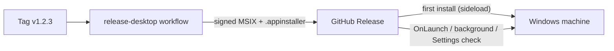
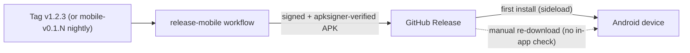
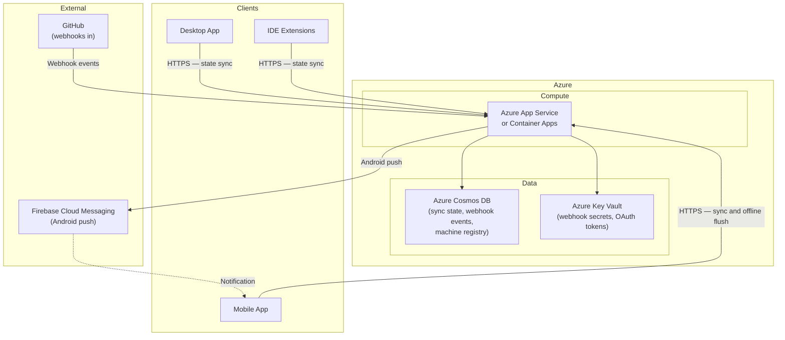

# 07. Deployment View

```meta
status: active
```

How Prompt Backlog's containers map onto infrastructure. There are two deployment
domains: the **user's local machines** (canonical) and the **optional Azure-hosted
cloud service** (additive).

## Local Deployment (Desktop)

```meta
status: active
related: [".arc42/05-building-block-view.md#desktop-app", ".arc42/08-crosscutting-concepts.md#storage-and-sync"]
```

The desktop app is installed on Windows machines and is the canonical deployment. Everything needed for core workflows runs here.

- **Local Storage** — one SQLite database (`backlog.db`) under a user-owned root is
  the source of truth for tasks; JSON files hold the workspace settings and feature
  flags. A task's content is markdown text inside the database.
- **Repository Knowledge** — knowledge folders are not deployed with the app. They
  live in each registered repository's own working copy, wherever the user cloned it,
  and are read in place; the generated index over them (`_meta/knowledge.db`) is
  built beside the folders in that repository rather than under the workspace root.
  See `.arc42/08-crosscutting-concepts.md#knowledge-index`.
- **Local Fetch Workers** — YouTube, website, email, GitHub-sync, and stale-detection
  workers run in-process/background on the desktop.
- **IDE Extensions** — installed in VS Code / Visual Studio on the same machine; read
  the desktop's local markdown / local API directly.

```
~/PromptBacklog/
  inbox/{incoming,processed}/     # captured / triaged items (markdown)
  projects/<repo-id>/{backlog,notes}/
  knowledge/topics/               # knowledge notes by topic
  monitoring/dashboards/          # saved dashboard configs
  tags/index.md                   # tag registry
  _meta/*.json                   # JSON indexes and metadata
```

### Installation and Updates

```meta
status: active
related: [".tech/desktop.md#msix-packaging", ".tech/desktop.md#app-installer-appinstaller"]
```

The desktop app is distributed as a **signed MSIX sideloaded from GitHub
Releases**, with an App Installer manifest driving updates — there is no
Microsoft Store listing and no custom update server.

- **Package** — Release builds produce a single signed MSIX
  (`WindowsPackageType=MSIX`, `AppxBundle=Never`, `SideloadOnly`). Debug stays
  unpackaged so the Aspire desktop resource and WebView2 CDP attach keep working.
- **App Installer** — `Backlog.Desktop.appinstaller` is published alongside the
  MSIX. Its own `Uri` points at the stable `releases/latest/download/...`
  location; its `MainPackage` points at the tagged release asset. Its
  `Name`/`Publisher`/`ProcessorArchitecture` match the MSIX exactly, or Windows
  refuses the update.
- **Update checks** — `UpdateSettings` requests an `OnLaunch` check (every 8
  hours, with a prompt) plus an `AutomaticBackgroundTask`. The version shown in
  the app header is itself the on-demand control: activating it checks, and an
  "Install update" action appears when a newer build is found, backed by
  `PackageManager.CheckUpdateAvailabilityAsync` and
  `AddPackageByAppInstallerFileAsync`.
- **Trust** — the certificate is self-signed for personal-scope use, so it must
  be trusted on the target machine before the first install.
- **Release automation** — `.github/workflows/release-desktop.yml` builds, signs
  (from repository secrets), generates the `.appinstaller`, and uploads both
  artifacts to the GitHub Release on a `v*` tag.



## Local Deployment (Mobile)

```meta
status: active
related: [".arc42/05-building-block-view.md#mobile-app", ".arc42/08-crosscutting-concepts.md#storage-and-sync"]
```

The mobile app is installed on Android devices as a capture-first,
sync-dependent channel — it is not canonical, so this section covers only how
the APK reaches a device, not a data layout equivalent to the desktop's local
Markdown tree. Its on-device JSON queue is documented in
`.tech/mobile.md#local-offline-store`.

### Installation and Updates (Mobile)

```meta
status: active
related: [".tech/mobile.md#apk-packaging", ".arc42/07-deployment-view.md#installation-and-updates"]
```

The mobile app is distributed as a **signed APK sideloaded from GitHub
Releases** — there is no Google Play listing and no in-app update mechanism.

- **Package** — Release builds produce a signed `.apk`
  (`AndroidPackageFormat=apk`), not an `.aab`: the package is sideloaded
  straight onto a device, and `.aab` is only consumable by Google Play.
- **Signing** — signing values come only from repository secrets
  (`ANDROID_KEYSTORE_BASE64`, `ANDROID_KEYSTORE_PASSWORD`, `ANDROID_KEY_ALIAS`,
  `ANDROID_KEY_PASSWORD`); the workflow refuses to produce an unsigned package
  when they are absent and runs `apksigner verify` on the staged APK before
  publishing.
- **Versioning** — `ApplicationDisplayVersion` is set to the semantic version;
  `ApplicationVersion` (the Android `versionCode`) is a packed integer
  (`major*10^7 + minor*10^5 + patch`, so `v1.2.3` becomes `10200003`) because
  Android requires a monotonically increasing integer for a package to be
  recognized as an upgrade.
- **Release channel** — tagged `v*` releases share one GitHub Release with
  the desktop MSIX. Nightly `main` builds publish under a separate
  `mobile-v0.1.<run_number>` tag marked not-latest, because
  `github.run_number` is a per-workflow counter and would otherwise collide
  with the desktop's own nightly numbering.
- **Trust** — the keystore is self-signed, so installing prompts to allow
  installs from unknown sources. Because it is self-signed, an APK signed
  with a different key cannot upgrade an existing install — Android rejects
  signature changes, so switching between a developer build and a release
  build requires uninstalling first.
- **Updates** — unlike the desktop's App Installer, there is no in-app
  auto-update mechanism for Android; updating means manually re-downloading
  the latest APK from GitHub Releases and reinstalling over the existing app
  (same signing key required).
- **Developer sideload** — `build/Install-AndroidApp.ps1` builds a signed APK
  and installs it via `adb`, generating a throwaway developer keystore under
  the gitignored `build/.local/` so a local build never needs the release
  signing secrets.
- **Release automation** — `.github/workflows/release-mobile.yml` builds,
  signs (from repository secrets), verifies, and uploads the APK to the
  GitHub Release on a `v*` tag or the nightly schedule.



## Cloud Deployment (Azure)

```meta
status: active
related: [".arc42/05-building-block-view.md#cloud-service", ".arc42/09-architecture-decisions.md"]
```

The optional cloud service is deployed to Azure as a single-region, low-cost
footprint sized only for sync coordination and webhook forwarding.



Deployment considerations:

- **Single region** is sufficient for a personal tool; a single App Service /
  Container App instance meets demand.
- **TTL-based cleanup** — sync payloads (7 days) and webhook events (24h) expire
  automatically, keeping storage minimal.
- **Webhook timeout handling** — GitHub expects a response within ~10s, so the
  service stores-and-forwards.
- **Secrets in Key Vault** — webhook secrets and OAuth tokens are externalized.
- **No blob storage** — attachments live on the desktop's local file system.


