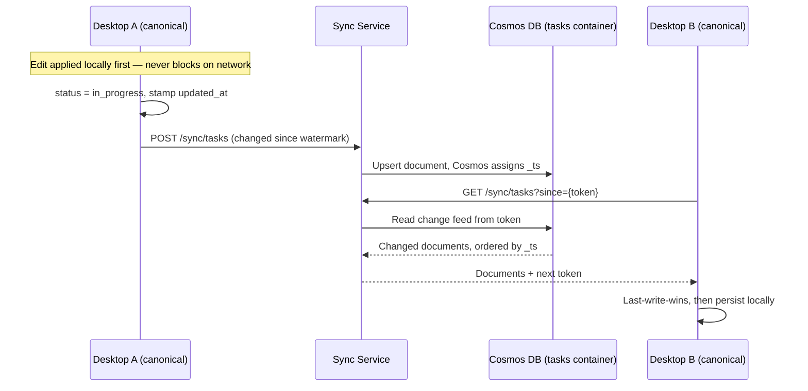

# 08. Cross-cutting Concepts

```meta
status: active
```

Concepts that apply across multiple channels and domains and must be handled
uniformly. Shared data types define the vocabulary exchanged between them.

## Storage and Sync

```meta
status: active
related: [".arc42/02-constraints.md#technical-constraints", ".arc42/06-runtime-view.md#state-sync-and-webhook-forwarding", ".arc42/06-runtime-view.md#copilot-app-session-capture", ".arc42/08-crosscutting-concepts.md#session-record-sync", ".arc42/08-crosscutting-concepts.md#task-sync", ".arc42/adr/0005-azure-hosted-task-replica-for-multi-device-sync.md", ".domain/capture/domain.md#source-adapter", ".domain/sessions/domain.md#session-log"]
```

- **Local-first, one canonical local store** — the desktop's own store is the single
  source of truth. Tasks live in one SQLite database (`backlog.db`) under the
  workspace root, with a task's content held as markdown text, and the roadmap plan
  is one document row in that same database; JSON files hold the workspace settings
  and feature flags, which are per-device and deliberately not shared. Markdown is
  the content of a task, not the storage format. One database file, two tables with
  an owner each — Tasks and Roadmap Planning share the file and not the schema. See
  `.arc42/adr/0003-sqlite-is-the-canonical-local-task-store.md`.
- **Knowledge is the other way round** — a repository's knowledge folders stay
  markdown-canonical, and only the layer derived from them is a database. The two
  decisions are not in tension: a task is owned by the app, a knowledge chapter is
  owned by the repository and edited outside it. See
  `.arc42/08-crosscutting-concepts.md#knowledge-index`.
- **Configurable repo paths** via a repo registry (`config/repos.json`).
- **Scope-portable dot-folder contract** — `.inbox/`, `.backlog/`, `.brain/` exist at
  workspace, repo, and project levels; shared tags/relationships live in the
  workspace-root `.tags/` (`tags.json`, `tag-graph.json`).
- **Optional cloud sync** for multi-device, carrying three kinds of state: the
  Task aggregate, session records, and the phone's captures. A capture is a task
  in the making, so it travels as a task document rather than as a third shape.
  Conflict resolution for tasks: **new items always create; edits are
  last-write-wins**. Session records do not reconcile at all — only the machine
  that ran a session writes records for it, so there is never a second version to
  discard and the lost-edit failure mode does not reach them.
- **Four kinds of state deliberately stay on the machine** — agent transcripts
  (the sanitization boundary that lets session records travel at all), workspace
  settings (they describe one machine's disk), feature flags (per-device by
  design, so an experiment on one machine is not a change on both), and the
  derived knowledge layer (regenerated on the second machine, not shipped to it).
  The roadmap plan is on neither list, and since 2026-09-05 the reason is narrower
  than it was: it is a document row in `backlog.db` rather than a file beside it, so
  it no longer carries the database's file-sync hazard, and the row stamps
  `updated_at` so it *could* replicate on a task's terms. Whether it should is the
  open question — see `.arc42/adr/0005-azure-hosted-task-replica-for-multi-device-sync.md`.
- **Two containers in the cloud replica** — `tasks` and `sessions`, both
  partitioned on `/ownerId`. Separate because each wants its own change feed, its
  own indexing policy, and its own retention, and because serverless billing
  levies no per-container charge to trade against.
- **Retention is a store setting, not code.** Container TTL expires task
  tombstones after 180 days and whole session records after 12 months. Nothing
  reaps, so there is no scheduled job to fail silently at exactly the moment
  nobody is watching — which is when a code-based reaper stops running.
- **The sync service, not the store, keeps a device inside its own data.** The
  service holds an account-scoped managed identity and can see every partition of
  both containers; what confines a device is service code reading the `ownerId`
  out of that device's JWT and refusing to issue a query outside the partition it
  names. The isolation is one check in one service, not a property of the storage
  layer.
- **Never file-sync the local store.** The workspace root is a local folder. A
  binary SQLite database in OneDrive or any other file-sync product is
  unmergeable, and its WAL sidecars sync out of step with it, so committed
  transactions silently roll back. Multi-device use goes through the sync service.
  See `.arc42/adr/0005-azure-hosted-task-replica-for-multi-device-sync.md`.
- **Desktop works fully standalone**; the cloud connection is purely additive.
- **Local credential handling includes Copilot sessions** — desktop workers and
  GitHub Copilot App session adapters both run on the same machine and pass local
  context (`session_id`, `worktree_path`, `branch`) without routing credentials
  through the optional Cloud Service.
- **Copilot capture vs. Copilot session tracking** — capture uses session context to
  create Inbox/Backlog/Knowledge items, while Dev PC Management tracking is a
  separate compliance/monitoring concern.

## Task Sync

```meta
status: active
related: [".arc42/02-constraints.md#technical-constraints", ".arc42/07-deployment-view.md#cloud-deployment-azure", ".arc42/08-crosscutting-concepts.md#storage-and-sync", ".arc42/adr/0005-azure-hosted-task-replica-for-multi-device-sync.md", ".domain/capture/domain.md#capture", ".domain/sessions/domain.md#session-log", ".domain/tasks/domain.md#task"]
```

How the general sync position above is realized for the Task aggregate. The
direction is settled by local ADR 0005, which is accepted; none of the cloud side
is built yet.

Tasks are one of three kinds of state that sync. Session records travel on
different terms, covered under
`.arc42/08-crosscutting-concepts.md#session-record-sync`; the phone's
captures are not a third shape at all, because a capture becomes a task document
in the same `tasks` container the moment it is pushed. What stays on the machine
— agent transcripts, workspace settings, feature flags, and the derived
knowledge layer — is listed under
`.arc42/08-crosscutting-concepts.md#storage-and-sync`.

**Reconciliation between equals, not client and server.** Each device's SQLite
database is canonical for that device. Azure holds a replica and the change feed
over it, and carries no invariant, no query path, and no domain logic.



- **Every task carries `updated_at` and `deleted_at`.** The first is stamped by
  the device on each mutation; the second is a tombstone, because a deletion has
  to replicate and a row that is simply gone cannot.
- **The server orders, the device does not.** Two machines' clocks disagree, and
  last-write-wins decided by a skewed clock discards real edits. The Cosmos `_ts`
  assigned on write orders the feed; `updated_at` breaks ties, and the device id
  breaks those, so two devices never flap.
- **Whole-document resolution**, matching how the aggregate is already persisted
  everywhere else. A per-field merge would invent a reconciliation the domain has
  no rule for.
- **Pairing, not accounts.** A first device generates an `ownerId`; a second is
  paired with a short code entered once, out of band. Each holds its own
  registration credential in the OS credential store and exchanges it for a
  short-lived JWT. `ownerId` is the Cosmos partition key of both containers.
- **The service, not the partition key, is what keeps a device inside its own
  data.** The partition key organizes the store; it authorizes nothing. Access to
  Cosmos is a managed identity with an account-scoped data-plane role, so as far
  as Cosmos is concerned the service may read every partition. What confines a
  device is the service reading `ownerId` out of the presented JWT and refusing
  to issue a query outside that partition — one check, in one service, standing
  in front of a credential that can see everything. Cosmos cannot authorize a
  device-session principal it has never heard of, so this is the only place the
  check can live.
- **Tombstones expire by container TTL**, at 180 days, rather than by anything
  the service runs. The number is chosen against how long a device may plausibly
  stay offline: a tombstone that expired first would let a returning device push
  its still-live copy and resurrect a task the person deleted.
- **Offline is unchanged.** Losing connectivity costs cross-device freshness and
  nothing else.

## Session Record Sync

```meta
status: active
related: [".arc42/07-deployment-view.md#cloud-deployment-azure", ".arc42/08-crosscutting-concepts.md#storage-and-sync", ".arc42/08-crosscutting-concepts.md#task-sync", ".arc42/adr/0005-azure-hosted-task-replica-for-multi-device-sync.md", ".domain/sessions/domain.md#session-log"]
```

Session records replicate through the same service and the same pairing identity,
into the `sessions` container, and reconcile on different terms — which is not a
special case bolted on, but a consequence of who writes them.

- **Single-writer, so last-write-wins does not apply.** A session ran on one
  machine and only that machine holds the evidence for it, so there is never a
  second version to discard. The conflict policy under
  `.arc42/08-crosscutting-concepts.md#task-sync`, and the silent loss it accepts,
  is not reachable here.
- **Machine-stamped and append-only.** Each record names the machine that wrote
  it, and the service accepts a record only from the machine it names. A session
  that moves gets a later record rather than an edit to an earlier one, so the
  container needs neither a tombstone nor an `updated_at`.
- **The sanitization boundary is a whitelist, not a filter.** A record carries
  session id, machine id, repository alias (not path), branch, started at, last
  activity at, turn count, and duration count. Never prompts, never tool output,
  never file contents. A filter that misses a field leaks it; a whitelist that
  misses one merely omits it, and adding a field is a decision taken in local
  ADR 0005 rather than settled in the pushing code.
- **Retention is a 12-month container TTL**, and nothing else removes a record.

## Knowledge Index

```meta
status: proposed
related: [".arc42/adr/0004-knowledge-index-is-a-generated-local-database.md", ".arc42/02-constraints.md#technical-constraints", ".domain/second-brain/features.md#repository-knowledge-areas"]
```

How every channel reads the knowledge a repository carries alongside its code.

- **Markdown is canonical and the layer over it is generated** — the graph between
  chapters, the resolved reading outline, the retrieval indexes and the diagram
  artifact index are all derived. Nothing that is derived is authoritative, and
  nothing that is authored lives only in the derived layer.
- **One generated SQLite database per knowledge repository**, at `_meta/knowledge.db`
  beside the folders it describes rather than in the workspace root, because an area
  is resolved per registered repository and the app reads repositories it did not
  build.
- **Generated, not committed.** The database is a build output and is ignored by
  git, which is what keeps two branches editing different chapters from conflicting
  on a file neither of them authored.
- **The authored half stays text** — each directory's reading order and root
  document, the hand-written Archify specifications, and the Structurizr C4
  workspace under `.arc42/_c4/`, are committed and reviewed in diffs. Only what a
  generator produces goes into the database. The C4 workspace has no derived half
  at all: it is not attached to a fence and nothing is rendered from it ahead of
  time, so there is nothing about it for an index to hold or to go stale.
- **Structural first, semantic optional** — the structural tier is deterministic and
  builds offline; embeddings are keyed by chapter content hash, need a model, and
  are versioned by it. A reader must work correctly with the semantic tier absent,
  falling back to full-text search.
- **The generator is the only writer.** The app reads and never writes, so the
  markdown parse has exactly one implementation. A chapter the app has just edited
  is treated as drifted and served from its markdown, rather than re-indexed by a
  second parser in C#.
- **Refresh is an optimisation, never a precondition** — nothing on the app's own
  write, a stat-per-file check when an area is opened, a debounced watcher while a
  folder is in view, and a cancellable idle-time background pass for repositories
  nobody has opened and for embeddings. **Not on startup**: startup only stats each
  registered repository to learn whether an index exists, and schedules rather than
  performs the work.
- **A reader degrades in defined steps** rather than on or off: current row →
  drifted file read from its markdown → unrecognised schema version ignored
  entirely → absent, locked or unreadable database → markdown, which is the path
  the panels take today. Browsing therefore always works. Search is the one
  exception — without an index it is unavailable and says so, because scanning the
  corpus per query is a hang, not a fallback.
- **One artifact, every channel** — desktop, mobile, the IDE extensions and a future
  MCP server read the same schema rather than each carrying its own markdown parser.

> Partly implemented. The derived layer is currently twelve committed JSON files
> under `_meta/`, and the reading rules above are already how the panels treat
> them: `KnowledgeIndexReader` lists a folder without opening a markdown file,
> re-reads any entry whose file is newer than the index, rejects a `schemaVersion`
> it does not recognise, and falls back to scanning a folder that has no index.
> What is not implemented is the container — the database, the retrieval tiers,
> and dropping the artifacts from version control. See
> `.arc42/adr/0004-knowledge-index-is-a-generated-local-database.md` for the
> reasoning and the questions it leaves open.

## Feature Enablement

```meta
status: proposed
related: [".arc42/04-solution-strategy.md", ".domain/second-brain/features.md#repository-knowledge-areas", ".domain/dev-pc-management/features.md#copilot-tool-catalog"]
```

- **Optional capabilities are switchable per installation** — repository knowledge,
  the individual knowledge areas, additional repositories, system tools, GitHub
  integration, feedback reporting, Copilot CLI, and AI assistance can each be turned
  on. Core backlog editing is always available and is never switchable.
- **Disabled is the default**; the stored setting records only what has been switched
  *on*, so a capability added later stays out of the way until it is deliberately
  chosen.
- **A disabled capability leaves no surface behind** — its entry points are absent
  rather than present-but-inert, and dependent settings disappear with it.
- **The switch is local to the installation**, kept with the other machine-local
  settings rather than inside the backlog folder, so it never travels with synced
  content.
- **Unreadable or unknown settings fall back to "everything disabled"** rather than
  failing startup, leaving only the always-available core.

> Not yet implemented: the current build defaults every optional capability to
> enabled and stores only the disabled ones. This section records the intended
> reversal, so treat it as the target state rather than a description of today's
> behavior.

## Tagging and Organization

```meta
status: active
related: [".domain/roadmap/domain.md#roadmap-item-gathering"]
```

- `#tags` embedded inside markdown, multiple per item.
- Project tags, cross-cutting tags, and PARA-inspired grouping (Projects, Areas,
  Resources, Archive).
- A tag index enables search across all domains.

Tags are not drawn from a single vocabulary. Alongside freely authored tags, every
roadmap item contributes its own slug as an available tag in both the backlog and the
knowledge base, which is how a roadmap item gathers contributing work without having to
reference each piece explicitly. A roadmap slug is derived from the item's title when it
is created and stays editable, but is deliberately **not** rewritten when the title is
later renamed — tags already written elsewhere would otherwise silently stop matching.
Because a knowledge chapter's `roadmap:` entries are tag slugs rather than chapter
references, they stay node attributes and produce no edges in the knowledge graph.

## Authentication and Authorization

```meta
status: active
related: [".arc42/09-architecture-decisions.md"]
```

- **No account required** for personal use in standalone mode.
- **OAuth 2.0** for GitHub integration (issue sync, webhook registration).
- **Cloud connection uses device-based auth** — JWT device sessions, no user login.
- The current architecture assumes a single personal user and does not include team-oriented authorization roles.

For the cloud service specifically, the inherited identity, authorization, and
error-contract decisions apply — `.arc42/adr/guidelines/0012-authentication-external-identity-providers.md`,
`0013-authorization-zero-trust.md`, and `0017-http-error-contract-and-problem-details.md`.

## Observability

```meta
status: active
related: [".arc42/09-architecture-decisions.md"]
```

Monitoring dashboards read telemetry signals from Application Insights (errors,
latency per project) alongside local queue/backlog health metrics. Telemetry follows
`.arc42/adr/guidelines/0010-opentelemetry-observability.md`, wired once in
`Backlog.Aspire.ServiceDefaults` for services and MAUI hosts alike.

## Shared Data Types

```meta
status: active
related: [".arc42/12-glossary.md", ".domain/inbox/domain.md#inbox-item", ".domain/tasks/domain.md#task", ".domain/second-brain/domain.md#knowledge-note", ".domain/monitoring/domain.md#progress-signal", ".domain/dev-pc-management/domain.md#machine-registry", ".domain/sessions/domain.md#session-log", ".domain/repository-management/domain.md#repository-registry", ".domain/technology-stack/domain.md#technology-registry", ".domain/roadmap/domain.md#roadmap-item-gathering"]
```

The vocabulary exchanged across all applications and domains is owned per
bounded context in `.domain` (aggregate shape, invariants, and lifecycle) — this
chapter only names which types cross container boundaries and are therefore an
architectural concern:

| Type | Owning aggregate |
|---|---|
| **InboxItem** | `.domain/inbox/domain.md#inbox-item` |
| **TaskItem** (ubiquitous term: Task) | `.domain/tasks/domain.md#task` |
| **KnowledgeNote** | `.domain/second-brain/domain.md#knowledge-note` |
| **ProgressSignal** | `.domain/monitoring/domain.md#progress-signal` |
| **RoutingRule** | Not yet modeled in `.domain` — tracked in `.arc42/11-risks-and-technical-debt.md` |
| **MachineRegistration** | `.domain/dev-pc-management/domain.md#machine-registry` |
| **SessionLog** | `.domain/sessions/domain.md#session-log` |
| **RepositoryRegistration** | `.domain/repository-management/domain.md#repository-registry` |
| **TechBaseline** | `.domain/technology-stack/domain.md#technology-registry` |

**Effort** is the one shared *scalar* rather than a shared type: an optional
non-negative story-point estimate that appears on tasks, on knowledge
chapters (as the `effort` field of a `meta` block, emitted into the knowledge graph as
a number), and as the arithmetic rollup a roadmap item reports over what it gathers. It
is architectural only because the same unit has to mean the same thing in all three
places. Absent means *not estimated* and is distinct from `0`, which is a real estimate
contributing zero; a rollup total is therefore always reported alongside a count of
gathered items carrying no estimate, so the total is never mistaken for the whole
picture.

The cloud service persists only sync-oriented state derived from these types
(`SyncState`, `SyncPayload`, `WebhookEvents`, `GitHubWebhookConfig`,
`MachineRegistry`, `TeamConfig`) — never the canonical domain data itself.


