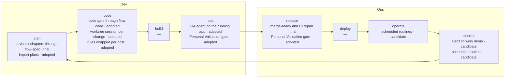

# AI Adoption Map

```meta
status: trial
type: adoption-map
related: [".devbook/tech/ai-development.md"]
```

> How this repository is developed with AI, read around the DevOps loop. The tools
> themselves are registered in `.devbook/tech/ai-development.md`; this folder records
> how they are used, at which stage, and how far that use has actually got.

## Usage files

| File | Covers |
| --- | --- |
| `01-plan.md` | Turning an idea into agreed, written-down work: devbook chapters and import plans. |
| `02-code.md` | Making a change: the code gate, worktree sessions, and the rules agents follow. |
| `03-test.md` | Proving a change: agent-driven QA against the running application, and the human gate. |
| `04-release-operate.md` | Getting a change merged and keeping the repository healthy: pull requests, scheduled routines, alerts. |
| `concepts.md` | The ideas the practices above rest on. |

## The loop



`build` and `deploy` are empty: both run as ordinary CI and `azd` pipelines with no AI
usage of their own, and the emptiness is the finding rather than a gap to fill.

## Reading and extending the folder

Every chapter carries `stage`, `status`, and `date`. `status` rates the **usage**, on the
same ladder `.devbook/tech` uses — `candidate`, `trial`, `adopted`, `hold`, `retired` — and
moves only when the **Adopted by** line says the way of working changed. Add a chapter to
the file for the part of the flow it belongs to, register its tool in `.devbook/tech` first,
point at it with `depends-on`, and update the table and diagram above in the same change.
