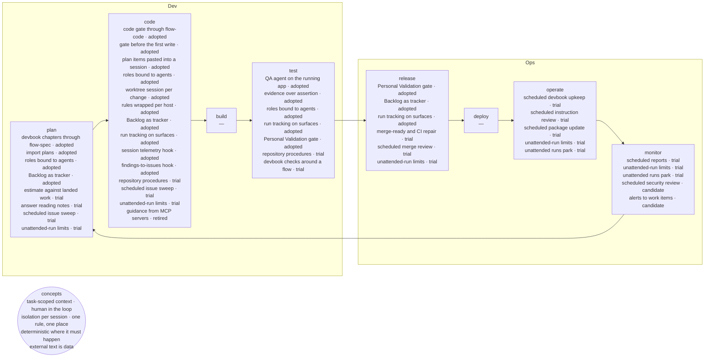

# AI Adoption Map

```meta
status: adopted
type: adoption-map
related: [".devbook/tech/ai-development.md"]
```

> How this repository is developed with AI, read around the DevOps loop. The tools
> themselves are registered in `.devbook/tech/ai-development.md`; this folder records
> how they are used, at which stage, and how far that use has actually got.

## Usage files

| File | Covers |
| --- | --- |
| `01-plan.md` | Agreeing and sizing work: devbook chapters through `flow-spec`, import plans, estimates, answered reading notes. |
| `02-code.md` | Making a change: the code gate, plan items pasted into a session, the roles and their agents, worktree sessions, per-host rules, the Backlog tracker, run surfaces, the two hooks, and the guidance servers retired. |
| `03-test.md` | Proving a change: the QA agent, the repository procedures, the devbook checks around a flow, and Personal Validation. |
| `04-release-operate.md` | Getting a change to `main` and a production failure back into the loop. |
| `05-unattended-runs.md` | The schedules selected from the catalog, and what an unattended run may and may not do. |
| `concepts.md` | The ideas the practices above rest on. |

## The loop


```mermaid
flowchart LR
    subgraph dev [Dev]
        plan["plan<br/>devbook chapters through flow-spec · adopted<br/>import plans · adopted<br/>roles bound to agents · adopted<br/>Backlog as tracker · adopted<br/>estimate against landed work · trial<br/>answer reading notes · trial<br/>scheduled issue sweep · trial<br/>unattended-run limits · trial"]
        code["code<br/>code gate through flow-code · adopted<br/>gate before the first write · adopted<br/>plan items pasted into a session · adopted<br/>roles bound to agents · adopted<br/>worktree session per change · adopted<br/>rules wrapped per host · adopted<br/>Backlog as tracker · adopted<br/>run tracking on surfaces · adopted<br/>session telemetry hook · adopted<br/>findings-to-issues hook · adopted<br/>repository procedures · trial<br/>scheduled issue sweep · trial<br/>unattended-run limits · trial<br/>guidance from MCP servers · retired"]
        build["build<br/>—"]
        test["test<br/>QA agent on the running app · adopted<br/>evidence over assertion · adopted<br/>roles bound to agents · adopted<br/>run tracking on surfaces · adopted<br/>Personal Validation gate · adopted<br/>repository procedures · trial<br/>devbook checks around a flow · trial"]
    end
    subgraph ops [Ops]
        release["release<br/>Personal Validation gate · adopted<br/>Backlog as tracker · adopted<br/>run tracking on surfaces · adopted<br/>merge-ready and CI repair · trial<br/>scheduled merge review · trial<br/>unattended-run limits · trial"]
        deploy["deploy<br/>—"]
        operate["operate<br/>scheduled devbook upkeep · trial<br/>scheduled instruction review · trial<br/>scheduled package update · trial<br/>unattended-run limits · trial<br/>unattended runs park · trial"]
        monitor["monitor<br/>scheduled reports · trial<br/>unattended-run limits · trial<br/>unattended runs park · trial<br/>scheduled security review · candidate<br/>alerts to work items · candidate"]
    end
    concepts(("concepts<br/>task-scoped context · human in the loop<br/>isolation per session · one rule, one place<br/>deterministic where it must happen<br/>external text is data"))
    plan --> code --> build --> test --> release --> deploy --> operate --> monitor --> plan
```

## What the loop shows

- **The dev half is where adoption is real.** Every change is gated into a flow, written in
  its own worktree by the agent its phase binds, proven by the QA agent, and approved by a
  person. Those are `adopted`; the procedure skills and devbook checks bolted onto the flows
  on 2026-09-25 are still `trial`.
- **The ops half is almost all `trial`, and all of it unattended.** Everything at `operate`
  and `monitor` is a schedule registered on 2026-09-25 or 2026-09-26 that has not yet
  published anything. Those ratings move when the first report issues and pull requests
  land — or come down if they do not.
- **`build` and `deploy` are empty.** Build runs as ordinary CI in
  `.github/workflows/pull-request.yml`, and deployment as `azd` and the release workflows;
  neither has an AI usage of its own. Dependency updates sit at `operate`, as upkeep, not at
  `build`. The emptiness is the finding, not a gap to fill.
- **Production does not reach `plan` yet.** The one usage that would close the loop from
  `monitor` — alerts to work items — is a `candidate` whose workflow fails its preflight.

## What the adoption left out

The `devbook-adoption` plan took the stack almost whole. Local ADR 0016's status table
records what landed. Three parts were left out on purpose, and none of them has a chapter,
because nobody works that way here:

| Left out | Why |
| --- | --- |
| `devbook-collaboration` | Dropped at the owner's decision on 2026-09-28, although `decide-adoption-scope` had asked for it. It is not installed or stamped. |
| The `security-review` schedule | The owner kept it unselected: CodeQL and Dependabot run in CI instead. `05-unattended-runs.md` keeps it as a `candidate`. |
| The `devbook-update` schedule | Added to the catalog in 1.10.0 and not taken. Stack updates run by hand through `devbook-config:update`. |

## Reading and extending the folder

Every chapter carries `stage`, `status`, and `date`. `status` rates the **usage**, on the
same ladder `.devbook/tech` uses — `candidate`, `trial`, `adopted`, `hold`, `retired` — and
moves only when the **Adopted by** line says the way of working changed. Add a chapter to
the file for the part of the flow it belongs to, register its tool in `.devbook/tech` first,
point at it with `depends-on`, and update the table and diagram above in the same change.
