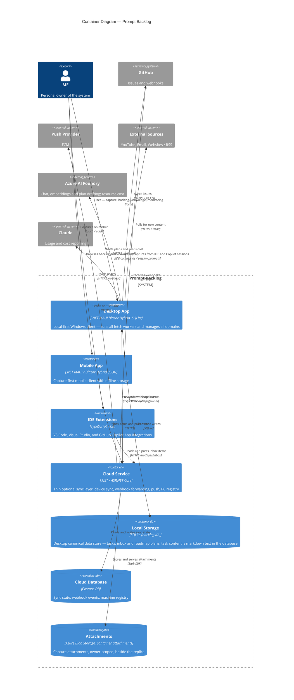
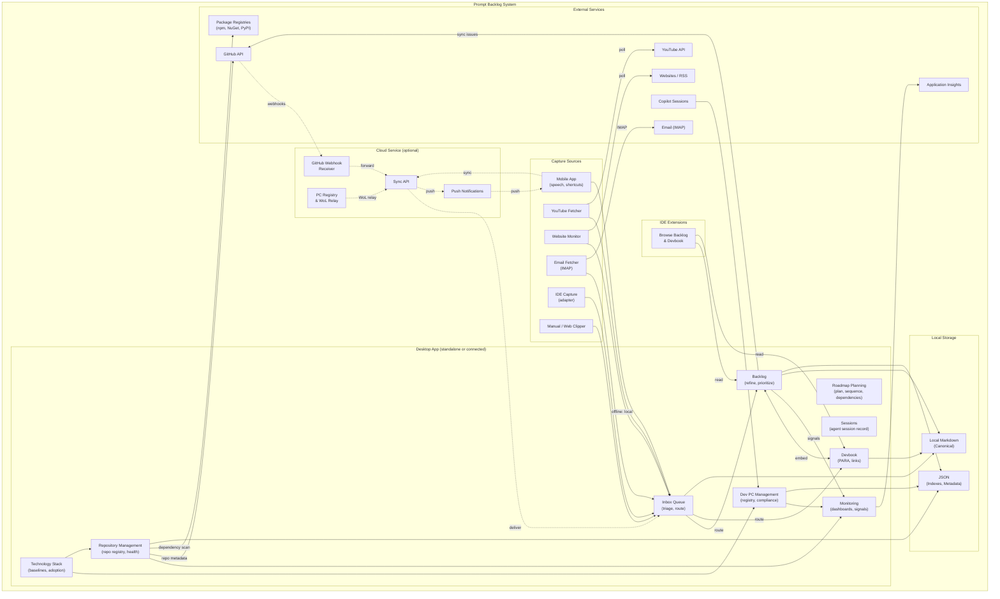
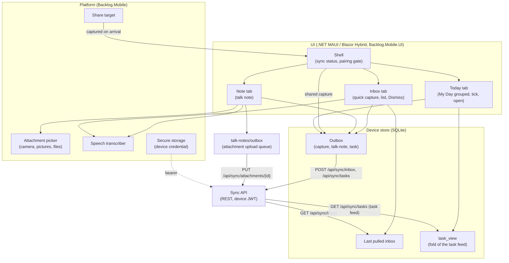
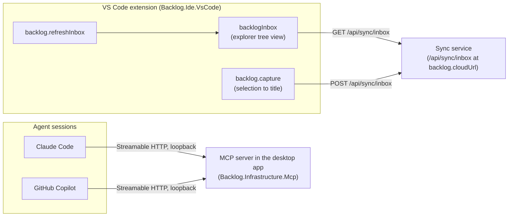
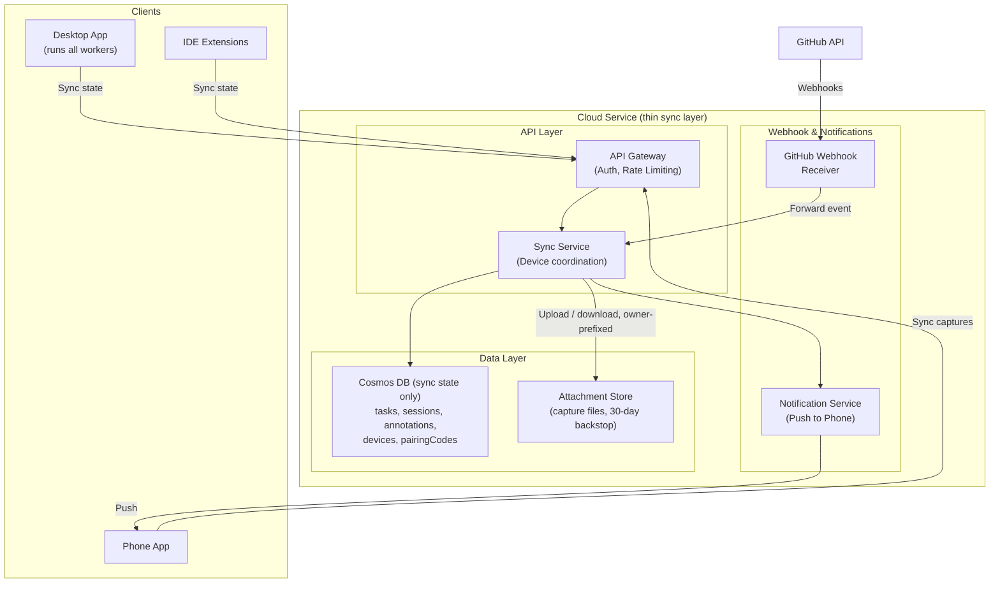

# 05. Building Block View

```meta
```

## Container View

```meta
related: [".devbook/arc42/03-context-and-scope.md#access-channels-scope", ".devbook/domain/context-map.md", ".devbook/arc42/adr/0003-sqlite-is-the-canonical-local-task-store.md", ".devbook/arc42/adr/0005-azure-hosted-task-replica-for-multi-device-sync.md", ".devbook/arc42/adr/0014-attachments-travel-through-a-blob-store-beside-the-replica.md"]
```

Container boundaries below are the deployable/runtime split; the domains they
serve (Capture, Inbox, Tasks, Roadmap Planning, Devbook,
Monitoring, Technology Stack, Dev PC Management, Sessions, Repository Management) are defined in
`.devbook/domain/context-map.md` and each context's own `.devbook/domain/<context>/domain.md` —
this view does not restate domain responsibilities.

The desktop's canonical store is one SQLite database, `backlog.db` (local ADR 0003);
a task's content is markdown text held in it. The cloud keeps the replica in Cosmos DB
(local ADR 0005) and attachments in a Blob container beside it (local ADR 0014).



### System-level flow

```meta
```



## Desktop App

```meta
related: [".devbook/arc42/06-runtime-view.md#task-to-github-issue", ".devbook/arc42/adr/0001-desktop-stack-maui-blazor-hybrid.md", ".devbook/arc42/adr/0003-sqlite-is-the-canonical-local-task-store.md", ".devbook/arc42/adr/0009-captures-are-a-document-kind-on-the-replica.md", ".devbook/arc42/adr/0012-backlog-is-an-mcp-server-inside-the-desktop-app.md", ".devbook/arc42/adr/0015-devbook-database-lives-in-app-storage-and-the-app-builds-it.md", ".devbook/arc42/adr/0017-inbox-import-is-a-capture-source-with-a-markdown-manifest.md", ".devbook/domain/tasks/features.md#pairing-a-device"]
```

Local-first Windows client. Serves Capture, Inbox, Tasks, Roadmap Planning, Devbook, Monitoring, Technology Stack, Dev PC Management, Sessions, and Repository Management. It runs in two seamless modes,
**Standalone** and **Connected**, as `.devbook/arc42/12-glossary.md` defines them.

```mermaid
graph TB
  McpCallers["MCP clients\n(agents, IDE extensions)"]

  subgraph "Desktop App (Backlog.Desktop)"
    Shell["Shell UI — Backlog.Desktop.UI\n(.NET MAUI Blazor Hybrid, Ask AI panel)"]

    subgraph "Module UIs"
      TasksUI["Backlog.Modules.Tasks.UI"]
      InboxUI["Backlog.Modules.Inbox.UI"]
      RoadmapUI["Backlog.Modules.Roadmap.UI"]
      DevbookUI["Backlog.Modules.Devbook.UI"]
      DashboardUI["Backlog.Modules.Dashboard.UI"]
      CaptureUI["Backlog.Modules.Capture.UI"]
      ToolsUI["Backlog.Modules.DevPc.UI\n(Tools)"]
      SessionsUI["Backlog.Modules.Sessions.UI"]
      SyncUI["Backlog.Modules.Sync.UI\n(Devices settings)"]
    end

    subgraph "Modules"
      Tasks["Backlog.Modules.Tasks"]
      Inbox["Backlog.Modules.Inbox"]
      Roadmap["Backlog.Modules.Roadmap"]
      Dashboard["Backlog.Modules.Dashboard"]
      Capture["Backlog.Modules.Capture"]
    end

    subgraph "Background workers"
      SyncWorkers["TaskSyncWorker, SessionSyncWorker,\nAnnotationSyncWorker"]
      BackupWorker["BackupWorker"]
      McpWorker["McpServerWorker"]
    end

    subgraph "Adapters (Backlog.Infrastructure.*)"
      Sqlite["Infrastructure.Sqlite\n(backlog.db: tasks, roadmap,\ninbox_items, inbox_lists, inbox_groups)"]
      FileSystem["Infrastructure.FileSystem\n(InboxBacklogTarget, backups)"]
      DevbookInfra["Infrastructure.Devbook\n(devbook database in app storage)"]
      SyncClient["Infrastructure.Sync\n(Sync Client, optional)"]
      Mcp["Infrastructure.Mcp\n(MCP server, loopback only)"]
      CaptureInfra["Infrastructure.Capture\n(YouTube, Website / Feeds, Import\n→ InboxCaptureDelivery)"]
      Foundry["Infrastructure.AzureFoundry\n(IInboxPlanDrafter, Ask AI)"]
      Claude["Infrastructure.Claude"]
      Copilot["Infrastructure.Copilot"]
      GitHubInfra["Infrastructure.GitHub"]
      DevPcInfra["Infrastructure.DevPc"]
      SessionsInfra["Infrastructure.Sessions"]
    end
  end

  SyncAPI["Cloud Sync API\n(optional)"]
  GitHub["GitHub API"]
  Sources["YouTube, websites / feeds,\nimport manifests"]
  FoundryApi["Azure AI Foundry"]

  Shell --> TasksUI & InboxUI & RoadmapUI & DevbookUI & DashboardUI & CaptureUI & ToolsUI & SessionsUI & SyncUI
  Shell --> Foundry & Claude & GitHubInfra & FileSystem & SyncClient & Mcp

  TasksUI -->|Abstractions| Tasks
  InboxUI -->|Abstractions| Inbox
  RoadmapUI -->|Abstractions| Roadmap
  DashboardUI -->|Abstractions| Dashboard
  CaptureUI -->|Abstractions| Capture
  ToolsUI -->|DevPc.Abstractions| DevPcInfra
  SessionsUI -->|Sessions.Abstractions| SessionsInfra
  SyncUI -->|pairing, sync loops| SyncClient

  TasksUI --> Copilot & GitHubInfra
  RoadmapUI --> GitHubInfra
  DevbookUI --> DevbookInfra & Copilot & GitHubInfra

  Tasks --> Sqlite
  Roadmap --> Sqlite
  Inbox --> Sqlite
  Inbox -->|IInboxBacklogTarget| FileSystem
  FileSystem -->|ITaskItems| Tasks
  Inbox -->|IInboxPlanDrafter| Foundry
  Claude -->|Dashboard.Abstractions| Dashboard

  Capture -->|ICaptureDelivery| CaptureInfra
  CaptureInfra --> Sources
  CaptureInfra -->|IInboxIntake| Inbox

  SyncWorkers --> SyncClient
  SyncClient -->|captures via IInboxIntake| Inbox
  SyncClient -.->|push / pull| SyncAPI
  BackupWorker --> FileSystem

  McpCallers -->|HTTP on 127.0.0.1 / ::1| Mcp
  McpWorker --> Mcp
  Mcp --> Tasks & Roadmap & DevbookInfra & SessionsInfra

  GitHubInfra --> GitHub
  Foundry --> FoundryApi
```



Capture sources and background workers run inside the desktop process, so external
credentials stay on the machine. `MauiProgram` starts the sync, backup and MCP
workers at launch.

**MCP server** is `Backlog.Infrastructure.Mcp`, hosted by `McpServerWorker` on its
own Kestrel listener bound to `127.0.0.1` and `::1` and never to a wildcard address
(local ADR 0012). Agents and IDE extensions on the same machine reach Tasks, Roadmap,
Devbook and Sessions through it; `McpServerRegistrationTests` holds the binding.

Module UI projects reference adapters directly where a pane needs one: Tasks.UI and
Devbook.UI reference Copilot and GitHub, Roadmap.UI references GitHub, and Devbook.UI
references `Backlog.Infrastructure.Devbook`, whose database lives in app storage
(local ADR 0015). `ModuleBoundaryTests` permits a module UI to take an adapter and
forbids it another module's implementation.

**Devbook database** is `Backlog.Infrastructure.Devbook`: the builder that indexes
a repository's devbook folders in C#, and the read-only reader over the result.
It indexes the chapters, the reference graph, the outline, the Archify artifacts
and the click demos. Since schema 5 the `demo` and `demo_link` tables pair each
`*.demo.html` with its page by name and with every chapter whose `demo` field
names it. The pairing rule itself lives in `DevbookReadingConvention`, in the
Devbook module's Abstractions, so the builder, the MCP chapter read and the
Domain devbook pane apply one rule. `tools/devbook/build-database.mjs` writes the
same tables, and `DevbookBuilderParityTests` compares the two writers.

**Inbox Service** is `Backlog.Modules.Inbox` since 2026-09-15 — a module with its
own `Abstractions` project and its own tables in `backlog.db` (`inbox_items`,
`inbox_lists`, `inbox_groups`), no longer a projection over draft tasks. It holds
the Inbox Item, List and Group aggregates and one feature slice per action
(intake, manual capture, tags, repositories, filing, archive, route to backlog,
create plan, and the list/group organiser). It reaches Tasks only through the
`IInboxBacklogTarget` port, answered by `InboxBacklogTarget` in
`Backlog.Infrastructure.FileSystem` over Tasks' published `ITaskItems` — the one
place an inbox item becomes entry text. A batch of items goes through the same
port's `CreateBatchTasksAsync` as one multi-entry document into Tasks'
`ImportPlanAsync`. The adapter maps the created entries back to items by
`import_item_id` and names each entry's own item as its source. The Inbox reaches the AI plan drafter through
`IInboxPlanDrafter`, answered in `Backlog.Infrastructure.AzureFoundry`. The
`Backlog.Modules.Inbox.UI` pane references its own module's Abstractions and
nothing of Tasks; the earlier Tasks.UI → Inbox.UI edge is gone. See local ADR 0009.

**Ask AI content** is a port in the shared kernel, `IAiContentSource` under
`Backlog.SharedKernel.Ai`, and one answer per area in that area's UI project —
`TasksAiContentSource`, `InboxAiContentSource`, `DevbookAiContentSource`,
`RoadmapAiContentSource`, `DashboardAiContentSource`, `SessionsAiContentSource`
and `ToolsAiContentSource`. Each declares what its content is and composes a body
for a question within a character budget, choosing among its records the one way
`AiContentBudget` defines; the shell's Ask AI panel collects the sources, offers a
scope chip per open area, and hands the chosen source's body to the Azure Foundry
client. The shell learns nothing about what a task, an item or a chapter looks
like. A source never describes the screen — no filter text, sort, layout or
selection beyond pinning the open record — but the scope that defines an area's
records (a dashboard's repositories and period, a task list's repository scope) is
content, and the body's first line states it. Ask AI used to scrape the visible
task rows, which was screen state and which exceeded the deployment's quota on
every press.

**Sync Client** is `Backlog.Infrastructure.Sync`, shared by the desktop head and
both web harnesses (registered separately so the two harnesses pair as two
distinct devices). It holds the device's registration credential
(`IDeviceCredentialStore`, DPAPI on Windows via `DpapiDeviceCredentialStore`),
exchanges it for a device token and caches it (`SyncTokenProvider`, refreshing
within two minutes of expiry, never retrying a 401), attaches the token to
outbound requests (`SyncAuthenticationHandler`), and drives the pairing calls
themselves (`DevicePairingClient`). The Android head keeps the same credential
in MAUI `SecureStorage` (Keystore-wrapped `EncryptedSharedPreferences`) through
`SecureValueDeviceCredentialStore`, the platform-neutral half of that adapter,
so a force-stop does not un-pair the phone; the in-memory store is for tests.
On the desktop it also carries the capture path: `TaskReplicaMerge` hands every
`capture`-kind replica document to the Inbox's `IInboxIntake` port before the
task merge, and `TaskSyncSession` drains the Inbox's `IInboxCaptureOutbox` into
the ordinary tasks push as tombstones. Both ports are optional constructor
parameters, so a head without an inbox store — the phone — composes unchanged
and leaves captures on the replica.

A second, unrelated caller reaches the same port without touching the replica
at all: `Backlog.Infrastructure.Capture`'s `InboxCaptureDelivery` answers the
Capture module's `ICaptureDelivery` port by calling `IInboxIntake` directly,
in-process, when a source monitor (YouTube channel, website feed) finds a new
entry on the desktop. The id-keyed idempotency `IInboxIntake` already gives the
sync path — a known id is a replay, not a duplicate — is what makes a second
press of Capture free, with no seen-store of its own. See
`.devbook/domain/context-map.md#strategic-rules`.

**Devices settings** belong to `Backlog.Modules.Sync.UI`, the Sync module's
only UI. Its Devices page registers a device and pairs it, counts down the
pairing code, and forgets a device. It also holds the sync service address and
drives the task and session sync loops through the Sync Client.
`SyncSettingsRegistration.AddSyncSettings` registers the page as a
`SettingsSection` from `Backlog.SharedKernel`, and the desktop composition
calls it. The shell knows a section only as a title and a component. It offers
the page while the Sync feature is on and keeps it alive across tab switches.

## Mobile App

```meta
related: [".devbook/arc42/06-runtime-view.md#mobile-capture-and-sync", ".devbook/arc42/06-runtime-view.md#talk-note-upload", ".devbook/arc42/06-runtime-view.md#mobile-my-day-and-task-push", ".devbook/arc42/06-runtime-view.md#sync-item-lifecycle", ".devbook/domain/capture/features.md#mobile-capture"]
```

Android-first, offline-first capture app. Serves Capture, Inbox,
and lightweight Tasks. It owns mobile UI, push plumbing, and sync
transport, but not domain lifecycle rules.

The shell (`MainLayout`) is a title bar carrying the sync status, the page, and
three tabs along the bottom, withheld until the device is paired:

- **Inbox** — quick capture and the list of captures the service still holds,
  each marked waiting until it has left the outbox; Dismiss acknowledges one.
- **Note** — the talk note: a title, a dictated Markdown body, the speaker, tags
  and attached pictures and files, sent as one capture.
- **Tasks** — My Day, read from `task_view`, and the writes the phone makes to
  tasks: adding a task picked for today, and marking a task in today's My Day
  done or undone, ticking one of its steps, or moving it to tomorrow.

Its local SQLite file holds three things and no canonical task data: the
outbox, the last inbox it pulled, and `task_view`, a fold of the owner's task
feed. Everything the phone sends leaves through the outbox, oldest first, with
backoff and a park after five attempts; an entry's kind — `capture`,
`talk-note`, `task` — decides how it is sent. A talk note's files wait beside
the database in `talk-notes/outbox/` and form its attachment upload queue: each
is uploaded before the capture that names them, checkpointed into the entry so a
retry never sends one twice. See
`.devbook/arc42/06-runtime-view.md#talk-note-upload` and
`.devbook/arc42/06-runtime-view.md#mobile-my-day-and-task-push`.



The phone reaches the cloud only through the sync API. Routing a device's
store through a consumer file-sync product — OneDrive, Google Drive, or any
other — is not a supported path and corrupts the store; see
`.devbook/arc42/02-constraints.md#technical-constraints` and
`.devbook/arc42/adr/0005-azure-hosted-task-replica-for-multi-device-sync.md`.

## IDE Extensions

```meta
related: [".devbook/arc42/06-runtime-view.md#ide-context-aware-capture", ".devbook/arc42/06-runtime-view.md#copilot-app-session-capture", ".devbook/arc42/adr/0005-azure-hosted-task-replica-for-multi-device-sync.md", ".devbook/arc42/adr/0009-captures-are-a-document-kind-on-the-replica.md", ".devbook/arc42/adr/0012-backlog-is-an-mcp-server-inside-the-desktop-app.md", ".devbook/tech/ide.md#vs-code-extension-api"]
```



Two kinds of editor-side client reach Backlog, and they take different paths. The VS Code
extension talks to the sync service. Claude Code and GitHub Copilot sessions talk to the
desktop app through its MCP server. Domain lifecycle rules stay with the owning domains.

The VS Code extension, `Backlog.Ide.VsCode`, serves the Inbox (capture intake). It adds one
explorer tree view, `backlogInbox`, and two commands:

- `backlog.refreshInbox` reloads the tree, which lists the captures from `GET /api/sync/inbox`.
- `backlog.capture` turns the editor selection into a title and sends it to
  `POST /api/sync/inbox` with the source `vscode`.

The extension reads the service's base URL from the `backlog.cloudUrl` setting. Local ADR
0009 fixes the shape of both calls. Local ADR 0005 is why the extension goes to the sync
service rather than to the desktop's files: only the service can serve an editor on a second
machine. The extension has no webview and keeps no local cache.

The extension is a TypeScript project outside `Backlog.sln`. In development the AppHost
hosts it through two explicit-start resources. `ide-vscode-build` runs `npm run watch`, and
`ide-vscode-host` opens a VS Code Extension Development Host with the extension side-loaded.
`.devbook/tech/ide.md#vs-code-extension-api` has the detail.

Agent sessions are IDE-class hosts, not a container of their own. Local ADR 0012 has them
call the MCP server that runs inside the desktop app, `Backlog.Infrastructure.Mcp`. Its tools
read and change the desktop's own store: tasks, the roadmap, devbook chapters and their
remarks, sessions and delivery runs.

Visual Studio has no extension yet, and no project exists for it. `.devbook/tech/ide.md`
lists Visual Studio extensibility and a VS Code webview UI as candidates.

This capture channel is distinct from Dev PC Management `Copilot Session Tracking`. Tracking
records active and archived session lifecycle for compliance and monitoring. Capture uses
session context to create backlog and knowledge items.

## Cloud Service

```meta
related: [".devbook/arc42/06-runtime-view.md#state-sync-and-webhook-forwarding", ".devbook/arc42/07-deployment-view.md#cloud-deployment-azure", ".devbook/arc42/adr/0005-azure-hosted-task-replica-for-multi-device-sync.md", ".devbook/arc42/adr/0009-captures-are-a-document-kind-on-the-replica.md", ".devbook/arc42/adr/0011-devbook-annotations-are-a-third-replica-container.md", ".devbook/arc42/adr/0014-attachments-travel-through-a-blob-store-beside-the-replica.md"]
```

The **thin cloud** `.devbook/arc42/12-glossary.md` defines — deliberately not the backbone. It coordinates
device sync, receives and forwards GitHub webhooks, sends push notifications, and hosts a Remote PC registry / Wake-on-LAN relay. It persists only sync-oriented state, much of it TTL-based, and never the canonical domain data or external credentials (local ADR 0005).

"Cloud Service" names where this container runs; the code is named after what it
does. It is implemented by `src/Modules/Sync/Backlog.Modules.Sync.Api` and appears
in the Aspire app model as the `sync` resource. Only the Sync Service component
below is implemented today — the webhook receiver, notification service, and PC
registry are not built yet.

Device identity is split across three projects rather than living in the API
head alone: `Backlog.Modules.Sync.Abstractions` carries the contracts and error
codes both sides reference, `Backlog.Modules.Sync` holds the domain logic —
device registration, pairing-code issuance and redemption, and device-token
issuance — behind ports, and `Backlog.Modules.Sync.Api` wires it to HTTP,
JWT-bearer authentication, and the owner-scoping filter.

Task replication runs the same way, and its adapter is a fourth project:
`src/Infrastructure/Backlog.Infrastructure.Cosmos` implements the `ITaskReplica`
port against the Cosmos `tasks` container and is the only place in the solution
that references the Cosmos SDK, so the API head depends on a port implementation
rather than on a database driver. The device registry and pairing-code store are
served from the same project against two more containers, `devices` and
`pairingCodes`, so a registration survives a restart of the service; the module's
in-memory adapters remain for the endpoint tests and for a run with no Cosmos
configured.

Two more replicas take the task replica's shape. The module declares
`ISessionReplica` and `IAnnotationReplica` in its `Ports`, each with an
in-memory stand-in in its `Adapters`. `Backlog.Infrastructure.Cosmos`
implements them against the `sessions` and `annotations` containers (local
ADRs 0005 and 0011). The API head serves each as one route,
`/api/sync/sessions` and `/api/sync/annotations`. A device pushes a batch with
`POST` and pulls the owner's feed from a cursor with `GET`, as it does on
`/api/sync/tasks`.

Captures have no container of their own. A capture is a document kind in the
`tasks` container, and the module writes it through `ITaskReplica` (local ADR
0009). A device posts a capture to `/api/sync/inbox`, the desktop lists the
owner's waiting captures from the same route, and it acknowledges one with
`POST /api/sync/inbox/{id}/ack`. The session, annotation and inbox routes sit
behind the same paired-device authorization, owner-scope and replica-fault
filters as every other sync route.

The Cosmos database therefore holds five containers. `tasks`, `sessions` and
`annotations` are partitioned on the owner, and `devices` and `pairingCodes`
on their own id.

Attachment bytes take the same shape with a fifth project (local ADR 0014): the
module declares an `IAttachmentStore` port beside `ITaskReplica`, with an
in-memory stand-in in its `Adapters`, and
`src/Infrastructure/Backlog.Infrastructure.BlobStorage` implements it against
the `attachments` blob container — the only project that references the Storage
SDK. It stages an upload as uncommitted blocks and commits them only once the
handler has checked the size and digest, so a refused upload never becomes a
blob. The API head exposes it as `PUT`/`GET /api/sync/attachments/{id}`, behind
the same authorization, owner-scope and replica-fault filters as every other
sync route, with the per-file cap and the type allowlist as
`Modules:Sync:Attachments` settings. A capture names its files as metadata, and
the acknowledgement tombstone — the phone's own or the desktop's pushed one —
releases them, best effort.



Cloud components:

| Component | Responsibility |
|---|---|
| **API Gateway & Auth** | Minimal REST surface; GitHub OAuth for webhook registration; JWT device sessions; rate limiting. |
| **Sync Service** | The only domain-aware service; stores sync *state*, never the canonical domain data; delta push/pull of the task, session and annotation replicas, the capture inbox, and attachments; conflict listing/resolution. |
| **GitHub Webhook Receiver** | Validates HMAC-SHA256, stores events (TTL 24h), forwards to desktop; never processes domain data. |
| **Notification Service** | Push to phone (FCM); SSE/WebSocket to desktop for real-time forwarding. |
| **Remote PC Registry & WoL Relay** | Register machines, heartbeat, Wake-on-LAN relay, connection details. |


