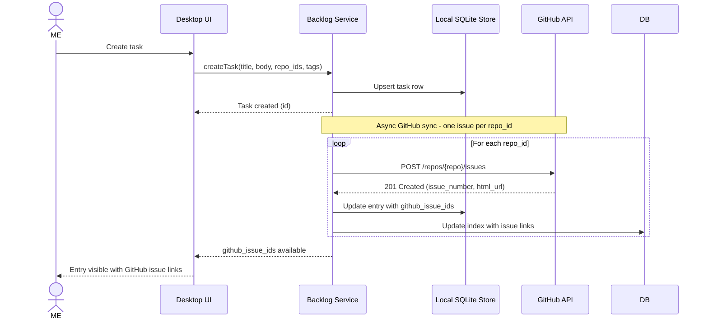
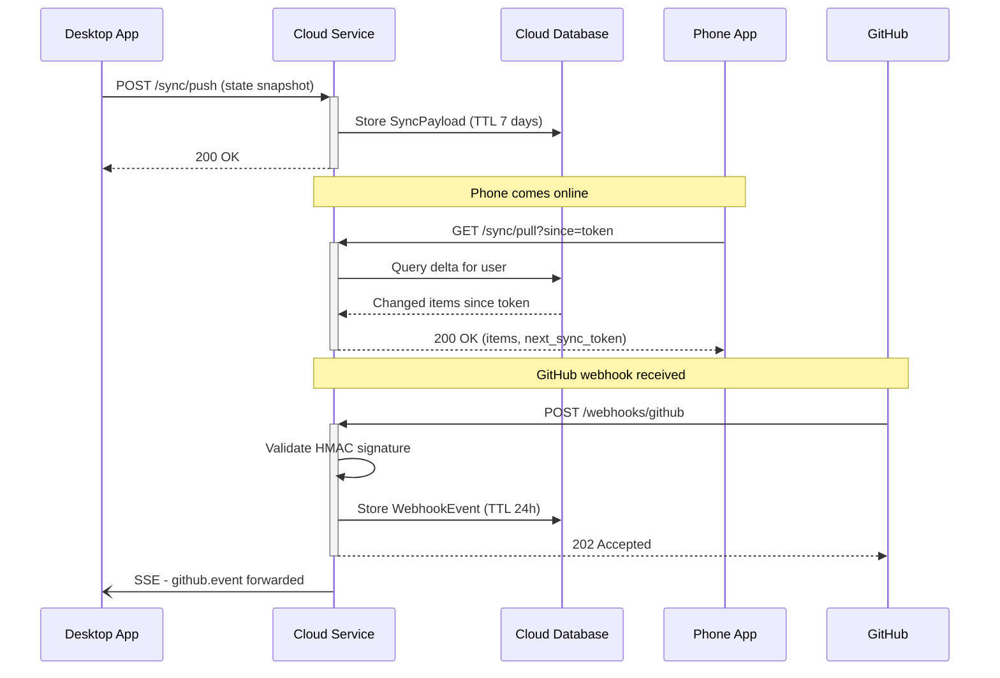
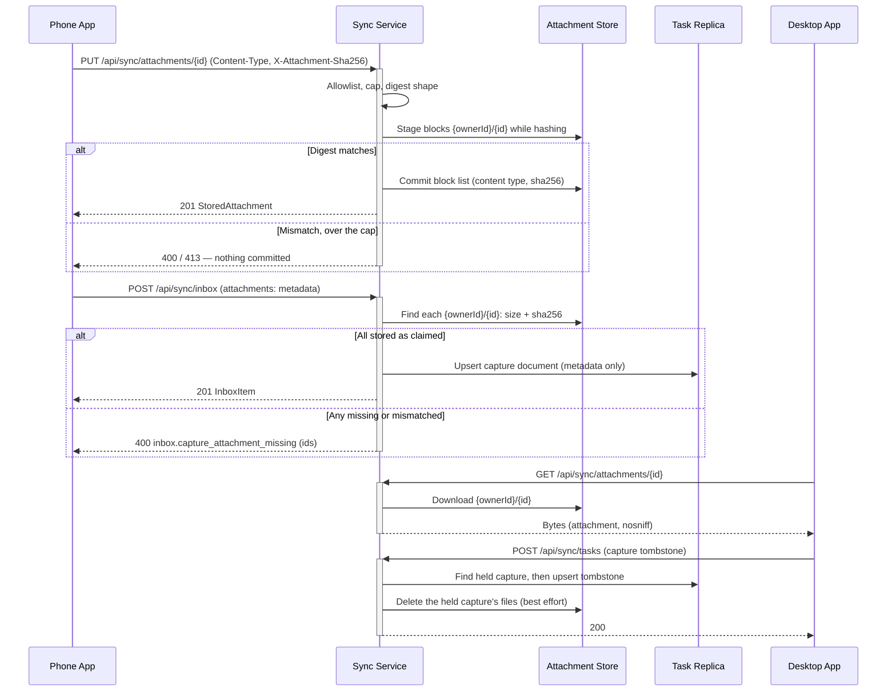
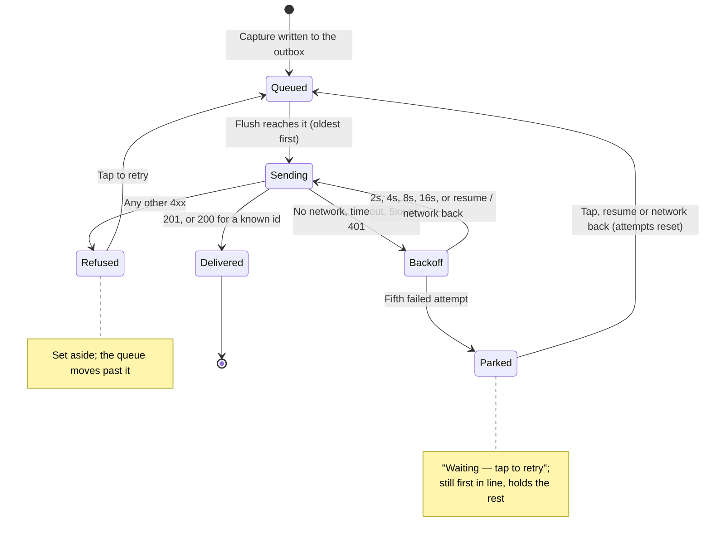
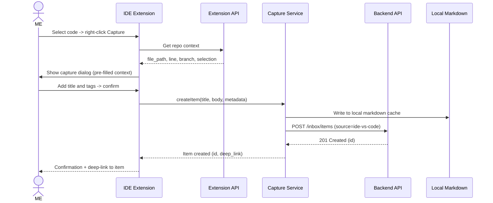
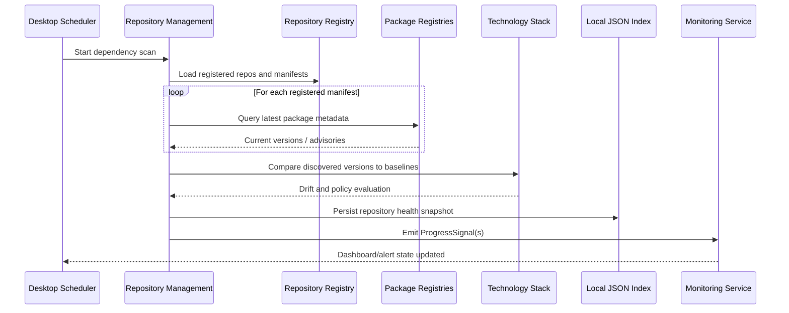
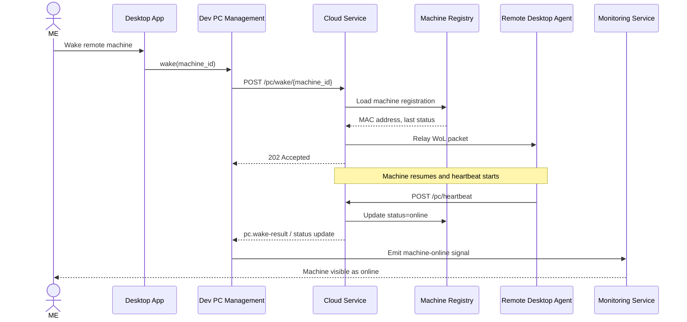

# 06. Runtime View

```meta
related: [".devbook/arc42/05-building-block-view.md"]
```

Key runtime scenarios that exercise the building blocks from chapter 05 and show how
the local-first and thin-cloud strategies play out dynamically.

## Task to GitHub Issue

```meta
related: [".devbook/arc42/05-building-block-view.md#desktop-app"]
```

Creating a task writes markdown locally first, then asynchronously creates
one GitHub issue per targeted repo.



## State Sync and Webhook Forwarding

```meta
related: [".devbook/arc42/05-building-block-view.md#cloud-service"]
```

In connected mode the desktop pushes state snapshots to the cloud, the phone pulls
deltas, and GitHub webhooks are validated and forwarded to the desktop.



## Mobile Capture and Sync

```meta
related: [".devbook/arc42/05-building-block-view.md#mobile-app"]
```

A capture is written to the phone's own SQLite outbox before anything touches
the network, then sent in the order it was made. The phone never loses a capture
to a missing signal: it shows the item at once, marked waiting, and delivers it
when the service answers.

- **One outbox, many kinds.** Each row is `id, kind, payload, attempts,
  last_error, created_at`. The `kind` picks the sender; `capture` is the first,
  and later kinds (an attachment upload that must go ahead of its capture, a task
  pushed to its own endpoint) join the same queue and the same order.
- **Oldest first, head of line.** A transient failure (no network, a timeout, a
  5xx, or a 401 from a service that restarted with a new signing key) stops the
  flush, so nothing overtakes it. It is retried after 2s, 4s, 8s, 16s. The fifth
  failure parks the entry as *waiting — tap to retry*, and it stays first in
  line. A refusal (any other 4xx) is set aside at once and holds nothing up.
- **Same id on every attempt.** The id is minted (`Guid.CreateVersion7()`) when
  the capture is queued. The service answers a repeat of it with 200 and the
  capture it already holds, so a retry after a lost 201 delivers it once.
- **Flush triggers.** Queuing an entry, the backoff timer, the app returning to
  the foreground, the network coming back, and a tap on a parked entry. The
  last three skip the pending wait and give a parked entry its attempts back,
  since the reason for the wait has most likely gone.
- **The list outlives the service.** Every successful pull is kept in the same
  file with its time. A failed pull, including 503 `sync.replica_unavailable`
  while the Cosmos emulator warms up, shows that cached list with one status line
  saying why it is not newer.

```mermaid
sequenceDiagram
    actor ME
    participant App as Phone App
    participant Outbox as SQLite Outbox
    participant Sync as Sync Service

    ME->>App: Capture (title)
    App->>Outbox: INSERT outbox (id v7, kind=capture, attempts=0)
    App-->>ME: Row shown at once, marked waiting

    loop Oldest entry first
        Outbox->>+Sync: POST /api/sync/inbox (same id every attempt)
        alt 201 Created, or 200 for an id it already holds
            Sync-->>-Outbox: Capture
            Outbox->>Outbox: DELETE entry
            App->>Sync: GET /api/sync/inbox (refresh, cache the list)
        else No network, timeout, 5xx or 401
            Outbox->>Outbox: attempts+1, last_error; wait 2s·2^(n-1); stop the flush
        else Any other 4xx
            Outbox->>Outbox: set aside as refused; continue with the next entry
        end
    end

    Note over App,Outbox: Five failures park the head entry and hold the queue behind it; resume, network back or a tap tries again
```

## Capture Attachments

```meta
related: [".devbook/arc42/adr/0014-attachments-travel-through-a-blob-store-beside-the-replica.md", ".devbook/arc42/05-building-block-view.md#cloud-service", ".devbook/domain/capture/domain.md#capture"]
```

A capture's files travel beside it rather than inside it (local ADR 0014). The
phone uploads each file first, under an id it mints itself, and posts the
capture that names them after; the capture document carries only their
metadata. The service side is built; the phone's upload and the desktop's
intake are later slices.

- **Upload, then capture.** `PUT /api/sync/attachments/{id}` carries the bytes,
  their declared `Content-Type` and their SHA-256 in `X-Attachment-Sha256`. The
  service refuses a type off the allowlist (415) or a body over the cap (413)
  before storing anything, stages the bytes while hashing them, and commits them
  only when they match the declared digest. The same bytes again under the same
  id are a 200 that writes nothing; different bytes are a 409.
- **A capture names only what is there.** `POST /api/sync/inbox` with
  `attachments` is refused (400 `inbox.capture_attachment_missing`, naming the
  ids) unless every file is stored under this owner with the size and digest
  the capture claims.
- **The desktop fetches** each file with `GET /api/sync/attachments/{id}`,
  served as a download with `nosniff`. Another owner's id is a 404.
- **Acknowledgement releases.** When the capture's tombstone is stored — the
  phone's `POST /inbox/{id}/ack` or the desktop's pushed tombstone — the
  service deletes the files the held capture named. A failed delete is logged
  and left to the container's 30-day lifecycle rule; the acknowledgement never
  fails on it.



## Mobile My Day and Task Push

```meta
related: [".devbook/arc42/05-building-block-view.md#mobile-app", ".devbook/arc42/06-runtime-view.md#mobile-capture-and-sync", ".devbook/domain/tasks/features.md#my-day"]
```

The phone's Tasks tab is My Day and nothing else. It reads the owner's existing
task feed rather than a My Day endpoint, and it writes exactly one thing: a task
added for today. It keeps no task store of its own — a projection of the feed,
and a push through the outbox.

- **Fold the feed.** `GET /api/sync/tasks?since=` is pulled from a cursor kept
  on the phone, page after page until `hasMore` is false, and each page is kept
  with the cursor after it in one transaction. Records fold into one row per
  task in a local `task_view` table: the later `UpdatedAt` wins, an equal stamp
  goes to the higher server stamp and then to the tombstone, a `DeletedAt` hides
  the row, and a `capture`-type document is skipped (it is the Inbox's,
  ADR 0009). A deleted task keeps its row, hidden, so the order pages arrive in
  never changes the result.
- **My Day is arithmetic.** The list is the rows whose `in_my_day_on` is the
  phone's current local date and whose status is neither `done` nor `archived`.
  Yesterday's pick is not in today's list without anything clearing it.
- **A rejected cursor starts over.** `sync.cursor_malformed` or
  `sync.cursor_expired` drops the cursor and pulls once from the beginning; the
  rows already kept fold to the same result. Any other failure keeps the list on
  screen with one line saying why.
- **Adding is a push.** The task is built on the phone as a `TaskChange` with a
  `Guid.CreateVersion7()` id, the typed title, type `task`, status `draft`,
  priority `medium`, `CreatedAt` now and `InMyDayOn` today — added here means
  picked for today. It is queued as outbox kind `task` and posted to
  `POST /api/sync/tasks` with the same order, backoff and waiting marker as a
  capture. A retry sends the same id, and the replica's whole-document upsert
  makes that idempotent (ADR 0005).
- **At once, then replaced.** The row is written into `task_view` when the task
  is queued, with server stamp 0, so it is in today's list immediately and marked
  waiting until the outbox delivers it. The pull that delivery triggers brings
  back the replica's copy of the same write, which replaces it.

```mermaid
sequenceDiagram
    actor ME
    participant Tasks as Phone Tasks tab
    participant View as task_view (SQLite)
    participant Outbox as SQLite Outbox
    participant Sync as Sync Service

    ME->>Tasks: Add "Buy a charger"
    Tasks->>Outbox: INSERT outbox (id v7, kind=task, TaskChange with InMyDayOn=today)
    Tasks->>View: UPSERT row (server stamp 0)
    Tasks-->>ME: In My Day at once, marked waiting

    Outbox->>+Sync: POST /api/sync/tasks (same id every attempt)
    Sync-->>-Outbox: 200 Accepted
    Outbox->>Outbox: DELETE entry

    loop Until hasMore is false
        Tasks->>+Sync: GET /api/sync/tasks?since=cursor
        alt Page
            Sync-->>-Tasks: TaskChangeRecords, next cursor
            Tasks->>View: Fold page (LWW, tombstones kept, captures skipped) + cursor
        else 400 sync.cursor_malformed / sync.cursor_expired
            Tasks->>View: Forget the cursor; pull again from the beginning
        end
    end
```

## Sync Item Lifecycle

```meta
related: [".devbook/arc42/05-building-block-view.md#mobile-app"]
```



## IDE Context-aware Capture

```meta
related: [".devbook/arc42/05-building-block-view.md#ide-extensions"]
```

Selecting code in the IDE captures it with repo context (file, line, branch) into the
local markdown cache and posts it to the inbox.



## Copilot App Session Capture

```meta
related: [".devbook/arc42/05-building-block-view.md#ide-extensions", ".devbook/domain/capture/domain.md#source-adapter", ".devbook/domain/capture/features.md#copilot-app-session-capture"]
```

A GitHub Copilot App session can capture a backlog follow-up or knowledge note using
local session metadata (`session_id`, `worktree_path`, `branch`) via
`.devbook/domain/capture/domain.md#source-adapter`, reusing the same local
capture pipeline as IDE extensions and desktop workers.

```mermaid
sequenceDiagram
    actor ME
    participant Copilot as GitHub Copilot App Session
    participant Adapter as Source Adapter
    participant Capture as Capture Service
    participant Store as Local Markdown
    participant API as Backend API

    ME->>Copilot: /capture "follow-up"
    Copilot->>Adapter: Build source metadata (session_id, worktree_path, branch)
    Adapter->>Capture: createItem(title, body, source=ide, metadata)
    Capture->>Store: Write to local markdown cache
    Capture->>API: POST /inbox/items
    API-->>Capture: 201 Created (id)
    Capture-->>Copilot: Item created (id, deep_link)
    Copilot-->>ME: Confirmation + deep-link

    Note over Copilot,API: Local-first path only; no credential forwarding through Cloud Service
```

## Repository Baseline Scan and Health Signal

```meta
related: [".devbook/arc42/05-building-block-view.md#desktop-app", ".devbook/arc42/08-crosscutting-concepts.md#shared-data-types"]
```

Repository Management scans registered repositories, compares discovered package
versions with Technology Stack baselines, and emits monitoring signals when drift is
found.



## Remote PC Wake and Status Update

```meta
related: [".devbook/arc42/05-building-block-view.md#desktop-app", ".devbook/arc42/05-building-block-view.md#cloud-service"]
```

Dev PC Management uses the optional cloud registry to wake a registered machine and
reconcile its status when the target desktop comes back online.




