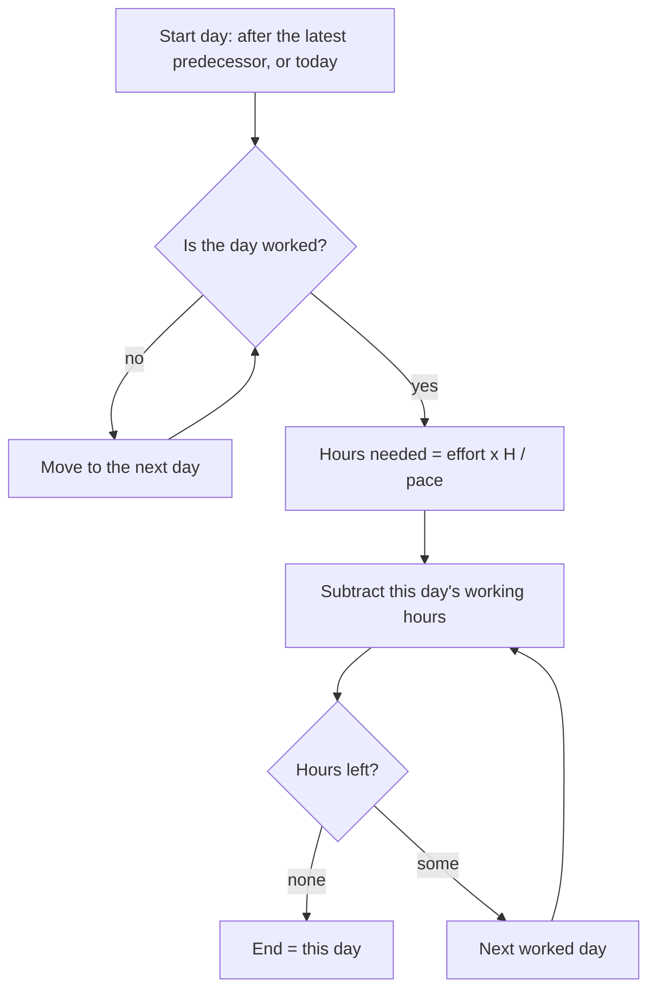

# ADR 0019: The roadmap counts the person's working week in hours, and the week travels with the pace

```meta
date: 2026-10-01
status: proposed
related: [".devbook/arc42/adr/0013-imported-plan-is-a-roadmap-item-laid-out-by-import.md", ".devbook/arc42/adr/0018-roadmap-plan-and-pace-ride-the-task-feed.md", ".devbook/arc42/adr/0006-additive-schema-bootstrapping-is-the-local-migration-mechanism.md", ".devbook/arc42/08-crosscutting-concepts.md#storage-and-sync", ".devbook/domain/roadmap/context.md#story-points-a-week", ".devbook/domain/roadmap/features.md#placing-a-plan-in-time", ".devbook/domain/roadmap/features.md#carrying-the-pace-with-the-person", ".devbook/domain/roadmap/features.md#reading-the-near-term-closely", ".devbook/domain/roadmap/domain.md#working-week", ".devbook/domain/roadmap/dependencies.md", ".devbook/domain/productivity/context.md#working-week", ".devbook/domain/productivity/features.md#personal-productivity-dashboard"]
```

The roadmap places an effort-sized window by counting the person's working
hours forward from its start, and measures a pace over the same hours. The pace
stays story points a working week. The working week travels between paired
devices inside the `planning-pace` document, so every device draws the same bars.

## Status

```meta
```

Proposed, 2026-10-01, by the flow-spec run that drafted it, awaiting the
repository owner at the Personal Validation gate. Nothing is built yet.

A **local** decision, numbered in the local sequence. Every bare ADR number below
means the local one.

The owner asked on 2026-10-01: "Can we include work hours in the week and day
column, to adjust measured effort? Can we take out days we do not work, to adjust
estimate?" They settled five choices. They are inputs here, not open questions:

| Choice | Settled as |
|---|---|
| What placement and measured pace count | **The working week, in hours.** A window counts working hours forward and skips days and hours not worked. |
| The unit of the pace | **Story points per working week.** A week is the hours of the person's working week. |
| Where the working week lives | **It travels with the pace**, inside the synced `planning-pace` document. There is one working week per person. |
| The roadmap axis | **Day and week heads show their working hours**, and days not worked are shaded. Columns stay even. |
| Holidays and one-off days off | **Out of scope.** Only the weekly pattern counts. |

This record **amends** ADR 0013 ruling 4, which drew a window in calendar days
because "Roadmap models no working week". It also **amends** ADR 0018 §2, which
kept the working week on the device because "nothing in placement reads it".
Both records carry a dated note pointing here.

## Context

```meta
```

**The working week already exists, and only the dashboard reads it.**
`WorkingHours` in `Backlog.SharedKernel` holds seven independent days. Each day
is worked or not, and has its own start and end. `WorkingHoursSettingsStore`
keeps it per device in `working-hours.json`. The default is Monday to Friday,
09:00 to 17:30, which is 42.5 hours. Today it only outlines hours on the
dashboard's hour grids
([Working week](../../domain/productivity/context.md#working-week)).

**Placement counts calendar days.** A window's length is effort × 7 ÷ the pace,
rounded up, in calendar days (ADR 0013, Deviations of 2026-09-25). A pace of 5
points a week spreads 5 points over 7 days, weekends included. A person who
works five days reads every bar as too short for the days they will actually
work, and an item that starts on a Saturday seems to have started.

**A measured pace already counts whole weeks.** Every stretch (2, 4 or 8 weeks)
is a run of whole seven-day weeks. Any seven consecutive days hold each weekday
exactly once. So a stretch of N weeks always holds N working weeks of hours,
whatever the pattern is.

**The pace already travels, and the plan with it.** ADR 0018 replicates the plan
as a `roadmap-plan` document and the pace as a `planning-pace` document. It kept
the working week behind because placement did not read it. Once placement reads
it, the reason ADR 0018 gave for the pace applies to the week too. Two devices
with different weeks would redraw the same `effort`-placed items to different
dates, and the plan would change hands on every load.

## Decision

```meta
```

### 1. An effort window counts working hours

```meta
```



H is the hours of the person's working week, 42.5 on the default week. The
start day is chosen by ADR 0013 ruling 4, unchanged. When that day is not
worked, the window starts on the next worked day. This applies to the
importer's placement, to the daily re-projection (ADR 0013 ruling 5) and to an
unstarted successor that follows its predecessor.

Hours are counted per day, and a day counts whole. A window that starts today
counts all of today's working hours, whatever the time is. Days not worked
inside the window add nothing and are still drawn as part of it. So a window
always runs from one worked day to another worked day.

The window is never shorter than its start day. A plan that has gathered nothing,
or nothing estimated, takes one working week of hours. On the default week, that
is Monday to Friday when it starts on a Monday.

A day is worked when the week marks it worked and its end is after its start. A
day whose end is at or before its start counts as not worked, as the dashboard
already reads it. The hours needed are computed as effort × H ÷ pace, multiplying
before dividing. A plan of 4 points at 4 a week then needs exactly H hours.

### 2. The pace stays story points per working week

```meta
```

The number a person typed or synced keeps its value and its unit: points a
week. A week now means the hours of their working week, not seven calendar days.

A measured pace is the points finished in the stretch ÷ the working hours in the
stretch × H. Each stretch is whole weeks, so this equals the points ÷ the weeks.
A measured pace therefore shows the same figure as before this change.

A working week with no working hours at all cannot divide anything. It reads as
the default week for placement and for the pace. The settings screen keeps
refusing a day whose end is not after its start, so this state needs a hand-edited
file or every day switched off.

### 3. The working week travels inside the `planning-pace` document

```meta
```

The `planning-pace` document of ADR 0018 §2 gains one key, `workingWeek`. It
holds the seven days, each with its working flag, start and end. Times use the
`HH:mm` spelling `working-hours.json` already uses. It travels under the
document's one `updatedAt` stamp and the same last-write-wins rule. A working week
changed on one device therefore reaches the other with the pace.

There is **one working week per person**. The roadmap and the dashboard's hour
grids read the same value. A change on the settings screen writes the device's
`working-hours.json` and the pace file's `workingWeek` together, and stamps the
pace file. A pulled document that carries `workingWeek` replaces both, at the
inbound stamp. So `working-hours.json` stays as the device's copy, always equal
to the last value the device held, and the dashboard keeps reading it.

**An absent key has a defined reading**, within ADR 0006's terms for an additive
key. A pace file or document without `workingWeek` reads the device's own
`working-hours.json`, or the default week when that file is missing. The device
writes the key on its next change to the pace or the working week, and pushes it
then. A device that never set a pace still sends nothing, as ADR 0018 §3 says.

An older build narrows the document when it saves a pace change, because it
writes only the keys it knows. A newer device that pulls that document keeps its
own copy of the week, because an absent key reads `working-hours.json`. Bars
can differ between the two devices until the older build is upgraded.

### 4. The roadmap axis shows the hours and shades days off

```meta
```

In the graduated axis, each day column's head shows that day's working hours,
and each week column's head shows the week's. A wide column reads them inline,
such as "Wed 23 · 8.5h" and "W41 · 42.5h". A narrow column shows them on a line
of their own under the label, such as "8.5h" and "42.5h", and drops the unit
when the figure would not fit. A day column the week does not work is hatched,
and its head shows no hours. Month and quarter columns are unchanged.

Every column keeps its width. The axis is still time, so a drag still moves a
bar by days, and a bar still spans the days off inside it.

### 5. Only the weekly pattern counts

```meta
```

The working week is a weekly pattern and nothing more. A public holiday, a day
of leave or a shorter Friday in one particular week is not modelled. Such a day
counts as worked when the pattern says so.

## Consequences

```meta
```

Positive:

- **A bar reads in the days the person actually works.** On the default week, 5
  points at 5 a week fill Monday to Friday, and the bar ends on a Friday.
- **A pace keeps its meaning.** The same number means the same amount of work in
  a working week, and every measured pace keeps its figure.
- **Every device draws the same bars**, because the week that sizes them travels
  with the pace and the plan.
- **The dashboard and the roadmap agree on the week.** A person sets it once.

Negative:

- **Bars get longer.** A pace of 5 points a week used to span 7 calendar days and
  now spans 5 working days, which is a full calendar week plus any days off
  inside it. The default pace of 7 used to mean one point a day. It now means 7
  points per working week, about 1.4 points per worked day on the default week.
  Nobody's typed number changes, but every `effort`-placed bar moves at the next
  load.
- **A holiday or a week of leave does not lengthen a bar.** The person absorbs
  it by moving the item, setting a `due:`, or lowering the pace for a while.
- **The working week becomes the person's, not the device's.** A person who
  works different hours on two machines can no longer say so. The owner chose
  identical bars over that.
- **An older build can strip the key.** Until every device is upgraded, a pace
  saved on an older build drops `workingWeek`, and the newer devices fall back
  to their own copies.
- **The working week is set in Productivity's settings and carried by Roadmap's
  document.** Two contexts now share one value. The value type was already the
  shared kernel's, so no model is copied, but a change to its shape touches both.

Neutral:

- The time axis is unchanged. Columns stay even, so a drag, a snap and the
  keyboard moves keep their step.
- `planning-velocity.json` gains one additive key with a defined absent reading.
  That is within ADR 0006's terms, as ADR 0018 already notes for its stamp.
- The sync service does not change. It still never looks inside the document.

## Rejected

```meta
```

- **Keeping the working week per device.** The same plan would draw different
  bar lengths on two PCs, and each device would save its own dates as the newer
  plan. This is the loop ADR 0018 closed for the pace. The owner rejected it.
- **Narrowing the columns of days off.** The axis would become uneven, and a drag
  of the same distance would move a bar by a different number of days. The owner
  rejected it.
- **Redefining the pace as points per working day or per hour.** Every typed and
  synced pace would change its meaning, and the person would have to retype it.
- **Counting working days instead of hours.** It cannot tell a short Friday from
  a full Monday, which the seven independent days exist to express.
- **Holidays and one-off days off.** A calendar of exceptions is a separate model
  with its own entry screen. It is left out until someone asks for it.

## Verification

```meta
```

The implementing `flow-code` run turns these into tests:

1. **A two-week bar on the default week.** 10 points at 5 a week, starting on a
   Monday, ends on the Friday of the next week. It covers 10 working days and 85
   hours.
2. **A weekend start moves to Monday.** A window whose start would fall on a
   Saturday starts on the following Monday, for the importer, the daily
   re-projection and an unstarted successor alike.
3. **The default span is one working week.** A plan that gathered nothing,
   starting on a Monday, ends on that Friday.
4. **A short Friday counts.** With Friday set to 09:00 to 13:00, a plan needing
   exactly the hours of Monday to Thursday ends on Thursday, and one more hour
   ends it on Friday.
5. **A measured pace keeps its figure.** 20 points finished over the 4-week
   stretch measure 5 a week, on the default week and on any other pattern.
6. **An empty week falls back.** A working week with no worked day places and
   measures as the default week.
7. **The working week travels.** Device A edits the working week and syncs.
   Device B pulls, its `working-hours.json` equals A's week, and it draws the
   same bars as A. The dashboard grid on B outlines the new hours.
8. **An absent key reads local.** A pace document without `workingWeek` leaves
   the device's `working-hours.json` alone, and placement reads that file. The
   device's next pace change writes and pushes the key.
9. **The axis shows hours and shades days off.** On the default week, a day head
   carries "8.5h", a week head carries "42.5h" at the default width and reads
   "W41 · 42.5h" when wide, and Saturday and
   Sunday columns are shaded at the same width as the others.
