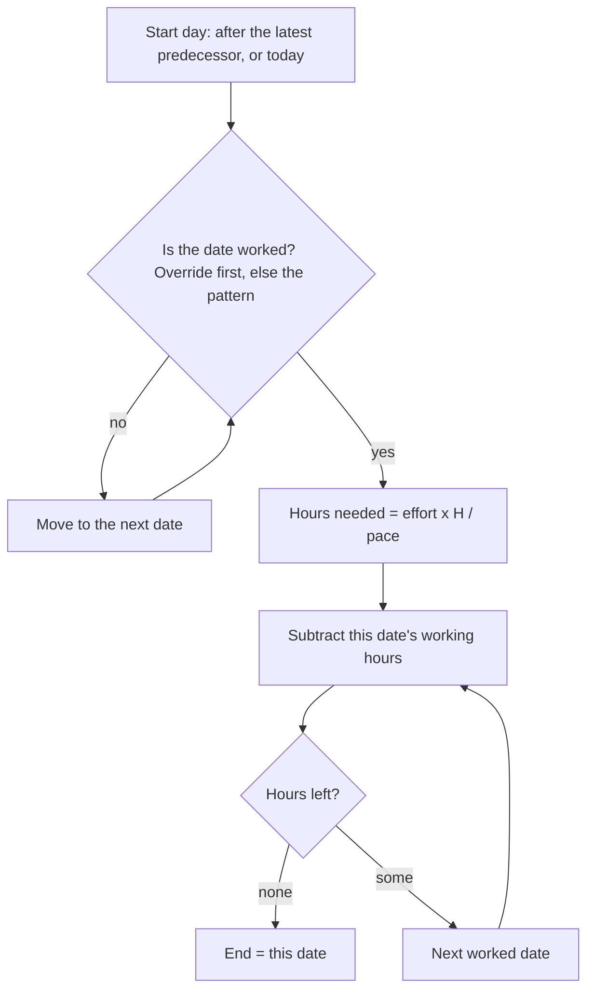
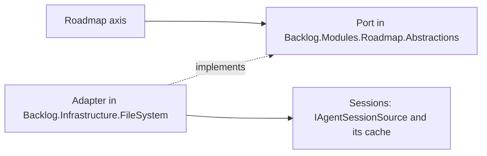

# ADR 0019: The roadmap counts the person's working week in hours, date by date, and the week travels with the pace

```meta
date: 2026-10-03
status: proposed
related: [".devbook/arc42/adr/0013-imported-plan-is-a-roadmap-item-laid-out-by-import.md", ".devbook/arc42/adr/0018-roadmap-plan-and-pace-ride-the-task-feed.md", ".devbook/arc42/adr/0006-additive-schema-bootstrapping-is-the-local-migration-mechanism.md", ".devbook/arc42/08-crosscutting-concepts.md#storage-and-sync", ".devbook/domain/roadmap/context.md#story-points-a-week", ".devbook/domain/roadmap/features.md#placing-a-plan-in-time", ".devbook/domain/roadmap/features.md#carrying-the-pace-with-the-person", ".devbook/domain/roadmap/features.md#reading-the-near-term-closely", ".devbook/domain/roadmap/domain.md#working-week", ".devbook/domain/roadmap/dependencies.md", ".devbook/domain/productivity/context.md#working-week", ".devbook/domain/productivity/features.md#personal-productivity-dashboard", ".devbook/domain/sessions/domain.md", ".devbook/domain/sessions/domain.md#activity-window"]
```

The roadmap places an effort-sized window by counting the person's working
hours forward from its start, and measures a pace over the same hours. The
working week is a weekly pattern plus day overrides: dates the person blocks or
unblocks on the roadmap axis. The pace stays story points a working week. The
working week and its overrides travel between paired devices inside the
`planning-pace` document, so every device draws the same bars. Past day and week
heads also show the hours an agent was actually active.

## Status

```meta
```

Proposed, 2026-10-01, by the flow-spec run that drafted it, awaiting the
repository owner at the Personal Validation gate. The weekly pattern of
2026-10-01 is built and merged (PR #935). The revision of 2026-10-03 below is
not built yet.

A **local** decision, numbered in the local sequence. Every bare ADR number below
means the local one.

The owner asked on 2026-10-01: "Can we include work hours in the week and day
column, to adjust measured effort? Can we take out days we do not work, to adjust
estimate?" They settled five choices. They are inputs here, not open questions.

Revised 2026-10-03, in place while the record is still proposed. The owner asked:
"I want to control some of this from the header. Allow me to block a day,
weekends default blocked, but I can unblock. Calculate actual working hours from
session and tasks." They settled three more choices in chat, two more at the
review of this revision, and reversed the choice on holidays.

| Choice | Settled as |
|---|---|
| What placement and measured pace count | **The working week, in hours.** A window counts working hours forward and skips days and hours not worked. |
| The unit of the pace | **Story points per working week.** A week is the hours of the person's working week. |
| Where the working week lives | **It travels with the pace**, inside the synced `planning-pace` document. There is one working week per person. |
| The roadmap axis | **Day and week heads show their working hours**, and days not worked are shaded. Columns stay even. |
| Holidays and one-off days off | **In scope since 2026-10-03.** A person blocks or unblocks a single date from the axis (§5). On 2026-10-01 this was out of scope. |
| How per-date blocking is reached (2026-10-03) | **A design pass first**, this revision, then the build. |
| What "actual hours" means (2026-10-03) | **Agent-active time** on each date (§6). |
| Where date overrides live (2026-10-03) | **They travel with the pace**, inside `workingWeek` (§3). |
| When a toggle moves bars (2026-10-03) | **At once**, as a change to the working week in settings does (§4). |
| A past day not worked with activity (2026-10-03) | **Its actual hours alone**, such as "2.0h" (§6). |

This record **amends** ADR 0013 ruling 4, which drew a window in calendar days
because "Roadmap models no working week". It also **amends** ADR 0018 §2, which
kept the working week on the device because "nothing in placement reads it".
Both records carry a dated note pointing here.

## Context

```meta
```

**The working week already exists, and only the dashboard reads it.**
`WorkingHours` in `Backlog.SharedKernel` holds seven independent days. Each day
is worked or not, and has its own start and end. `WorkingHoursSettingsStore`
keeps it per device in `working-hours.json`. The default is Monday to Friday,
09:00 to 17:30, which is 42.5 hours. Today it only outlines hours on the
dashboard's hour grids
([Working week](../../domain/productivity/context.md#working-week)).

**Placement counts calendar days.** A window's length is effort × 7 ÷ the pace,
rounded up, in calendar days (ADR 0013, Deviations of 2026-09-25). A pace of 5
points a week spreads 5 points over 7 days, weekends included. A person who
works five days reads every bar as too short for the days they will actually
work, and an item that starts on a Saturday seems to have started.

**A measured pace already counts whole weeks.** Every stretch (2, 4 or 8 weeks)
is a run of whole seven-day weeks. Any seven consecutive days hold each weekday
exactly once. So a stretch of N weeks always holds N working weeks of hours,
whatever the pattern is.

**The pace already travels, and the plan with it.** ADR 0018 replicates the plan
as a `roadmap-plan` document and the pace as a `planning-pace` document. It kept
the working week behind because placement did not read it. Once placement reads
it, the reason ADR 0018 gave for the pace applies to the week too. Two devices
with different weeks would redraw the same `effort`-placed items to different
dates, and the plan would change hands on every load.

**A weekly pattern alone falls short.** A day of leave, a public holiday and a
Saturday the person chose to work all differ from the pattern for one date only.
The pattern counts a holiday as worked and a worked Saturday as off, so a bar
over either is wrong by a day. The owner also wants to see the hours actually
worked beside the hours planned. The dashboard already measures agent-active
time, but the roadmap shows only the plan.

## Decision

```meta
```

### 1. An effort window counts working hours

```meta
```



H is the hours of the person's working week, 42.5 on the default week. It is
the weekly pattern's total, and day overrides never change it. The start day is
chosen by ADR 0013 ruling 4, unchanged. When that date is not worked, the window
starts on the next worked date. A window therefore never starts on a blocked
date. This applies to the importer's placement, to the daily re-projection
(ADR 0013 ruling 5) and to an unstarted successor that follows its predecessor.

Hours are counted per date, and a date counts whole. Each date counts its own
hours: the pattern day's, or its override's (§5). A window that starts today
counts all of today's working hours, whatever the time is. Dates not worked
inside the window add nothing and are still drawn as part of it. A blocked date
is one of them. An unblocked Saturday takes hours like any worked day. So a
window always runs from one worked date to another worked date.

The window is never shorter than its start day. A plan that has gathered nothing,
or nothing estimated, takes one working week of hours. On the default week with
no overrides, that is Monday to Friday when it starts on a Monday.

A pattern day is worked when the week marks it worked and its end is after its
start. A day whose end is at or before its start counts as not worked, as the
dashboard already reads it. The hours needed are computed as effort × H ÷ pace,
multiplying before dividing. A plan of 4 points at 4 a week then needs exactly H
hours.

The walk skips whole weeks first, because any seven days in a row hold H hours.
That shortcut holds only where no override falls in the skipped weeks. The walk
must count those weeks date by date, or skip only up to the first override.

### 2. The pace stays story points per working week

```meta
```

The number a person typed or synced keeps its value and its unit: points a
week. A week now means the hours of their working week, not seven calendar days.

A measured pace is the points finished in the stretch ÷ the working hours in the
stretch × H. The hours in the stretch are counted date by date, overrides
included. With no override in the stretch, each stretch is whole weeks, so this
equals the points ÷ the weeks. A measured pace then shows the same figure as
before this change.

A stretch with an override measures a different figure, and a truer one. A
4-week stretch that holds a blocked week has three working weeks of hours. The
same 15 points then measure 5 a week rather than 3.75. An unblocked Saturday adds
its hours to the stretch and lowers the figure.

A working week with no working hours at all cannot divide anything. It reads as
the default week for placement and for the pace. The settings screen keeps
refusing a day whose end is not after its start, so this state needs a hand-edited
file or every day switched off. Overrides apply on top of the effective pattern,
the default week included.

### 3. The working week travels inside the `planning-pace` document

```meta
```

The `planning-pace` document of ADR 0018 §2 gains one key, `workingWeek`. It
holds the seven days, each with its working flag, start and end. Times use the
`HH:mm` spelling `working-hours.json` already uses. It travels under the
document's one `updatedAt` stamp and the same last-write-wins rule. A working week
changed on one device therefore reaches the other with the pace.

`workingWeek` also holds an `overrides` array, one entry per date that differs
from the pattern:

```json
"overrides": [
  { "date": "2026-10-09", "worked": false },
  { "date": "2026-10-10", "worked": true }
]
```

The array travels under the same `updatedAt` stamp, with last write wins. A
toggle on the axis stamps the pace document, as a settings change does. The
device copy `working-hours.json` carries the same array.

There is **one working week per person**. The roadmap and the dashboard's hour
grids read the same value. A change on the settings screen writes the device's
`working-hours.json` and the pace file's `workingWeek` together, and stamps the
pace file. A pulled document that carries `workingWeek` replaces both, at the
inbound stamp. So `working-hours.json` stays as the device's copy, always equal
to the last value the device held, and the dashboard keeps reading it.

**An absent key has a defined reading**, within ADR 0006's terms for an additive
key. A pace file or document without `workingWeek` reads the device's own
`working-hours.json`, or the default week when that file is missing. A
`workingWeek` without `overrides` reads as no overrides. The device writes the
keys on its next change to the pace or the working week, and pushes them then. A
device that never set a pace still sends nothing, as ADR 0018 §3 says.

An older build narrows the document when it saves a pace change, because it
writes only the keys it knows. A newer device that pulls that document keeps its
own copy of the week, because an absent key reads `working-hours.json`. Bars
can differ between the two devices until the older build is upgraded. A build
that knows `workingWeek` but not `overrides` rewrites the week from its own model
and drops the array. That is the same narrowing, one level down.

Nothing prunes overrides in this change. A past override is history that the
measured pace reads.

### 4. The roadmap axis shows the hours and toggles a date

```meta
```

In the graduated axis, each day column's head shows that date's working hours,
and each week column's head shows the sum of its dates' hours, overrides
included. A wide column reads them inline, such as "Wed 23 · 8.5h" and
"W41 · 42.5h". A narrow column shows them on a line of their own under the
label, such as "8.5h" and "42.5h", and drops the unit when the figure would not
fit. A date not worked is hatched, and its head shows no planned hours. Month and
quarter columns are unchanged.

A day column's head is a toggle. It is a real button, so a click, Enter or Space
activates it. Its accessible name says what it will do, such as "Block Fri 9 Oct"
or "Unblock Sat 10 Oct". Activating it blocks a date the pattern works, or
unblocks a date the pattern leaves off. Past dates toggle too, because they feed
the measured pace (§2). Week, month and quarter heads are not toggles. A toggle
re-places the `effort`-placed items at once, as a change to the working week in
settings does, rather than waiting for the next load.

A blocked date is hatched like a pattern day off. An unblocked date is unhatched
and shows its hours. A date that differs from its pattern also carries a visible
marker, so a day of leave reads differently from an ordinary weekend.

Every column keeps its width. The axis is still time, so a drag still moves a
bar by calendar days, and a bar still spans the days off inside it.

The Settings screen keeps editing the weekly pattern. The axis is the only place
an override is set in this change. A list of overrides in Settings is a possible
follow-up, not part of this decision.

### 5. A date override changes one date

```meta
```

The working week is the weekly pattern plus a set of **day overrides**. Each
override is a date and whether it is worked. A blocked date is not worked, such
as a day of leave or a public holiday. An unblocked date is worked although the
pattern leaves its weekday off, such as one Saturday.

A date with no override reads the pattern. The default pattern leaves Saturday
and Sunday off, so weekends are blocked by default.

An unblocked date counts the stored start and end of its weekday. The pattern
keeps those times for a day marked off too, 09:00 to 17:30 by default, which is
8.5 hours. An unblocked date whose weekday ends at or before it starts still
counts as not worked. Only a hand-edited file reaches that state.

A toggle that brings a date back in line with its pattern removes the override.
The set therefore only ever holds dates that differ from the pattern.

H stays the pattern's weekly total, so an override never changes a pace's unit.

The dashboard's hour grids keep reading the weekly pattern only. They outline
weekdays rather than dates, so an override does not change them.

### 6. Past heads show the hours actually worked

```meta
```



Day and week heads for columns on or before today also show the **actual
hours**: agent-active time on that local date. It is the union of every agent
session's active intervals, so overlapping sessions count once. It is the same
measure as the dashboard's activity grid, read from Sessions' activity windows.
It includes sessions replicated from paired devices wherever the dashboard
includes them.

Today shows the hours so far. Future columns show none. The figure sits beside
the planned hours, such as "6.2 / 8.5h". A date not worked shows its actual
hours alone whenever there are some, such as "2.0h", so work on a day of leave
is visible without printing a planned zero.

The actual hours are presentation only. They move no bar and change no pace. A
pace is still measured from finished points.

Roadmap reads them through a port in `Backlog.Modules.Roadmap.Abstractions`. An
adapter in `Backlog.Infrastructure.FileSystem` answers it over Sessions'
agent-activity source and cache. `RoadmapItemRollupService` is the precedent: an
adapter there already takes `IAgentSessionSource`. No module references another
module.

The read is asynchronous, and the axis draws it after the plan. When it fails,
or the Sessions context is off, the heads show the planned hours only.

## Consequences

```meta
```

Positive:

- **A bar reads in the days the person actually works.** On the default week, 5
  points at 5 a week fill Monday to Friday, and the bar ends on a Friday.
- **A holiday or a week of leave lengthens a bar**, once the person blocks the
  dates on the axis. A worked Saturday shortens one.
- **A pace keeps its meaning.** The same number means the same amount of work in
  a working week. A measured pace keeps its figure over a stretch with no
  override, and reads truer over one with leave in it.
- **Every device draws the same bars**, because the week and its overrides that
  size them travel with the pace and the plan.
- **The dashboard and the roadmap agree on the week.** A person sets it once.
- **The plan meets the record.** A past head shows the hours worked beside the
  hours planned.

Negative:

- **Bars get longer.** A pace of 5 points a week used to span 7 calendar days and
  now spans 5 working days, which is a full calendar week plus any days off
  inside it. The default pace of 7 used to mean one point a day. It now means 7
  points per working week, about 1.4 points per worked day on the default week.
  Nobody's typed number changes, but every `effort`-placed bar moves at the next
  load.
- **A toggle moves bars.** Blocking or unblocking a date inside a window re-places
  every `effort`-placed item after it, on every paired device.
- **A measured pace moves when a past date is toggled.** Blocking a past day
  changes the hours in the stretch, so the measured figure changes with it.
- **The working week becomes the person's, not the device's.** A person who
  works different hours on two machines can no longer say so. The owner chose
  identical bars over that.
- **An older build can strip the keys.** Until every device is upgraded, a pace
  saved on an older build drops `workingWeek`. A build that predates overrides
  drops the `overrides` array. Newer devices then fall back to their own copies.
- **The whole-week skip in the placement walk must know about overrides.**
  `WorkingHours.LastDayOf` skips whole weeks first. With overrides, a skipped
  week may not hold H hours, so the skip must stop at the first override.
- **Roadmap gains a read of Sessions.** The actual hours need a new port and
  adapter, and the axis renders twice: once for the plan, once for the actual
  hours.
- **The working week is set in Productivity's settings and carried by Roadmap's
  document.** Two contexts now share one value. The value type was already the
  shared kernel's, so no model is copied, but a change to its shape touches both.
  The overrides are set on Roadmap's axis instead, so the value is edited in two
  places.

Neutral:

- The time axis is unchanged. Columns stay even, so a drag, a snap and the
  keyboard moves keep their step.
- `planning-velocity.json` gains one additive key with a defined absent reading,
  and that key gains an additive array. Both are within ADR 0006's terms, as
  ADR 0018 already notes for its stamp.
- The sync service does not change. It still never looks inside the document.
- The override set grows over the years. At a few dozen dates a year, it stays
  small enough to carry whole in every push.
- The dashboard's hour grids keep reading the weekly pattern alone.

## Rejected

```meta
```

- **Keeping the working week per device.** The same plan would draw different
  bar lengths on two PCs, and each device would save its own dates as the newer
  plan. This is the loop ADR 0018 closed for the pace. The owner rejected it.
- **Keeping overrides per device.** The bars would differ between devices in the
  same way. Overrides travel with the week instead.
- **Narrowing the columns of days off.** The axis would become uneven, and a drag
  of the same distance would move a bar by a different number of days. The owner
  rejected it.
- **Redefining the pace as points per working day or per hour.** Every typed and
  synced pace would change its meaning, and the person would have to retype it.
- **Counting working days instead of hours.** It cannot tell a short Friday from
  a full Monday, which the seven independent days exist to express.
- **A separate holiday calendar or entry screen.** It is a second place to keep
  dates and a second model to learn. A toggle on the axis sets the same date
  where the person sees its effect.
- **Counting the days a task started or completed as hours worked.** Tasks carry
  only dates, never hours. A date cannot give a count of hours.
- **Counting a session from its first to its last event.** That span counts every
  idle gap inside it, the overstatement the dashboard already left behind.

## Verification

```meta
```

The implementing `flow-code` run turns these into tests:

1. **A two-week bar on the default week.** 10 points at 5 a week, starting on a
   Monday, ends on the Friday of the next week. It covers 10 working days and 85
   hours.
2. **A weekend start moves to Monday.** A window whose start would fall on a
   Saturday starts on the following Monday, for the importer, the daily
   re-projection and an unstarted successor alike.
3. **The default span is one working week.** A plan that gathered nothing,
   starting on a Monday, ends on that Friday.
4. **A short Friday counts.** With Friday set to 09:00 to 13:00, a plan needing
   exactly the hours of Monday to Thursday ends on Thursday, and one more hour
   ends it on Friday.
5. **A measured pace keeps its figure with no override.** 20 points finished over
   the 4-week stretch with no override in it measure 5 a week, on the default
   week and on any other pattern.
6. **An empty week falls back.** A working week with no worked day places and
   measures as the default week.
7. **The working week travels.** Device A edits the working week and syncs.
   Device B pulls, its `working-hours.json` equals A's week, and it draws the
   same bars as A. The dashboard grid on B outlines the new hours.
8. **An absent key reads local.** A pace document without `workingWeek` leaves
   the device's `working-hours.json` alone, and placement reads that file. The
   device's next pace change writes and pushes the key.
9. **The axis shows hours and shades days off.** On the default week, a day head
   carries "8.5h", a week head carries "42.5h" at the default width and reads
   "W41 · 42.5h" when wide, and Saturday and
   Sunday columns are shaded at the same width as the others.
10. **A blocked weekday lengthens a window.** Blocking a Wednesday inside a
    one-week window on the default week moves its end one worked date later.
11. **An unblocked Saturday shortens a window.** Unblocking a Saturday inside a
    window that spans it ends the window one worked date earlier.
12. **A window never starts on a blocked date.** A window whose start would fall
    on a blocked Monday starts on the Tuesday.
13. **A blocked week lowers the hours in a stretch.** Over a 4-week stretch with
    one week blocked, 15 points finished measure 5 a week.
14. **A toggle back removes the override.** Blocking a Friday and then unblocking
    it leaves the override set empty.
15. **Overrides travel and survive.** Device A blocks a date and syncs. Device B
    pulls, holds the same override, and draws the same bars. A later pace change
    on B keeps the override.
16. **An absent `overrides` reads none.** A `workingWeek` without the array
    places exactly as the pattern alone.
17. **A day head toggles from the keyboard.** Focus on a Friday head, press
    Enter, and the date is blocked. The head's accessible name reads "Block Fri 9
    Oct" before and "Unblock Fri 9 Oct" after.
18. **A past day head shows actual against planned.** A past weekday with 6.2
    hours of agent-active time reads "6.2 / 8.5h".
19. **Overlapping sessions count once.** Two sessions active over the same hour
    add one hour to that date, not two.
20. **Future heads show no actual hours.** A date after today shows the planned
    hours only.
21. **Actual hours move nothing.** Adding agent activity to a past date changes no
    bar and no measured pace.
22. **A day off shows actual hours alone.** A past Saturday the pattern leaves off,
    with 2 hours of agent-active time, reads "2.0h".
23. **A toggle moves bars at once.** Blocking a date inside an `effort`-placed
    window lengthens the bar without a reload.
