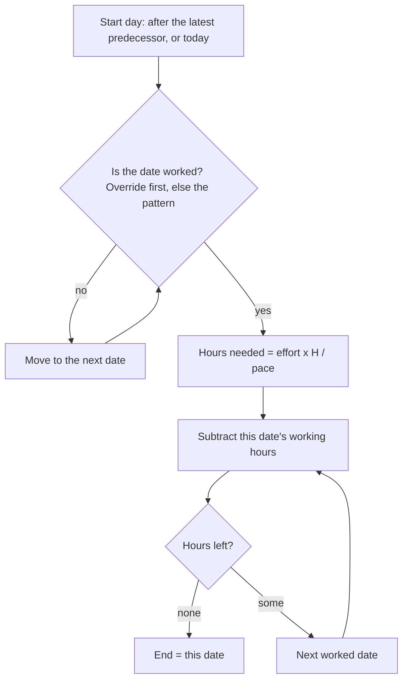
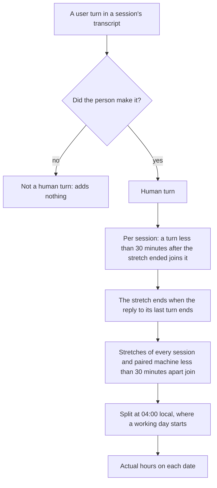
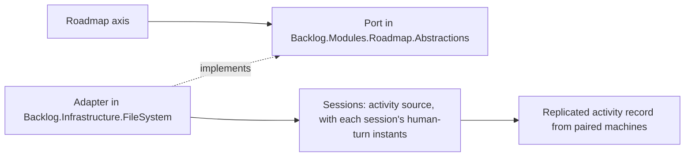
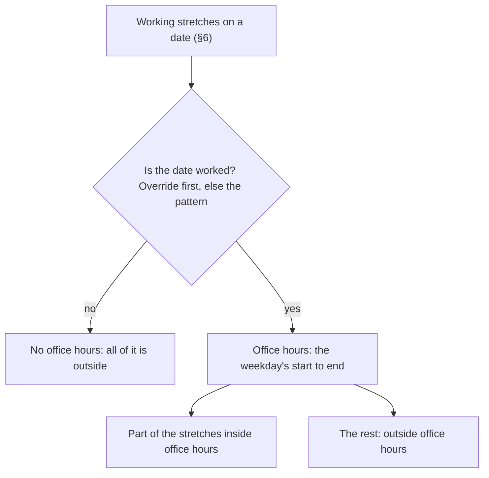
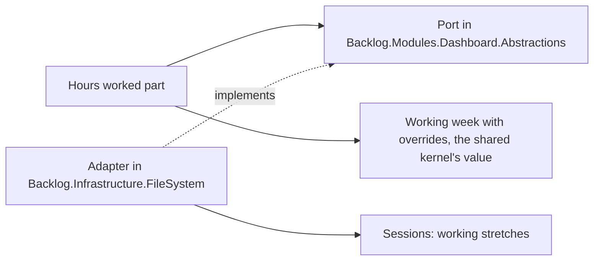

# ADR 0019: The roadmap counts the person's working week in hours, date by date, and the week travels with the pace

```meta
date: 2026-10-03
status: proposed
related: [".devbook/arc42/adr/0013-imported-plan-is-a-roadmap-item-laid-out-by-import.md", ".devbook/arc42/adr/0018-roadmap-plan-and-pace-ride-the-task-feed.md", ".devbook/arc42/adr/0006-additive-schema-bootstrapping-is-the-local-migration-mechanism.md", ".devbook/arc42/08-crosscutting-concepts.md#storage-and-sync", ".devbook/domain/roadmap/context.md#story-points-a-week", ".devbook/domain/roadmap/features.md#placing-a-plan-in-time", ".devbook/domain/roadmap/features.md#carrying-the-pace-with-the-person", ".devbook/domain/roadmap/features.md#reading-the-near-term-closely", ".devbook/domain/roadmap/domain.md#working-week", ".devbook/domain/roadmap/dependencies.md", ".devbook/domain/productivity/context.md#working-week", ".devbook/domain/productivity/features.md#personal-productivity-dashboard", ".devbook/domain/productivity/context.md#dashboard", ".devbook/domain/sessions/domain.md", ".devbook/domain/sessions/domain.md#activity-window"]
```

The roadmap places an effort-sized window by counting the person's working
hours forward from its start, and measures a pace over the same hours. The
working week is a weekly pattern plus day overrides: dates the person blocks or
unblocks on the roadmap axis. The pace stays story points a working week. The
working week and its overrides travel between paired devices inside the
`planning-pace` document, so every device draws the same bars. A day or week
head that has begun shows the hours the person actually worked, and a head still
to come shows the hours planned. Those actual hours are working stretches built
from the person's own turns in agent sessions. The Dashboard splits them into
hours inside and outside office hours.

## Status

```meta
```

Proposed, 2026-10-01, by the flow-spec run that drafted it, awaiting the
repository owner at the Personal Validation gate. The weekly pattern of
2026-10-01 is built and merged (PR #935). The revision of 2026-10-03 below is
not built yet.

A **local** decision, numbered in the local sequence. Every bare ADR number below
means the local one.

The owner asked on 2026-10-01: "Can we include work hours in the week and day
column, to adjust measured effort? Can we take out days we do not work, to adjust
estimate?" They settled five choices. They are inputs here, not open questions.

Revised 2026-10-03, in place while the record is still proposed. The owner asked:
"I want to control some of this from the header. Allow me to block a day,
weekends default blocked, but I can unblock. Calculate actual working hours from
session and tasks." They settled three more choices in chat, two more at the
review of this revision, and reversed the choice on holidays. The owner revised
the definition of actual hours at the implementation's Personal Validation, the
same day. Agent-active time had counted 13.1 hours on Tue 29 Sept, mostly 238
overnight subagents of one orchestrating session. The owner said: "I was working
when I started session or gave followup prompts". They chose to join prompts
less than 30 minutes apart into one stretch, and to build it in the same pull
request.

The owner reviewed the amendment on 2026-10-03 and asked for four changes. None
is built yet. A blocked date now looks exactly like a weekend column, and its
toggle no longer looks like a button (§4). A Days off dialog on the Roadmap
toolbar lists every override and adds a range of days off (§4). Each head shows
one hours figure, behind an "Hours" switch: actual hours on a begun column,
planned hours on a column still to come (§4, §6). A new "Hours worked" part on
the Dashboard splits the actual hours into inside and outside office hours (§7).
This review drops the "6.2 / 8.5h" form that the earlier round settled.

Revised again on 2026-10-05, after the stretches were built. The owner said: "I
have been working many days from before 9:00 till sometimes 2:00. that is not
visible in the current calculations." The figures matched the transcripts, so
the rule was the cause. Three choices changed the rule (§6). The 30-minute pause
is measured from the end of the agent's answer, not from the prompt before it.
Stretches of different sessions less than 30 minutes apart join. A working day
runs from 04:00 to 04:00 local, so an evening past midnight counts on the day it
began. At the Personal Validation of that change the owner asked: "Can we add a
report somewhere for the working hours for a week, so that I can check the
calculations?" They chose a report opened from a roadmap head (§6).

| Choice | Settled as |
|---|---|
| What placement and measured pace count | **The working week, in hours.** A window counts working hours forward and skips days and hours not worked. |
| The unit of the pace | **Story points per working week.** A week is the hours of the person's working week. |
| Where the working week lives | **It travels with the pace**, inside the synced `planning-pace` document. There is one working week per person. |
| The roadmap axis | **Day and week heads show their working hours**, and days not worked are shaded. Columns stay even. Since the review of 2026-10-03, one figure per head behind a switch (§4). |
| Holidays and one-off days off | **In scope since 2026-10-03.** A person blocks or unblocks a single date from the axis, or sets dates in the Days off dialog (§4, §5). On 2026-10-01 this was out of scope. |
| How per-date blocking is reached (2026-10-03) | **A design pass first**, this revision, then the build. |
| What "actual hours" means (2026-10-03) | **The person's working stretches**, built from their own turns (§6). |
| Joining turns into a stretch (2026-10-03) | **Turns less than 30 minutes apart join** (§6). Since 2026-10-05, measured from the end of the answer. |
| Where date overrides live (2026-10-03) | **They travel with the pace**, inside `workingWeek` (§3). |
| When a toggle moves bars (2026-10-03) | **At once**, as a change to the working week in settings does (§4). |
| A past day not worked with activity (2026-10-03) | **Its actual hours**, such as "2.0h" (§6). |
| How a blocked date looks (review, 2026-10-03) | **Exactly like a weekend column** of the pattern, with the same colours and hatching. The toggle is a real button styled as the head, with a subtle override marker (§4). |
| Where overrides are listed and ranges set (review, 2026-10-03) | **A Days off dialog**, opened from a "Days off" button on the Roadmap toolbar. The weekly pattern stays in Settings (§4). |
| The hours figure on a head (review, 2026-10-03) | **One figure, behind an "Hours" switch** that is on by default and kept per device. A begun column shows actual hours, a column still to come shows planned hours. A head never shows both (§4, §6). |
| A begun column whose actual hours cannot be read (review, 2026-10-03) | **Shows nothing**, rather than the planned hours (§6). |
| Hours inside and outside office hours (review, 2026-10-03) | **An "Hours worked" part on the Dashboard**, presentation only (§7). |
| Where the 30-minute pause is measured from (2026-10-05) | **The end of the agent's answer**, so reading the answer counts (§6). |
| Moving between sessions (2026-10-05) | **Stretches of any two sessions less than 30 minutes apart join** (§6). |
| Where a date ends (2026-10-05) | **At 04:00 local**, so work until two in the morning counts on the evening's date (§6). |
| How the person checks a figure (2026-10-05) | **An hours report opened from a begun head's hours**: the week's working days and the stretches behind each (§6). |

This record **amends** ADR 0013 ruling 4, which drew a window in calendar days
because "Roadmap models no working week". It also **amends** ADR 0018 §2, which
kept the working week on the device because "nothing in placement reads it".
Since 2026-10-03 it also **amends** ADR 0005's session whitelist, which stood at
nineteen fields: the replicated activity record gains a twentieth, the instants
of the person's human turns (§6). Instants only, never a word of the turn. All
three records carry a dated note pointing here.

## Context

```meta
```

**The working week already exists, and only the dashboard reads it.**
`WorkingHours` in `Backlog.SharedKernel` holds seven independent days. Each day
is worked or not, and has its own start and end. `WorkingHoursSettingsStore`
keeps it per device in `working-hours.json`. The default is Monday to Friday,
09:00 to 17:30, which is 42.5 hours. Today it only outlines hours on the
dashboard's hour grids
([Working week](../../domain/productivity/context.md#working-week)).

**Placement counts calendar days.** A window's length is effort × 7 ÷ the pace,
rounded up, in calendar days (ADR 0013, Deviations of 2026-09-25). A pace of 5
points a week spreads 5 points over 7 days, weekends included. A person who
works five days reads every bar as too short for the days they will actually
work, and an item that starts on a Saturday seems to have started.

**A measured pace already counts whole weeks.** Every stretch (2, 4 or 8 weeks)
is a run of whole seven-day weeks. Any seven consecutive days hold each weekday
exactly once. So a stretch of N weeks always holds N working weeks of hours,
whatever the pattern is.

**The pace already travels, and the plan with it.** ADR 0018 replicates the plan
as a `roadmap-plan` document and the pace as a `planning-pace` document. It kept
the working week behind because placement did not read it. Once placement reads
it, the reason ADR 0018 gave for the pace applies to the week too. Two devices
with different weeks would redraw the same `effort`-placed items to different
dates, and the plan would change hands on every load.

**A weekly pattern alone falls short.** A day of leave, a public holiday and a
Saturday the person chose to work all differ from the pattern for one date only.
The pattern counts a holiday as worked and a worked Saturday as off, so a bar
over either is wrong by a day. The owner also wants to see the hours actually
worked beside the hours planned. The roadmap shows only the plan.

**A day column has room for one figure.** At the default width a day column is
about 32 pixels wide, so "8.5h" fits and "6.2 / 8.5h" does not. Two stacked
figures crowd the head, and the reader must work out which line is which.

**Agent-active time is not the person's time.** The dashboard measures when
agents were active, subagents included. On Tue 29 Sept it counted 13.1 hours,
mostly 238 overnight subagents of one orchestrating session. The person works
when they start a session or give a follow-up prompt. Only their own turns say
when that was.

## Decision

```meta
```

### 1. An effort window counts working hours

```meta
```



H is the hours of the person's working week, 42.5 on the default week. It is
the weekly pattern's total, and day overrides never change it. The start day is
chosen by ADR 0013 ruling 4, unchanged. When that date is not worked, the window
starts on the next worked date. A window therefore never starts on a blocked
date. This applies to the importer's placement, to the daily re-projection
(ADR 0013 ruling 5) and to an unstarted successor that follows its predecessor.

Hours are counted per date, and a date counts whole. Each date counts its own
hours: the pattern day's, or its override's (§5). A window that starts today
counts all of today's working hours, whatever the time is. Dates not worked
inside the window add nothing and are still drawn as part of it. A blocked date
is one of them. An unblocked Saturday takes hours like any worked day. So a
window always runs from one worked date to another worked date.

The window is never shorter than its start day. A plan that has gathered nothing,
or nothing estimated, takes one working week of hours. On the default week with
no overrides, that is Monday to Friday when it starts on a Monday.

A pattern day is worked when the week marks it worked and its end is after its
start. A day whose end is at or before its start counts as not worked, as the
dashboard already reads it. The hours needed are computed as effort × H ÷ pace,
multiplying before dividing. A plan of 4 points at 4 a week then needs exactly H
hours.

The walk skips whole weeks first, because any seven days in a row hold H hours.
That shortcut holds only where no override falls in the skipped weeks. The walk
must count those weeks date by date, or skip only up to the first override.

### 2. The pace stays story points per working week

```meta
```

The number a person typed or synced keeps its value and its unit: points a
week. A week now means the hours of their working week, not seven calendar days.

A measured pace is the points finished in the stretch ÷ the working hours in the
stretch × H. The hours in the stretch are counted date by date, overrides
included. With no override in the stretch, each stretch is whole weeks, so this
equals the points ÷ the weeks. A measured pace then shows the same figure as
before this change.

A stretch with an override measures a different figure, and a truer one. A
4-week stretch that holds a blocked week has three working weeks of hours. The
same 15 points then measure 5 a week rather than 3.75. An unblocked Saturday adds
its hours to the stretch and lowers the figure.

A working week with no working hours at all cannot divide anything. It reads as
the default week for placement and for the pace. The settings screen keeps
refusing a day whose end is not after its start, so this state needs a hand-edited
file or every day switched off. Overrides apply on top of the effective pattern,
the default week included.

### 3. The working week travels inside the `planning-pace` document

```meta
```

The `planning-pace` document of ADR 0018 §2 gains one key, `workingWeek`. It
holds the seven days, each with its working flag, start and end. Times use the
`HH:mm` spelling `working-hours.json` already uses. It travels under the
document's one `updatedAt` stamp and the same last-write-wins rule. A working week
changed on one device therefore reaches the other with the pace.

`workingWeek` also holds an `overrides` array, one entry per date that differs
from the pattern:

```json
"overrides": [
  { "date": "2026-10-09", "worked": false },
  { "date": "2026-10-10", "worked": true }
]
```

The array travels under the same `updatedAt` stamp, with last write wins. A
toggle on the axis stamps the pace document, as a settings change does. The
device copy `working-hours.json` carries the same array.

There is **one working week per person**. The roadmap and the dashboard's hour
grids read the same value. A change on the settings screen writes the device's
`working-hours.json` and the pace file's `workingWeek` together, and stamps the
pace file. A pulled document that carries `workingWeek` replaces both, at the
inbound stamp. So `working-hours.json` stays as the device's copy, always equal
to the last value the device held, and the dashboard keeps reading it.

**An absent key has a defined reading**, within ADR 0006's terms for an additive
key. A pace file or document without `workingWeek` reads the device's own
`working-hours.json`, or the default week when that file is missing. A
`workingWeek` without `overrides` reads as no overrides. The device writes the
keys on its next change to the pace or the working week, and pushes them then. A
device that never set a pace still sends nothing, as ADR 0018 §3 says.

An older build narrows the document when it saves a pace change, because it
writes only the keys it knows. A newer device that pulls that document keeps its
own copy of the week, because an absent key reads `working-hours.json`. Bars
can differ between the two devices until the older build is upgraded. A build
that knows `workingWeek` but not `overrides` rewrites the week from its own model
and drops the array. That is the same narrowing, one level down.

Nothing prunes overrides in this change. A past override is history that the
measured pace reads.

### 4. The roadmap axis shows the hours and toggles a date

```meta
```

**One hours figure per head, behind a switch.** The roadmap toolbar has one
switch, "Hours". It is on by default. The device keeps the choice beside the
app's other per-device choices, and sync does not carry it. With the switch off,
no head shows an hours line.

With the switch on, each day and week head in the graduated axis shows one
figure. A column that has begun shows the actual hours so far (§6). Today, the
current week and every earlier column have begun. A column still to come shows
its planned hours: the date's working hours, or for a week the sum of its dates'
hours, overrides included. A wide column reads the figure inline, such as
"Wed 23 · 8.5h" and "W41 · 42.5h". A narrow column shows it on a line of its own
under the label, and drops the unit when the figure would not fit. A date still
to come that is not worked shows no figure. Month and quarter columns are
unchanged.

A head never shows both figures. Its tooltip may carry both for a reader who
wants them, such as "Tue 29 Sept · 6.2h worked of 8.5h planned".

**A blocked date looks exactly like a weekend column** of the pattern, with the
same colours and the same hatching. An unblocked date looks like an ordinary day
head, as every worked date does. A date that differs from its pattern also
carries a subtle marker, so a day of leave can still be told from a weekend.

**A day column's head is a toggle that does not look like a button.** It is a
real button, styled as the original head, so a click, Enter or Space activates
it and a screen reader announces it. Its accessible name says what it will do,
such as "Block Fri 9 Oct" or "Unblock Sat 10 Oct". Activating it blocks a date
the pattern works, or unblocks a date the pattern leaves off. Past dates toggle
too, because they feed the measured pace (§2). Week, month and quarter heads are
not toggles. A toggle re-places the `effort`-placed items at once, as a change to
the working week in settings does, rather than waiting for the next load.

Every column keeps its width. The axis is still time, so a drag still moves a
bar by calendar days, and a bar still spans the days off inside it.

**The Days off dialog lists and sets the overrides.** A "Days off" button on the
Roadmap toolbar opens it. Week columns have no per-day toggle, so the dialog is
where a person sets the days inside them. In the dialog the person can:

- Read every override, with its date, its weekday, and whether it blocks or
  unblocks the date. Future dates come first, and past dates sit behind a "Show
  past" control.
- Add a range of days off from one date to another, such as a holiday. The range
  blocks every date in it that the pattern works. A date the pattern already
  leaves off gets no override.
- Add a single worked date, which unblocks a date the pattern leaves off.
- Remove any entry.

The dialog writes the same overrides as the head toggle, through the same port,
and they travel the same way (§3). The `effort`-placed bars re-lay out at once.

The Settings screen keeps editing the weekly pattern, and only the pattern.

### 5. A date override changes one date

```meta
```

The working week is the weekly pattern plus a set of **day overrides**. Each
override is a date and whether it is worked. A blocked date is not worked, such
as a day of leave or a public holiday. An unblocked date is worked although the
pattern leaves its weekday off, such as one Saturday.

A date with no override reads the pattern. The default pattern leaves Saturday
and Sunday off, so weekends are blocked by default.

An unblocked date counts the stored start and end of its weekday. The pattern
keeps those times for a day marked off too, 09:00 to 17:30 by default, which is
8.5 hours. An unblocked date whose weekday ends at or before it starts still
counts as not worked. Only a hand-edited file reaches that state.

A toggle that brings a date back in line with its pattern removes the override,
as removing the entry in the Days off dialog does. The set therefore only ever
holds dates that differ from the pattern.

H stays the pattern's weekly total, so an override never changes a pace's unit.

The dashboard's hour grids keep reading the weekly pattern only. They outline
weekdays rather than dates, so an override does not change them. The Dashboard's
"Hours worked" part does read the overrides (§7).

### 6. Begun heads show the hours actually worked

```meta
```



With the "Hours" switch on, a day or week head whose column has begun shows the
**actual hours** in place of the planned hours (§4). They are the time the person
spent in working stretches on that working day, or in that week. A working day
runs from 04:00 local on its date to 04:00 the next morning.

**A human turn** is a turn the person made. They start a session, give a
follow-up prompt, or answer a question the agent asked them. In a Claude
transcript a start or a prompt is a user turn whose `origin.kind` is `human`. An
answer carries no origin: it is the tool result of the agent's `AskUserQuestion`
call, at the time the result was written. Turns from automation, task
notifications, subagent hand-backs and schedules, and every other tool result,
are not human turns. `promptSource` cannot tell them apart, because the desktop
app records the person's own prompts as `sdk`.

**A working stretch** starts at a human turn. Within one session, a human turn
that comes less than 30 minutes after the stretch so far ended belongs to it, and
the stretch covers the gap. A turn 30 minutes or more after that end starts a new
stretch. The pause is measured from the end of the agent's answer, because
reading the answer is work.

**A stretch ends** when the agent finishes answering its last human turn. That
is the end of the agent run the turn started. If that run ended before the turn
itself, the stretch ends at the turn.

**Actual hours on a date** are the union of every stretch, built per session
first, over every session on every paired machine. Overlapping stretches from
two sessions therefore count once. Stretches of any two sessions less than 30
minutes apart join as well, because the person moving from one session to the
next was working between them. A lone turn nobody answered still joins the
stretches around it.

The union is split at 04:00 local, where a working day starts. An evening that
goes on until two in the morning counts on the date it began. A stretch across
04:00 counts on both dates. The cut also stays clear of the hour a European clock
change skips or repeats. Today counts up to now, and an open stretch counts up
to now.

Agent and subagent time with no human turn behind it adds nothing. Overnight
subagents, scheduled sweeps and automated sessions therefore count no hours.

A column still to come shows no actual hours, only its planned hours. A begun
head shows the actual figure alone, such as "6.2h", and never beside the planned
one. A begun date not worked shows its actual hours whenever there are some,
such as "2.0h", so work on a day of leave is visible. A begun worked date with no
stretch shows "0h". The tooltip carries both figures, as §4 says.

The actual hours count every stretch, inside office hours and outside them. Only
the Dashboard splits them (§7).

**The hours report** lets the person check a figure. The hours on a begun day or
week head are a button of their own. Pressing it opens a dialog for the week the
head's date falls in. Each working day shows its total, which is the figure on its
head, and its stretches. Each stretch shows when it ran, how long it counts, how
many prompts it holds, and the sessions it was worked in, by title and repository.
The person can step to the week before. The day head itself still blocks or
unblocks its date, so the hours button sits beside it, never inside it. The report
reads a second Roadmap port, answered by the same adapter over the same stretches,
so the report and the heads cannot disagree.

The actual hours are presentation only. They move no bar and change no pace. A
pace is still measured from finished points.



Roadmap reads them through a port in `Backlog.Modules.Roadmap.Abstractions`. An
adapter in `Backlog.Infrastructure.FileSystem` answers it over Sessions'
agent-activity source and cache. `RoadmapItemRollupService` is the precedent: an
adapter there already takes `IAgentSessionSource`. No module references another
module.

Sessions' activity source gains each session's human-turn instants. Sessions
reads them from the transcript and carries them in the replicated activity
record, so sessions on paired machines count too. A session kind whose
transcript does not record who made a turn, such as Copilot, contributes no
human turns until its transcript can say so.

The read is asynchronous, and the axis draws it after the plan. When it fails,
or the Sessions context is off, a begun head shows no figure, and a head still to
come keeps its planned hours. A begun head never falls back to the planned
hours, because a reader takes a figure there as hours worked.

### 7. The Dashboard splits the hours worked by office hours

```meta
```



The Dashboard, in the Productivity context
([Personal productivity dashboard](../../domain/productivity/features.md#personal-productivity-dashboard)),
gains an **"Hours worked"** part. Per
day and per week, over the period the dashboard's own period selector picks, it
shows the actual hours split into **inside office hours** and **outside office
hours**, against the planned hours.

**Office hours on a date are that date's working hours.** They run from the
weekday's start to its end in the weekly pattern, with the overrides applied, on
the calendar date. The part of a working day after midnight therefore counts
outside them. A
blocked date has no office hours, so all its time counts outside. An unblocked
date uses its weekday's stored start and end (§5).

The split is computed from the same working stretches as §6, so inside plus
outside always equals the actual hours a roadmap head shows. The roadmap's
actual figure counts all of them and is never split.

The part is presentation only. It moves no bar, changes no pace, and recomputes
no other dashboard figure.



The part reads the stretches through a Dashboard port. An adapter in
`Backlog.Infrastructure.FileSystem` answers it over Sessions, as
`AgentActivityAssistantActivitySource` already answers the Dashboard's
`IAssistantActivitySource`. It reads the working week, overrides included, as
the shared kernel's value. No module references another module.

The dashboard's hour grids keep reading the weekly pattern only (§5). This part
is the one dashboard surface that reads the overrides.

## Consequences

```meta
```

Positive:

- **A bar reads in the days the person actually works.** On the default week, 5
  points at 5 a week fill Monday to Friday, and the bar ends on a Friday.
- **A holiday or a week of leave lengthens a bar**, once the person blocks the
  dates on the axis. A worked Saturday shortens one.
- **A pace keeps its meaning.** The same number means the same amount of work in
  a working week. A measured pace keeps its figure over a stretch with no
  override, and reads truer over one with leave in it.
- **Every device draws the same bars**, because the week and its overrides that
  size them travel with the pace and the plan.
- **The dashboard and the roadmap agree on the week.** A person sets it once.
- **The plan meets the record.** A begun head shows the hours worked, and a head
  still to come shows the hours planned. The tooltip holds both.
- **A head stays readable at the default width**, because it carries one figure.
  A person who wants the axis quiet turns the "Hours" switch off.
- **A holiday is set in one go.** The Days off dialog blocks a whole range, and it
  reaches the dates inside week columns that have no toggle of their own.
- **A day off reads as a day off.** A blocked date looks like a weekend, so the
  axis shows at a glance which days are not worked.
- **The person sees when they worked.** The Dashboard shows how much of their time
  fell outside office hours, on days off included.
- **The record counts the person, not the machine.** Overnight subagents,
  scheduled sweeps and automated sessions add no hours, so a day reads as long
  as the person actually worked it.

Negative:

- **Bars get longer.** A pace of 5 points a week used to span 7 calendar days and
  now spans 5 working days, which is a full calendar week plus any days off
  inside it. The default pace of 7 used to mean one point a day. It now means 7
  points per working week, about 1.4 points per worked day on the default week.
  Nobody's typed number changes, but every `effort`-placed bar moves at the next
  load.
- **A toggle moves bars.** Blocking or unblocking a date inside a window re-places
  every `effort`-placed item after it, on every paired device.
- **A measured pace moves when a past date is toggled.** Blocking a past day
  changes the hours in the stretch, so the measured figure changes with it.
- **The working week becomes the person's, not the device's.** A person who
  works different hours on two machines can no longer say so. The owner chose
  identical bars over that.
- **An older build can strip the keys.** Until every device is upgraded, a pace
  saved on an older build drops `workingWeek`. A build that predates overrides
  drops the `overrides` array. Newer devices then fall back to their own copies.
- **The whole-week skip in the placement walk must know about overrides.**
  `WorkingHours.LastDayOf` skips whole weeks first. With overrides, a skipped
  week may not hold H hours, so the skip must stop at the first override.
- **Roadmap gains a read of Sessions.** The actual hours need a new port and
  adapter, and the axis renders twice: once for the plan, once for the actual
  hours.
- **Dashboard gains a read of Sessions' stretches too.** The "Hours worked" part
  needs its own port and adapter, beside the Roadmap one, over the same
  stretches.
- **The axis no longer sets plan beside record.** A begun head shows only the
  hours worked. A reader who wants to compare them with the plan opens the
  tooltip or the Dashboard.
- **A begun head can be empty.** When the actual hours cannot be read, or the
  Sessions context is off, begun heads show no figure at all.
- **A blocked date and a weekend look alike.** Only the subtle override marker
  tells a day of leave from a pattern day off.
- **The "Hours" switch does not travel.** It is a device preference, so two
  devices can show the axis differently.
- **Sessions carries more.** Its activity source and the replicated activity
  record gain each session's human-turn instants, read from the transcript.
- **Work outside a session that records its turns reads as no hours.** A session
  kind whose transcript does not say who made a turn, such as Copilot,
  contributes no human turns. Work done only in such a session reads as no
  actual hours. Work done outside any agent session reads as none too.
- **A long pause splits a stretch.** Reading or thinking for 30 minutes or more
  after the reply has ended, with no prompt in any session, is not counted.
- **A date is a working day, not a calendar day.** Work between midnight and
  04:00 counts on the date before. A roadmap head for today therefore gains
  nothing until 04:00.
- **The working week is set in Productivity's settings and carried by Roadmap's
  document.** Two contexts now share one value. The value type was already the
  shared kernel's, so no model is copied, but a change to its shape touches both.
  The overrides are set on Roadmap's axis and in its Days off dialog instead, so
  the value is edited in two contexts.

Neutral:

- The time axis is unchanged. Columns stay even, so a drag, a snap and the
  keyboard moves keep their step.
- `planning-velocity.json` gains one additive key with a defined absent reading,
  and that key gains an additive array. Both are within ADR 0006's terms, as
  ADR 0018 already notes for its stamp.
- The sync service does not change. It still never looks inside the document.
- The override set grows over the years. At a few dozen dates a year, it stays
  small enough to carry whole in every push.
- The dashboard's hour grids keep reading the weekly pattern alone. The new
  "Hours worked" part reads the overrides, so the two can disagree about a
  blocked weekday: the grid outlines its hours, and the part counts them outside.

## Rejected

```meta
```

- **Keeping the working week per device.** The same plan would draw different
  bar lengths on two PCs, and each device would save its own dates as the newer
  plan. This is the loop ADR 0018 closed for the pace. The owner rejected it.
- **Keeping overrides per device.** The bars would differ between devices in the
  same way. Overrides travel with the week instead.
- **Narrowing the columns of days off.** The axis would become uneven, and a drag
  of the same distance would move a bar by a different number of days. The owner
  rejected it.
- **Redefining the pace as points per working day or per hour.** Every typed and
  synced pace would change its meaning, and the person would have to retype it.
- **Counting working days instead of hours.** It cannot tell a short Friday from
  a full Monday, which the seven independent days exist to express.
- **A separate holiday calendar.** It is a second model to learn and a second set
  of dates to keep. The Days off dialog writes the same overrides as the axis
  toggle, so a range of days off is still one set of dates.
- **A list of overrides in Settings.** The owner chose a dialog on the roadmap,
  where the person sees the bars move as they set the dates.
- **Both figures in one head**, such as "6.2 / 8.5h", inline or stacked. It is
  unreadable at the default width of a day column.
- **Falling back to the planned hours when the actual hours cannot be read.** A
  figure on a begun head reads as hours worked, so a planned figure there would
  misreport them.
- **Counting the days a task started or completed as hours worked.** Tasks carry
  only dates, never hours. A date cannot give a count of hours.
- **Counting a session from its first to its last event.** That span counts every
  idle gap inside it, the overstatement the dashboard already left behind.
- **Agent-active time, subagents included.** It counts machine work. It read 13.1
  hours on Tue 29 Sept, a day the person did not work that long.
- **Sessions' own active time only.** It still counts scheduled and automated
  sessions.
- **From a prompt until its reply only.** It misses the reading and thinking
  between prompts.
- **A fixed window after each prompt.** The length is arbitrary, and it is blind
  to long replies.

## Verification

```meta
```

The implementing `flow-code` run turns these into tests:

1. **A two-week bar on the default week.** 10 points at 5 a week, starting on a
   Monday, ends on the Friday of the next week. It covers 10 working days and 85
   hours.
2. **A weekend start moves to Monday.** A window whose start would fall on a
   Saturday starts on the following Monday, for the importer, the daily
   re-projection and an unstarted successor alike.
3. **The default span is one working week.** A plan that gathered nothing,
   starting on a Monday, ends on that Friday.
4. **A short Friday counts.** With Friday set to 09:00 to 13:00, a plan needing
   exactly the hours of Monday to Thursday ends on Thursday, and one more hour
   ends it on Friday.
5. **A measured pace keeps its figure with no override.** 20 points finished over
   the 4-week stretch with no override in it measure 5 a week, on the default
   week and on any other pattern.
6. **An empty week falls back.** A working week with no worked day places and
   measures as the default week.
7. **The working week travels.** Device A edits the working week and syncs.
   Device B pulls, its `working-hours.json` equals A's week, and it draws the
   same bars as A. The dashboard grid on B outlines the new hours.
8. **An absent key reads local.** A pace document without `workingWeek` leaves
   the device's `working-hours.json` alone, and placement reads that file. The
   device's next pace change writes and pushes the key.
9. **The axis shows planned hours ahead and shades days off.** With the switch on
   and the default week, a day head still to come carries "8.5h". A week head
   still to come carries "42.5h" at the default width and reads "W41 · 42.5h"
   when wide. Saturday and Sunday columns are shaded at the same width as the
   others.
10. **A blocked weekday lengthens a window.** Blocking a Wednesday inside a
    one-week window on the default week moves its end one worked date later.
11. **An unblocked Saturday shortens a window.** Unblocking a Saturday inside a
    window that spans it ends the window one worked date earlier.
12. **A window never starts on a blocked date.** A window whose start would fall
    on a blocked Monday starts on the Tuesday.
13. **A blocked week lowers the hours in a stretch.** Over a 4-week stretch with
    one week blocked, 15 points finished measure 5 a week.
14. **A toggle back removes the override.** Blocking a Friday and then unblocking
    it leaves the override set empty.
15. **Overrides travel and survive.** Device A blocks a date and syncs. Device B
    pulls, holds the same override, and draws the same bars. A later pace change
    on B keeps the override.
16. **An absent `overrides` reads none.** A `workingWeek` without the array
    places exactly as the pattern alone.
17. **A day head toggles from the keyboard.** Focus on a Friday head, press
    Enter, and the date is blocked. The head's accessible name reads "Block Fri 9
    Oct" before and "Unblock Fri 9 Oct" after.
18. **A begun head shows the actual hours only.** A past weekday with working
    stretches totalling 6.2 hours reads "6.2h", never "6.2 / 8.5h" in either
    form. Its tooltip reads "Tue 29 Sept · 6.2h worked of 8.5h planned". The
    current week's head shows the week's actual hours so far.
19. **Turns 20 minutes apart join.** Two human turns in one session, 20 minutes
    apart, make one stretch, and the stretch covers the gap between them.
20. **Turns 40 minutes apart do not join.** Two human turns 40 minutes apart make
    two stretches. The gap between the first reply's end and the second turn is
    not counted.
21. **A stretch ends with its last reply.** A stretch ends when the agent run
    started by its last human turn ends.
22. **Overnight subagents add nothing.** Subagent work through the night with no
    human turn behind it adds no hours to either date.
23. **Overlapping stretches count once.** Stretches from two sessions over the
    same hour add one hour to that date, not two.
24. **A notification is not a human turn.** A task notification or a subagent
    hand-back neither starts nor extends a stretch.
25. **An answer is a human turn.** The person's answer to a question the agent
    asked starts or extends a stretch.
26. **A head still to come shows the planned hours only.** A worked date after
    today reads "8.5h" on the default week and carries no actual figure, and so
    does the next week's head with "42.5h".
27. **Actual hours move nothing.** Adding a stretch to a past date changes no bar
    and no measured pace.
28. **A day off shows its actual hours, and an idle worked day shows zero.** A
    past Saturday the pattern leaves off, with a 2-hour stretch, reads "2.0h". A
    past worked Wednesday with no stretch reads "0h".
29. **An evening past midnight counts on its own date.** A stretch from 23:00 to
    02:00 adds three hours to the first date. A stretch from 03:00 to 05:00 adds
    one hour to each date.
30. **A replicated session's turns count.** A session on a paired machine adds its
    stretches to the date, through the replicated activity record.
31. **A toggle moves bars at once.** Blocking a date inside an `effort`-placed
    window lengthens the bar without a reload.
32. **The switch hides and shows the hours.** On a fresh device the "Hours"
    switch is on and heads carry their figures. Turned off, no day or week head
    shows an hours line. The choice survives a restart of the app on that
    device, and sync does not carry it to another.
33. **Unreadable actual hours leave a begun head empty.** With the read of the
    actual hours failing, today's head and every earlier head show no figure.
    Heads still to come keep their planned hours.
34. **A blocked head looks like a weekend head.** A blocked Wednesday's head has
    the colours and hatching of a Saturday head of the pattern, plus the subtle
    override marker. An unblocked Saturday's head looks like a Friday head, plus
    the marker. Both stay buttons with their accessible names.
35. **The dialog adds a range that blocks only worked dates.** On the default
    week, the range Mon 12 Oct to Sun 18 Oct adds five blocked overrides, Monday
    to Friday, and none for the Saturday and the Sunday.
36. **The dialog adds an unblocked Saturday.** Adding Sat 17 Oct as a worked date
    adds one unblocked override, and the dialog lists it with its weekday.
37. **Removing an entry restores the pattern.** Removing the blocked Fri 9 Oct
    from the dialog empties the set, and the Friday head looks like an ordinary
    day head again.
38. **The dialog lists the future first.** With overrides before and after
    today, the dialog lists the future ones first. The past ones appear only
    after "Show past".
39. **The dialog's change moves bars at once.** Adding a range of days off inside
    an `effort`-placed window lengthens the bar without a reload.
40. **The Dashboard splits a stretch at the end of office hours.** On a day worked
    from 09:00 to 17:30, a stretch from 16:00 to 19:00 counts 1.5 hours inside
    office hours and 1.5 hours outside. The roadmap's head for that date reads
    "3.0h".
41. **A blocked date's stretch counts entirely outside.** On a blocked Wednesday,
    a 2-hour stretch inside the weekday's stored 09:00 to 17:30 counts 0 hours
    inside office hours and 2 hours outside.
42. **The pause counts from the end of the answer.** A prompt at 09:00 answered
    until 09:40, and a prompt at 09:45, make one stretch.
43. **Moving between sessions joins.** A stretch from 10:00 to 10:20 in one
    session and one from 10:40 to 11:00 in another add one hour.
44. **After midnight counts outside office hours.** A stretch from 23:00 to 01:00
    after a worked Wednesday counts 2 hours outside on that Wednesday.
45. **A head's hours open the week's report.** Pressing "4.0h" on Thu 1 Oct
    opens the report of 28 Sep to 4 Oct. Thursday's total reads 4.0h, its
    stretches add up to it, and each names its sessions. The day stays unblocked.
