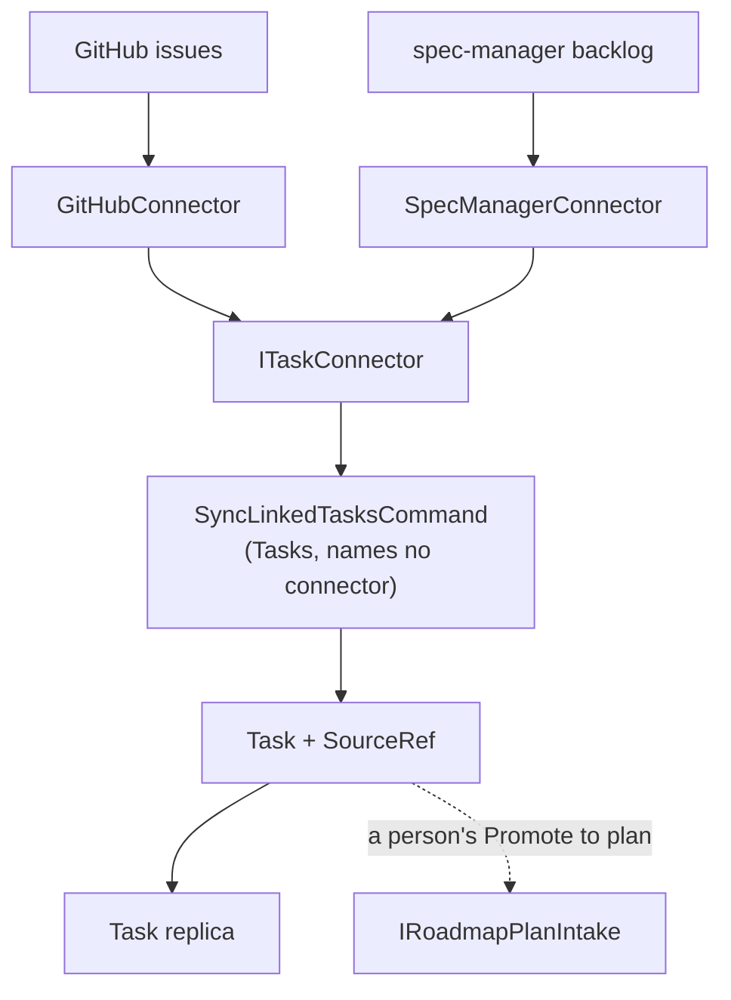

# ADR 0020: Items from GitHub and spec-manager arrive as linked tasks, through one connector contract

```meta
date: 2026-10-05
status: proposed
related: [".devbook/domain/tasks/domain.md#source-ref", ".devbook/domain/tasks/domain.md#linked-task", ".devbook/domain/tasks/domain.md#task-connector", ".devbook/domain/tasks/domain.md#source-state", ".devbook/domain/tasks/domain.md#connected-target", ".devbook/domain/tasks/domain.md#projection-ref", ".devbook/domain/tasks/domain.md#tombstone", ".devbook/domain/tasks/features.md#linked-tasks", ".devbook/domain/tasks/features.md#promote-to-plan", ".devbook/domain/tasks/flow.md#task-lifecycle", ".devbook/domain/roadmap/domain.md#roadmap-tag", ".devbook/domain/roadmap/domain.md#source-label", ".devbook/arc42/adr/0005-azure-hosted-task-replica-for-multi-device-sync.md", ".devbook/arc42/adr/0006-additive-schema-bootstrapping-is-the-local-migration-mechanism.md", ".devbook/arc42/adr/0007-import-reuses-the-entry-text-grammar.md", ".devbook/arc42/adr/0013-imported-plan-is-a-roadmap-item-laid-out-by-import.md", ".devbook/arc42/adr/0017-inbox-import-is-a-capture-source-with-a-markdown-manifest.md"]
```

Every open item in a connected GitHub repository or spec-manager product
becomes a Backlog task directly, with no Inbox step, whoever it is assigned to.
Such a task is a **linked task**: it carries a `SourceRef` that says where it
came from, and each sync updates the fields the source owns. The Tasks module
reaches every source through one contract, `ITaskConnector`, and never names a
connector. GitHub and spec-manager are the first two connectors.

## Status

```meta
```

Proposed, 2026-10-05, by the flow-spec run that drafted it, awaiting the
repository owner at the Personal Validation gate. Nothing is built yet.

A **local** decision, numbered in the local sequence. Every bare ADR number below
means the local one.

This is the first entry (`adr-linked-tasks`) of the `external-task-connectors`
plan. It records the design note "External Task Sources"
(<https://claude.ai/artifact/FeMoriPegRA6tP77tCMva9>, updated 2026-10-05), so
that every later entry of the plan implements one decision. The owner settled
three choices before this record was written. They are inputs here, not open
questions:

| Choice | Settled as |
|---|---|
| How items come in | **Linked tasks, directly.** No Inbox capture, and no read-only federated pane. |
| Which items come in | **Every open item** in a connected repository or product, whoever it is assigned to. |
| How Backlog reaches spec-manager | **Its REST API with OAuth**: authorization code with PKCE on a loopback redirect. Never a pasted token. |

The note's open questions are answered in [section 9](#9-the-open-questions-are-settings-per-connected-target):
each one is a setting per connected repository or product.

## Context

```meta
```

The person's work lives in three places: Backlog, GitHub issues, and the backlog
of a spec-manager product. Today only the first is on the Tasks list, in My Day
and on the roadmap. The other two are read in their own tools.

Backlog already has pieces that point toward an answer:

- **Capture** fetches from a source and normalises each item through an
  `ICaptureSourceAdapter`. It derives one id per item with `CaptureIds.For`, a
  name-based UUID, so a repeated fetch creates nothing twice (ADR 0017).
  A captured item has no state, assignee or update stamp, so it cannot follow
  later changes at the source.
- **Projection** sends a task out. A `ProjectionRef` records the GitHub issue or
  CLI task created *from* a task. It points the wrong way for an item that
  started somewhere else.
- **The task replica** carries every task between devices and merges a task
  whole, last writer wins on `UpdatedAt` (ADR 0005).
- **Roadmap Planning** gathers tasks by their `+` plan tag, and changes only
  through a person's gesture (ADR 0013, ruling 3).

Three ways in were weighed. Inbox capture reuses triage but freezes each item
the day it is routed. A live federated pane is always current but holds no
tasks, so nothing reaches My Day, search, the roadmap or the other devices. A
linked task costs field-ownership rules and a sync-safe merge, and it is the
only one of the three that keeps a task's status honest.

## Decision

```meta
```



### 1. External items become linked tasks, with no Inbox step

```meta
```

A connector fetches every open item of each connected target, plus the items
closed since its last run. Each one becomes a task, or updates the task it
already became. The item does not pass through the Inbox, because triage would
freeze it. The assignee does not filter what arrives: it is data on the task,
and the Tasks pane offers "Assigned to me" as a filter over it.

The GitHub connector fetches issues only. Pull requests and review requests stay
in the Pull Requests pane.

### 2. `SourceRef` is the inbound counterpart of `ProjectionRef`

```meta
```

A linked task carries one `SourceRef` with seven values:

| Value | Holds |
|---|---|
| `ConnectorId` | The connector's id, such as `github` or `spec-manager` |
| `ExternalId` | The source's own stable id: the GitHub issue's `node_id`, the spec-manager item's uuid |
| `Url` | Where the item opens at the source |
| `DisplayKey` | How a person names the item, such as `#412` |
| `Assignee` | The source's assignee, as a display name; absent when unassigned |
| `SourceState` | The source's own status name, kept for display |
| `SourceUpdatedAt` | The source's update stamp from the last sync |

`ConnectorId` is a string, not an enum. A new connector needs no schema change,
and a device that meets an id it does not know still shows the stored display
key under a neutral badge. The local store holds `SourceRef` in an additive
`source_ref` JSON column (ADR 0006), and the replica payload carries it. A task
without a `SourceRef` is local work and shows no source badge.

`ProjectionRef` keeps its meaning: an artifact created *from* a task. The GitHub
connector skips an issue that already backs a `ProjectionRef`, so a task pushed
to GitHub never comes back as a second task.

### 3. `ITaskConnector` is the one contract

```meta
```

The port sits in `Backlog.Modules.Tasks.Abstractions`. Everything that differs
between two systems sits behind it:

| Part | What the connector supplies |
|---|---|
| Descriptor | A stable id, a display name, an icon and a colour token. The source badge, the Source filter and the settings page are drawn from it. |
| Targets | What a person connects: repositories, or product slugs. Never credentials. |
| Fetch | `FetchAsync(target, since, ct)`: every open item, plus the items closed since `since`, each normalised to a `SourceItem`. |
| Display key | How a person names an item. |
| Normalised state | One of `Open`, `Active`, `Done` or `Dropped`, beside the source's own status name. |
| Blocked | Whether the item cannot be worked on now, and the reason. |
| Capabilities | Flags the sync and the UI read: has effort, has dependencies, can set status, can comment. |
| Who am I | The connected account, so "Assigned to me" knows who "me" is. |

A connector is registered with `AddTaskConnector<T>()`. The Tasks module never
names GitHub or spec-manager, and `ModuleBoundaryTests` hold that. The GitHub
connector lives in `Backlog.Infrastructure.GitHub`, beside the client it uses.
The spec-manager connector gets its own project, `Backlog.Infrastructure.SpecManager`.

### 4. The source owns three fields; Backlog owns the rest

```meta
```

The source owns the title, the state and the assignee. Each sync overwrites
them. Backlog owns everything else: priority, My Day, area, order, sub-items,
notes, scheduling, and effort once the person changes it. The body is copied
once, when the task is created, and never again, because the person's notes
grow in it.

One map turns a normalised state into a task status, the same for every
connector:

| Normalised state | Task status |
|---|---|
| `Open` | Ready |
| `Active` | In progress |
| `Done` | Done |
| `Dropped` | Archived |

A connector never maps to `EntryStatus` itself. The sync moves the task along
the edges of `EntryStatusFlow` and never sets a status past the graph. The
graph has no edge from Ready to Done, so a closed issue walks its task through
In progress first, and an archived item walks through Done.

**A local Done is never reopened.** When the person finished a task the source
still holds open, the sync leaves the task Done and flags the mismatch. The
person's finish is information the source does not have yet.

### 5. One id per item on every device; tombstones and quiet syncs

```meta
```

- **Identity.** `LinkedTaskIds.For(connectorId, externalId)` derives the task's
  id on the `CaptureIds` scheme: a name-based UUID over
  `linked:{connectorId}:{externalId}`. Two desktops syncing the same repository
  create one task, not two. Every desktop may sync. Mobile never fetches from a
  source and sees linked tasks through the replica.
- **Tombstones.** A linked task the person deleted leaves a tombstone. The sync
  skips a tombstoned id and never re-creates it.
- **A quiet sync stays quiet.** A sync that changes no field leaves `UpdatedAt`
  alone. The replica merge is whole-task last writer wins on `UpdatedAt`, so an
  idle machine that stamped every task would overwrite real edits made elsewhere.
- **An item that disappears** archives its task with a flag. Deleted,
  transferred out of a connected repository and archived in spec-manager all
  count. The task is never deleted, so the person's notes survive.

### 6. A `+` label is the plan tag; sync never creates a Roadmap Item

```meta
```

Labels become tags by Backlog's own sigil rule, the same way for both sources:

| On the item | On the linked task |
|---|---|
| A label whose name starts with `+`, such as `+offline-sync` | The plan tag of the same name |
| Any other label, such as `Blocked` | A general tag, `#blocked` |
| Two or more `+` labels | The first becomes the plan tag, and the task is flagged |

Label names are made into slugs: lower case, spaces to hyphens. A task counts in
one plan only, so no effort is counted twice.

The sync writes tags onto tasks and nothing else. **It never creates a Roadmap
Item**, because the roadmap changes only through a person's gesture (ADR 0013,
ruling 3). A plan tag with no item yet shows on the roadmap's shelf, where the
person places it with one click.

### 7. Promote to plan turns one linked task into a Roadmap Item

```meta
```

Promote to plan is a person's action on one linked task, for an item that is
really an epic. It creates a Roadmap Item through `IRoadmapPlanIntake`, the port
Import already uses (ADR 0013, ruling 3). The item is titled after the source
item and carries its link in its notes. Its tag is the item's `+` label when it
has one, and otherwise a slug made from the display key and the title, such as
`gh-412-offline-sync`.

It then breaks the item down from one of three places:

- **Sub-issues.** Each becomes a linked task with the plan tag. It stays linked
  to its source.
- **A checklist** in the body. Each line becomes a local task with the plan tag.
- **A generated plan.** The body is the specification for `backlog-import-plan`.
  Importing the result fills the item, and a re-import updates the steps nobody
  started (ADR 0007).

What happens to the original task is a setting ([section 9](#9-the-open-questions-are-settings-per-connected-target)).

### 8. spec-manager is reached over REST with OAuth

```meta
```

The spec-manager connector calls the product's REST API, not its MCP server, so
the desktop app takes on no MCP client. It authorizes with OAuth: the
authorization code flow with PKCE, on a loopback redirect the app listens on for
the one sign-in. This is the same authorization the spec-manager MCP server
uses, so a person grants Backlog access the way they grant an agent access. The
app never asks for a pasted token. It stores the refresh token per user in the
platform's credential store, beside the GitHub credentials.

spec-manager cannot set an item's status or filter by change date today. Those
two calls, and a field for the Backlog task id, are added to spec-manager's own
API in its own repository. They are prerequisites of write-back and of an
incremental fetch, not of this decision.

### 9. The open questions are settings per connected target

```meta
```

Each question the design note left open is a setting on one connected
repository or product. Two targets may answer it differently.

| Setting | Default |
|---|---|
| Skip items untouched for longer than a set age, on the first sync only | Off |
| "Assigned to me" on in the Tasks pane by default | Off |
| The title follows the source, or can be renamed locally | Follows the source |
| Sync interval | A fixed interval on the desktop, plus on demand from the Tasks pane |
| On Promote to plan, archive the original task or keep it as an umbrella step | Archive it |

A target's settings hold its connector id, whether it is enabled, the target
itself, and the values above. They never hold credentials.

A locally renamed title stops following the source until the person resets it.
The other four settings change only what the next sync fetches or does.

**Connectors ship inside the app for now.** A connector is a class and one
registration line in this repository. The contract is kept plugin-shaped: a
string id, a self-describing descriptor, and no connector named in Tasks. A later
record can then open it to connectors shipped as plugins, once a third system
asks for one. Loading code from outside the app raises signing and trust
questions that two built-in connectors do not justify.

## Consequences

```meta
```

- `TaskItem` gains `SourceRef`, the local store gains an additive `source_ref`
  column, and the replica payload carries it. An older device keeps the field as
  written.
- `SyncLinkedTasksCommand` in Tasks upserts by deterministic id. It runs on the
  desktop's timer and on demand.
- The Tasks pane gains a source badge on the row, in the editor header and in My
  Day, and two filters: Source and Assigned to me. All three are drawn from the
  connector descriptors, so a new connector needs no UI change.
- `IGitHubClient` gains `SearchIssuesAsync`. The spec-manager connector needs a
  REST client, the OAuth sign-in and a status-name cache.
- Write-back, which closes the source item when its task is done, is a later
  slice behind a setting. It needs the spec-manager status call above.
- Linked tasks take part in My Day, search, the roadmap and sync like any other
  task. A Tasks list over a busy repository grows, which is what the Source and
  Assigned to me filters are for.

## Rejected

```meta
```

- **Capture into the Inbox.** A routed item stops following its source, so its
  status goes stale the day it is triaged.
- **A live federated pane.** It holds no tasks, so nothing reaches My Day,
  search, the roadmap or the other devices.
- **Only the items assigned to me.** Reassignment would make tasks appear and
  vanish. Everything open arrives, and the assignee is a filter.
- **`ConnectorId` as an enum.** Every new connector would change the schema, and
  an older device could not read a newer device's tasks.
- **A status map per connector.** The map would be repeated in each connector and
  drift. Connectors normalise; Tasks maps once.
- **Reopening a local Done** to match the source. It would undo the person's own
  finish on the next sync.
- **Creating a Roadmap Item from a `+` label during sync.** The roadmap would
  change with no person's gesture (ADR 0013, ruling 3).
- **The spec-manager MCP server as the transport.** The desktop app would need
  an MCP client for one source, while REST serves the same data.
- **A pasted personal token for spec-manager.** It would be a second
  authorization beside the one its MCP server already uses, and a long-lived
  secret typed into a field.

## History

```meta
```

| Date | Change |
|---|---|
| 2026-10-05 | Proposed: linked tasks through `ITaskConnector`, from the "External Task Sources" design note. |
