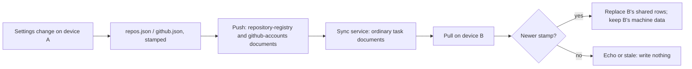

# ADR 0020: The GitHub accounts and the repository registry ride the task feed as two whole documents

```meta
date: 2026-10-05
related: [".devbook/arc42/adr/0005-azure-hosted-task-replica-for-multi-device-sync.md", ".devbook/arc42/adr/0018-roadmap-plan-and-pace-ride-the-task-feed.md", ".devbook/arc42/adr/0019-roadmap-counts-the-working-week.md", ".devbook/arc42/adr/0009-captures-are-a-document-kind-on-the-replica.md", ".devbook/arc42/adr/0006-additive-schema-bootstrapping-is-the-local-migration-mechanism.md", ".devbook/arc42/08-crosscutting-concepts.md#storage-and-sync", ".devbook/domain/tasks/features.md#multi-device-sync"]
```

The repository registry and the person's GitHub account identities replicate
between paired devices as two whole documents on the existing `/tasks` feed. They
travel under the kind tokens `repository-registry` and `github-accounts`. Each
document is last-write-wins on its own stamp, as ADR 0018 does for the roadmap plan
and the pace. No token and no credential kind ever leaves the machine.

## Status

```meta
```

Accepted, 2026-10-05, by the repository owner at the Personal Validation gate of
the flow-spec run that drafted it. Nothing is built yet.

A **local** decision, numbered in the local sequence. Every bare ADR number below
means the local one.

The owner hit "Could not resolve to a Repository" on 2026-10-05 for three private
`innovadis-dev` repositories. The repositories were not bound to the work account,
so their calls went out as the default `gh` account, which cannot see them. The
owner then said: "I want to sync accounts and account specified per repo." They
settled one choice in chat:

| Choice | Settled as |
|---|---|
| How accounts and bindings travel | **Through the sync service**, not through a file-synced workspace folder and not by export and import. Tokens and the choice between the GitHub CLI and a pasted token stay on each machine. |

This record **amends** ADR 0005's list of what stays out of sync, which keeps
workspace settings per device because "they describe one machine's disk". The
registry and the account identities hold no path and no secret, so that reason
does not reach them. ADR 0005 carries a dated note pointing here.

## Context

```meta
```

**A repository already has a shared half and a machine half.**
`GitHubSettingsStore` composes the two. The shared half is the registry,
`{root}/config/repos.json`. Each row holds the `owner/name` id, the alias, the
hue, the account binding and the devbook branch. The registry also holds a rename
record and a removal record. The machine half is the per-user `github.json`. It
holds each repository's clone directory, token and devbook folder overrides.

**The accounts live only on the machine.** `github.json` also holds the accounts
this machine can speak as. Each account has a login, a display name, a host, an
API endpoint, a credential kind and, for a pasted token, the token.

**Nothing carries either between devices.** The sync service carries tasks,
captures, sessions, annotations and attachments. The registry travels only when
the workspace root sits in a file-synced folder. ADR 0005 tells the person to keep
that root on a local disk, and the Storage screen says so. So a binding set on one
PC is unknown on the next one, and its calls go out as that PC's default account.

**A binding the machine cannot satisfy already fails loudly.** The credential
resolver refuses the call and names the login. The Settings screen lists the
binding as unsatisfied. That path stays as it is.

**ADR 0018 already settled how a small whole document travels.** The plan and the
pace ride the `/tasks` feed under their own kind tokens. The service never looks
inside them, and nothing in the service changes.

## Decision

```meta
```



### 1. The registry is one `repository-registry` document

```meta
```

The document's content is the registry file's stored JSON: the repository rows,
the rename record and the removal record. It is the same content as
`repos.json`, so a row carries the id, the alias, the hue, the account login and
the devbook branch. The registry file gains an `updatedAt` key, written on every
change, and that is the document's stamp. A file without the key is stamped once
from its last-write time, as ADR 0018 does for the pace file.

The document travels under one constant id, on the task-shaped fields ADR 0018 §1
lists, with the title `Repository registry`.

`repos.json` stays as the device's copy. A local change writes the file and stamps
it. A pulled document with a later stamp replaces the file, verbatim, at the
inbound stamp. Each repository's machine data in `github.json` stays as it is,
because it is keyed on the id and the id travels with the row.

The rename and removal records travel inside the document. So a repository
removed on one device stays removed on the other, and the start-up reconcile pass
does not register it back.

### 2. The accounts are one `github-accounts` document

```meta
```

The document holds one entry per account, with four fields:

```json
{ "updatedAt": "2026-10-05T09:12:00Z",
  "accounts": [
    { "login": "j-schepers_innobv", "displayName": "Work", "host": null, "apiEndpoint": null }
  ] }
```

The credential kind and the token never enter the document. They are facts about
one machine: another machine may have no GitHub CLI, or may be signed in to other
logins. `github.json` keeps them per login, beside the accounts' stamp.

A pulled document with a later stamp sets the account list:

- **A login this machine already holds** takes the inbound display name, host and
  endpoint. It keeps its own credential kind and token.
- **A login this machine does not hold** is added with the GitHub CLI as its
  credential kind. When `gh` on this machine is signed in as that login, the
  account works at once. Otherwise the Settings screen shows the existing "no
  credential on this machine" problem, with the sign-in hint the Accounts tab
  already gives.
- **A login the document no longer lists** is removed, with its local credential,
  as removing an account on this machine does today. Bindings that name it stay.
  They show as unsatisfied, as they do today.

### 3. A binding to a missing account fails, never falls back

```meta
```

A bound repository whose account this machine cannot satisfy is refused with the
login named. It never goes out as the default `gh` account. The registry can
arrive before the accounts, so a binding may briefly name a login with no account
row. That state is already handled and shown.

`SetRepositoryAccount` keeps refusing a login with no account row. So a person can
bind only to an account they see, while a pulled binding may name one still on
its way.

### 4. The desktop's intake and push follow ADR 0018 §3

```meta
```

`TaskReplicaMerge` hands each document to a port the GitHub infrastructure
answers, before it reads a local task. The port applies ADR 0018's stamp rules: it
takes a later stamp whole, treats an equal stamp as an echo, refuses an older
stamp, and skips a payload that does not parse. A pulled write is not announced as
a local change, and the Settings screen and the GitHub panes reload on it.

`TaskSyncSession.PushAsync` sends each document when its stamp is later than the
one last accepted. A device that has no registry file sends no registry document,
and a device with no accounts sends no accounts document. So a newly paired
machine takes the other machine's registry and accounts, and never replaces them
with an empty list.

The phone's `TaskFold` skips both kinds, as it skips `capture`, `roadmap-plan` and
`planning-pace`.

### 5. The service does not change

```meta
```

No route, record, container, index, AppHost resource or bicep file changes. To the
service both documents are ordinary task documents with a type string it does not
interpret, as ADR 0005 requires.

## Consequences

```meta
```

Positive:

- **A binding is set once.** A repository bound to the work account on one PC is
  bound on every paired PC, and its calls go out as that account.
- **An account is added once.** A paired PC shows it at once. Where `gh` there is
  already signed in as that login, nothing more is needed.
- **No secret travels.** Tokens and credential kinds never enter a document, so
  the replica holds nothing that could sign in to GitHub.
- **Aliases and hues agree everywhere.** The registry travels whole, so a repository
  has the same alias and hue on every device without a synced workspace folder.

Negative:

- **Whole-document last write wins.** Two devices that edit the registry, or the
  accounts, before either syncs keep only the later edit. These lists change
  rarely, so the owner accepts it, as ADR 0018 does for the plan.
- **Removing an account removes it on every device.** A token pasted for it on
  another PC is forgotten there too.
- **An older build narrows the documents.** A build that predates this record
  never pushes them. A build that predates a later field drops it on its next
  write, as ADR 0018 notes.
- **A root in a file-synced folder has two channels.** The file sync and the task
  feed then both deliver `repos.json`. They agree by its stamp, but ADR 0005's
  hazard for a synced root stands.
- **The documents are task-shaped without being tasks**, as ADR 0018 already
  accepts.

Neutral:

- The install-wide API endpoint and the hue switch stay per device. They describe
  how one install reads GitHub and draws its surfaces.
- Clone directories and devbook folder overrides stay per device. They are paths
  on one machine's disk, the case ADR 0005 keeps out.

## Rejected

```meta
```

- **Keeping the registry in a file-synced workspace folder.** ADR 0005 tells the
  person to keep the root on a local disk, so this channel reaches nobody who
  follows that advice.
- **An export and import action in Settings.** It works without sync, but the
  person has to remember it on every change. The owner chose sync.
- **Syncing the credential kind.** Whether a machine uses the GitHub CLI or a
  pasted token depends on what that machine has installed.
- **Syncing tokens, even encrypted.** The replica would then hold a credential to
  GitHub, and the sanitization boundary of ADR 0005 exists to prevent exactly that.
- **One document for both.** An account added on one PC and a binding changed on
  another before either syncs would overwrite each other. As two documents, both
  survive.
- **One document per repository or per account.** It would merge concurrent edits
  better. It also needs a tombstone per row and a reconcile of the rename record.
  The lists are small and change rarely, so whole documents are enough.
- **A new route and container on the sync service.** ADR 0018 showed the task feed
  carries a small whole document with no service change.
- **Falling back to the default account when the bound one is missing.** That is
  how a call left as the wrong identity and came back a 404. The resolver keeps
  refusing it.

## Verification

```meta
```

The implementing `flow-code` run turns these into tests:

1. **A binding travels.** Device A binds `innovadis-dev/spec-manager` to
   `j-schepers_innobv` and syncs. Device B pulls, and its calls for that repository
   go out as `j-schepers_innobv`.
2. **An account travels without its credential.** Device A adds an account with a
   pasted token and syncs. The pushed document holds the login, display name, host
   and endpoint, and no token or credential kind. Device B lists the account with
   the GitHub CLI as its credential.
3. **A local credential survives a pull.** Device B holds the login with a pasted
   token. A pulled document that changes its display name keeps B's token and
   credential kind.
4. **A missing credential shows, never falls back.** Device B has no `gh` sign-in
   for a pulled login. A call for a repository bound to it is refused with the login
   named, and the Settings screen lists the binding as unsatisfied.
5. **A removal travels.** Device A removes a repository and syncs. On device B it
   stays removed after a restart.
6. **A rename travels.** Device A renames a repository and syncs. Device B resolves
   the old id to the new row.
7. **A new device sends nothing.** A newly paired device with no registry and no
   accounts pushes neither document and takes device A's.
8. **Stamps decide.** An older inbound stamp writes nothing, and an equal stamp is an
   echo.
9. **An unreadable payload is skipped.** A `github-accounts` document that does not
   parse leaves the local accounts as they were.
10. **The phone ignores both kinds.** `TaskFold` keeps no row for either.
11. **Machine data stays.** A pulled registry leaves each repository's clone
    directory, token and devbook folder overrides on device B unchanged.
