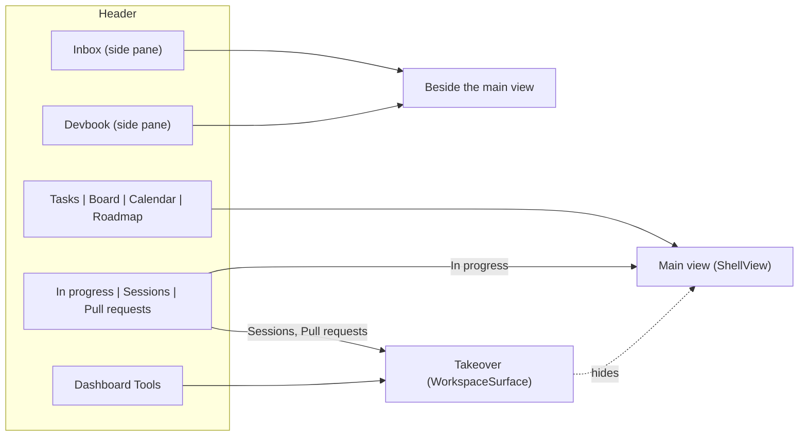

# ADR 0022: The desktop shell shows one main view, picked by a view switch; side panes open beside it and takeovers replace it

```meta
date: 2026-10-07
status: proposed
related: [".devbook/design/interaction-guidelines.md#shell-header", ".devbook/design/interaction-guidelines.md#workspace-panes", ".devbook/design/interaction-guidelines.md#group-shape-says-cardinality", ".devbook/domain/tasks/features.md#search-filter-and-organize", ".devbook/domain/tasks/features.md#board-view", ".devbook/domain/tasks/features.md#calendar-view", ".devbook/domain/roadmap/features.md#reading-and-rescheduling-on-a-timeline", ".devbook/domain/sessions/features.md#session-inventory", ".devbook/domain/sessions/features.md#in-progress-by-task", ".devbook/arc42/adr/0001-desktop-stack-maui-blazor-hybrid.md"]
```

The desktop shell's workspace always shows exactly one **main view** — Tasks,
Board, Calendar, Roadmap or In progress — chosen in the header and never closed,
only replaced. The Inbox and the Devbook are **side panes** that open beside
whichever view is showing. Sessions, Pull requests, Dashboard and Tools stay
**takeovers** that hide the workspace and that Escape closes. What the shell
remembers in `shell-navigation.json` gains a `lastView`, and a file from before
the change is read into the new shape rather than rejected.

## Status

```meta
```

Proposed, 2026-10-07. Recorded after the fact by the flow-spec run of the
`task-views` plan's step 9, from the code the plan's steps 1, 5, 7 and 8 merged
into `plan/task-views` (pull requests #1040, #1044, #1043 and #1045). It
describes what was built; it waits on the repository owner's acceptance at that
run's Personal Validation gate.

A **local** decision, numbered in the local sequence. Every bare ADR number below
means the local one.

## Context

```meta
```

**The header used to switch panes, not views.** Before the plan the header's
middle region was a fused strip of three panes — Inbox, Tasks, Devbook — of which
a plain press showed one and a Ctrl-press added one beside the others. The
shell kept at least one of them open, so the strip's last open option was
disabled. A "side panes only" state, the Inbox and the Devbook with no task list,
was a real arrangement. Beside the strip stood the takeovers: Roadmap, Sessions,
Pull requests, Dashboard and Tools, each a `WorkspaceSurface` member that took the
whole screen.

**The plan adds three ways to read the same tasks.** The Board lays the filtered
tasks out in columns of cards, the Calendar on a month by due date, and In
progress lists the tasks in progress with their sessions and pull requests. Each
is another reading of the task list, not another place beside it. As panes they
would have had to share the screen with the list they replace. As takeovers they
would have hidden the Inbox and the Devbook, which the person reads beside the
list.

**The roadmap was a takeover for no reason of its own.** It took the screen
because it was wide, not because reading it meant leaving the backlog. The
Inbox and the Devbook are as useful beside a plan as beside a list.

**The shell's choices are stored names.** `shell-navigation.json` holds the open
surface and the open panes as enum names (`ShellNavigationStore`). A file written
before the change names `Roadmap` as a surface and may list `Tasks` among the
open panes. Neither is a member the new shape writes.

## Decision

```meta
```



### 1. One main view, always

```meta
```

`ShellView` names the main view: `Tasks`, `Roadmap`, `Calendar`, `Board` and
`InProgress`. Exactly one is on screen whenever the workspace is. A view is never
closed: pressing the pressed option changes nothing, and nothing but another view
replaces it. Tasks is always offered and is what the shell opens on when nothing
was remembered. Roadmap is offered while `RoadmapFeatures.Roadmap` is on, and In
progress while the Sessions or the Pull requests feature is. A view whose feature
goes off falls back to Tasks, and the choice is kept, so the view comes back when
the feature does.

Tasks, Board and Calendar are one pane, the Tasks pane, in three layouts. They
share its filter bar, its open task and its selection. Roadmap and In progress
render their own content and carry no Tasks filter bar.

### 2. The view switch holds the task views; In progress sits with the work in progress

```meta
```

The header's view switch is one fused group, `Tasks | Board | Calendar | Roadmap`.
In progress is a main view too, but its option leads the work in progress group,
`In progress | Sessions | Pull requests`. It answers "what is moving", the
question that group asks, and it summarises the two lists beside it.

### 3. The Inbox and the Devbook are side panes

```meta
```

`GlobalPane` holds only `Inbox` and `Devbook`. Each is a plain toggle that opens
beside whichever view is showing. No side pane at all is an ordinary state, so
neither toggle is ever disabled. The modifier press is gone: there is no "switch
to" a side pane, because switching away from the main view is the view switch's
question. The viewport still sets how many panes fit, the main view included, and
leaves at least one side slot. A pane that opens into a full set closes the first
open one in the stable order, and a narrowed window trims in that order.

The Tasks pane toggle and the "side panes only" state are gone.

### 4. Sessions, Pull requests, Dashboard and Tools stay takeovers

```meta
```

`WorkspaceSurface` keeps `Workspace`, `Tools`, `Dashboard`, `Sessions` and
`PullRequests`. A takeover hides the workspace, takes focus when it opens, and
closes on Escape, on its own close button, or on a second press of its option.
Pressing a view option or a side-pane toggle during a takeover also closes it and
shows the workspace. The main view and the open side panes are kept underneath,
so closing a takeover shows them as they were.

### 5. Roadmap is no longer a takeover

```meta
```

The roadmap is the Roadmap view inside the workspace, with the Inbox and the
Devbook beside it. It is not closed by Escape, which on the roadmap already puts a
grabbed bar back and dismisses its planning dialogs. A window resize never closes
it. The `WorkspaceSurface.Roadmap` member stays only so that an older file still
reads. Nothing assigns it.

### 6. `lastView` and the migration of an older file

```meta
```

`shell-navigation.json` gains `lastView`, the `ShellView` member's name, written
on every view change. The Board's column grouping (`boardColumns`) and the
Calendar's plans choice (`calendarPlansShown`) are written beside it. Reading a
file migrates it in `ShellNavigationStore.Normalize`, and the shell checks the
surface again when it initialises, so no path puts the old takeover back:

| The file holds | It reopens as |
|---|---|
| No `lastView` | The Tasks view |
| `lastSurface: Roadmap` | The Roadmap view over the workspace, never the takeover |
| `Tasks` (or the older `Backlog`) in `lastEnabledPanes` | Ignored; the Inbox and the Devbook keep their state |
| `Knowledge` in `lastEnabledPanes` | The Devbook, as before |
| An unknown or numeric name | The default for that field |

`Roadmap` is never written as a surface again. The names are appended to the
enums, never reordered, because the names are what is stored.

## Consequences

```meta
```

Positive:

- **A new reading of the tasks costs one enum member and one option.** The Board,
  the Calendar and In progress landed that way, with nothing existing revisited.
- **The Inbox and the Devbook work beside every view.** Triage beside the roadmap,
  or a chapter beside the board, is an ordinary arrangement.
- **The shell can never render empty.** A view is always showing, so the "at least
  one pane" rule and its disabled option are gone.
- **Every earlier file reopens.** A person who left the shell on the roadmap
  takeover comes back to the roadmap, now as a view.

Negative:

- **The Inbox and the Devbook cannot be read alone.** The "side panes only"
  arrangement is gone. A person who wants the Devbook wide drags the side-pane
  edge.
- **A Ctrl-press on a side pane is now a plain press.** Anyone used to the old
  modifier finds it does nothing different.
- **`WorkspaceSurface.Roadmap` is a dead member kept for reading.** Removing it
  would make an older file read as nothing rather than as the Roadmap view.

Neutral:

- In progress sits in the work in progress group but behaves as a view. Its shape
  matches its neighbours; its behaviour matches the view switch's.
- The phone keeps its own tab bar. This record is about the desktop shell.

## Rejected

```meta
```

- **Board, Calendar and In progress as more panes.** They would sit beside the
  list they replace and compete with the Inbox and the Devbook for the side slots.
- **Board, Calendar and In progress as takeovers.** They would hide the Inbox and
  the Devbook, and Escape would close what is the person's working view.
- **Keeping the roadmap a takeover.** Nothing about reading a plan means leaving
  the backlog, and as a takeover it could not have the Inbox or the Devbook beside
  it.
- **In progress in the view switch.** It reads sessions and pull requests, not the
  filtered tasks, and is offered only while one of those lists is. Placed with
  them, it leads the group it summarises.
- **Rejecting or resetting an older `shell-navigation.json`.** The person would
  lose the screen they left for no reason of theirs; reading the old names into
  the new shape costs a few lines in one store.

## Verification

```meta
```

The bUnit tests in `Backlog.Desktop.UI.UnitTests` hold this record:

1. **One view, never closed.** `HomeWorkspaceSurfaceTests.Pressing_the_pressed_view_again_changes_nothing`,
   `The_roadmap_view_replaces_the_task_list_inside_the_workspace`.
2. **Side panes beside any view.** `The_inbox_and_devbook_open_beside_the_roadmap_view`,
   `The_side_panes_are_the_inbox_and_the_devbook_and_no_view`,
   `A_side_pane_toggle_opens_it_beside_the_view_and_closes_it_again`,
   `GlobalPaneMarkupTests.A_side_pane_needs_neither_a_pin_nor_a_modifier`.
3. **Header order and groups.** `The_nav_reads_inbox_views_devbook_then_the_work_in_progress_and_the_other_takeovers`,
   `In_progress_is_a_main_view_that_leads_the_work_in_progress_group`.
4. **Takeovers.** `A_takeover_keeps_the_view_switch_unpressed_and_a_view_option_returns_to_the_workspace`,
   `Escape_heard_at_the_document_closes_the_takeover`,
   `Closing_a_takeover_opened_from_the_roadmap_returns_to_the_roadmap`.
5. **Roadmap is a view.** `Escape_heard_at_the_document_leaves_the_roadmap_open`,
   `A_window_resize_never_closes_the_roadmap`,
   `GlobalPaneMarkupTests.Roadmap_option_is_feature_gated_and_is_a_view_not_a_takeover`.
6. **Migration.** `A_roadmap_surface_from_before_the_view_switch_reopens_as_the_roadmap_view`,
   `A_tasks_pane_from_before_the_view_switch_is_ignored_and_the_side_panes_keep_their_state`,
   `A_side_panes_only_file_reopens_with_the_panes_beside_the_tasks_view`,
   `The_view_is_remembered_and_a_fresh_shell_instance_reopens_on_it`, and
   `ShellNavigationStoreTests`.
