# Backlog

```meta
type: context-map
status: draft
```

> Strategic DDD view of the Backlog product domain: bounded-context roles,
> subdomain classification, and the relationships that carry work, knowledge,
> standards, and signals across the system.

> See also: `.devbook/arc42/03-context-and-scope.md` for the system-level context this
> map's bounded contexts sit inside, and `.devbook/arc42/05-building-block-view.md` for
> how these contexts are realized across the desktop, mobile, IDE, and cloud
> containers.

## Subdomain landscape

| Bounded context | Subdomain type | Why |
|---|---|---|
| Capture | Core | It is the front door for turning raw external input into normalized intent for the product. |
| Inbox | Core | It owns triage and the decision point where captured input becomes work, knowledge, deferral, or archive. |
| Tasks | Core | It owns the durable work model, prioritization, and multi-repository execution planning. |
| Roadmap Planning | Core | It owns the forward plan — what is intended, when, in what order — and is the only context that holds a dependency between two pieces of planned work. Sequencing intent across repositories is a judgement the product exists to support, not a report over work someone else owns. |
| Devbook | Core | It owns durable knowledge linked to work and makes knowledge reusable across projects. |
| Productivity | Supporting | It turns AI-assisted work activity into personal productivity insight without owning the work items or execution tools. |
| Environment | Supporting | It provides quick access to named local, cloud, and project environments without becoming the authority for repository or health data. |
| Monitoring & Dashboard | Supporting | It observes the core flow and turns signals into visibility and follow-up actions rather than owning the work itself. |
| Technology Stack | Supporting | It supplies portfolio-wide standards, baselines, and deprecation policy to the core work contexts. |
| Repository Management | Supporting | It provides repository inventory, health, and dependency visibility used by the core work contexts. |
| Dev PC Management | Supporting | It provides machine inventory, compliance, and operator support capabilities for the work system. |
| Sessions | Supporting | It records what the AI coding agents have been doing on each environment, without owning the work, the machines, or the repositories those sessions touch. |

## Context map

```mermaid
flowchart LR
    Capture[Capture]
    Inbox[Inbox]
    Tasks[Tasks]
    Roadmap[Roadmap Planning]
    Brain[Devbook]
    Productivity[Productivity]
    Environment[Environment]
    Monitor["Monitoring & Dashboard"]
    Tech[Technology Stack]
    Repo[Repository Management]
    DevPC[Dev PC Management]
    Sessions[Sessions]

    Capture -->|OHS + Published Language<br/>ItemCaptured| Inbox
    %% Inbox -> Tasks is built as an in-process port (IInboxBacklogTarget in
    %% the Inbox's Abstractions) answered by an infrastructure adapter over
    %% Tasks' published ITaskItems — not an async event. See
    %% .devbook/domain/inbox/dependencies.md.
    Inbox -->|OHS + Published Language<br/>ItemTriaged| Tasks
    Inbox -->|OHS + Published Language<br/>ItemTriaged| Brain
    Tasks <-->|Partnership<br/>Cross-link by id| Brain
    Tasks <-->|Partnership<br/>Optional cross-link by id| Roadmap
    Roadmap -->|Customer/Supplier<br/>Roadmap tag vocabulary| Tasks
    Brain -->|Customer/Supplier<br/>Chapters by tag/ref + registered effort| Roadmap

    Roadmap -->|OHS + Published Language<br/>RoadmapItemScheduled| Monitor

    Tasks -->|OHS + Published Language<br/>StatusChanged / TaskProjected / TaskCompleted| Monitor
    Inbox -->|Customer/Supplier<br/>Queue-health feed| Monitor
    Repo -->|Customer/Supplier<br/>Health and scan feed| Monitor
    DevPC -->|OHS + Published Language<br/>MachineStatusChanged / ComplianceUpdated| Monitor
    Productivity -->|OHS + Published Language<br/>ProductivityRecorded| Monitor
    Environment -->|Customer/Supplier<br/>Environment availability feed| Monitor
    Monitor -->|OHS + Published Language<br/>FollowUpCaptured| Inbox

    Tech -->|Customer/Supplier<br/>Technology baselines| Repo
    Tech -->|Customer/Supplier<br/>Team tools baseline| DevPC
    Repo -->|Customer/Supplier<br/>Adoption and technology scans| Tech
    DevPC -->|Customer/Supplier<br/>Tool-version reports| Tech

    Tasks -->|OHS + Published Language<br/>AIWorkLogged| Productivity
    Monitor -->|OHS + Published Language<br/>CopilotSession signal| Productivity
    Productivity -->|Customer/Supplier<br/>Productivity summaries| Tasks

    Repo -->|Customer/Supplier<br/>Repository/environment registry lookup| Environment
    Environment -->|Customer/Supplier<br/>Launchable environment links| Tasks
    Environment -->|Customer/Supplier<br/>Environment shortcuts| DevPC

    %% Sessions. The Sessions -> Productivity edge is built, through an
    %% infrastructure adapter rather than a published event; the other two
    %% below remain named and not built: see the strategic rules below and
    %% .devbook/domain/sessions/dependencies.md.
    DevPC -.->|"Customer/Supplier (not built)<br/>Machine identity for an environment"| Sessions
    Sessions -->|Customer/Supplier<br/>Agent session facts| Productivity
    Sessions -.->|"Customer/Supplier (not built)<br/>Stalled-session observation"| Monitor

    Repo -->|Customer/Supplier<br/>Repo registry lookup| Tasks
    Repo -->|Customer/Supplier<br/>Repo registry lookup by alias| Roadmap
```



## Published languages and contracts

| Contract owner | Published language / contract | Used by |
|---|---|---|
| Capture | `.devbook/domain/capture/domain.md#itemcaptured` | Inbox |
| Inbox | `.devbook/domain/inbox/domain.md#itemtriaged` | Tasks, Devbook |
| Tasks | `.devbook/domain/tasks/domain.md#statuschanged`, `.devbook/domain/tasks/domain.md#taskprojected`, `.devbook/domain/tasks/domain.md#taskcompleted` | Monitoring & Dashboard |
| Tasks | `.devbook/domain/tasks/domain.md#aiworklogged` | Productivity |
| Roadmap Planning | `.devbook/domain/roadmap/domain.md#roadmapitemscheduled` | Monitoring & Dashboard |
| Roadmap Planning | `.devbook/domain/roadmap/domain.md#roadmap-item` | Tasks |
| Roadmap Planning | `.devbook/domain/roadmap/domain.md#roadmap-tag` | Tasks, Devbook |
| Monitoring & Dashboard | `.devbook/domain/monitoring/domain.md#followupcaptured` | Inbox |
| Dev PC Management | `.devbook/domain/dev-pc-management/domain.md#machinestatuschanged`, `.devbook/domain/dev-pc-management/domain.md#complianceupdated` | Monitoring & Dashboard |
| Productivity | `.devbook/domain/productivity/domain.md#productivityrecorded` | Monitoring & Dashboard |
| Environment | `.devbook/domain/environment/domain.md#environment-shortcut-resolution` | Tasks, Dev PC Management |
| Technology Stack | `Technology Baseline` / `BaselineProvided` contract in `.devbook/domain/technology-stack/domain.md#deprecation-management` | Dev PC Management, Repository Management |

## Strategic rules

- Only the owning context defines a published language. Consumers conform to that
  contract and do not reach into the supplier's internal aggregate shape.
- `Tasks` and `Roadmap Planning` split the word *priority* on
  purpose, and the split is load-bearing: Tasks owns a task's **status and
  execution priority**, Roadmap owns **planning priority and sequence**. Neither
  writes the other's value, and neither derives its own from the other. A roadmap
  item may name the task that executes it, but a plan must be able to hold work
  that has no task yet — which is why the plan is stored rather than projected.
  This supersedes the earlier reading, in which the roadmap was a view over
  Tasks.
- `Inbox` publishes `ItemTriaged` and `Tasks` conforms to it, but the edge is
  carried in-process rather than by an asynchronous event: the payload is a DTO
  in the Inbox's Abstractions, handed over a port (`IInboxBacklogTarget`) that an
  infrastructure adapter answers over Tasks' published `ITaskItems`. Neither
  module references the other, and the adapter is the only place an inbox item
  becomes entry text. A capture reaches the Inbox from another device as a
  `capture`-kind document on the sync replica
  (`.devbook/arc42/adr/0009-captures-are-a-document-kind-on-the-replica.md`). On the
  desktop, a source monitor (YouTube channel, website) reaches the Inbox
  without the replica at all — it delivers in-process through the same
  `IInboxIntake` port the sync path hands `capture`-kind documents to, keyed
  by the same deterministic per-entry id, so the idempotency is the port's,
  not the transport's.
- `Tasks` and `Devbook` are a deliberate `Partnership`: both
  sides keep only foreign ids and the link semantics are coordinated through the
  Cross-Linking service rather than a shared aggregate.
- `Roadmap Planning` **totals** what it does not **own**. Story-point `effort` is
  registered on Tasks and on knowledge chapters; a roadmap item's tag is
  the vocabulary Tasks offers in its picker and a knowledge chapter names in its
  `roadmap` list. Roadmap reads those — gathering tasks and chapters by tag and by
  direct reference, and adding their registered effort — but registers no effort and
  defines no tag. This is why a roadmap tag must not change when its item's title is
  renamed: tasks and chapters already filed under it would silently stop matching.
  The tag is a slug that *names* a roadmap item rather than *addressing* a chapter,
  so it draws no edge in the knowledge graph.
- `Technology Stack` is the standards supplier for both `Repository Management`
  and `Dev PC Management`; those contexts may cache or copy baselines locally,
  but they do not become the authority for baseline meaning.
- `Monitoring & Dashboard` is an observer/read context. Its only write-back into
  the core flow is the published `FollowUpCaptured` contract into `Inbox`.
- `Productivity` measures personal and AI-assisted work from published activity
  signals. It never changes backlog status, Copilot sessions, or repository state.
- `Environment` owns the user's launchable environment shortcuts and access
  preferences. It resolves repository and health facts through suppliers instead
  of duplicating Repository Management or Monitoring data.
- `Sessions` is the single owner of the agent-session record. `Dev PC Management`
  modelled Copilot sessions on the `Machine` while Copilot was the only agent the
  machines ran; those chapters were removed rather than left as a second model of
  the same subject, and `Monitoring`'s own `copilot_session` signal kind is
  superseded by this context the moment the two are wired together.
- `Sessions` still publishes no bounded-context domain event, which is why it
  appears in no row of the published-language table above and why the Dev PC
  Management and Monitoring edges stay dashed. It is no longer its own only
  consumer, though: an infrastructure adapter now reads
  `.devbook/domain/sessions/domain.md#session-log` directly for `Productivity`, a
  Customer/Supplier read rather than a published contract, which is why that one
  edge draws solid without a table row. The day Monitoring consumes it too, or
  Sessions begins publishing an event of its own, the event belongs in
  `.devbook/domain/sessions/domain.md` and in that table in the same change.
- A `Sessions` **Environment** is not an `Environment`-context Environment, and not
  a `Dev PC Management` **Machine**. It is wherever an agent ran. The two words
  collide across three contexts and the concepts do not; each context defines its own
  in its `naming.md`, and no aggregate holds another context's identity for it. Its
  `EnvironmentId` is the product-wide device identity issued by the shared kernel
  (`.devbook/domain/tasks/domain.md#device`), which no bounded context owns, so the rule
  stands unchanged — that identity is still not Dev PC Management's Machine.