# Dev PC Management

```meta
type: flow
status: draft
```

> Lifecycle and process flows for this bounded context. Flows describe how a
> machine moves through its states over time — complementary to `model.md`
> (structure) and `domain.md` (responsibilities/invariants).

## Machine status lifecycle

```mermaid
stateDiagram-v2
    [*] --> Online : Registers and sends heartbeat
    Online --> Sleeping : OS sleeps (heartbeat pauses)
    Sleeping --> Online : WoL received; heartbeat resumes
    Online --> Offline : Heartbeat timeout
    Sleeping --> Offline : Heartbeat timeout
    Offline --> Online : Component restarts and heartbeats
```


