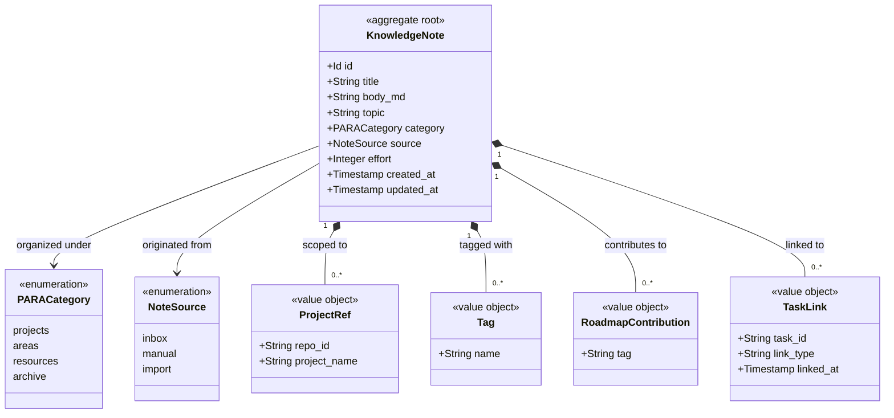
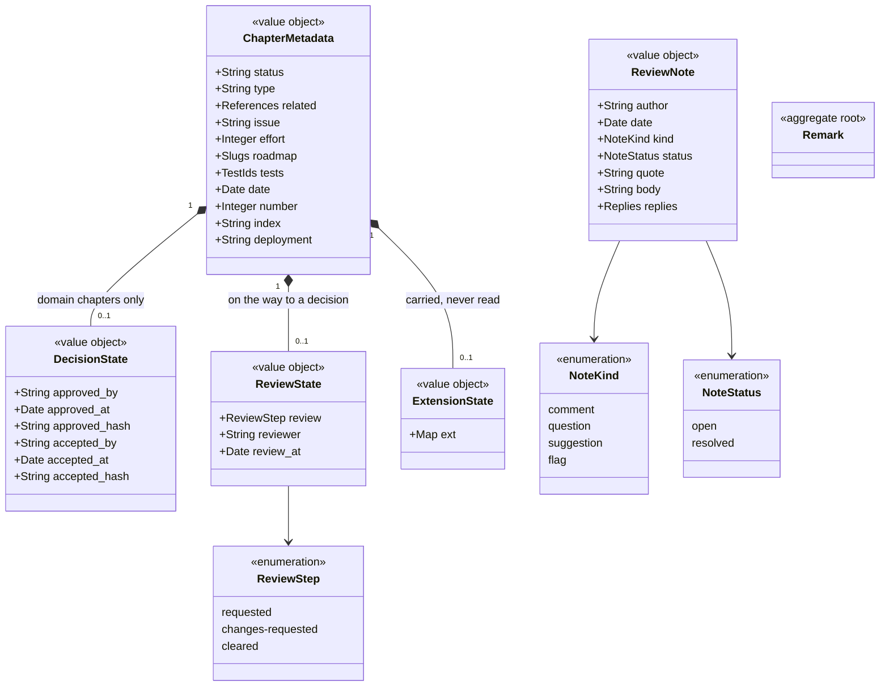

# Devbook

```meta
type: model
status: draft
```

> Structural view of the domain model for this bounded context: aggregates,
> entities, value objects, and their relationships. Keep this in sync with
> `domain.md` (which describes responsibilities/invariants in prose) — this
> file focuses on structure and relationships.

## Model diagram



## Relationship notes

- `KnowledgeNote` is the aggregate root; `ProjectRef`, `Tag`,
  `RoadmapContribution`, and `TaskLink` are owned value objects. There are no
  separately identified child entities.
- `TaskLink` references a Task by id only, never by object reference,
  so the two contexts stay decoupled; the Cross-Linking service keeps both
  directions consistent.
- `effort` is a plain scalar of story points on the root, with the same three-value
  meaning as a Task's `effort` (`null`/absent = not estimated, `0` a real
  estimate, negative rejected). It carries no relationship to another type. Roadmap
  Planning reads and totals it; Devbook owns it.
- `Tag` and `RoadmapContribution` are **two different value objects on purpose**,
  even though both read as "tags". `Tag` is a `#keyword` this context owns for
  cross-cutting discovery; `RoadmapContribution` is a
  [Roadmap Item](../roadmap/model.md) tag slug the chapter declares it contributes
  to. Neither draws an edge: `Tag` groups notes here, and `RoadmapContribution`
  *names* a roadmap item rather than *addressing* a chapter, so — like an alias —
  it stays a node attribute and produces no cross-reference in the knowledge graph.

## Chapter metadata the panels read

A repository devbook chapter is not a `KnowledgeNote`: it is a file this context
reads and never owns (see [Repository devbook areas](features.md#repository-devbook-areas)).
What the panels read off one is modelled here because it is what they show, and
because three of its parts are easy to confuse.



- **`status` is folder-relative, and absent is a value.** In the architecture,
  domain and design areas an absent status *is* `active`, the resting state,
  and the panels write it by removing the line. In the technology and AI areas
  it is a rating and always present. The domain area alone adds two decision
  steps above the ladder, `approved` and `accepted`.
- **`DecisionState` and `ReviewState` are state, not content.** They sit in the
  chapter's `meta` block but describe the road to a decision, so the panels draw
  them beside the status and hand none of them on as what the chapter says.
  `DecisionState` exists only while its step stands and leaves with it;
  `ReviewState` is replaced by `DecisionState` when approval is written. Neither
  is legal outside the domain area.
- **`type` is folder-relative too.** Domain, technology and AI chapters each
  draw from their own set; architecture and design define none. A domain
  context's additional page takes its own filename as its type.
- **`ExtensionState` belongs to whoever wrote it.** Keys under `ext.` are
  carried through verbatim and never validated or interpreted here.
- **`ReviewNote` and `Remark` are two things on purpose.** A `ReviewNote` is an
  `annotation` fence in the chapter file: the repository's shared review state,
  read-only here, attached to the passage above it, and never chapter content.
  A `Remark` is the person's own note on a block, owned and replicated by this
  context — local ADR 0011 (`.devbook/arc42/adr/0011-devbook-annotations-are-a-third-replica-container.md`)
  records why the two are kept apart and why neither is converted into the
  other.
