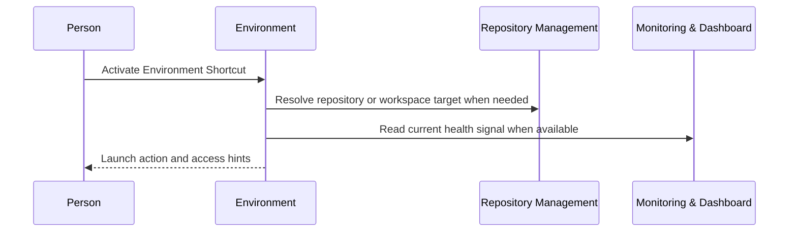

# Environment

```meta
type: flow
status: draft
```

> Lifecycle and process flows for this bounded context: how environment shortcuts
> are resolved and activated.

## Shortcut activation



- Environment owns the shortcut and launch preference.
- Repository Management supplies repository and workspace facts.
- Monitoring supplies health or availability signals when a view wants to display
  them.