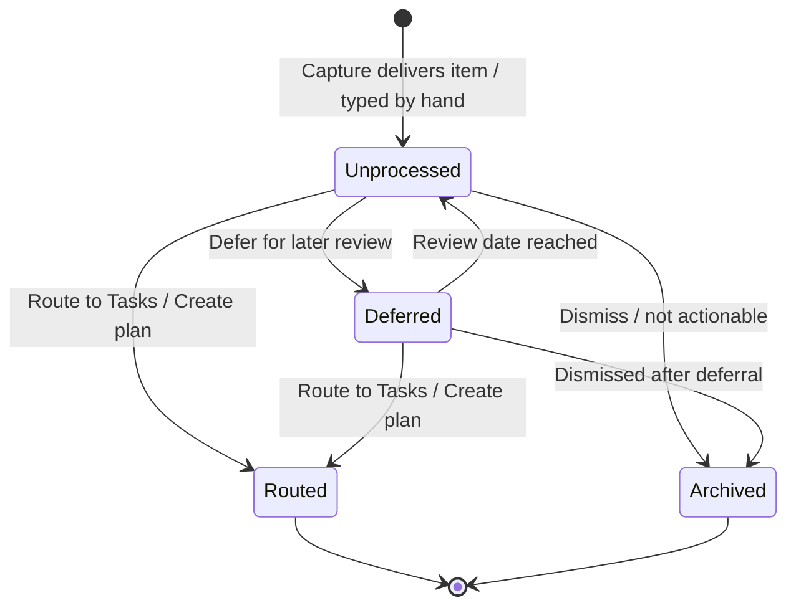
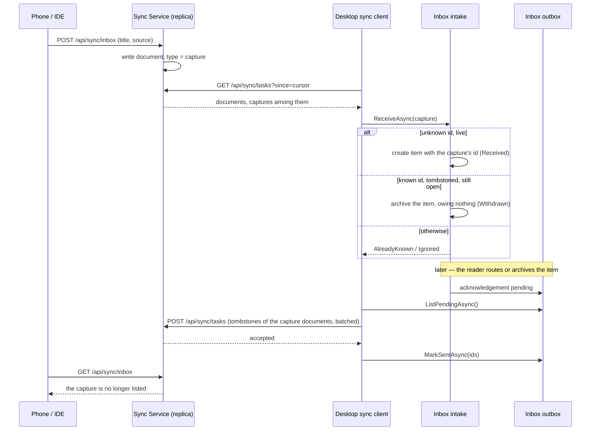

# Inbox

```meta
type: flow
status: draft
related: [.devbook/arc42/adr/0009-captures-are-a-document-kind-on-the-replica.md]
```

> Lifecycle and process flows for this bounded context. Flows describe how an
> inbox item moves through its states over time — complementary to `model.md`
> (structure) and `domain.md` (responsibilities/invariants).

## Inbox item lifecycle



- `Routed` is not a stored status value — it is the terminal outcome of triage
  represented by the presence of a `RoutingTarget` plus emission of
  `ItemTriaged`; the persisted `status` is `triaged`. There is no bare "mark
  triaged" step: in this product deciding *is* routing, so an item reaches
  `triaged` and gains its `RoutingTarget` in the same transition.
- Routing happens exactly once; a second routing is refused.
- Archive is refused from `Routed` — the item has left — and from `Archived`.
  It is allowed from `Unprocessed`, `Deferred`, and a `triaged` item that has no
  routing target.
- Filing in a list (`list_id`) is not a transition: it is allowed in every
  state, `Archived` included.
- `Deferred → Unprocessed` on the review date is modelled and exists on the
  aggregate; nothing schedules it yet.

## Capture intake and acknowledgement

How a capture made on another device becomes an item here, and how that device
learns it was dealt with. The replica document and its `capture` kind token are
decided in `.devbook/arc42/adr/0009-captures-are-a-document-kind-on-the-replica.md`.



- The intake decides by id and status and parses no token; every case has an
  answer and none is an error, because the caller is the sync client and an
  error there would replay the page for ever.
- Only a decision about a replica-backed item — route or archive — puts an
  acknowledgement in the outbox. An item archived *because* the replica already
  carried a tombstone owes nothing. The acknowledgement is durable on the item,
  so a decision taken offline reaches the phone on the first push that
  succeeds.
- The desktop's own tombstone comes back round on the next pull as a known id
  it has already decided on: `AlreadyKnown`, nothing written. A second desktop
  still holding the item open archives it instead — the honest multi-desktop
  answer.
- The phone's own "Triage" acknowledges the same way: the service tombstones the
  capture document.
