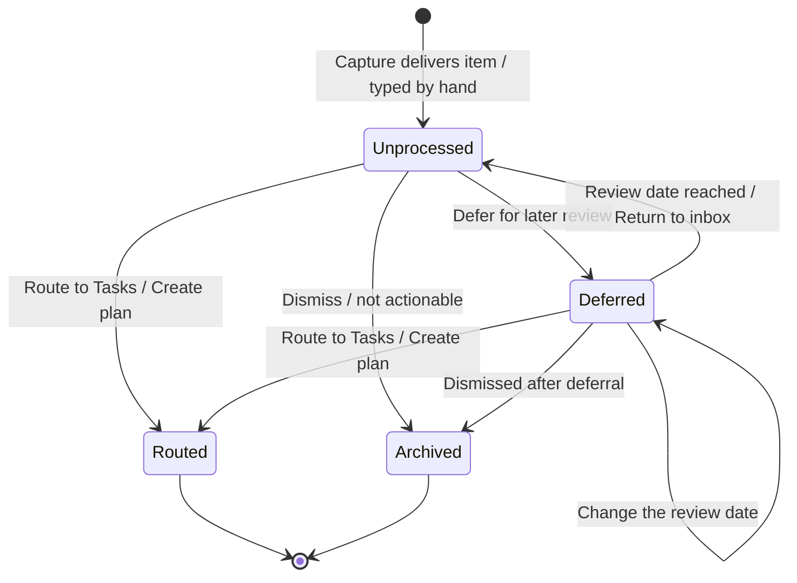
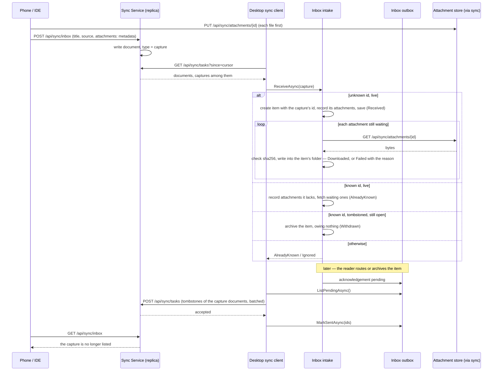
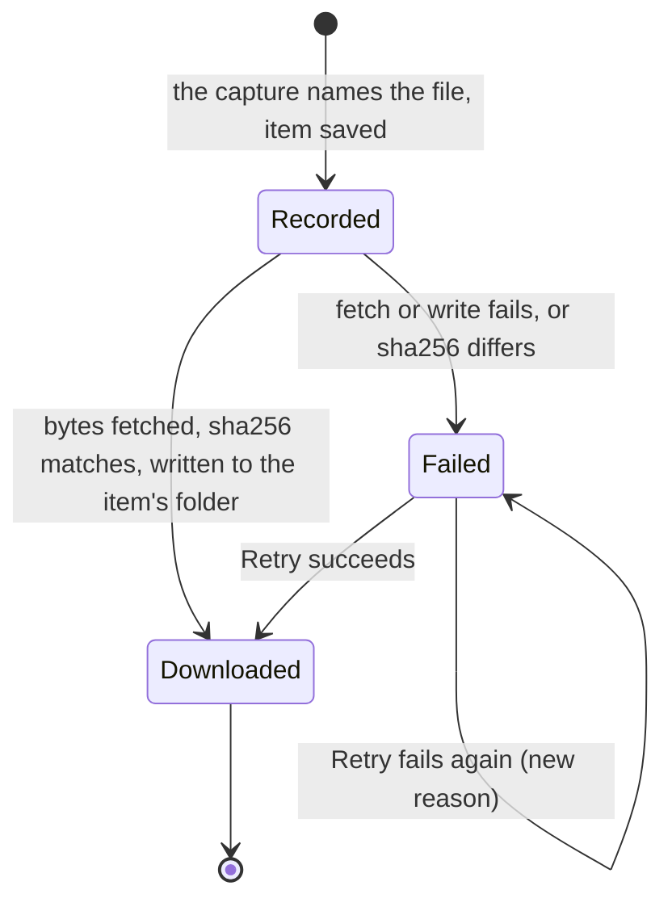

# Inbox

```meta
type: flow
status: draft
related: [.devbook/arc42/adr/0009-captures-are-a-document-kind-on-the-replica.md, .devbook/arc42/adr/0014-attachments-travel-through-a-blob-store-beside-the-replica.md, .devbook/domain/inbox/domain.md#attachment]
```

> Lifecycle and process flows for this bounded context. Flows describe how an
> inbox item moves through its states over time — complementary to `model.md`
> (structure) and `domain.md` (responsibilities/invariants).

## Inbox item lifecycle


```mermaid
stateDiagram-v2
    [*] --> Unprocessed : Capture delivers item / typed by hand
    Unprocessed --> Routed : Route to Tasks / Create plan
    Unprocessed --> Deferred : Defer for later review
    Unprocessed --> Archived : Dismiss / not actionable
    Deferred --> Deferred : Change the review date
    Deferred --> Unprocessed : Review date reached / Return to inbox
    Deferred --> Routed : Route to Tasks / Create plan
    Deferred --> Archived : Dismissed after deferral
    Routed --> [*]
    Archived --> [*]
```

- `Routed` is not a stored status value — it is the terminal outcome of triage
  represented by the presence of a `RoutingTarget` plus emission of
  `ItemTriaged`; the persisted `status` is `triaged`. There is no bare "mark
  triaged" step: in this product deciding *is* routing, so an item reaches
  `triaged` and gains its `RoutingTarget` in the same transition.
- Routing happens exactly once; a second routing is refused.
- Archive is refused from `Routed` — the item has left — and from `Archived`.
  It is allowed from `Unprocessed`, `Deferred`, and a `triaged` item that has no
  routing target.
- Filing in a list (`list_id`) is not a transition: it is allowed in every
  state, `Archived` included.
- `Deferred → Unprocessed` happens two ways. A person returns the item by hand,
  whatever its date. Or the **resurface sweep** finds its `deferred_until` on or
  before today — the local calendar day — and brings it back. The sweep runs
  when the desktop Inbox pane opens, the first time and every time after it is
  closed and shown again. There is no background scheduler: for a single reader
  on one desktop, opening the pane is the only moment the difference shows, so a
  timer would wake a queue nobody is reading. An item with no review date is
  never swept. A scheduler can replace the sweep if a second surface ever reads
  the queue unattended.
- Deferring a deferred item is allowed and changes its review date.

## Capture intake and acknowledgement

The replica document and its `capture` kind token are
decided in `.devbook/arc42/adr/0009-captures-are-a-document-kind-on-the-replica.md`.


```mermaid
sequenceDiagram
    participant P as Phone / IDE
    participant S as Sync Service (replica)
    participant M as Desktop sync client
    participant I as Inbox intake
    participant O as Inbox outbox
    participant A as Attachment store (via sync)

    P->>A: PUT /api/sync/attachments/{id} (each file first)
    P->>S: POST /api/sync/inbox (title, source, attachments: metadata)
    S->>S: write document, type = capture
    M->>S: GET /api/sync/tasks?since=cursor
    S-->>M: documents, captures among them
    M->>I: ReceiveAsync(capture)
    alt unknown id, live
        I->>I: create item with the capture's id, record its attachments, save (Received)
        loop each attachment still waiting
            I->>A: GET /api/sync/attachments/{id}
            A-->>I: bytes
            I->>I: check sha256, write into the item's folder — Downloaded, or Failed with the reason
        end
    else known id, live
        I->>I: record attachments it lacks, fetch waiting ones (AlreadyKnown)
    else known id, tombstoned, still open
        I->>I: archive the item, owing nothing (Withdrawn)
    else otherwise
        I-->>M: AlreadyKnown / Ignored
    end
    Note over I,O: later — the reader routes or archives the item
    I->>O: acknowledgement pending
    M->>O: ListPendingAsync()
    M->>S: POST /api/sync/tasks (tombstones of the capture documents, batched)
    S-->>M: accepted
    M->>O: MarkSentAsync(ids)
    P->>S: GET /api/sync/inbox
    S-->>P: the capture is no longer listed
```

- The intake decides by id and status and parses no token; every case has an
  answer and none is an error, because the caller is the sync client and an
  error there would replay the page for ever. For the same reason a file entry
  no fetch could honour is left off the item rather than thrown, and a file that
  fails to download leaves the item Received.

## Attachment lifecycle

One file on an item, as this machine holds it. The bytes come from the attachment
store (local ADR 0014), never from the replica.


```mermaid
stateDiagram-v2
    [*] --> Recorded : the capture names the file, item saved
    Recorded --> Downloaded : bytes fetched, sha256 matches, written to the item's folder
    Recorded --> Failed : fetch or write fails, or sha256 differs
    Failed --> Downloaded : Retry succeeds
    Failed --> Failed : Retry fails again (new reason)
    Downloaded --> [*]
```

- A replayed sync page never retries a Failed file; only the person's Retry does.
- Recording the same file again changes nothing, so a replay cannot move a
  Downloaded file back to Recorded.
- Only a decision about a replica-backed item — route, archive or delete — puts
  an acknowledgement in the outbox. An item archived *because* the replica
  already carried a tombstone owes nothing. The acknowledgement is durable on the
  item, so a decision taken offline reaches the phone on the first push that
  succeeds; a deleted item's is kept beside the item store, all that is left of
  it, and until it is sent a replay of the capture is `AlreadyKnown` rather than
  a new item.
- The desktop's own tombstone comes back round on the next pull as a known id
  it has already decided on: `AlreadyKnown`, nothing written. A second desktop
  still holding the item open archives it instead — the honest multi-desktop
  answer.
- The phone's own "Triage" acknowledges the same way: the service tombstones the
  capture document.
