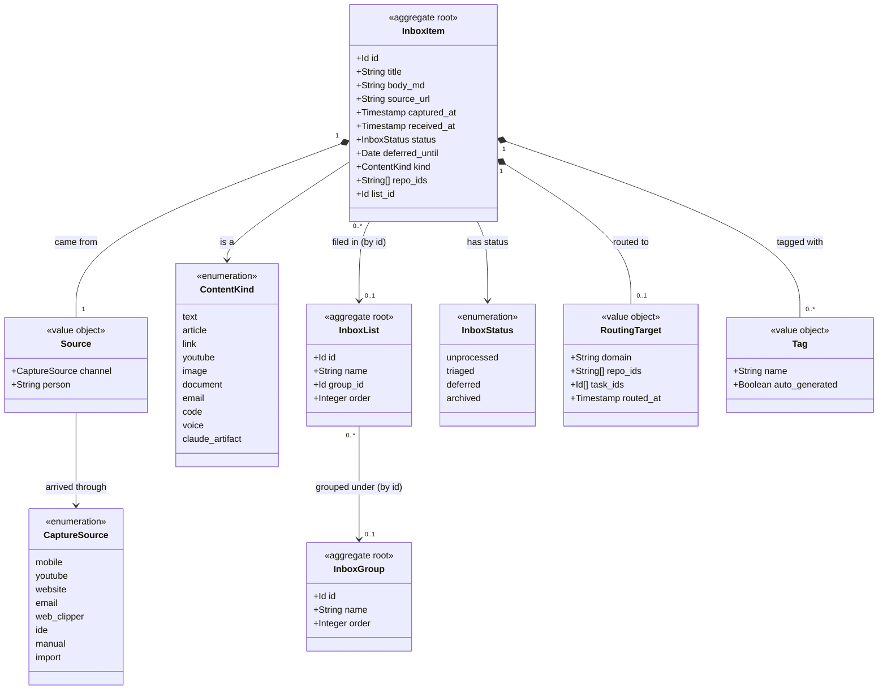

# Inbox

```meta
type: model
status: draft
```

> Structural view of the domain model for this bounded context: aggregates,
> entities, value objects, and their relationships. Keep this in sync with
> `domain.md` (which describes responsibilities/invariants in prose) — this
> file focuses on structure and relationships.

## Model diagram



## Relationship notes

- `InboxItem` is the aggregate root of an item; `Tag`, `RoutingTarget` and
  `Source` are owned value objects.
- `InboxList` and `InboxGroup` are two further, small aggregate roots. An item
  relates to a list by `list_id` and a list to a group by `group_id` — id
  references only, never containment, so deleting a list is a write across the
  items it held (each `list_id` is cleared) and ungrouping is a write across
  the group's lists. Both are local-only and hard-deleted; nothing replicates
  them.
- `Source` carries the `CaptureSource` channel (mirrored from Capture) and the
  optional person who shared the item; the channel is no longer a bare field on
  the root.
- `ContentKind` says what the content is; `CaptureSource` says how it arrived.
  The two are independent — the same video can arrive through any channel.
- `repo_ids` on the root are the repositories a reader assigned while the item
  waits; `RoutingTarget.repo_ids` are the ones it was routed with, frozen at
  that moment. `RoutingTarget.task_ids` name the entries Tasks created — one
  per repository, or one when none was assigned — as ids in another context,
  not references.
- `captured_at` is set by Capture and preserved; `received_at` is set by the
  Inbox on intake — the two are kept distinct on purpose. An item that arrived
  through sync reuses the capture's id as its own.
- Routing does not embed the target aggregate; it records the destination
  (`domain`, `repo_ids`, `task_ids`) and hands off via `ItemTriaged`. Tasks and
  Devbook own the created entities.
- Two flags the store keeps beside the item — whether it is replica-backed and
  whether the replica still owes an acknowledgement — are sync bookkeeping for
  the intake and outbox adapters and deliberately not part of the model here.
