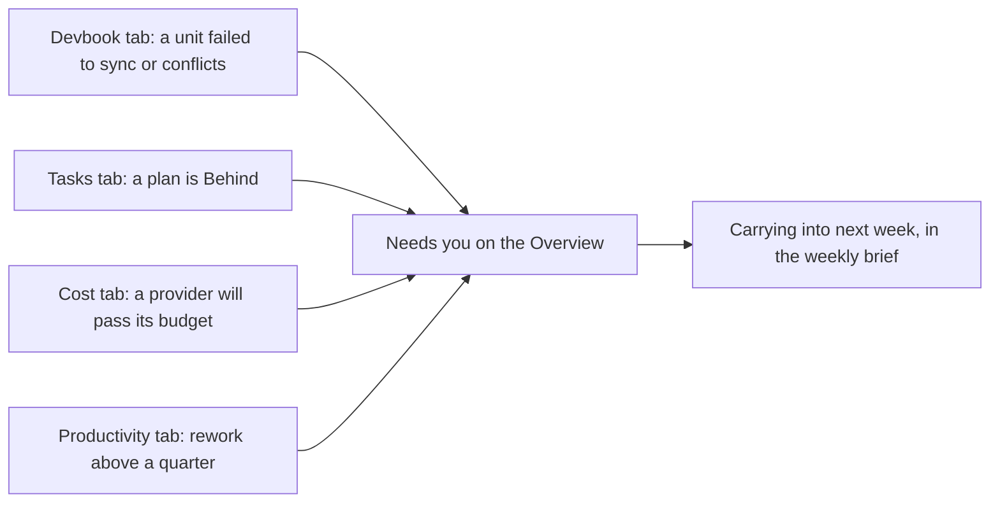

# Productivity

```meta
type: features
status: draft
```

> Features and sub-features this bounded context supports, described in
> business/ubiquitous language rather than implementation terms.

## AI productivity tracking

```meta
type: feature
status: draft
related: [.devbook/domain/productivity/domain.md#productivity-ledger, .devbook/domain/tasks/domain.md#aiworklogged]
```

[AI Productivity Tracking](domain.md#ai-productivity-tracking) shows what changed
because of AI assistance: tasks moved, artifacts created, prompts reused, reviews shortened, or
research summarized.

### AI activity capture

```meta
type: sub-feature
status: draft
```

Record AI-assisted activity from task work, Copilot sessions, IDE chats, and
automation runs with enough context to understand the work without copying tool
internals.

### Productivity summaries

```meta
type: sub-feature
status: draft
```

Summarize AI-assisted work by day, week, repository, activity kind, and tool so
the person can see how AI affects throughput and focus.

### Time-saved estimates

```meta
type: sub-feature
status: draft
```

Capture optional estimates or calibrated defaults for time saved, keeping the
estimate visibly separate from measured activity.

### AI vendor usage import

```meta
type: sub-feature
status: draft
feature-flag: .devbook/domain/productivity/context.md#ai-usage-metrics
related: [.devbook/domain/productivity/dependencies.md#outbound-dependencies]
```

Import token, cost, and session usage from the AI vendors the person works
through, so productivity insight rests on measured usage rather than
recollection. Both vendors report at organization level only: Claude exposes
usage and cost reports to an organization holding an Admin API key, and GitHub
reports Copilot usage per organization to an organization owner. The import is
evidence for the ledger; it never becomes the ledger.

### Local usage accumulation

```meta
type: sub-feature
status: draft
related: [.devbook/domain/productivity/features.md#ai-vendor-usage-import]
```

Accumulate usage locally, call by call, for the person who has no organization
behind their AI subscription.

Neither vendor offers a personal usage history. Anthropic documents the Admin
API as unavailable to individual accounts, and GitHub has no endpoint at all for
an individual Copilot subscriber's own usage — its billing page is the only
route, by manual export. For those people the only measurable signal is what
each response reports about itself: Claude returns per-request token counts on
every message it answers.

The capability is therefore to record those per-response counts as they arrive
and roll them up by day, model, and work subject — the same shape the vendor
import produces, so summaries do not care which route the evidence took. Kept as
an idea rather than a plan because it only measures work that flows through
Tasks itself, which is a narrower claim than the vendor reports make, and that
narrowing has to stay visible to the person reading the numbers.

## Personal productivity dashboard

```meta
type: feature
status: draft
feature-flag: .devbook/domain/productivity/context.md#dashboard
setting: [.devbook/domain/productivity/context.md#working-week, .devbook/domain/productivity/context.md#weekly-usage-reset, .devbook/domain/productivity/context.md#monthly-spend-budget]
related: [.devbook/domain/monitoring/features.md#multi-layer-dashboards]
```

Expose productivity trends as personal insight rather than team performance
reporting. The view shows patterns and evidence while preserving the user's
control over interpretation.

The dashboard is one pane of six tabs. The Overview answers "how is it going, and
what needs me?" in one screen. The other five tabs each answer one question in
depth. A person can also read the last finished week as a short brief instead of
as charts.

### Six tabs and what each answers

```meta
type: sub-feature
status: draft
related: [.devbook/domain/productivity/features.md#what-needs-you, .devbook/domain/productivity/features.md#spend-against-a-monthly-budget, .devbook/domain/productivity/features.md#the-weekly-brief]
```

The pane holds six tabs, in this order:

| Tab | What it answers | What it holds |
| --- | --- | --- |
| Overview | How is it going, and what needs me? | The headline tiles, the main charts and [What needs you](#what-needs-you) |
| Productivity | How much did I ship, and how much came back? | Pull requests merged and issues closed over time, and rework after review |
| Tasks | Is the planned work getting done, and will each plan land? | The task figures, the [roadmap timeline](#whether-each-plan-will-land-in-its-window), and tasks and story points completed per week |
| Sessions | When and how long did the agents work? | Sessions and agent-active hours per week, the hour grid, the longest sessions, and [what the sessions cost and shipped](#what-the-sessions-cost-and-shipped) |
| Devbook | Which devbook units have drifted from their code? | [Drift at a glance](#drift-at-a-glance) |
| Cost | What are my assistants costing this month? | [Spend against a monthly budget](#spend-against-a-monthly-budget) |

The task figures on the Tasks tab are tasks completed, story points done, the pace
in use, the items in the window, the planned effort, and the work still to do.

The pane opens on the Overview every time, and it does not remember which tab was
selected. Nothing on the dashboard outlives the pane being closed: the scope, the
window and the folded sections are already forgotten when it closes, and the tab is
no exception.

Three controls narrow what the tabs show. The repository chips stay in the shell
header. The Machine select and the Window toggle sit in the pane header, because only
the dashboard reads them. The Devbook tab says that the window and the machine do not
apply to it.

Each headline figure carries a delta against the previous window of the same length.
A figure over a window of N weeks is compared with the N weeks just before it, so the
person sees which way it moved without choosing a second period.

### What needs you

```meta
type: sub-feature
status: draft
related: [.devbook/domain/productivity/features.md#six-tabs-and-what-each-answers, .devbook/domain/productivity/features.md#drift-at-a-glance, .devbook/domain/productivity/features.md#whether-each-plan-will-land-in-its-window, .devbook/domain/productivity/features.md#spend-against-a-monthly-budget]
```

The Overview opens with five headline tiles:

- pull requests merged;
- story points done, out of those planned;
- agent-active time;
- spend this month, out of the monthly budget;
- devbook drift issues open.

The spend tile gives each provider its own line, with that provider's spend set
against that provider's budget. It never adds the providers into one total, for the
reason [Spend against a monthly budget](#spend-against-a-monthly-budget) gives.

Below the tiles come throughput, the roadmap against its pace, Needs you, spend by
model, and [hours worked](#hours-worked).



Needs you lists what the person should look at, in this order:

1. Devbook units whose drift issue carries `sync-failed`, or whose last verdict is
   conflict.
2. Roadmap items whose outlook is Behind.
3. Providers projected to pass their monthly budget by the end of the month.
4. Rework, when the pull requests that came back after review are more than 25% of
   those merged in the window.

Each item has a title, a one-line detail and a link to its tab. The list only points;
the tab holds the evidence. When nothing qualifies, the list says "Nothing needs you."

### Spend against a monthly budget

```meta
type: sub-feature
status: draft
setting: [.devbook/domain/productivity/context.md#monthly-spend-budget]
related: [.devbook/domain/productivity/features.md#ai-vendor-usage-import, .devbook/domain/productivity/features.md#what-needs-you]
```

Show what each assistant has cost this month, and whether it will stay inside the
budget the person set for it. The spend providers are Claude (Anthropic), GitHub
Copilot and the Azure AI Foundry resource.

Each provider has its own monthly budget, set in Dashboard settings. An empty budget
means that provider has none. The dashboard projects each provider's month-end spend
as its spend so far this month, plus its average daily spend over the last 7 days
times the days left in the month. The 7 days include today and stay inside the
month: with fewer than 7 days of the month gone, the average is over the days there
are, so on the first of the month it is that day's spend. The days left are the days
after today. A provider is projected past its budget only when it has a budget and
the projection is above it.

The Cost tab holds one card per provider. A card shows the spend so far out of the
budget, with a marker where the projected month-end spend falls. Below the cards, a
chart draws spend over time, either cumulative or per day. It draws the budget line,
and it draws the projected days to the end of the month faded, so a projection never
reads as spend that happened. The tab ends with spend by model: each model's share,
its input and output tokens, and its spend.

Each provider's spend stays on its own and is never summed into one total. The
figures differ in kind, because one provider calls its figure an estimate and another
reports what it charged, and they may be in different currencies. No provider reports
spend per repository, so the repository chips do not narrow spend.

### The weekly brief

```meta
type: sub-feature
status: draft
related: [.devbook/domain/productivity/features.md#what-needs-you, .devbook/domain/productivity/features.md#six-tabs-and-what-each-answers]
```

Read the last finished week as a few sentences rather than as charts. The brief
covers the last completed week, Monday to Sunday, and links to the week before it.
The person reaches it from the "Read as brief" link on the tab strip.

The brief has one block each for Shipping, Plan, Sessions and Cost. Each block opens
with a headline sentence built from a template, adds one supporting sentence, and
shows its figure and a small chart. It closes with "Carrying into next week", which
holds the items of [What needs you](#what-needs-you).

### What the sessions cost and shipped

```meta
type: sub-feature
status: draft
related: [.devbook/domain/sessions/features.md#what-a-session-cost-and-what-it-shipped]
```

This part sits on the Sessions tab. Beside time, it reads what the session records
carry: **output tokens**, per usage week and cut by model or by repository,
and **pull requests linked**, per week and by the repository each lives in — counted
once however many sessions linked one. Both are charts of their own rather than lines
on the hours chart, because a count of tokens and a count of hours are two measures.
Each figure is over the sessions that could say, and says it is partial when that is
fewer than the sessions counted: Copilot records neither, and a missing figure is
never read as zero.

The limit-hits tile says what overage did about each refusal: fell back to overage, a
wall for the reason the assistant gave ("org spend cap reached"), or nothing said.
And a Claude session now sits in the band of the registered clone its folder lies in,
rather than in "No repository recorded" with every other Claude session.

### Hours worked

```meta
type: sub-feature
status: draft
setting: [.devbook/domain/productivity/context.md#working-week]
related: [.devbook/domain/productivity/requirements.md#hours-worked, .devbook/domain/productivity/domain.md#office-hours, .devbook/domain/roadmap/domain.md#actual-hours, .devbook/domain/roadmap/domain.md#working-stretch, .devbook/domain/roadmap/domain.md#day-override, .devbook/domain/productivity/dependencies.md#outbound-dependencies]
```

Show how long the person actually worked, and how much of it fell outside the
hours they meant to work. The Hours worked chart on the Overview shows, per day
and per week over the period the dashboard's selector picks, the person's
[actual hours](../roadmap/domain.md#actual-hours). It splits them into the time
**inside** and **outside** their [office hours](domain.md#office-hours), and sets
both beside the planned hours of the working week.

Actual hours are the union of the person's
[working stretches](../roadmap/domain.md#working-stretch), as Roadmap Planning
defines them, so the axis and this part count the same time. Office hours apply
the [day overrides](../roadmap/domain.md#day-override) the person set on the
roadmap. A day off they blocked therefore counts all of its work outside, and a
Saturday they unblocked has office hours from its stored times.

It is presentation only, like the hour grids. No other dashboard figure changes
and no work is left out. What it promises is in
[the requirements](requirements.md#hours-worked).

### Drift at a glance

```meta
type: sub-feature
status: draft
related: [.devbook/domain/devbook/features.md#sync-verdicts-beside-a-chapter, .devbook/domain/devbook/domain.md#sync-verdict, .devbook/ai/05-unattended-runs.md]
```

Show how far each repository's devbook has drifted from its code, without opening a
chapter. This part is the Devbook tab. A stacked bar sums up the last verdict a sweep
reached on every unit it has verified — aligned, code-ahead, spec-ahead, conflict, and
unresolved — with a legend that gives the count of each. Under it, the units that need a
look are listed with their direction, their last verdict, what the sweep did about it,
and when. The aligned units are folded away behind a "Show all" link that names how
many units there are.

A direction filter narrows the list to All, Code → chapter, or Chapter → code. Code →
chapter is the pull direction, and Chapter → code is the push direction. A unit a sync,
report, or off sweep owns shows under All only. A verdict leads to the pull request or
drift issue the sweep opened. Beside the units, a side list holds the `devbook-drift`
issues still open, those labelled `sync-failed` first and marked with the label's badge:
a sweep tried that unit, did not finish, and will not try again until a person clears
the label. A unit whose drift issue carries the label is marked in its row too.

The direction is the one the sweep read when it verified the unit, so the filter also
picks the sweep that owns the units. A unit no sweep has verified is not listed.
The repository chips narrow the tab. The window and the machine do not, because a
verdict is the latest a sweep left and an issue is open now, and the tab says so.
The verdicts are this machine's and the issues are GitHub's, and either shows without the other: issues
that cannot be read leave the units standing and say why.

### Whether each plan will land in its window

```meta
type: sub-feature
status: draft
feature-flag: .devbook/domain/productivity/context.md#dashboard
related: [.devbook/domain/roadmap/features.md#placing-a-plan-in-time, .devbook/domain/roadmap/features.md#forecasting-work-in-flight, .devbook/domain/roadmap/context.md#story-points-a-week, .devbook/arc42/adr/0013-imported-plan-is-a-roadmap-item-laid-out-by-import.md#5-placed_by_import-and-what-a-re-import-may-touch]
tests: [unit:dotnet:Backlog.Modules.Dashboard.UnitTests.TaskInsightsTests, unit:dotnet:Backlog.Infrastructure.FileSystem.UnitTests.RoadmapPlanProgressSourceTests, integration:dotnet:Backlog.Desktop.UI.UnitTests.DashboardPaneTests.An_item_in_two_repositories_says_the_pace_of_each_part_it_was_projected_at]
```

See, without opening the roadmap, which plans will land inside the window they
were given. The Tasks tab draws the roadmap as a week-by-week timeline, which
replaces the table it used to be. The timeline holds the plans whose window overlaps
the weeks the selector picks, together with every plan whose window is still sized
by its effort. Each plan says how its work stands: finished, on track, behind,
overdue, not sized, or with no pace to read it at. The Overview's roadmap chart sets
the same plans against their pace, and a plan that is behind is listed under
[What needs you](#what-needs-you).

A plan placed by hand or by its due date is projected one repository part at a
time, the same parts [Placing a plan in time](../roadmap/features.md#placing-a-plan-in-time)
lays out. Each part's estimated work left is spent at its own repository's pace in
use. It starts on the later of today and the day after the parts it waits on end.
The plan is judged on the latest part end: on track when that falls inside its
window, behind when it falls after. A plan whose window is still sized by its effort
is already laid out that way, so the part reports the window the roadmap stores.
An unestimated task counts nothing here, because the part reports it as unestimated.
A figure that also guessed at its size would count it twice. A plan has no pace only
when no part with work left has one. Where the parts with work left run at different
paces, the plan names each of them, for example "app 8, site 4 points a week".
