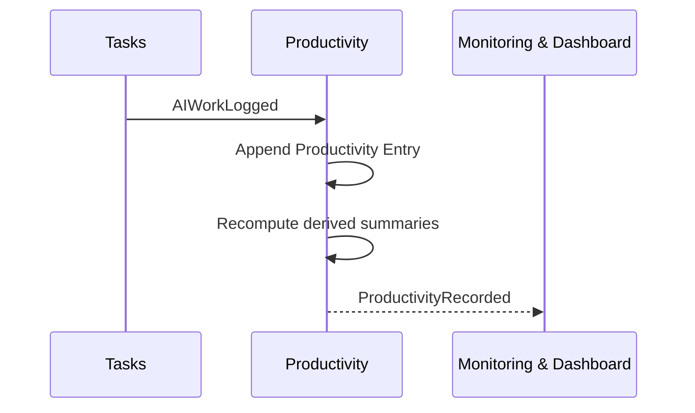

# Productivity

```meta
type: flow
status: draft
```

> Lifecycle and process flows for this bounded context: how activities become
> productivity insight over time.

## AI-assisted activity recording



- Tasks owns the work item and emits activity evidence.
- Productivity owns the measurement ledger and derived summaries.
- Monitoring may display productivity signals but does not change productivity
  records.