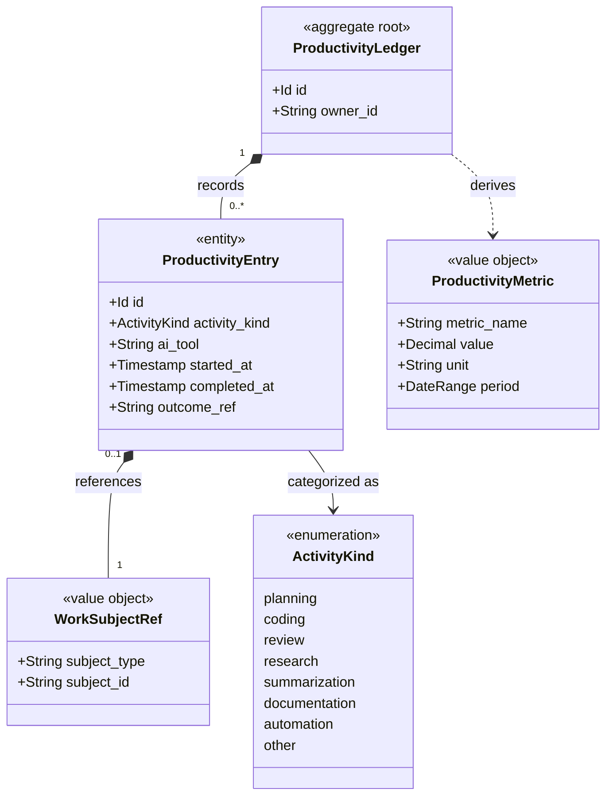

# Productivity

```meta
type: model
status: draft
```

> Structural view of the domain model for this bounded context: aggregates,
> entities, value objects, and their relationships. Keep this in sync with
> `domain.md` (which describes responsibilities/invariants in prose) - this
> file focuses on structure and relationships.

## Model diagram



## Relationship notes

- `ProductivityLedger` is the aggregate root and owns append-only
  `ProductivityEntry` records.
- `WorkSubjectRef` is opaque by design so Productivity can link to tasks,
  sessions, issues, pull requests, commits, or notes without owning those models.
- `ProductivityMetric` is derived from ledger entries and is not stored as the
  authoritative activity record.