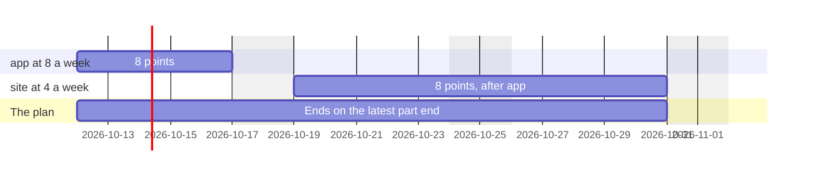

# Roadmap Planning

```meta
type: features
status: draft
```

> Features and sub-features this bounded context supports, described in
> business/ubiquitous language rather than implementation terms.

## Owning a stored plan

```meta
type: feature
status: draft
related: [.devbook/domain/roadmap/domain.md#roadmap-plan]
```

Keep a plan that exists in its own right, so intent survives a restart and can be
written down before the work has been refined into anything. The plan lives with
the person's own storage location: point the workspace at a different folder and
the plan moves with it, because a plan kept somewhere other than where its owner
keeps everything else is a plan they will lose.

### Planning work that has no task yet

```meta
type: sub-feature
status: draft
```

Add an item to the plan with a title and dates alone. Most planning happens before
refinement, and a planning tool that first demands a refined work item is a tool
that gets used after the decisions have already been made somewhere else.

### Linking an item to the task that executes it

```meta
type: sub-feature
status: draft
related: [.devbook/domain/tasks/domain.md#task]
```

Name the [Task](../tasks/domain.md#task) that
carries out a planned item, so the plan can show real progress instead of a
guess — while status and priority of the work itself stay where they belong. The
link is optional in both directions and may dangle without breaking the plan.

### Milestones

```meta
type: sub-feature
status: draft
related: [.devbook/domain/roadmap/domain.md#milestone]
```

Mark the fixed points a plan is read against — a release, a freeze, a review, a
commitment made to someone else. A milestone is a day, not a short piece of work,
and it can be depended on exactly as an item can.

Dates share one place at the top of the plan rather than a line inside each
repository's band: a release is a fact about the plan, not about one project.

### A date the whole plan is read against

```meta
type: sub-feature
status: draft
related: [.devbook/domain/roadmap/domain.md#milestone]
```

Say that a particular date is one everything is measured against — a release, a
freeze — and have it drawn through the whole plan rather than only where its marker
sits, so what lands before it can be read without tracing a vertical line by eye.

Whether a date is that kind of date is a planning judgement, so it is recorded on
the milestone rather than decided by whatever is drawing it. A plan where every date
claimed it would be a plan of lines.

## Syncing the plan between devices

```meta
type: feature
status: draft
depends-on: [.devbook/domain/roadmap/features.md#owning-a-stored-plan, .devbook/domain/tasks/features.md#multi-device-sync]
related: [.devbook/arc42/adr/0018-roadmap-plan-and-pace-ride-the-task-feed.md, .devbook/arc42/adr/0005-azure-hosted-task-replica-for-multi-device-sync.md, .devbook/domain/roadmap/domain.md#roadmap-plan, .devbook/domain/tasks/domain.md#device, .devbook/domain/roadmap/context.md#story-points-a-week]
```

Keep one plan on every device the person has paired, so the plan drawn on one
PC is the plan the next one opens. The whole plan travels — its items,
milestones, dependencies, lanes, dates and band colours — beside the tasks the
devices already sync
([Multi-device sync](../tasks/features.md#multi-device-sync)). It travels only
while sync is on and the device is paired; otherwise the plan is that device's
own, as it always was.

The plan is replaced whole, never merged. When two devices have both saved the
plan since they last synced, the **newer save wins on every device** and the
older one is lost. That is the same trade a task makes when it is edited in two
places, and here it has one more reason: the plan's dependencies must never form
a loop, and two plans that each hold none can form one when merged item by item.
One whole plan from one device is a plan that was valid when it was saved.

A device that has **never saved a plan has nothing to send**. Opening the
roadmap on a newly paired machine shows the plan from the other device rather
than wiping it with an empty one.

How the plan is being looked at stays with the device: zoom and scroll are not
part of the plan and do not travel.

### Carrying the pace with the person

```meta
type: sub-feature
status: draft
related: [.devbook/domain/roadmap/context.md#story-points-a-week, .devbook/arc42/adr/0018-roadmap-plan-and-pace-ride-the-task-feed.md, .devbook/arc42/adr/0019-roadmap-counts-the-working-week.md, .devbook/domain/productivity/context.md#working-week, .devbook/domain/roadmap/requirements.md#carrying-the-pace-with-the-person]
```

The pace travels too — the typed pace, the chosen source, and each repository's
own pace ([Story points a week](context.md#story-points-a-week)) — so a bar sized
by its effort is drawn the same length on every device. It travels apart from
the plan, so a pace changed on one device and the plan edited on another both
survive; between two pace changes, the newer one wins. A device that has never
set a pace sends none, and reads the other device's instead of offering its
seven. The measured paces do not travel: each device counts them from the
finished work it holds.

The working week travels with the pace, inside the same document and under the
same newer-wins rule
([ADR 0019](../../arc42/adr/0019-roadmap-counts-the-working-week.md)). Its
[day overrides](domain.md#day-override) travel inside it. Every device then
counts a bar over the same hours and draws it the same length. The person has one
working week. The dashboard's hour grids read its weekly pattern only, and the
dashboard's Hours worked part reads the overrides too
([Working week](../productivity/context.md#working-week)). A pace saved before
this change carries no working week. It reads the device's own until the next
change to the pace or the week writes one. What travels, and how, is in
[the requirements](requirements.md#carrying-the-pace-with-the-person).

## Tagging planned work

```meta
type: feature
status: draft
depends-on: [.devbook/domain/roadmap/features.md#owning-a-stored-plan]
related: [.devbook/domain/roadmap/domain.md#roadmap-tag]
```

Give every planned item a short tag other work can be filed against, so a Task
 or a knowledge chapter can say "this belongs to that plan item" without the
plan having to name it first. The tag is derived from the item's title when the
item is created — a person does not invent it — and is then editable on its own.

It deliberately **does not** move when the title is later renamed. The tag is the
word other places have already written down, and quietly reslugging it would make
every task filed under it and every chapter naming it stop matching, with nothing
to say so. Renaming the title and retagging the item are two different acts, and
keeping them apart is what makes a tag safe to write elsewhere.

Every item has a tag — there is no untagged item — and a title that comes out
empty once slugified falls back to a plain `item` so there is always something to
file against. Tags are not forced to be unique: two items can share one on
purpose, and the plan can list the tags in use and show the items sitting under
any one of them, so grouping planned work under a shared tag is a first-class
thing to do rather than an accident to be prevented.

The tag is spelled two ways on purpose, and the difference is which side is
writing. The item holds the **bare slug** — `release-q4` — because that is the
word a knowledge chapter names in its `roadmap` list and the word this context
lists as in use. A [Task](../tasks/domain.md#task) filed under it wears the slug
with a **plan sigil**, `+release-q4`, so that on a line a person reads it tells
itself apart from a `#` general tag and an `@` person; that spelling is the
task's, offered by its picker, and the item gathers a task whether it wears the
sigil or carries the bare slug from before the sigil existed. An imported plan's
shared tag is this same tag — one item per plan, its tag the plan's slug — which
is what [laying out imported plans](#laying-out-imported-plans) rests on, and
`.devbook/arc42/adr/0013-imported-plan-is-a-roadmap-item-laid-out-by-import.md` is where
the two spellings are settled.

## Gathering work under an item and totalling its effort

```meta
type: feature
status: draft
depends-on: [.devbook/domain/roadmap/features.md#tagging-planned-work]
related: [.devbook/domain/roadmap/domain.md#roadmap-item-gathering, .devbook/domain/tasks/features.md#effort-registration, .devbook/domain/devbook/features.md#topic-and-tag-grouping]
```

Read, for one planned item, everything that belongs to it and what it all adds up
to in story points — so an item on the plan can show the size of the work behind
it without anyone maintaining that number by hand.

An item gathers work two ways at once. It gathers what it **names** outright: the
Task it links, and the knowledge chapters it references directly. And it
gathers what carries its **tag**: every Task filed under the item's tag,
and every knowledge chapter whose own roadmap list names that tag. Something
reached both ways — linked and tagged — is shown once, but the plan remembers it
was held by both threads, because a person about to remove a link needs to see
whether the tag would still hold the work afterwards.

Over all of it, the item reports its
[total registered effort](domain.md#effort) and **how many gathered things carry
no estimate**, so a small total that hides a pile of unsized work cannot be
mistaken for a small pile of work.

## Priority planning

```meta
type: feature
status: draft
depends-on: [.devbook/domain/roadmap/features.md#owning-a-stored-plan]
related: [.devbook/domain/roadmap/domain.md#planning-priority]
```

Decide what matters most across projects at once, and record that decision in the
plan rather than in each project. The plan's priority is its own judgement: it is
never overwritten by the priority of a task the item names, and setting it never
reaches into that task — so reprioritising a quarter does not mean editing a
dozen issues.

## Dependency planning

```meta
type: feature
status: draft
depends-on: [.devbook/domain/roadmap/features.md#owning-a-stored-plan]
related: [.devbook/domain/roadmap/domain.md#dependency, .devbook/domain/roadmap/domain.md#plan-sequencing]
```

Record what has to land before what, between any two things in the plan — item to
item, item to milestone, milestone to item. This is the capability that makes a
roadmap more than a list of dates: the order is stated once, and everything read
off the plan respects it.

### Refusing a circular plan

```meta
type: sub-feature
status: draft
```

Reject a dependency that would make something wait, however indirectly, on
itself. The plan is left untouched and the reason is reported. A circular plan is
not a plan with a mistake in it; there is no order it could be executed in.

### Surfacing contradictions instead of fixing them

```meta
type: sub-feature
status: draft
related: [.devbook/domain/roadmap/domain.md#plan-sequencing]
```

Show every [Contradiction](domain.md#contradiction) in the plan. They are
reported, not silently corrected: discovering that a date does not fit
is the point of drawing the plan, and quietly moving the dependent work would
hide it. The one thing that moves by itself is a window the importer still sizes
by effort, and only while nothing has started there, as
[Placing a plan in time](#placing-a-plan-in-time) says. That is the importer's
own rule applied again, not a date a person chose being overruled.

## Repository-scoped planning

```meta
type: feature
status: draft
depends-on: [.devbook/domain/roadmap/features.md#owning-a-stored-plan]
related: [.devbook/domain/roadmap/domain.md#repository-scope, .devbook/domain/repository-management/features.md#repository-registration]
```

Relate planned work to the repositories it happens in, using the same repository
identity the rest of the product already uses, so one plan can span a portfolio
and still be read one project at a time.

### Reading the plan by repository

```meta
type: sub-feature
status: draft
related: [.devbook/domain/roadmap/features.md#placing-a-plan-in-time]
```

Group the plan into per-repository bands, with the person's own lanes inside each.
Work that names several repositories is drawn in the band of each of them. Each
band draws only that repository's part of the work, placed at that repository's
own pace, so the bars can carry different dates
([Placing a plan in time](#placing-a-plan-in-time)). The work stays findable under
any of its repositories.

Work that names no repository, or names only repositories that are not configured,
sits in a last band of its own rather than being hidden. That band takes no colour
and shows no name, because being last and colourless already tells it apart; a
screen reader still hears it called "No repository". The chart always draws it,
with one empty "Planned" lane when nothing is filed there. That lane is where the
person plans the next project before it has a repository, by double-clicking or
dragging on it.

### Surviving a repository that is no longer configured

```meta
type: sub-feature
status: draft
related: [.devbook/domain/roadmap/domain.md#repository-scope-resolution]
```

Keep planned work readable when the repository it named is no longer configured.
The alias is kept as written and reads as unresolved; nothing the person typed is
deleted because a registry changed underneath it.

## Reading and rescheduling on a timeline

```meta
type: feature
status: draft
depends-on: [.devbook/domain/roadmap/features.md#dependency-planning, .devbook/domain/roadmap/features.md#repository-scoped-planning]
related: [.devbook/domain/roadmap/flow.md, .devbook/design/interaction-guidelines.md]
```

See the whole plan against time — bands, lanes, spans, milestones and the arrows
between them — and change when something happens by moving it. A reschedule is a
change to the plan and is stored as one; the view proposes a new placement and
the plan decides whether it stands.

### Rescheduling without a mouse

```meta
type: sub-feature
status: draft
```

Move and resize planned work from the keyboard, with every step announced. A plan
that could only be dragged would be a plan some people can read and nobody can
edit.

### Reading the near term closely

```meta
type: sub-feature
status: draft
related: [.devbook/domain/roadmap/features.md#looking-back-at-finished-plans, .devbook/domain/roadmap/features.md#forecasting-work-in-flight, .devbook/domain/roadmap/requirements.md#reading-the-near-term-closely, .devbook/domain/roadmap/domain.md#actual-hours, .devbook/arc42/adr/0019-roadmap-counts-the-working-week.md]
```

The timeline fills the width it is given and is ruled finer the nearer it is to
today, the same way in both directions: last week, this week and next a column a
day, the three weeks either side of those a column each, then months for about a
quarter, then quarters. The four weeks before this one are always ruled, whatever
is drawn: last week in days and the three before it in weeks. Earlier months and
quarters appear only when something drawn reaches that far back. Forward, the axis
always reaches at least to the end of its months, and further when the plan does.
The work in flight sits around today, and a single week
column stacked every bar that started in it on the same few pixels. Every column
widens by the same factor until the chart from last week on fills the screen, so a
short plan never leaves the right of it empty, and the chart opens on last week.

The day and week columns also show the person's
[working week](domain.md#working-week), with the dates they blocked or unblocked.
The axis keeps the look it had before. A date the person does not work, blocked
or a weekend in the pattern, wears the weekend's colours and hatching. A date
they do work looks like any ordinary day. A small marker on the head is the only
sign that a date differs from its pattern.

Each head carries one hours figure. A head still to come shows its planned
working hours. A head that has begun, today and the current week included, shows
the [actual hours](domain.md#actual-hours) the person worked so far instead, such
as "6.2h", or "0h" for a worked day with no work recorded. A head never shows
both, because two figures side by side were hard to read. The tooltip can name
both, such as "6.2h worked of 8.5h planned". A wide column reads the figure
inline, such as "Wed 23 · 8.5h" and "W41 · 42.5h". A narrow one shows it on a
line under the label. The Hours switch on the toolbar hides the line. It is on
by default and stays with the device, because how the axis is read is not part
of the plan.

Every column keeps its width, because the axis is still time. Narrowing the days
off was rejected: a drag of the same distance would then move a bar by a
different number of days
([ADR 0019](../../arc42/adr/0019-roadmap-counts-the-working-week.md)). What the
heads promise is in
[the requirements](requirements.md#reading-the-near-term-closely).

### Blocking and unblocking a day

```meta
type: sub-feature
status: draft
related: [.devbook/domain/roadmap/domain.md#day-override, .devbook/domain/roadmap/requirements.md#blocking-and-unblocking-a-day, .devbook/domain/productivity/context.md#working-week, .devbook/arc42/adr/0019-roadmap-counts-the-working-week.md]
```

Take a single day off, or work a day the week does not, by pressing that day's
head on the axis. A weekly pattern alone cannot say that next Friday is a holiday, and
a bar counted over that Friday would land a day early.

Each press records a [day override](domain.md#day-override). Pressing the day
again returns it to the weekly pattern. A date in the past can be changed too,
because the measured paces count the hours that were actually there. The head is
a real button for the pointer, the keyboard and a screen reader, but it does not
look like one: the axis reads as it did before. The weekly
pattern itself stays in
[Productivity's setting](../productivity/context.md#working-week). What a press
promises is in
[the requirements](requirements.md#blocking-and-unblocking-a-day).

### Setting days off in a list

```meta
type: sub-feature
status: draft
related: [.devbook/domain/roadmap/domain.md#day-override, .devbook/domain/roadmap/features.md#blocking-and-unblocking-a-day, .devbook/domain/roadmap/requirements.md#setting-days-off-in-a-list, .devbook/domain/productivity/context.md#working-week, .devbook/arc42/adr/0019-roadmap-counts-the-working-week.md]
```

See every day off and every extra worked day in one list, and set a holiday of
two weeks in one go. The **Days off** button on the roadmap toolbar opens a
dialog for it. Only a day column has a head to press, so the dialog is also how
a person blocks a date that the axis shows inside a week column.

The dialog lists each [day override](domain.md#day-override) with its date, its
weekday and whether it is blocked or unblocked. It lists the dates still to come
first, and keeps the past ones behind "Show past". The person can add a range of days
off from one date to another. The range blocks only the dates the weekly pattern
works, because a weekend inside a holiday is already a day off and needs no
override. The person can also add a single worked date, which unblocks a day the
pattern leaves off, and can remove any entry.

The dialog writes the same overrides a press on a head writes. They travel the
same way, inside the working week, and every bar is laid out again as soon as a
change is made. The weekly pattern itself stays in
[Productivity's setting](../productivity/context.md#working-week). What the
dialog promises is in
[the requirements](requirements.md#setting-days-off-in-a-list).

### Looking back at finished plans

```meta
type: sub-feature
status: draft
related: [.devbook/domain/roadmap/domain.md#planned-window, .devbook/domain/tasks/domain.md#started, .devbook/domain/tasks/domain.md#completed, .devbook/domain/roadmap/features.md#reading-the-near-term-closely, .devbook/domain/roadmap/features.md#forecasting-work-in-flight]
```

Scroll back from this week to see what was finished and how long it really took. A
plan whose tasks are all done is drawn where its work actually ran — from the day
its first task was started to the day its last was ticked off — rather than where it
was planned, because a finished plan is a record and its planned window was only a
hope. When nothing says when the work ended, the planned end stands, but never
later than today: finished work cannot end in the future.

History is ruled as the horizon is, mirrored. The four weeks before this one are
always there, where recent work sits: last week in days and the three weeks before
it in weeks. Months and then quarters appear before them only when something drawn
reaches that far back.

A finished plan cannot be dragged: its dates are read off the work, so a move would
change nothing the next reading keeps. Opening it still edits the stored item. A
plan still being worked on is drawn from its work too, to a forecast end
([Forecasting work in flight](#forecasting-work-in-flight)).

### Forecasting work in flight

```meta
type: sub-feature
status: draft
related: [.devbook/domain/roadmap/domain.md#planned-window, .devbook/domain/roadmap/domain.md#effort, .devbook/domain/roadmap/domain.md#working-week, .devbook/domain/roadmap/features.md#looking-back-at-finished-plans, .devbook/domain/roadmap/features.md#reading-the-near-term-closely, .devbook/domain/roadmap/features.md#placing-a-plan-in-time, .devbook/domain/tasks/domain.md#started, .devbook/arc42/adr/0019-roadmap-counts-the-working-week.md]
```

See where a plan that is under way will really land, rather than where it was hoped
to. A plan is in flight when some of its tasks are in progress or done and some are
still open. A planned window that stretches finished work over months, or ends
before the work left could, is the hope again rather than the reading.

A plan in flight is forecast one repository part at a time, the same parts
[Placing a plan in time](#placing-a-plan-in-time) lays out. A part whose work has
begun is drawn from the day that work began, earlier or later than the plan's
planned start. That holds for a plan placed by hand too. That day is the earliest start of the part's begun tasks: a task's own started
date, else the start of the session linked to it, else the day the task was
created. The part's end is a forecast of when its open work will be done. Its open
points, with an unestimated task counted as one, are spent at its own repository's
pace in use. The count starts on the first worked day on or after the later of
today and the part's start. A part whose work has not begun is placed as any part
is, after the parts it waits on. The plan's forecast end is the latest part end. The
hours are counted through the person's [working week](domain.md#working-week), the
same way every other window is counted
([ADR 0019](../../arc42/adr/0019-roadmap-counts-the-working-week.md)).

The bar is locked like a finished one: its dates are read off the work, so a drag
would change nothing the next reading keeps. A pinned end is a person's date and
outranks the forecast, but only on the part that ends latest. Every part tied for
that end ends on the pin, and every other part keeps its own forecast. The pin
never ends that part before the first day its open work can be drawn on. Pulling
the end of an earlier part pins the plan's end as many days later as the pull
moved it. The forecast still shows in the detail of the part the pin moved, with
the pace it was read at, so pinning does not hide what the pace says.

When the plan hands work over between repositories, a part whose tasks are all
done is drawn where that work ran. Every open part is placed after the parts it
waits on, at its own repository's pace, so no open part is given a share of the
window by its size. A done part stretched over a slice of the future would draw
finished work that has not happened yet.

The parts are never stored. A plan placed by hand or by its due date keeps its
[planned window](domain.md#planned-window), and its forecast is read off the work
at every draw, like the totals it comes from. A plan whose window is still sized by
its effort stores the window its parts make, as
[Placing a plan in time](#placing-a-plan-in-time) says.

### Telling one project from another at a glance

```meta
type: sub-feature
status: draft
related: [.devbook/design/color-scheme.md#band-identity-tokens, .devbook/domain/repository-management/features.md#repository-identity-colour]
```

Draw each repository's band in that repository's own colour, so a plan spanning a
portfolio can be read one project at a time without tracing every row back to its
label.

The colour is an **identity and nothing more**: it says which repository, never a
status, a severity or a priority. It is never the only thing saying it either — the
band is labelled, every span names its band when read aloud, and the repository
filter lists them in full — so a reader who cannot tell two hues apart loses
nothing. Priority on a plan is the ordinal shade ramp on the spans, which is one
colour and stays that way.

**The plan does not decide the colour and does not store it.** Which colour a
repository wears is a fact about that repository, settled in the registry, and the
plan is told it — the same reason this context holds repository aliases as opaque
strings rather than resolving them. A plan that recorded a colour of its own would
make the same project one colour here and another on the filter beside it, and
would have to be rewritten whenever the choice changed.

The band for work under no repository, and the band carrying the plan's dates,
take no colour at all. A colour here means "which repository", and neither of those
is one.

## Editing the plan in place

```meta
type: feature
status: draft
depends-on: [.devbook/domain/roadmap/features.md#owning-a-stored-plan]
related: [.devbook/domain/roadmap/domain.md#roadmap-plan, .devbook/domain/roadmap/features.md#dependency-planning]
```

Add planned work, change it, and take it off the plan, from the same place the plan
is read. Planning is not a thing done once: dates move, priorities change, and what
something waits for is usually learned after it was first written down.

An edit submits the whole item — title, window, priority, repositories, lane, notes —
rather than the fields that changed, because "leave this alone" and "clear this" are
different intentions and a partial edit cannot tell them apart. The item's identity
survives every edit, so anything waiting on it still is.

Naming a repository is optional. The repository picker does not prompt for one, and
an item saved with none lands in the band for work under no repository.

### Editing what something waits for

```meta
type: sub-feature
status: draft
related: [.devbook/domain/roadmap/features.md#refusing-a-circular-plan]
```

Add and remove dependencies while looking at the item that has them. A dependency is
answered on the spot rather than when the rest of the edit is saved, because it is
the one change that can be refused for a reason none of the fields explain — it
would make the plan circular — and that has to be said while the change is still the
thing being looked at.

### Refusing an edit rather than half-applying it

```meta
type: sub-feature
status: draft
```

An edit that cannot stand — no title, or dates that do not make a window — changes
nothing at all, and says why without closing what is being edited. A form that
closed on a refusal would look exactly like one that saved.

## Publishing planned intent for observation

```meta
type: feature
status: draft
depends-on: [.devbook/domain/roadmap/features.md#owning-a-stored-plan]
related: [.devbook/domain/roadmap/domain.md#roadmapitemscheduled, .devbook/domain/monitoring/features.md]
```

Announce when planned work is scheduled or moved, so
[Monitoring & Dashboard](../monitoring/domain.md#progress-signal) can
compare intent against delivery. Roadmap publishes and does not subscribe: nothing
observed downstream reaches back in and edits the plan.

## Laying out imported plans

```meta
type: feature
depends-on: [.devbook/domain/roadmap/features.md#tagging-planned-work, .devbook/domain/roadmap/features.md#gathering-work-under-an-item-and-totalling-its-effort, .devbook/domain/roadmap/features.md#dependency-planning]
related: [.devbook/arc42/adr/0013-imported-plan-is-a-roadmap-item-laid-out-by-import.md, .devbook/domain/tasks/features.md#import, .devbook/domain/tasks/features.md#re-importing-an-updated-plan, .devbook/domain/roadmap/features.md#sequencing-work-into-tracks, .devbook/domain/roadmap/features.md#reading-and-rescheduling-on-a-timeline, .devbook/domain/roadmap/domain.md#roadmap-item-gathering]
```

Put a plan that was [imported](../tasks/features.md#import) on the roadmap
without anyone typing it in a second time. An imported plan becomes **one
planned item**, tagged with the plan's own slug, so the tasks the import created
are gathered under it by the tag they already carry; nothing links them and
nothing is copied. The plan's steps are then read inside that item, sized by the
effort they registered, and the item's progress is the tasks' progress, read
every time and stored nowhere.

A plan reaches the roadmap two ways, and both are the same import. A roadmap
document — the same entry text a task-level plan is written in, with the type
word `plan` on each entry — describes the items outright: a title, the plan's
tag, which repositories, how much the plan wants it, what it waits on, and
optionally the day it is due. Or the tasks come first, as they do today, and the
plan is laid out later from the tag they carry (see
[the shelf](#laying-out-a-plan-whose-tasks-arrived-first)). Either way the
person pressing Import is the person changing the plan: the import is a gesture
of theirs, and the item it creates is theirs to move.

The decision behind all of it is
`.devbook/arc42/adr/0013-imported-plan-is-a-roadmap-item-laid-out-by-import.md`; this
chapter says what the feature does, not why the rulings fell the way they did.

### Placing a plan in time

```meta
type: sub-feature
status: draft
setting: [.devbook/domain/roadmap/context.md#story-points-a-week]
related: [.devbook/domain/roadmap/domain.md#roadmap-item, .devbook/domain/roadmap/domain.md#roadmap-item-gathering, .devbook/domain/roadmap/domain.md#dependency, .devbook/domain/roadmap/features.md#reading-the-plan-by-repository, .devbook/domain/roadmap/features.md#forecasting-work-in-flight, .devbook/domain/roadmap/domain.md#planned-window, .devbook/domain/roadmap/domain.md#plan-sequencing, .devbook/domain/roadmap/features.md#surfacing-contradictions-instead-of-fixing-them, .devbook/arc42/adr/0013-imported-plan-is-a-roadmap-item-laid-out-by-import.md#4-the-importer-places-the-window-velocity-is-the-readers, .devbook/arc42/adr/0019-roadmap-counts-the-working-week.md, .devbook/domain/roadmap/domain.md#working-week, .devbook/domain/roadmap/requirements.md#placing-a-plan-in-time]
```

Give an imported plan a window nobody had to guess. The **end** is the day the
plan says it is due, when it says one. The **start** is never in the document:
it is the day after the last thing the plan waits on finishes, or today when it
waits on nothing. A plan with no due date gets a **length from its effort**:
the story points its tasks registered, divided by how many points a working week
the person says they get through. The plan never starts on a day the person does
not work; such a start moves to their next working day. From there it counts
their working hours forward, skipping the days and hours they do not work, and
ends on the day the hours run out
([ADR 0019](../../arc42/adr/0019-roadmap-counts-the-working-week.md)). It is never
shorter than its start day, and it takes one working week when there is nothing
gathered yet or nothing sized. The hours are the person's
[working week](domain.md#working-week), so a date they blocked on the axis counts
none and a day off they unblocked counts its hours
([requirements](requirements.md#placing-a-plan-in-time)). A due date that falls
before the plan could start is kept, and the plan is placed on that one day so
the [contradiction shows](#surfacing-contradictions-instead-of-fixing-them)
rather than being smoothed over.

The points-a-week figure is **the person's own reading pace**, set on the
roadmap beside the chart it sizes, and not an estimate the plan registers: the effort is still
the tasks' own, added and never invented, and the only thing the placement adds
is how fast the person works through it — the pace they typed, or the one they
actually kept over the last two, four or eight weeks, whichever they pick.

Productivity differs from one project to the next, so the pace is kept **per
repository band**. Each repository's band carries its own under its name, in the
chart's sidebar, with the band's named lanes starting below it: the points a
week, and the paces to choose from beneath it with the figure each measured,
always in view, the band growing to fit them. A stretch that finished nothing
estimated is not offered, and when none did there is nothing to choose between
and only the points are shown. When the stretch a band chose has since emptied,
a line under the choices says the typed pace is used instead. A repository's measured paces
count only the work finished in it. The band for work under no repository carries
the **default** points a week, measured over all finished work. Work filed under
a repository is placed at that repository's pace. Work filed under none, or under a
repository that is not configured, is placed at the default pace. A repository
nobody has set a pace for uses the default typed pace and choice, over its own
work, until somebody does.

**A plan filed under several repositories is laid out one part per repository.**
A plan's **part** in a repository is the work it gathered that is filed there.
Each repository's band draws only its own part, placed at its own pace, so no band
draws the whole plan's window. In the example below, a plan holds one 8-point task
in `app` and one 8-point task in `site` that waits on it. `app` gets through 8
points a week and `site` 4.



- **Each part counts the full points of every task filed in its repository.** A
  task filed under two repositories counts in full in both parts, because each
  repository does that work at its own pace. A task filed under none goes to the
  first part.
- **A part waits on what its work waits on.** Every part waits on the plans this
  plan [depends on](domain.md#dependency). A part also waits on every other part
  that holds a task one of its own tasks waits on: these are the waits
  [the gathering](domain.md#roadmap-item-gathering) carries. A wait on work the
  plan did not gather is not counted. A circle of waits between parts is broken at
  the earliest part still waiting, the way the gathering breaks one between tasks.
- **A part starts on the later of today and the day after the latest end among
  what it waits on.** A start on a day the person does not work moves to their next
  working day. From there the part's points are counted through the working week at
  its own repository's pace.
- **Work that hands over and back gets a part per phase.** When work passes from
  one repository to another and returns, the first repository has one part before
  the hand-over and one after it. Each is placed after the parts it waits on.
- **A part with nothing sized takes one working week**, as a plan does. A repository
  the plan names that holds none of its tasks draws its part over the plan's own
  window, so the plan still shows that it is filed there.

**The plan's own window ends on the latest part end** and starts on the earliest
part start. The importer stores that window. Contradictions, milestones and the
plans that wait on this one all read it, so work that waits on a plan starts after
its last part ends. **Parts are worked out every time the roadmap is drawn, and are
never stored.** Only the plan's window is.

Parts are placed this way only while the plan's window is still sized by its
effort, or while its work is
[in flight](#forecasting-work-in-flight). A plan moved by hand, or ending on its
due date, draws every part over its one stored window. Dragging any part moves the
whole plan, which is a hand move like any other. The plan is then no longer sized
by its effort, so all its parts draw over the moved window
([ADR 0013, ruling 4](../../arc42/adr/0013-imported-plan-is-a-roadmap-item-laid-out-by-import.md#4-the-importer-places-the-window-velocity-is-the-readers),
as amended on 2026-10-07).

A plan whose window is still sized by its effort **keeps up with its work**.
Every time the roadmap opens, and every time a task changes, the plan is laid out
again from what is **not done yet**, part by part, each part at its own
repository's pace, from today. A part whose work has begun is drawn from the day
that work began, as [Forecasting work in flight](#forecasting-work-in-flight)
says, and the plan keeps the earliest part start as its own. A plan nobody has
started whose start has passed starts today, or on the next working day when the
person does not work today. Finished tasks no longer count toward its
length. A plan that ran late therefore shows the day the rest of its work will
actually land, and one that ran ahead pulls its end in. Changing a pace, or a
measured pace moving as work is finished, re-draws the same way. A finished plan
keeps its window and is drawn over the stretch its work actually ran. A plan
moved by hand, or ending on its due date, keeps its dates (ADR 0013, ruling 5 as
amended on 2026-09-27 and on 2026-10-07).

An item the import placed remembers that it did. The first time a person moves
it by hand, that memory is cleared and the importer never touches its dates
again. Re-importing the roadmap document brings the item's title, repositories,
priority and dependencies up to date and re-places only the windows the importer
still owns; re-importing the plan's tasks changes nothing on the item but the
length of a window still sized by effort. **Nothing is ever removed** from the
plan by an import: a plan the document has stopped describing stays planned,
because taking work off the roadmap is a planning decision — other work waits on
it — and the person makes it [in place](#editing-the-plan-in-place).

Work that waits on a plan that moved follows it when nothing has started there
yet and its own window is still sized by effort: it starts the day after the
plan it waits on ends, and keeps its length. Work that has begun, or that was
placed by hand or by a due date, keeps its dates. When such work now starts
before what it waits on finishes, the conflict is
[named, not moved](#surfacing-contradictions-instead-of-fixing-them).

Because the plan keeps itself up to date, there is no longer an offer to
**update from its tasks**. The item's editor shows the window as it has been laid
out, and a Save that leaves the dates alone is not a hand move.

An import says what it could not do rather than guessing. A plan entry with no
tag is skipped and named, because the tag is how the next import finds it. A tag
several planned items already carry updates the first of them and names the
rest. A dependency that names nothing is dropped and named. And a document whose
dependencies would make the plan circular is
[refused whole](#refusing-an-edit-rather-than-half-applying-it): nothing is
created and nothing revised, and the person sees which edge did not fit.

### Reading a plan's steps inside its item

```meta
type: sub-feature
related: [.devbook/domain/roadmap/domain.md#roadmap-item-gathering, .devbook/domain/tasks/features.md#task-dependencies, .devbook/domain/tasks/features.md#effort-registration, .devbook/domain/roadmap/features.md#sizing-a-track-by-the-effort-it-gathers]
```

Open a planned item on the timeline and see the steps it gathers laid end to end
inside its bar, in the order the tasks' own dependencies put them — what waits on
what, ties by which was written first — each as wide as its share of the plan's
effort. A step nobody sized is drawn at a fixed small width and marked as unsized,
so a plan of unestimated work reads as a row of question marks rather than as
nothing. Each step wears its task's status colour, and the item's bar fills with
the effort already done over the effort registered, with the count of unsized
steps written beside it so a small fill over a pile of unsized work cannot pass
for a plan nearly finished.

The widths are **proportions of the window, not dates**. A step drawn across a
Tuesday is not scheduled for Tuesday; the item has a window and the steps have
sizes, and the drawing puts the second inside the first. This is the reading
[the tracks idea](#sizing-a-track-by-the-effort-it-gathers) asked for — how big
each piece is, relative to the others — inside the dated plan the roadmap keeps,
and it settles that idea's first question: dates stay, and effort sizes the steps
within them. Everything drawn here is read from Tasks each time the band draws, and drawn
again whenever a task it gathers is written or an import lays items out, so a
step marked done shows as done without reopening anything; the plan stores no
status, no progress and no order of its own.

### Laying out a plan whose tasks arrived first

```meta
type: sub-feature
related: [.devbook/domain/tasks/features.md#filing-a-task-against-a-roadmap-tag, .devbook/domain/roadmap/features.md#planning-work-that-has-no-task-yet]
```

Find the plans that were imported as tasks and never placed. Every plan tag the
backlog carries that no planned item holds is listed on a **shelf** beside the
timeline; picking one creates its item — tagged with that slug, so it gathers the
tasks already there — and [places it](#placing-a-plan-in-time) from the effort
they registered. The Import dialog offers the same thing at the moment of
import, as an option that is off unless asked for: a document of task entries
with no `plan` entry can be laid out as one item per plan tag it carries, so a
person who wants both in one gesture has it, and one who is only refreshing a
plan's tasks does not grow an item they did not ask for.

Only a tag written as a plan tag reaches the shelf. A plan filed under a general
tag before the plan sigil existed still gathers under an item whose tag matches
it, but the item is the person's to create.

The shelf is a column beside the timeline, or beside the empty state when
nothing is planned yet — the tasks-first order is exactly the one that starts
with no roadmap — and moves under it on a narrow window. It holds one card per
plan: the plan tag in full, how many tasks carry it, the points they registered,
how many registered none, and — for a plan whose tasks are filed in more than one
repository — a line per repository with that repository's share. Picking a card is one gesture, **Plan it**, and it runs the same
import a roadmap document runs, with the effort those tasks registered: the item
is titled from its tag, filed under those repositories, and placed from that
effort, as an imported item is. The card then leaves the shelf, because an item
now carries its tag, and what was planned is announced. A shelf with nothing to
offer is not drawn at all.

## Sequencing work into tracks

```meta
type: feature
status: proposed
depends-on: [.devbook/domain/roadmap/features.md#tagging-planned-work, .devbook/domain/roadmap/features.md#gathering-work-under-an-item-and-totalling-its-effort]
related: [.devbook/domain/roadmap/features.md#dependency-planning, .devbook/domain/roadmap/features.md#reading-and-rescheduling-on-a-timeline, .devbook/domain/roadmap/domain.md#planning-lane, .devbook/domain/tasks/features.md#effort-registration, .devbook/domain/devbook/features.md#topic-and-tag-grouping]
```

**An idea, written down to be argued with — not an agreed model.** This folder's
status vocabulary has no `idea`, so `proposed` carries it here: nothing below is
settled, and the open questions are as much the point of the chapter as the
description is. Two of them have since been answered by
[laying out imported plans](#laying-out-imported-plans) and
`.devbook/arc42/adr/0013-imported-plan-is-a-roadmap-item-laid-out-by-import.md`; each is
marked where it stands below, and the rest are as open as they were.

Plan a repository's work as **tracks** rather than as dates. A track is an *area
within one repository* holding a chain of work that has to be done in order — each
piece written against the one before it, the way one feature depends on another.
What the plan then answers is not *when does this run*, but **what can be picked
up right now, and what would collide if two workers picked up at once**.

The goal is parallel work without conflicting changes. Two tracks are, by
construction, different areas, so the head of each can be worked at the same time;
two pieces inside one track cannot, because the later one is written against the
earlier. That makes the plan a statement about **safe concurrency** rather than a
forecast, and it is the thing a dated plan cannot say: a
[Planned Window](domain.md#planned-window) tells you two items overlap in *time*,
never whether they overlap in *code*.

It would be built on what this context already has, not beside it. The chain is
the existing [Dependency](domain.md#dependency) — acyclicity, and
[Plan Sequencing](domain.md#plan-sequencing)'s reachability answers, are exactly
what an ordered chain needs. The work a track holds is reached the way an item
already reaches it: by named link and by tag, across Tasks and
Devbook. And **the repository line stays as it is** — a track sits inside a
repository band exactly as lanes and items do today, so a portfolio still reads
one project at a time.

**Open questions.** Each of these changes what the idea is, not merely how it is
built:

- **Replacement or addition?** If dated planning goes, the Planned Window, the
  timeline reading, and [RoadmapItemScheduled](domain.md#roadmapitemscheduled) go
  with it — and that event is the one contract
  [Monitoring](../monitoring/domain.md#progress-signal) consumes, so comparing
  intent against delivery would need a new answer or a different question. If both
  are kept, one plan carries two ways of ordering the same work, and something has
  to say which one a reader is looking at. *Answered: addition — dates stay.*
  Effort sizes the steps
  [inside a dated window](#reading-a-plans-steps-inside-its-item), so the window,
  the timeline and the event all survive and Monitoring's contract holds; what says
  which reading a person is looking at is the drawing itself — the bar is the
  window, the steps inside it are proportions and never dates.
- **Is a track a [Planning Lane](domain.md#planning-lane) with an order and a size,
  or a new node?** A lane today is a free-form label the person owns and nothing
  depends on. A track is ordered and depended upon. Making the lane ordered would
  change what every label already written means, so this is a rename with
  consequences rather than a small extension. *Partly answered:* an imported plan
  is an existing node, the [Roadmap Item](domain.md#roadmap-item), and its steps
  are the tasks it gathers — no new node and no ordered lane was needed. Whether a
  track drawn by hand, with no plan behind it, is a lane or an item stays open.
- **What is an "area", and who decides that two areas cannot collide?** The safety
  claim rests entirely on this. If an area is the person's own word — as a lane is —
  the guarantee is their judgement, and the plan should say so rather than imply
  otherwise. If the product derives it from paths the repository actually has,
  Roadmap starts holding repository facts it has deliberately never owned:
  [Repository Scope](domain.md#repository-scope) keeps opaque aliases for exactly
  that reason, and resolving them is a supplier's job.
- **Does a track hold work, or gather it?** *Answered: it gathers.* If the chain
  runs between plan nodes it is the existing Dependency and nothing moves. If it
  runs between Tasks, the dependency is Tasks' own — and Tasks *does* model one,
  `after:`, since `.devbook/arc42/adr/0007-import-reuses-the-entry-text-grammar.md`
  ([task dependencies](../tasks/features.md#task-dependencies)); an earlier
  version of this chapter said it did not, which is why Roadmap was described as
  the only context holding a dependency between two pieces of planned work. The
  accurate statement is narrower: Roadmap is the only context that holds one
  between two pieces of *planned* work, and Tasks holds the one between two
  *tasks*. An item [reads the tasks' chain](#reading-a-plans-steps-inside-its-item)
  to order its steps and never holds it; the chain between plans stays here.
- **Do milestones survive?** *Answered: yes*, because dates do. A
  [Milestone](domain.md#milestone) is a day, and a plan with no dates would have
  had nowhere to put one; with the window kept, it stays the fixed point an
  imported plan can wait on and be placed after.

### Sizing a track by the effort it gathers

```meta
type: sub-feature
status: proposed
related: [.devbook/domain/roadmap/domain.md#roadmap-item-gathering, .devbook/domain/tasks/features.md#effort-registration]
```

Read how big a track is from the **total registered effort** of the work it
gathers — story points, a relative size — instead of from a span of days. This is
what takes the calendar's place: "this track is twice the one beside it" is a
judgement the person can actually make, where "this track ends on the 14th" is one
they mostly cannot.

The arithmetic is the one already described in
[gathering work under an item](#gathering-work-under-an-item-and-totalling-its-effort),
unchanged and for the same reasons: the points are registered on the tasks and
the chapters, Roadmap only adds them, something reached both by link and by tag
counts once, and the count of gathered things that registered no estimate is
reported next to the total rather than folded into it. A track whose size hid its
unestimated work would read as small precisely when it is least understood.

### Picking work that cannot collide

```meta
type: sub-feature
status: proposed
related: [.devbook/domain/roadmap/domain.md#plan-sequencing]
```

Ask the plan what is safe to start now: the head of every track whose predecessor
has landed, with the tracks sharing an area held back rather than offered. One
question, answered from the chain and the areas, in place of comparing two spans
on a timeline by eye.

Whether the plan may state this as a **guarantee** or only as advice is the
unresolved part, and it decides how much the idea is worth — see the open question
about what an area is.
