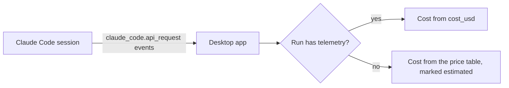
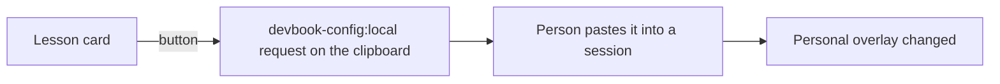

# Sessions

```meta
type: features
```

> Features and sub-features this bounded context supports, described in
> business/ubiquitous language rather than implementation terms.

## Session inventory

```meta
type: feature
related: [.devbook/domain/sessions/domain.md#session-log]
```

Answer "what have my agents been doing here" as one list: every session the
environment has a record of, most recently active first, whichever agent ran it.

One list rather than one per agent, because the question is about the work and not
about the vendor. A person who has both agents installed does not think in two
inventories.

### Live and past sessions together

```meta
type: sub-feature
related: [.devbook/domain/sessions/features.md#open-on-the-live-sessions]
```

A session that is running now and a session that finished last week are rows in the
same list, distinguished by their state rather than by which list they are in. Two
lists would force the reader to know which one to look in before knowing whether the
session had ended — which is usually the thing they are trying to find out.

The list **opens on part of itself**, and that is a smaller concession than splitting
it. One list narrowed by a control is still one list: the rows left out are one press
away under the same heading, the count beside the title names both numbers whenever
any are being left out, and the empty state the narrowing can produce says which
states it kept and how many sessions are on the other side. A reader looking for a
session has one place to look and one control to move.

### Open on the live sessions

```meta
type: sub-feature
related: [.devbook/domain/sessions/domain.md#session-view, .devbook/domain/sessions/features.md#sessions-from-another-machine, .devbook/domain/sessions/domain.md#session-view]
```

The list opens on the sessions that are still going, and a `Live` / `All` choice sits
first in the row of controls above it — before the grouping, because it decides which
rows exist before the grouping decides where they sit. "What is going on right now" is
the question somebody opens this for, and several hundred finished records are the
answer to a different one.

Live means running **or** stalled, both. Stalled is computed from silence rather than
declared by the agent — nothing writes "I have stopped" — so a stalled session is one
nobody can show has ended, and a default that dropped it would hide the row most worth
looking at: the one that may be sitting there waiting on the reader.

The choice is not remembered. Every open starts on `Live`, the way the grouping starts
at `Nothing`, because a reader should not have to remember having already answered
"what is going on right now" — and a view silently restored from last week is how a
reader concludes the product has lost their sessions.

**The default is only as good as the evidence under it, and for one agent that is
thin.** Claude leaves a record per running session, so its live rows are evidence.
Copilot leaves no liveness marker at all: its sessions read as running while their
record is fresh and as finished once it has been quiet for longer than the
`Stale Threshold`, and they never read as stalled. A Copilot session that is genuinely
running but has said nothing for half an hour therefore falls out of this view. That is
a limit of what Copilot writes down rather than a rule this product wanted, and it is
why the way back to `All` is named in the empty state instead of left to be discovered.

A session that arrived from another machine is thin in the same way and for a
different reason — a record carries no liveness marker whichever agent wrote it —
so it too falls out of this view once it has been quiet long enough. See
`.devbook/domain/sessions/features.md#sessions-from-another-machine`.

### Narrow to one machine

```meta
type: sub-feature
related: [.devbook/domain/sessions/domain.md#environment, .devbook/domain/sessions/features.md#group-by-environment]
```

A machine filter sits beside `Live` / `All` and opens on "All machines". Choosing a
machine keeps only the rows that machine gathered, and the count beside the title
names both numbers — "1 of 4 sessions" — so the rows on the other machines are
counted rather than forgotten. It composes with the view: `Live` on one machine is
the running and stalled sessions there and nothing else.

A list rather than a row of buttons, because the options are however many machines
have reported, which is not this list's decision. An option is offered exactly when
there are rows behind it, named and ordered the way Group by environment names its
sections, so the two cannot disagree. Like the view, it is not remembered: every open
starts on "All machines".

### Open on the session a task names

```meta
type: sub-feature
related: [.devbook/domain/sessions/features.md#open-on-the-live-sessions, .devbook/domain/sessions/features.md#narrow-to-one-machine]
```

A task that names a session opens the list on that session. Its row is marked, the
focus moves to it, and its runs show, because a task that names a session is usually
asking about the run it drove. When the view or the machine filter would hide the
row, both widen — to `All` and "All machines" — rather than answer with a list the
session is missing from. They widen once: re-reading the list does not undo what the
reader narrowed since.

The shell's repository scope is left alone, because it is the shell's. A session
outside it is said out loud instead, and so is a session this machine has no record
of, rather than a list with no row marked.

### Only what the agent recorded

```meta
type: sub-feature
related: [.devbook/domain/sessions/domain.md#working-location]
```

Each session shows what its own agent wrote down and no more. The agents disagree
about one field of the two — Copilot names the repository and the branch, Claude
names the branch and never the repository — so a Claude row shows its branch and
an em dash where its repository would be, visibly rather than blankly, while a
Copilot row shows both.

The alternative was inferring the missing repository from the working folder. A
wrong repository attributed to a session renders exactly as convincingly as a right
one, which is what makes inference the more expensive option.

What a row may show in that cell instead, as of 2026-09-22, is the **resolved
repository** — marked as resolved, with the cell's title saying in words that the
agent recorded none and the folder was placed inside a registered clone. This is
not the inference above: it is not read off the path but looked up against the
clone directory the person registered (`.devbook/domain/sessions/domain.md#working-location`).
A recorded repository always outranks it in the cell, and a session with neither
still shows an em dash. The repository scope in the shell's header admits a
session by either — which is what makes a scoped list able to hold the Claude
sessions running in that repository's clone — and its narrowing sentence names
both terms, so a Claude session missing from a scoped list is understood as one
outside every registered clone rather than as one that never ran.

### What a session cost and what it shipped

```meta
type: sub-feature
related: [.devbook/domain/sessions/features.md#the-work-a-run-is-linked-to, .devbook/domain/productivity/features.md#what-the-sessions-cost-and-shipped, .devbook/domain/sessions/features.md#the-detail-of-one-session]
```

As of 2026-09-23 a row also shows three things Claude writes into its transcript and
the session record keeps: **the pull requests the session linked itself to**, drawn
exactly as a run's are — "PR #n", opening on GitHub — **its tokens**, output and input
with every model and the cache figures in the cell's title, and **where it was run
from**, a quiet badge beside the type ("desktop", "cli").

A pull request the row's own run already draws is not drawn again: one piece of work
is one reference on screen. The tokens are the session's own spend, and the title
says the agents it spawned are not in them. Copilot records none of the three, and a
row that could not say shows nothing or an em dash — never a zero, which would be a
claim that the session linked nothing or spent nothing.

### Sessions from another machine

```meta
type: sub-feature
related: [.devbook/domain/sessions/domain.md#session-log, .devbook/domain/sessions/features.md#group-by-environment, .devbook/arc42/08-crosscutting-concepts.md#session-record-sync, .devbook/arc42/adr/0005-azure-hosted-task-replica-for-multi-device-sync.md]
```

A session that ran on one of the person's machines can be read on another. The
record travels and the work stays where it happened, and what arrives joins the
same list rather than a panel of its own — somebody running agents on a desktop
and a laptop has one set of sessions on two boxes, not two inventories to check
in turn.

Off until it is switched on, by the one Sync switch that also turns on pairing and
the tasks' sync, and that starts off. A record of what the assistants have been
doing is the kind of thing a person agrees to let off a machine rather than finds
out has left it. Until 2026-09-14 that argued for a separate flag; the switches
were folded into one because the question a person actually answers is whether this
machine takes part in sync at all, and the sanitization boundary — only the metadata
below travels, never the transcript — is what makes that one answer safe to give
(`.devbook/arc42/08-crosscutting-concepts.md#session-record-sync`). Until it is on,
this is the list it has always been: everything read here and nothing else.

**A row from elsewhere says less than a row read here, and visibly so.** Only the
whitelisted metadata travelled — which agent, which machine, which repository and
branch, when the session was alive, how much of it there was, its title, and the
usage limits it was refused by — so such a row has no working folder to show. That
is not a gap waiting to be closed: a folder names a disk the reading machine cannot
see. The row still carries the delivery runs filed under that folder, matched on
the worktree key its record carried. A record from a device that predates the title
is headed by its session id, an identifier that plainly reads as one.

**A session of this machine's outlives its transcript.** The assistant cleans its
transcripts away after a month by default; this machine keeps its own record of every
session it has read, so the session stays in the list — titled, with its folder,
dated, measured and with its refusals — after the files are gone, with or without
sync. While the transcript is there the row is read from it, and the record is never
shown beside it. A row answered from the record says so under its folder, in the
origin line's quiet register: the transcript is gone, and what it shows is what the
last reading kept. The pane amends the records of the sessions that moved each time it
opens; **Update records**, beside Refresh, amends every record the files still hold —
adding to each, never replacing it — says how many it amended and started, and with
sync on sends every record again so the other machines are amended too.

**And it reads as finished once it goes quiet, sooner than the truth may be.** A
record carries no liveness marker, so a session nobody has heard from for longer
than the `Stale Threshold` reads as over — the same treatment Copilot's sessions
already get here, for the same reason and with the same cost. A session still
running on the other machine can therefore drop out of the live view between one
exchange and the next. Reading it as stalled instead would be the worse answer:
stalled says something is still there and quiet, and a record cannot tell that
from a session that ended a month ago.

### Re-read on request

```meta
type: sub-feature
```

The list is read when it is opened and again when the reader asks for it. Nothing
polls.

A surface that refreshed itself would be claiming to be live, and the evidence does
not support the claim: one of the two agents leaves no liveness marker at all, so a
self-moving list would move without meaning.

Records arriving from another machine do not change that. Those arrive on a schedule of their own — a machine cannot
be asked for its sessions at the moment somebody looks at them — but they arrive
into what this environment has a record of, which is the thing the list reads. The
reading is still the reader's: nothing appears on screen until they open the list
or ask for it again, so what moves under them is never the rows they are looking
at.

## Session grouping

```meta
type: feature
related: [.devbook/domain/sessions/domain.md#session-grouping]
```

Carve the same list up by the two things that separate sessions from each other in
practice, without removing any of them.

### Group by environment

```meta
type: sub-feature
related: [.devbook/domain/sessions/domain.md#environment, .devbook/domain/sessions/features.md#sessions-from-another-machine, .devbook/arc42/adr/0005-azure-hosted-task-replica-for-multi-device-sync.md]
```

A section per environment, named after it, with its own count — so "how many are
running on that box" is read rather than counted.

It carves something now. For as long as an environment could only read its own
records this was one section named after the box the reader was sitting at; a
reader whose machines exchange session records gets a section per machine that
has reported. Which section a row lands in is settled by the environment that
gathered it and never by the one showing it, so a session sits under the machine
that ran it wherever it is being read.

A section for a machine the reader is not sitting at is as fresh as that
machine's last exchange and no fresher, and that costs something real rather than
nothing: a session started since is not in the section at all, and the count on
it therefore answers for what has arrived rather than for what is happening over
there. What the section does not do is lie about the sessions it has. Their state
is derived against the reader's own clock from the timestamps that travelled, so
a row ages honestly on this side instead of repeating the other machine's opinion
of it — which is why the staleness needs naming here and not a caveat on every
row.

### Group by agent

```meta
type: sub-feature
```

A section per agent, so Claude's sessions and Copilot's can be read separately
without the two being separate lists.

### Grouping never hides a session

```meta
type: sub-feature
related: [.devbook/domain/sessions/features.md#open-on-the-live-sessions]
```

The total is the same whichever grouping is chosen, and the surface keeps that total
on screen beside the title, above the controls that act on the list — so a grouping
can be trusted not to be a filter in disguise.

That count is what carries the guarantee, and it answers to the view and never to the
grouping: it does not move while `Group by` moves the same rows around. When the view
is leaving some of them out the count names both numbers — kept and total — so the
total is still there to be checked against, with the reader's own subtraction stated
beside it rather than folded into it. One number where two are owed would let the only
control that removes rows borrow the innocence of the ones that do not.

## Honest partial answers

```meta
type: feature
related: [.devbook/domain/sessions/domain.md#session-catalog]
```

Say what could not be read and what was left out, rather than presenting whatever
arrived as the whole picture.

### Name the source that could not be read

```meta
type: sub-feature
```

When one agent's records are there but cannot be read, because this user may not
read them or reading them fails, the other agent's sessions are still shown and the
unreadable one is named.

An agent that was never installed is not unreadable. A machine with only one agent
installed is the ordinary case, so the absent agent is an empty source and is not
named. Naming it would put a permanent warning on every machine that has never run
that agent.

"No Copilot sessions" and "Copilot could not be read" are different facts, and only
one of them is worth investigating.

### Say how much was left out

```meta
type: sub-feature
related: [.devbook/domain/sessions/domain.md#session-limit]
```

An environment can hold hundreds of session records — enough that reading all of
them costs real time and showing all of them buries the handful that are running. A
reading for a list therefore describes the most recent sessions per agent, up to the
[Session Limit](domain.md#session-limit), and when it does, it states how many exist.

A reading for a count takes the other shape: everything since a horizon, with no
limit. A count over the most recent hundred per agent is the limit wearing a
total's clothes — every busy machine reads "200" — so a consumer that counts asks
since a horizon and gets every session inside it, and every source keeps records at
least as far back as the longest horizon a consumer can ask for
(`.devbook/domain/sessions/domain.md#session-history`). A source that cannot reach the
horizon it was asked still says so.

## Delivery runs beside their sessions

```meta
type: feature
depends-on: [.devbook/domain/sessions/features.md#session-inventory]
related: [.devbook/domain/sessions/domain.md#delivery-run, .devbook/domain/sessions/domain.md#run-attachment]
```

Show the orchestrated delivery runs an environment's dashboards recorded — which skill
ran, what it was called, how it ended, how much it cost — in the same list as the
sessions, because a run is a piece of work a session was doing and a reader asking
"what has been going on here" wants both answers in one place.

**One list, whichever side arrived first.** A session record and a run file describe
the same piece of work from two sides, and either can be the one this environment
still holds: the run's session may have aged out of the reading, or the run may belong
to a session read on another machine. So the row is the unit of the list, not the
session — a row is a session with the runs it drove, or a run standing on its own —
and the reader never has to know which table to look in.

The dashboards keep a run's file outside the repository, keyed by the worktree it ran
in, and the file says nothing about which session drove it. What this context adds is
the matching: the same worktree key derived from a session's folder, and the window
the two were open together.

A run does not have to come from a dashboard. A session can report to this product
directly, and then the run is recorded here as it happens rather than found afterwards
— in the same shape, in the same list, on the same terms. See
[Record a run as it happens](#record-a-run-as-it-happens).

### Under the session that drove it

```meta
type: sub-feature
related: [.devbook/domain/sessions/domain.md#run-attachment, .devbook/domain/sessions/features.md#how-each-stage-of-a-run-ran]
```

A run filed under the worktree a listed session ran in, and open while that session
was active, is shown under that session's own row and across every column of the
list, stacked the way a reader asks: the work it is linked to, the dashboard's status
under it, one line of figures — stages done, output tokens, the context peak, the tool
calls — and the skill that owned it last. The stages, the token buckets, the gauge,
the tool activity by category and by MCP server, and the run's own title are behind a
fold.

Each stage the owner session worked in names that session in the fold. It names the
model too when the run called exactly one, since then every call in every stage was on
it; the run file records the models for the run as a whole, never per stage, so with
more than one the session is named without a model rather than with a guess. A stage
still pending or skipped names no one, because nobody worked in it.

Where the host can render one, the open fold shows the run's Archify artifact full
width above the figures, in place of the stage flow. The artifact is produced only
once the fold opens, and not again when a refresh brings the same stages. Where it
cannot be produced, for example because Node.js is missing, the fold keeps the stage
flow and says why.

Under the row rather than in a column, because a run is not a property of a session;
across every column rather than inside the name cell, because a quarter of the width
turned each of its parts into three lines while the rest of the row sat empty.

Behind a fold, because a run holds ten stages
and tens of thousands of tool calls, and a row that showed them would be a report with
a table around it.

[How each stage of a run ran](#how-each-stage-of-a-run-ran) extends this fold with each
stage's mode and what ran beside what was configured.

### One line for a run two surfaces reported

```meta
type: sub-feature
related: [.devbook/domain/sessions/domain.md#delivery-run]
```

A flow reports its run to every surface it is bound to, and each surface files it as
a run of its own. The list shows such a run as one line under its session, because it
is one piece of work (see [Delivery Run](domain.md#delivery-run)).

Two files are the same run when they name the same skill, come from different
dashboards and started within five minutes of each other. They must also either sit
under the same worktree with session ids that agree, or share a session id that both files name.
Two files from one surface stay two runs, whatever else they share.

The line shows the record of the preferred surface: `delivery-surface-dashboard`, then
`orch-dashboard`, then `backlog`. Its fold names the surfaces that reported the run, so
a reader who sees one line where a dashboard shows two knows why.

### The work a run is linked to

```meta
type: sub-feature
related: [.devbook/domain/sessions/domain.md#delivery-run-reference]
```

A run names what it was for and what it produced, and both are shown on its line: the
tracker issue it was working and the pull requests it opened, each as a reference of
the kind this product draws for work that lives elsewhere, one per line, opening where
it lives.

The Backlog entry it was started from is not a reference beside them — **the run's own
status is how a reader reaches it**, because the entry is where this product tracks
the work and the status is the run's answer about that work. Pressing it hands the
entry back to whatever holds the task list, which shows and selects it; a run whose
prompt names no entry and whose session no entry linked leaves the status a plain word.

The run's own title is not shown on the line at all. A dashboard names a run after the
work it was doing, so beside a reference to that work the title is the same sentence
twice; it stays in the fold for a reader who wants the run's own words.

Three sources, because a run file records them in three places — its own tracker
field, the links its stages kept, the entry in the prompt it was started with — and
one item named twice is one reference. The prompt names its entry either by plan item,
through the marker the import plan writes, or by the entry's stored id, through the
line the app puts on every entry it copies; the second is called by the title written
under that line, because an id is not what a reader knows their task by, and an
imported entry copied out of the app carries both markers for one entry, so they stay
one reference. **A run naming no entry of its own shows the entry its session was
linked to** — the link a task records through the Backlog MCP server — and it is the
application holding the task list that answers which entry that is, since the link
lives on the task, not in the run. The run's own entry always takes precedence: the
prompt is what the run was actually started from, so the link is a fallback, never a
second opinion. No state travels with any of them: this environment has not asked the
tracker how the item is doing, and saying otherwise would be inventing a reading.

### A row of its own in the same list

```meta
type: sub-feature
related: [.devbook/domain/sessions/features.md#say-how-much-was-left-out]
```

A run no listed session ran in is a row of the same list — named after its worktree,
dated by the run, on the machine its file was read on, with a line saying that no
session record backs it and which dashboard does — rather than dropped, or dressed as
a session, or put in a table of its own.

It answers every control the sessions answer: grouped by machine and by agent beside
them, narrowed by the machine filter, and out of the live view — with no liveness
evidence a row is Finished, and a session still running would be in the reading and
the run would be on its row.

### A schedule's runs as one row

```meta
type: sub-feature
related: [.devbook/domain/sessions/domain.md#session-row, .devbook/domain/sessions/features.md#a-row-of-its-own-in-the-same-list]
```

The runs a schedule fired, with no session in the list behind them, are one row per
schedule and repository, titled by the schedule, with every run a line under it,
newest first. Every scheduled run cuts a worktree of its own, so a row per run would
add a line a week for a weekly sweep, each named after a folder nobody opens again;
one row reads as the schedule's history instead. Each line carries a *scheduled* chip
naming the schedule, and its fold names the schedule and repository and, for a devbook
sync sweep, counts the units it checked by verdict. A scheduled run whose session the
list does hold sits on that session's row like any other run, still chipped.

### Only the rows with a run

```meta
type: sub-feature
related: [.devbook/domain/sessions/features.md#open-on-the-live-sessions]
```

One toggle narrows the list to the rows that carry a delivery run — a session that
drove one, or a run standing on its own — for the reader who came for the work rather
than for the sessions. A filter like the live view: the count says what it hid, it
composes with the view and the machine filter, and it is off again on every open.

### Only what the dashboard recorded

```meta
type: sub-feature
related: [.devbook/domain/sessions/features.md#name-the-source-that-could-not-be-read]
```

A status word is shown as the dashboard wrote it, made readable but never mapped onto
a smaller vocabulary; a figure the file does not carry is left out rather than shown
as zero; a stage the writer lost the name of is numbered rather than named after the
writer's missing value. A run file cut off mid-write costs that run and nothing else,
and a dashboard folder that cannot be read is named beside the agents that cannot be,
in the same sentence.

## Record a run as it happens

```meta
type: feature
depends-on: [.devbook/domain/sessions/features.md#delivery-runs-beside-their-sessions]
related: [.devbook/domain/sessions/domain.md#delivery-run-recording, .devbook/arc42/adr/0012-backlog-is-an-mcp-server-inside-the-desktop-app.md]
```

Let a session report its delivery run to this product while it runs, so the pane shows
the work in progress instead of a folder somebody else's tool wrote and this product
found later. A reader watching a run land here sees the same row, with the same
figures and the same stages, as one imported from a dashboard — because it is the same
shape, written by this product rather than read from another.

This closes the gap the area was built around. Until now every run in the list was
somebody else's record: the list could say what had happened, never what was
happening, and a session with no dashboard installed left no run at all. The
difference a reader notices is that a row appears when the work starts rather than
when the reader next refreshes something that had already finished.

**Asking to see the runs brings the pane forward, and answers with the application.**
A session that reports here can ask for the surface, and what it gets back is what the
window did — showing the pane, or not showing it because the area is switched off, or
nothing to show because no window is open. Never an address: this product is the
application the session is already talking to, and handing back a link would open a
second window onto the thing it is holding.

### Picking a run back up

```meta
type: sub-feature
related: [.devbook/domain/sessions/domain.md#delivery-run-recording]
```

A session that resumes work already under way continues the run it left rather than
starting a second one beside it, and is told that is what happened so it can carry on
from the first stage that is not done. Two rows for one piece of work would be the
same work counted twice, with its stages split between them — and a reader has no way
to tell that from two genuine runs.

### What started a run and what it found

```meta
type: sub-feature
related: [.devbook/domain/sessions/domain.md#delivery-run-recording, .devbook/domain/devbook/features.md#sync-verdicts-beside-a-chapter]
```

A run says what started it — a person, or a schedule, named, in a repository it names
— and a devbook sync sweep closes its run with the verdict it reached on every sync
unit and chapter it checked. Both are kept on the run as sent. The verdicts are also
filed against the chapters they are about, the latest per chapter, so a reader opening
a chapter in the Devbook pane sees what the last sweep said about it without finding
the run. A run that names no repository keeps its verdicts on itself alone: a verdict
that cannot say which repository it is about matches no chapter.

### What a run cost, reported by the session itself

```meta
type: sub-feature
related: [.devbook/domain/sessions/domain.md#delivery-run-telemetry, .devbook/domain/sessions/features.md#only-what-the-dashboard-recorded, .devbook/domain/sessions/features.md#the-cost-of-a-run-and-its-stages]
```

A run recorded here shows what it cost the way a dashboard's run does: the tool calls
it made by kind and by MCP server, the agents it delegated to, the tokens it spent —
in total, delegated, and per stage — and how full its context window got. The session
reports these itself, from the moments its own tools run, rather than the run
claiming them: a tool call arriving here is a call, not the session that made it, so
the figures come from the session's side or not at all.

A session reports only to a run it is driving. One that has no run under way reports
nothing, and a run started later in it does not count the conversation that came
before it; a run another session is driving is left alone. A session that does not
report — the plugin not installed, or a host other than Claude Code — leaves its run
without these figures, and they are left out rather than shown as zero: the rule this
area already applies to a dashboard's own gaps.

[The cost of a run and its stages](#the-cost-of-a-run-and-its-stages) extends these
figures with what the run and each stage cost in money.

## The session list and its detail

```meta
type: feature
status: proposed
depends-on: [.devbook/domain/sessions/features.md#session-inventory]
related: [.devbook/domain/sessions/domain.md#session-row, .devbook/domain/sessions/features.md#session-grouping, .devbook/domain/sessions/features.md#delivery-runs-beside-their-sessions, .devbook/design/effort-and-mode-chips.md#effort-chips]
```

The session list gains a filter bar above it, rows that say how each session ran, and a
detail panel beside it for the one row the reader picked. The list still answers "what
have my agents been doing here" at a glance. The detail panel answers "what exactly
happened in this one" without the row growing into a report.

This extends [Session inventory](#session-inventory) and
[Delivery runs beside their sessions](#delivery-runs-beside-their-sessions) rather than
replacing them. Every rule those chapters set still holds: one list, nothing hidden by a
grouping, and nothing shown that the agent or the dashboard did not record.

### A filter bar over the list

```meta
type: sub-feature
status: proposed
related: [.devbook/domain/sessions/features.md#open-on-the-live-sessions, .devbook/domain/sessions/features.md#narrow-to-one-machine, .devbook/domain/sessions/features.md#only-the-rows-with-a-run]
```

The controls that narrow the list sit together in one filter bar above it. These are the
live view, the machine filter and the toggle for rows with a run. One bar, because a
reader who wonders why a session is missing should find every reason in one place.

The count beside the title keeps its promise from
[Grouping never hides a session](#grouping-never-hides-a-session). It names both numbers
whenever the bar leaves rows out.

### Grouped rows that show how each session ran

```meta
type: sub-feature
status: proposed
related: [.devbook/domain/sessions/features.md#session-grouping, .devbook/domain/sessions/features.md#how-each-stage-of-a-run-ran, .devbook/design/effort-and-mode-chips.md#effort-chips]
```

The list stays grouped the way the reader chose. Each row now also shows the model the
session ran on, the effort it ran at, and the stage strip of the run it drove. The stage
strip is one mark per stage, so a reader sees how far the run got without opening it.

Model and effort sit on the row because they are the two choices that most change what a
session costs and how well it does. A reader comparing two sessions should not have to
open both to learn that one ran on a smaller model. A session whose agent recorded no
effort shows none, rather than a default that would claim a choice nobody made.

### The detail of one session

```meta
type: sub-feature
status: proposed
related: [.devbook/domain/sessions/features.md#what-a-session-cost-and-what-it-shipped, .devbook/domain/sessions/features.md#the-work-a-run-is-linked-to, .devbook/domain/sessions/features.md#the-detail-panel-of-a-pull-request]
```

Picking a row opens a detail panel beside the list. It holds three things, in this order:

- the session's facts, with its model and effort among them;
- the run card for the delivery run the session drove;
- a card for each pull request and each task the session or its run is linked to.

A panel beside the list, because the reader is usually moving down the rows. A panel
keeps their place, where a page of its own would lose it. The pull request card and the
task card are the same cards the pull requests pane and the task list draw, so one piece
of work looks the same wherever it appears.

## How each stage of a run ran

```meta
type: feature
status: proposed
depends-on: [.devbook/domain/sessions/features.md#delivery-runs-beside-their-sessions]
related: [.devbook/domain/sessions/features.md#under-the-session-that-drove-it, .devbook/domain/sessions/domain.md#delivery-run, .devbook/design/effort-and-mode-chips.md#mode-chips, .devbook/design/effort-and-mode-chips.md#effort-chips]
```

Each stage of a delivery run says how it ran, beside how the repository said it should
run. A flow's configuration names an agent, a model and an effort per phase. What a
reader needs to know is whether the run actually followed it, because a cheap or a poor
run is usually explained by a stage that ran differently from its configuration.

This deepens the fold described in
[Under the session that drove it](#under-the-session-that-drove-it). That chapter names
who worked in each stage; this one says how.

### The mode a stage ran in

```meta
type: sub-feature
status: proposed
related: [.devbook/design/effort-and-mode-chips.md#mode-chips]
```

| Mode | What it means |
| --- | --- |
| inline | The session driving the run did the stage itself. |
| delegate | The session handed the stage to a sub-agent and waited for its answer. |
| fork | The session started the stage in a separate session that runs on its own. |
| gate | The stage waited for a person to decide. |

Every stage shows its mode. A reader needs it to read the stage's figures: an inline stage
shares the driving session's context and cost, while a delegated stage spends its own.

### What ran beside what was configured

```meta
type: sub-feature
status: proposed
related: [.devbook/domain/sessions/features.md#only-what-the-dashboard-recorded, .devbook/design/effort-and-mode-chips.md#stage-marks]
```

Each stage shows the agent, model and effort that ran, next to the ones its configuration
named. A ≠ mark says the stage ran differently from its configuration. A ? mark says a
value on the stage was inferred rather than read from the run's own record. When both
apply, ≠ is the one shown, and the open stage states the difference and the inference in
words.

The ≠ mark exists because a difference is the finding a reader is looking for. Without
it, they would have to compare two columns by eye on every stage. The ? mark exists
because an inferred value reads as convincingly as a recorded one. An example is the model
of a stage in a run that called exactly one model. Marking it keeps the rule this area
already holds: say what was recorded, and say so when something was not.

### The stage panel

```meta
type: sub-feature
status: proposed
```

A stage expands into a panel that names the skill it ran and the MCP servers it used. The
panel also lists the skills that ran before and after it within the stage, and the
sub-agent runs it started. The panel is closed by default, for the reason the run's fold
is: a stage can hold hundreds of tool calls, and a list that showed them all would bury
the stage strip.

## The cost of a run and its stages

```meta
type: feature
status: proposed
depends-on: [.devbook/domain/sessions/features.md#how-each-stage-of-a-run-ran]
related: [.devbook/domain/sessions/features.md#what-a-run-cost-reported-by-the-session-itself, .devbook/domain/sessions/domain.md#delivery-run-telemetry, .devbook/domain/productivity/features.md#what-the-sessions-cost-and-shipped]
```

A run and each of its stages show what they cost in money, and whether that was usual. A
token count tells a reader how much was said. It does not tell them whether a stage was
expensive, and that is the question a person tuning a flow is asking.

This extends
[What a run cost, reported by the session itself](#what-a-run-cost-reported-by-the-session-itself),
which counts tool calls and tokens. That chapter's rule still holds: a figure nobody
reported is left out, never shown as zero.

### Cost as Claude Code reports it

```meta
type: sub-feature
status: proposed
related: [.devbook/domain/sessions/domain.md#delivery-run-telemetry, .devbook/domain/sessions/domain.md#claude-api-request-log, .devbook/arc42/adr/0024-claude-code-telemetry-arrives-on-the-mcp-listener.md]
```



The cost of a run comes from the `claude_code.api_request` events Claude Code sends
through OpenTelemetry, which the desktop app receives. Each event carries `cost_usd`. That
figure is Claude Code's own estimate of what the request cost, and the product shows it as
Claude Code's rather than as an invoice.

Claude Code's own figure is preferred because Claude Code knows the price it applied to
each request. A price the product worked out afterwards would only be a second guess at
the same number.

The receiving end is built. The desktop app takes Claude Code's OpenTelemetry logs at
`/v1/logs` on the port its MCP server listens on, and keeps each
`claude_code.api_request` event once, in its local database, as the
[Claude API Request Log](domain.md#claude-api-request-log). Settings has a **Claude
Code** page with the endpoint and the `settings.json` block to paste into Claude Code.
The run and stage views that would show the cost are not built yet.

### A price table for runs without telemetry

```meta
type: sub-feature
status: proposed
```

A price table in Settings gives a price per model. It covers the runs that sent no
telemetry, such as runs from before the desktop app received it or from a session that
does not send it. The product works out those runs' cost from their tokens, and marks
that cost as estimated.

The mark matters because the two figures are not equally sure. A price the person typed
in may be out of date. A reader comparing two runs must be able to tell a reported cost
from one this product worked out.

### Each stage against its usual cost

```meta
type: sub-feature
status: proposed
related: [.devbook/domain/sessions/features.md#delivery-economics]
```

Each stage shows its cost and its ratio to that stage's median cost over the last 30 runs
of the same flow. A one-line insight under the run names the stage that stood out most,
for example "Review cost 2.4 times its usual".

The comparison is per flow and per stage because a review stage and an implement stage
cost very different amounts. A run-wide average would flag every long run and explain
none of them. The median is used rather than the mean, because one runaway run would
otherwise move the baseline for the next thirty. Where the flow has fewer than 30 earlier
runs, the ratio says how many it was taken over. The insight opens
[Delivery economics](#delivery-economics), filtered to the run's flow.

### Share of the week and the weekly limit

```meta
type: sub-feature
status: proposed
related: [.devbook/domain/sessions/domain.md#session-log]
```

Each run shows its share of the week's usage. Once a weekly-limit hit has been recorded,
each run also shows an estimated percentage of the weekly limit. The weekly limit for
Fable is kept separate, because Claude counts Fable against a limit of its own.

The percentage is always labelled an estimate. Nothing the product reads states the size
of the weekly limit. The product can only learn it from the moment a session was refused for
reaching it, and the usage recorded up to then. A percentage without that hit would be a
guess dressed as a measurement, so none is shown until one is recorded.

## Delivery economics

```meta
type: feature
status: proposed
depends-on: [.devbook/domain/sessions/features.md#the-cost-of-a-run-and-its-stages]
related: [.devbook/domain/sessions/features.md#how-each-stage-of-a-run-ran, .devbook/design/effort-and-mode-chips.md#effort-chips, .devbook/design/effort-and-mode-chips.md#mode-chips]
```

A page under Sessions compares how the flows' configurations perform, so a person can
decide which agent, model, effort and mode to give each phase. One run tells a reader
what happened once. Deciding a configuration needs many runs side by side, which is what
this page holds.

### Where the page is reached from

```meta
type: sub-feature
status: proposed
related: [.devbook/domain/sessions/features.md#each-stage-against-its-usual-cost]
```

The page has a button in the Sessions header. A run's one-line insight also opens it,
filtered to that run's flow. The second way in exists because the insight raises the
question, "is this stage always this expensive?", and the page is where it is answered.

### Configurations compared per phase

```meta
type: sub-feature
status: proposed
```

For each phase of a flow, the page compares the configurations that ran it on three
measures:

| Measure | What it says |
| --- | --- |
| Phase cost | What the phase cost under this configuration. |
| Quality | How well the work came out, from what the delivery phases report. |
| Whole-run cost | What the runs cost end to end. |

Whole-run cost sits beside phase cost because a cheaper phase can make the run dearer. A
smaller model in implement can save money there and then cost more in extra review
rounds. Comparing the phase alone would recommend exactly that mistake.

### What the delivery phases report

```meta
type: sub-feature
status: proposed
```

The quality measure is built from three facts the delivery phases start reporting with
their run: how many review rounds a change took, how many blockers review found, and how
many defects escaped review and were found later. The delivery engine reports them,
because only the phase that reviews or verifies the work knows them. This product records
what is reported and works out none of the three itself.

A run from before the phases reported these facts has no quality measure. It still counts
toward cost, and the page says how many runs the quality measure stands on.

### Lesson cards

```meta
type: sub-feature
status: proposed
```



The page draws its findings as lesson cards. Each card states one lesson and the number of
runs it is drawn from, for example "Sonnet at high effort reviews as well as Opus here,
over 14 runs". The card's button copies a request for the `devbook-config:local` skill,
which changes the person's own overlay of the repository's configuration.

The sample size is on every card because a lesson from three runs reads as confidently as
one from forty. Only the number tells them apart. The app never writes the overlay
itself, for two reasons. The overlay belongs to the person and to the skill that keeps it.
A change to how a flow runs should also be a step the person takes on purpose, in a
session where they can see it happen.

## Pull request readiness

```meta
type: feature
status: proposed
related: [.devbook/domain/sessions/features.md#the-detail-of-one-session, .devbook/domain/sessions/features.md#the-work-a-run-is-linked-to, .devbook/arc42/adr/0020-external-items-arrive-as-linked-tasks.md]
```

The pull requests pane is the Sessions context's second surface. Sessions and delivery
runs produce pull requests, so the pane is where a reader follows that work to the point
where it merges. This chapter is the first to describe the pane.

The pane as it stands has two views, Open and Recently merged. A Mine / Everyone's choice
narrows the rows, where Mine is the reader's own pull requests and those related to one of
their tasks. Refresh re-reads the list. A stack of pull requests that build on each other
shows as one tree, and each pull request is matched to the task it serves. The acts are
Update branch, Ready for review, and Merge or Merge when checks pass.

What this feature adds is one answer per pull request: is it ready, and if not, what is it
waiting on. A reader scanning twenty pull requests should not have to open each to learn
which one needs them.

### Lanes that filter the list

```meta
type: sub-feature
status: proposed
related: [.devbook/domain/sessions/features.md#one-verdict-per-pull-request]
```

Four lane tiles sit beside the Mine / Everyone's choice: Needs you, Ready to merge,
Waiting and Drafts. Each tile shows how many pull requests are in its lane, and pressing
it narrows the list to them.

The Mine / Everyone's choice stays, because it answers a different question. Mine says
whose pull requests to look at; a lane says which of them to look at first. The two
combine: Mine and Needs you is the reader's own work that is waiting on them.

### One verdict per pull request

```meta
type: sub-feature
status: proposed
```

Each pull request that is still open gets exactly one readiness verdict. Where several
apply, the first in this table wins:

| Precedence | Verdict | Lane | Tone | Act | Second act |
| --- | --- | --- | --- | --- | --- |
| 1 | Conflicts | Needs you | fault | Open on GitHub | — |
| 2 | Failing checks | Needs you | fault | Re-run failed, when a failed check is a GitHub Actions run; else Open on GitHub | Open on GitHub, after Re-run failed |
| 3 | Changes requested | Needs you | fault | Open review on GitHub | — |
| 4 | Behind | Needs you | alert | Update branch | Merge when ready |
| 5 | Draft | Drafts | quiet | Ready for review | — |
| 6 | Checks running | Waiting | live | Merge when ready | — |
| 7 | Review required | Waiting | live | Merge when ready | — |
| 8 | Ready | Ready to merge | settled | Merge | — |

One verdict rather than a row of badges, because a reader acts on one thing at a time. The
order puts first what blocks the most: a conflict has to be resolved before checks or
review mean anything, and a failing check before a review is worth asking for. Behind is
in Needs you because it waits on nobody else: the reader brings the branch up to date
with the act the banner offers, and it can merge. The tones are the badge tone scale of
`.devbook/design/color-scheme.md`, so the verdict chip reads like every other badge.

Each verdict carries a label for its chip, a headline and a one-sentence reason for the
banner, and the acts above. A few rules sit beside the table:

- A failed check decides even while others still run, and a reviewer who asked for
  changes counts even where the repository asks for no review.
- Ready offers Merge when ready instead of Merge when GitHub still reports the pull
  request not mergeable, because a merge now would be refused.
- A stacked pull request's reason names the pull request it waits on. It is offered no
  merge act, because merged now it would land on its parent's branch rather than where
  the stack is going; its other acts stay.
- A merged pull request reads as Merged, in the settled tone, with no act. A pull request
  closed without merging has no verdict, since there is nothing left to get ready.

### The detail panel of a pull request

```meta
type: sub-feature
status: proposed
related: [.devbook/domain/sessions/features.md#the-detail-of-one-session]
```

Picking a pull request opens a detail panel. From the top, it holds:

- a banner with the verdict and the one act that fits it, such as Update branch for
  Behind;
- a merge-readiness list of four lines: checks, review, up to date, and mergeable;
- the checks, failures first;
- the stack the pull request is part of, bottom first;
- the task card and the session card for the work behind it.

The banner offers one act because the verdict already names the one thing in the way. The
mergeable line says only whether the pull request has conflicts. It does not count the
conflicted files, because GitHub reports no such count, and a number this product made
up would be wrong in a way nobody could check. The failures come first so the reader sees
the reason before the long list of passing checks.

The list already reads what the panel needs. Each check on the head commit, a check run or
a commit status, comes with its name, whether it passed, failed or is still running, and,
for a check run that finished, how long it took; the first fifty are listed and the counts
cover the rest. Each open pull request from the same repository also carries how many
commits its base has that its branch does not. GitHub cannot compare a fork's branch from
the base repository, so a pull request from a fork has no such count.

### Re-run failed

```meta
type: sub-feature
```

Re-run failed is the one new act. It is offered when a failed check is a GitHub Actions
run, and it starts the failed jobs of that run again, and the jobs that depend on them. It
covers the most common way a check goes red without anyone's code being wrong: a runner
that flaked.

Where several checks failed, each workflow run behind them is asked once, however many of
its jobs failed. Every run is asked even when GitHub refuses one, because the runs are
independent; the refusal then says how many of the others did start again. Afterwards the
pane reads that one repository again, as it does after every other act, so the row shows
the checks running instead of failed.

It is offered only for GitHub Actions because that is the only kind of check this product
can ask GitHub to run again. A check from another service has to be re-run there. Until
the detail panel lands, the act sits beside the row's other acts.

There is no act that hands a pull request off to an agent. Starting a session is something
a person does in their agent, with the context they choose. A button here would start work
on the reader's behalf that the pane could neither show nor stop.

## Session activity enrichment

```meta
type: feature
status: proposed
depends-on: [.devbook/domain/sessions/features.md#session-inventory]
related: [.devbook/domain/sessions/domain.md#session-activity-publishing, .devbook/domain/sessions/domain.md#session-activity-enrichment]
```

Layer externally reported session activity onto the same session list, so a reader can
see what a session has been doing without replacing the locally read record that says
the session existed.

The extra layer is optional by design. A session with no Collections MCP reporting is
still read, grouped, and counted exactly as it is today; a session with reporting adds
timeline and correlation detail to that same row.

### Optional Collections MCP reporting

```meta
type: sub-feature
status: proposed
related: [.devbook/domain/sessions/domain.md#session-activity-publishing, .devbook/domain/sessions/domain.md#collections-mcp]
```

When a session has the Collections MCP configured, it reports start, meaningful
activity, and finish updates to that MCP. When it does not, nothing about the session
surface breaks or changes shape.

Capability detection is ordinary product behavior rather than setup drama: missing
configuration is simply `disabled`, not an error that needs a banner.

### Latest meaningful activity

```meta
type: sub-feature
status: proposed
related: [.devbook/domain/sessions/domain.md#session-enrichment-summary, .devbook/domain/sessions/domain.md#session-activity-entry]
```

Show the latest human-readable activity summary, when it arrived, and any safe
correlation facts that help a person place the session — for example the orchestration
run or issue it was working against.

Meaningful rather than exhaustive. The point is to answer "what is this session doing"
without turning the session list into a transcript or a tool log.

### Reporting degrades honestly

```meta
type: sub-feature
status: proposed
related: [.devbook/domain/sessions/domain.md#reporting-capability]
```

When reporting is configured but the Collections MCP cannot be reached, the session
still appears and the reporting path reads as degraded.

That answer is more honest than either hiding the reporting layer or pretending no
external activity exists. A broken path is a fact worth surfacing, and it is separate
from the session's own `Session State`.

## Turn the area off

```meta
type: feature
feature-flag: .devbook/domain/sessions/context.md#sessions-area
tests: [unit:dotnet:Backlog.Desktop.UI.UnitTests.HomeWorkspaceSurfaceTests.With_the_sessions_feature_off_there_is_no_segment_and_no_list, unit:dotnet:Backlog.Desktop.UI.UnitTests.HomeWorkspaceSurfaceTests.A_remembered_sessions_surface_falls_back_to_the_workspace_when_its_feature_is_off, unit:dotnet:Backlog.Desktop.UI.UnitTests.HomeWorkspaceSurfaceTests.Opening_a_session_from_a_task_with_sessions_switched_off_says_so_and_stays, unit:dotnet:Backlog.HostComposition.UnitTests.McpEndpointGateTests.The_delivery_surface_is_absent_while_its_feature_is_off, unit:dotnet:Backlog.Infrastructure.FileSystem.UnitTests.AgentActivityHoursWorkedSourceTests.With_the_sessions_area_switched_off_the_hours_are_not_read, unit:dotnet:Backlog.Infrastructure.FileSystem.UnitTests.RoadmapActualHoursTests.With_the_sessions_area_switched_off_the_hours_are_not_read]
```

The whole area can be switched off, and when it is there is no way in and nothing to
find — not a disabled control and not an empty surface. Nothing else reads the
sessions either: the `list_sessions` tool and the eight delivery-surface operations
leave the MCP endpoint, and the dashboard's hours worked and the roadmap's actual
hours stop reading agent activity.

One switch for the area rather than one per column or per grouping, because "should
this product show me sessions at all" is a single question.
