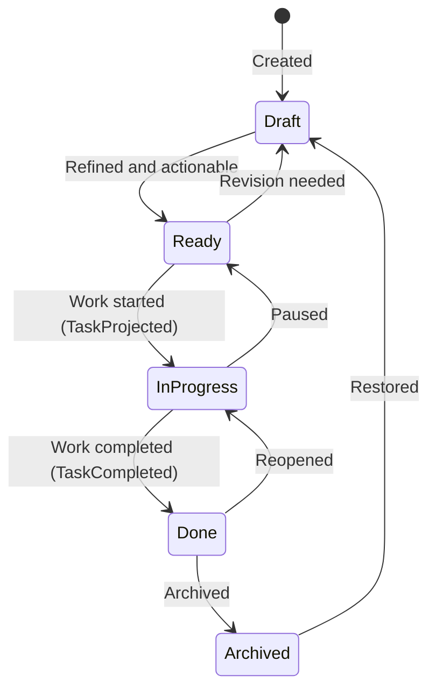
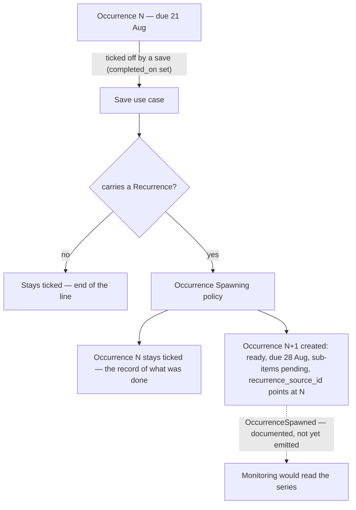
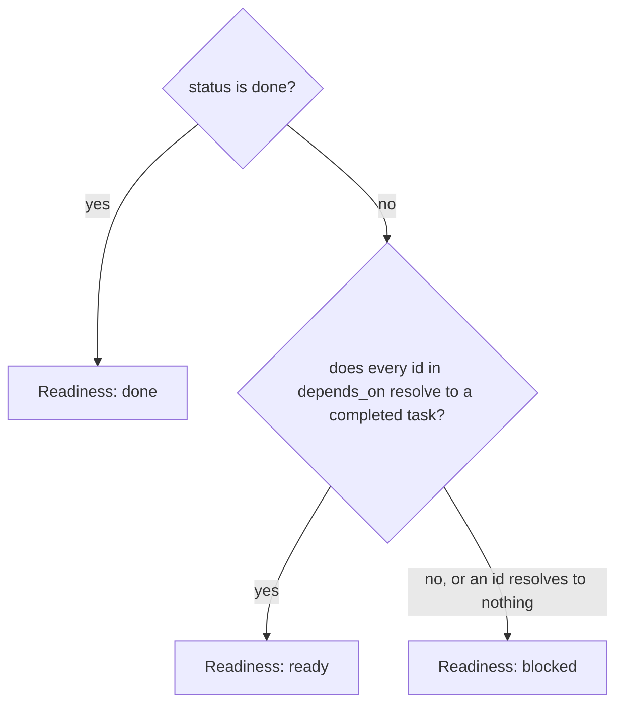

# Tasks

```meta
type: flow
status: draft
```

> Lifecycle and process flows for this bounded context. Flows describe how the
> aggregate moves through its states over time — complementary to `model.md`
> (structure) and `domain.md` (responsibilities/invariants).

## Task lifecycle



- The `Ready → InProgress` transition emits `TaskProjected` (one artifact per
  `repo_id`); `Done` emits `TaskCompleted` to close all projections.
- `Done` and `Archived` say the work is over. They do not say the person is
  finished with the task: that is the tick — `completed_on`, the checkbox in
  the list — which is a separate fact and not a state in this diagram. A task
  can reach `done` and stay on the open list, unticked, until the person has
  looked at it. It can be ticked from any state. The list's checkbox also moves
  a task that is not yet in an end state to `done` in the same save — a
  finished task that still read "in progress" was the list contradicting
  itself — while `done` and `archived` keep their state; the tick itself is
  still not a transition, and a typed `completed:` token moves nothing.
  Unticking clears the date and moves nothing here. Everything
  that groups on "finished" — the Completed section, tag counts, dependency
  readiness, the next occurrence of a repeat — reads the tick, never these two
  states. See `.devbook/domain/tasks/domain.md#task`.
- Scheduling attributes do not appear in this diagram, and that is deliberate.
  A due date, a reminder, a repeat and a My Day stamp are facts about when work
  is wanted, not lifecycle states — an overdue task is still `ready`, and
  nothing has to move a task between states as a clock advances.

## Recurring task occurrences



- Completion is the tick — the save that sets `completed_on` from unset — and
  not the status reaching `done`. A repeating task whose work is over but which
  the person has not ticked spawns nothing yet; the next occurrence is owed
  when they tick it, whatever its status is by then.
- Completion does not roll one task forward; it leaves the finished occurrence
  in place and creates the next as a separate aggregate with its own lifecycle.
  The link between them is `recurrence_source_id` — provenance, not ownership.
- The spawn is a synchronous step inside the save that completed the task, drawn
  with a solid arrow. The dashed arrow is the event that would tell Monitoring
  about it, which this context documents but does not yet emit — so a consumer
  reads a series today by following `recurrence_source_id` rather than by
  subscribing.
- The next due date is calculated from the completed occurrence's `due_on`, not
  from the date it was actually finished, so lateness does not drift a schedule.
- What resets on the new occurrence: sub-items return to `pending`, and
  projections, usage history, `remind_at`, `in_my_day_on` and `completed_on` do
  not carry over.
  What carries: title, body, type, priority, area, tags, `repo_ids`, and the
  `Recurrence` itself.

## Readiness derivation



- Readiness is derived on every read and never persisted, so completing one task
  unblocks its dependents with nothing to recalculate or keep in sync.
- Readiness and `Task Status` are orthogonal. Status is the recorded lifecycle
  state; readiness is a conclusion about whether the task can be started. They
  share only `done`, and a recorded `done` wins over the derivation — a task
  somebody marked done is done even if something it named is outstanding.
- An id that resolves to no visible task leaves the task blocked rather than
  ready. Treating it as satisfied would let a chain claim readiness when the step
  it waits on is merely missing from view.
- A dependency loop leaves every member blocked forever, which is a data
  condition to be named rather than a state to be resolved automatically. No
  invariant prevents one: a cycle spans aggregate boundaries, so no single task
  can enforce its absence.
