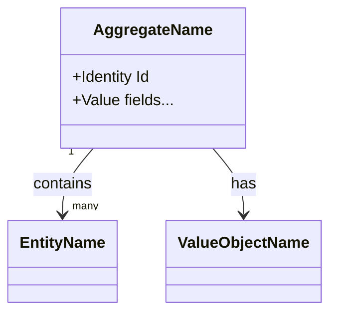

# Domain Model: <Bounded Context Name>

> Structural view of the domain model for this bounded context: aggregates,
> entities, value objects, and their relationships. Keep this in sync with
> `domain.md` (which describes responsibilities/invariants in prose) — this
> file focuses on structure and relationships.

## Model diagram

## Relationship notes

- Describe cardinalities, ownership direction, and any relationships that
  aren't obvious from the diagram alone (e.g. why an association is one-way,
  or why two aggregates only relate by id reference rather than direct
  object reference).
