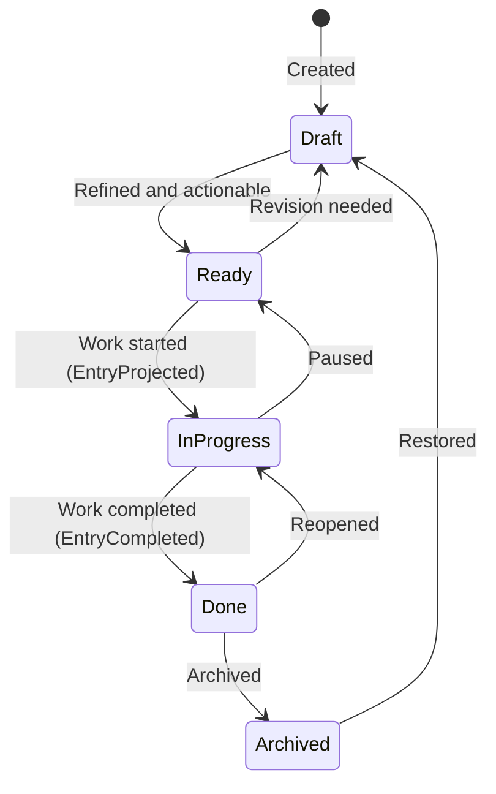

# Flow: Backlog Management

> Lifecycle and process flows for this bounded context. Flows describe how the
> aggregate moves through its states over time — complementary to `model.md`
> (structure) and `domain.md` (responsibilities/invariants).

## Backlog entry lifecycle

- The `Ready → InProgress` transition emits `EntryProjected` (one artifact per
  `repo_id`); `Done` emits `EntryCompleted` to close all projections.
