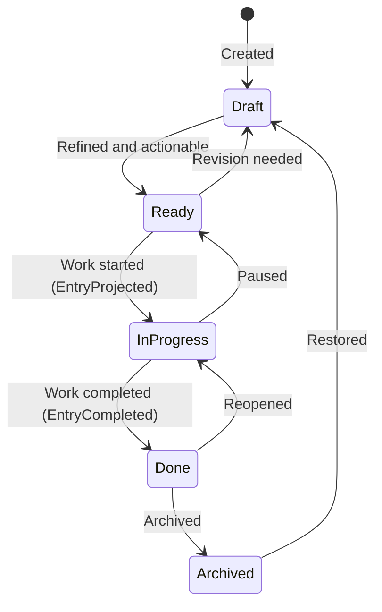
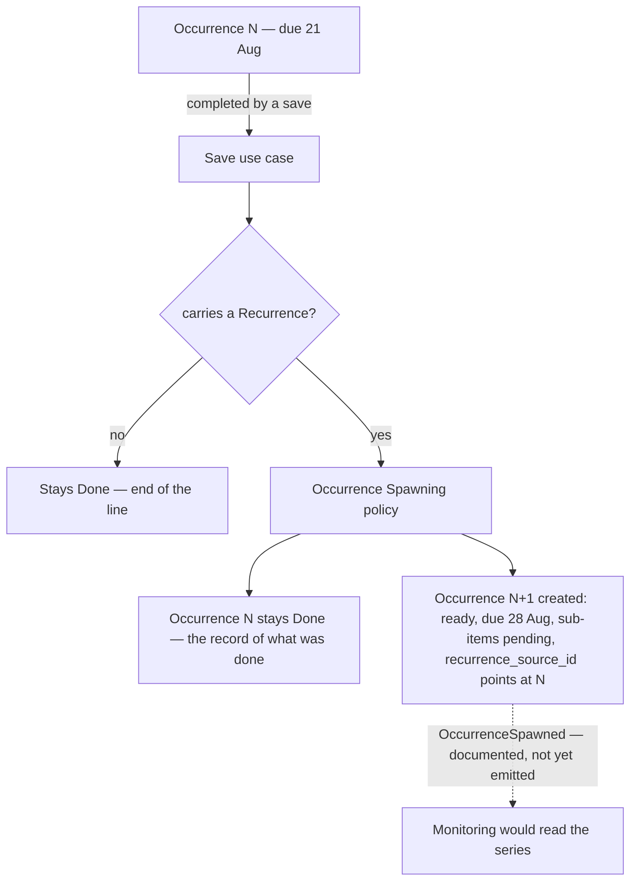
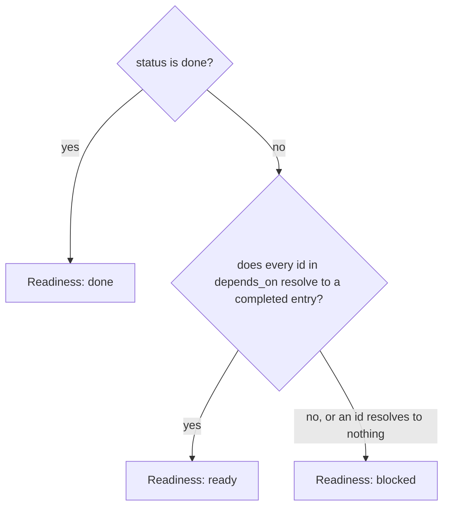

# Backlog Management

```meta
type: flow
status: draft
```

> Lifecycle and process flows for this bounded context. Flows describe how the
> aggregate moves through its states over time — complementary to `model.md`
> (structure) and `domain.md` (responsibilities/invariants).

## Backlog entry lifecycle



- The `Ready → InProgress` transition emits `EntryProjected` (one artifact per
  `repo_id`); `Done` emits `EntryCompleted` to close all projections.
- Scheduling attributes do not appear in this diagram, and that is deliberate.
  A due date, a reminder, a repeat and a My Day stamp are facts about when work
  is wanted, not lifecycle states — an overdue entry is still `ready`, and
  nothing has to move an entry between states as a clock advances.

## Recurring entry occurrences



- Completion does not roll one entry forward; it leaves the finished occurrence
  in place and creates the next as a separate aggregate with its own lifecycle.
  The link between them is `recurrence_source_id` — provenance, not ownership.
- The spawn is a synchronous step inside the save that completed the entry, drawn
  with a solid arrow. The dashed arrow is the event that would tell Monitoring
  about it, which this context documents but does not yet emit — so a consumer
  reads a series today by following `recurrence_source_id` rather than by
  subscribing.
- The next due date is calculated from the completed occurrence's `due_on`, not
  from the date it was actually finished, so lateness does not drift a schedule.
- What resets on the new occurrence: sub-items return to `pending`, and
  projections, usage history, `remind_at` and `in_my_day_on` do not carry over.
  What carries: title, body, type, priority, area, tags, `repo_ids`, and the
  `Recurrence` itself.

## Readiness derivation



- Readiness is derived on every read and never persisted, so completing one entry
  unblocks its dependents with nothing to recalculate or keep in sync.
- Readiness and `Entry Status` are orthogonal. Status is the recorded lifecycle
  state; readiness is a conclusion about whether the entry can be started. They
  share only `done`, and a recorded `done` wins over the derivation — an entry
  somebody marked done is done even if something it named is outstanding.
- An id that resolves to no visible entry leaves the entry blocked rather than
  ready. Treating it as satisfied would let a chain claim readiness when the step
  it waits on is merely missing from view.
- A dependency loop leaves every member blocked forever, which is a data
  condition to be named rather than a state to be resolved automatically. No
  invariant prevents one: a cycle spans aggregate boundaries, so no single entry
  can enforce its absence.
