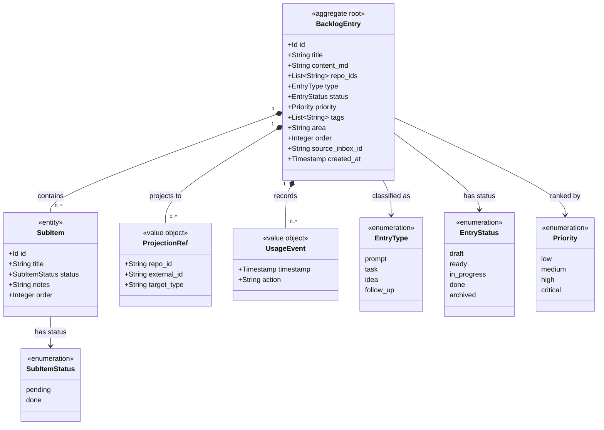

# Domain Model: Backlog Management

```meta
status: draft
```

> Structural view of the domain model for this bounded context: aggregates,
> entities, value objects, and their relationships. Keep this in sync with
> `domain.md` (which describes responsibilities/invariants in prose) — this
> file focuses on structure and relationships.

## Model diagram



## Relationship notes

- `BacklogEntry` is the aggregate root and the only consistency boundary.
  `SubItem` is an owned entity (identity within the aggregate only);
  `ProjectionRef` and `UsageEvent` are immutable value objects.
- `repo_ids` is a plain list of repository identifiers, not object references —
  Backlog stays decoupled from Repository Management. Projection turns each
  `repo_id` into a `ProjectionRef` when the entry starts work.
- `area` and `order` are plain scalars on the root, not separate value objects —
  they place the entry in the person's own working set (self-chosen grouping,
  manual rank) rather than describing the entry's business state, so they carry
  no relationships to other types.
