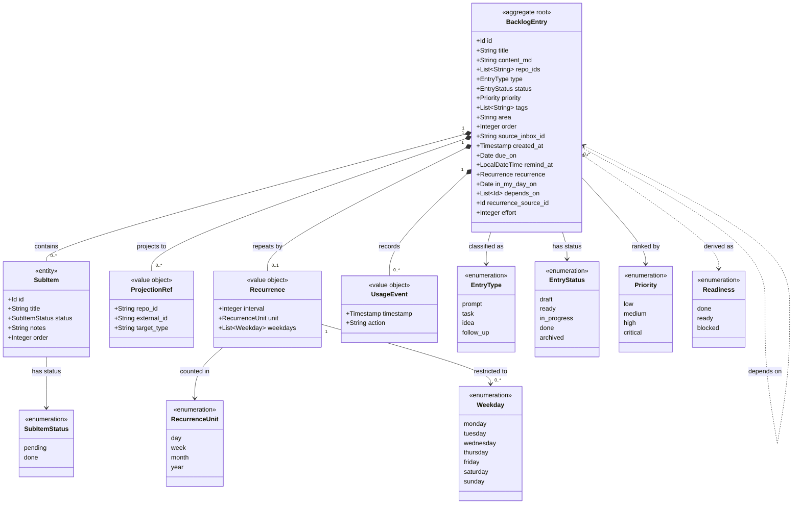

# Backlog Management

```meta
type: model
status: draft
```

> Structural view of the domain model for this bounded context: aggregates,
> entities, value objects, and their relationships. Keep this in sync with
> `domain.md` (which describes responsibilities/invariants in prose) — this
> file focuses on structure and relationships.

## Model diagram



## Relationship notes

- `BacklogEntry` is the aggregate root and the only consistency boundary.
  `SubItem` is an owned entity (identity within the aggregate only);
  `ProjectionRef`, `UsageEvent`, and `AIWorkLog` are immutable value objects.
- `repo_ids` is a plain list of repository identifiers, not object references —
  Backlog stays decoupled from Repository Management. Projection turns each
  `repo_id` into a `ProjectionRef` when the entry starts work.
- `area` and `order` are plain scalars on the root, not separate value objects —
  they place the entry in the person's own working set (self-chosen grouping,
  manual rank) rather than describing the entry's business state, so they carry
  no relationships to other types.
- `due_on`, `remind_at` and `in_my_day_on` are plain scalars on the root for the
  same reason, and they are three different kinds of fact rather than three
  spellings of one. `due_on` is a calendar date (a commitment to a day, with no
  time and no zone); `remind_at` is a local date and time held as wall-clock
  intent, so it means the same clock reading wherever the device is; and
  `in_my_day_on` is the date the entry was picked for the day, from which My Day
  membership is derived by comparing it against the reader's current local date.
  None of them is a `Timestamp`: `created_at` records when something happened and
  is an instant, while these three record what a person intended and are read
  against a local calendar.
- `Recurrence` is an owned value object rather than a scalar because a repeat has
  internal structure (`interval`, `unit`, and an optional `Weekday` set) and no
  identity of its own. It describes the shape of the repeat only; the date of the
  next occurrence is calculated by the `Occurrence Spawning` policy from `due_on`, and is
  never stored.
- `depends_on` is the one self-association on the diagram, and it is drawn dashed
  because it is a weak id reference rather than an object graph. Every
  `BacklogEntry` is its own aggregate root, so a dependency crosses an aggregate
  boundary and follows the `repo_ids` rule: plain identifiers, resolved by the
  reader rather than navigated. An id that resolves to nothing still counts as a
  dependency, so the association is not guaranteed to have a target.
- `Readiness` is attached with a dashed dependency, not an association, because
  it is derived and never persisted. It is computed from `depends_on` and the
  entries those ids resolve to on every read. `Readiness` and `EntryStatus` are
  orthogonal: status is the recorded lifecycle state, readiness is a conclusion
  about whether the entry can be started, and `done` is the one value they share
  — a recorded `done` status wins over any derivation.
- `recurrence_source_id` is a plain id in the same spirit as `source_inbox_id`:
  provenance pointing back at the entry an occurrence was spawned from, not
  ownership. A spawned occurrence is a separate aggregate with its own lifecycle,
  which is why there is no containment relationship between a series and its
  members.
- `effort` is a plain scalar on the root, not a value object: a non-negative
  integer of story points, three-valued at the edges (`null`/absent means "not
  estimated", `0` is a real zero-point estimate, a negative is rejected). It sizes
  the work rather than measuring time spent, so it is neither a `Timestamp` nor a
  duration, and it carries no relationship to another type. Roadmap Planning reads
  and totals it across the items it gathers but never registers it, which is why
  the field lives here and nowhere else.
