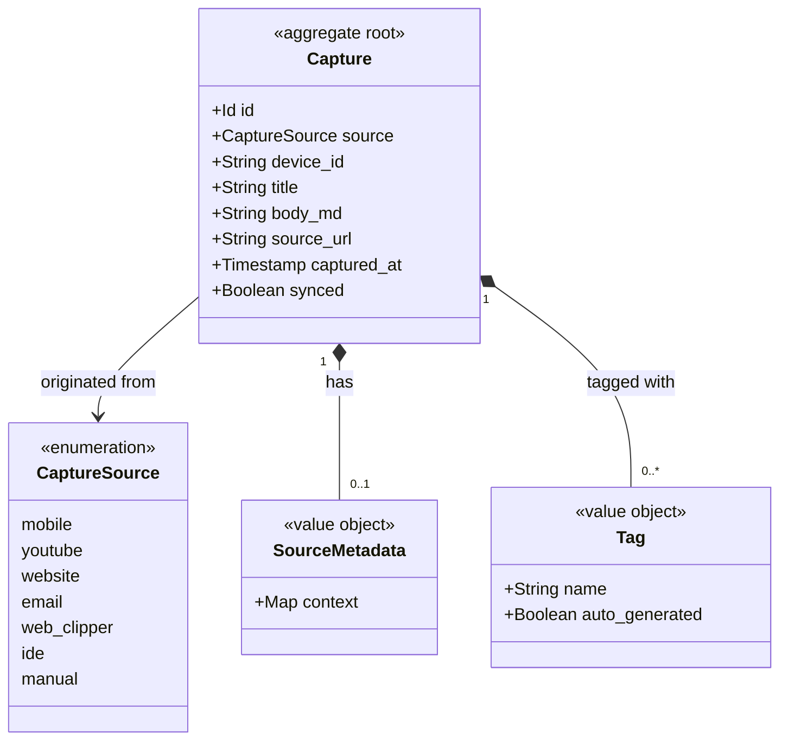

# Domain Model: Capture

> Structural view of the domain model for this bounded context: aggregates,
> entities, value objects, and their relationships. Keep this in sync with
> `domain.md` (which describes responsibilities/invariants in prose) — this
> file focuses on structure and relationships.

## Model diagram

## Relationship notes

- `Capture` is the aggregate root; there are no independently identifiable child
  entities. `SourceMetadata` and `Tag` are value objects owned by the root.
- `Capture Source` selects which `Source Adapter` produced the capture and
  determines the concrete keys present in `SourceMetadata`.
- Capture holds no reference to the resulting Inbox Item. Delivery is a one-way
  handoff via the `ItemCaptured` event; the Inbox owns the item's identity and
  lifecycle from that point on (see `dependencies.md`).
- Duplicate captures are intentionally allowed: the same logical content from two
  devices produces two distinct `Capture` instances with distinct ids.
