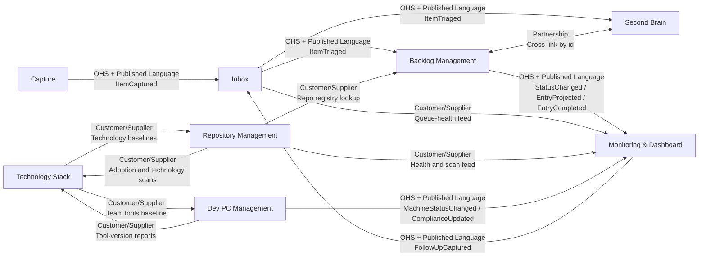

# Context Map: Backlog

```meta
status: draft
order: ["inbox", "capture", "backlog", "second-brain", "repository-management", "dev-pc-management", "monitoring", "technology-stack"]
```

> Strategic DDD view of the Backlog product domain: bounded-context roles,
> subdomain classification, and the relationships that carry work, knowledge,
> standards, and signals across the system.

> See also: `.arc42/03-context-and-scope.md` for the system-level context this
> map's bounded contexts sit inside, and `.arc42/05-building-block-view.md` for
> how these contexts are realized across the desktop, mobile, IDE, and cloud
> containers.

## Subdomain landscape

| Bounded context | Subdomain type | Why |
|---|---|---|
| Capture | Core | It is the front door for turning raw external input into normalized intent for the product. |
| Inbox | Core | It owns triage and the decision point where captured input becomes work, knowledge, deferral, or archive. |
| Backlog Management | Core | It owns the durable work model, prioritization, and multi-repository execution planning. |
| Second Brain | Core | It owns durable knowledge linked to work and makes knowledge reusable across projects. |
| Monitoring & Dashboard | Supporting | It observes the core flow and turns signals into visibility and follow-up actions rather than owning the work itself. |
| Technology Stack | Supporting | It supplies portfolio-wide standards, baselines, and deprecation policy to the core work contexts. |
| Repository Management | Supporting | It provides repository inventory, health, and dependency visibility used by the core work contexts. |
| Dev PC Management | Supporting | It provides machine inventory, compliance, and operator support capabilities for the work system. |

## Context map



## Published languages and contracts

| Contract owner | Published language / contract | Used by |
|---|---|---|
| Capture | `.domain/capture/domain.md#domain-event-itemcaptured` | Inbox |
| Inbox | `.domain/inbox/domain.md#domain-event-itemtriaged` | Backlog, Second Brain |
| Backlog Management | `.domain/backlog/domain.md#domain-event-statuschanged`, `.domain/backlog/domain.md#domain-event-entryprojected`, `.domain/backlog/domain.md#domain-event-entrycompleted` | Monitoring & Dashboard |
| Monitoring & Dashboard | `.domain/monitoring/domain.md#domain-event-followupcaptured` | Inbox |
| Dev PC Management | `.domain/dev-pc-management/domain.md#domain-event-machinestatuschanged`, `.domain/dev-pc-management/domain.md#domain-event-complianceupdated` | Monitoring & Dashboard |
| Technology Stack | `Technology Baseline` / `BaselineProvided` contract in `.domain/technology-stack/domain.md#domain-service-deprecation-management` | Dev PC Management, Repository Management |

## Strategic rules

- Only the owning context defines a published language. Consumers conform to that
  contract and do not reach into the supplier's internal aggregate shape.
- `Backlog Management` and `Second Brain` are a deliberate `Partnership`: both
  sides keep only foreign ids and the link semantics are coordinated through the
  Cross-Linking service rather than a shared aggregate.
- `Technology Stack` is the standards supplier for both `Repository Management`
  and `Dev PC Management`; those contexts may cache or copy baselines locally,
  but they do not become the authority for baseline meaning.
- `Monitoring & Dashboard` is an observer/read context. Its only write-back into
  the core flow is the published `FollowUpCaptured` contract into `Inbox`.

