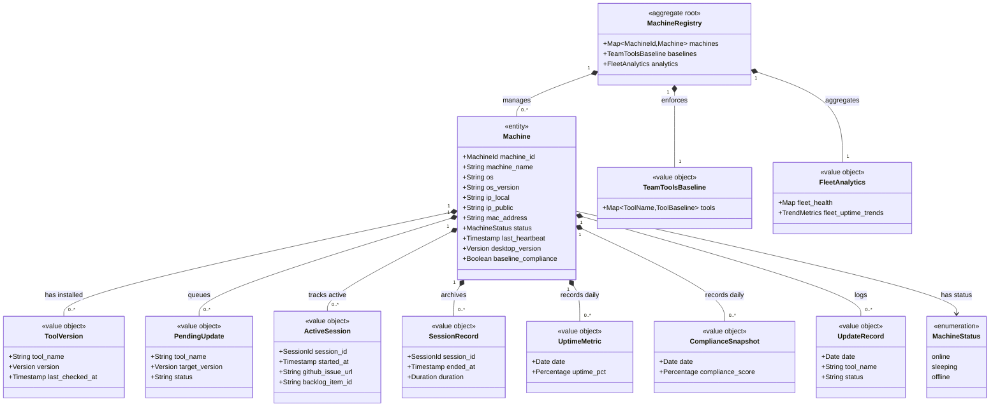

# Domain Model: Dev PC Management

```meta
status: draft
```

> Structural view of the domain model for this bounded context: aggregates,
> entities, value objects, and their relationships. Keep this in sync with
> `domain.md` (which describes responsibilities/invariants in prose) — this
> file focuses on structure and relationships.

## Model diagram



## Relationship notes

- `MachineRegistry` is the single aggregate root (global singleton). `Machine` is
  its owned entity; everything else is an immutable value object.
- `TeamToolsBaseline` is a local copy of versions consumed from Technology Stack;
  compliance is computed against it, not against a live foreign aggregate.
- Active vs. archived sessions are deliberately split (`ActiveSession` in
  `copilot_sessions`, `SessionRecord` in `session_history`); likewise queued vs.
  executed updates (`PendingUpdate` → `UpdateRecord`).
- `ToolBaseline` and `TrendMetrics` (see `domain.md`) are nested value objects of
  `TeamToolsBaseline` and `FleetAnalytics` respectively.
