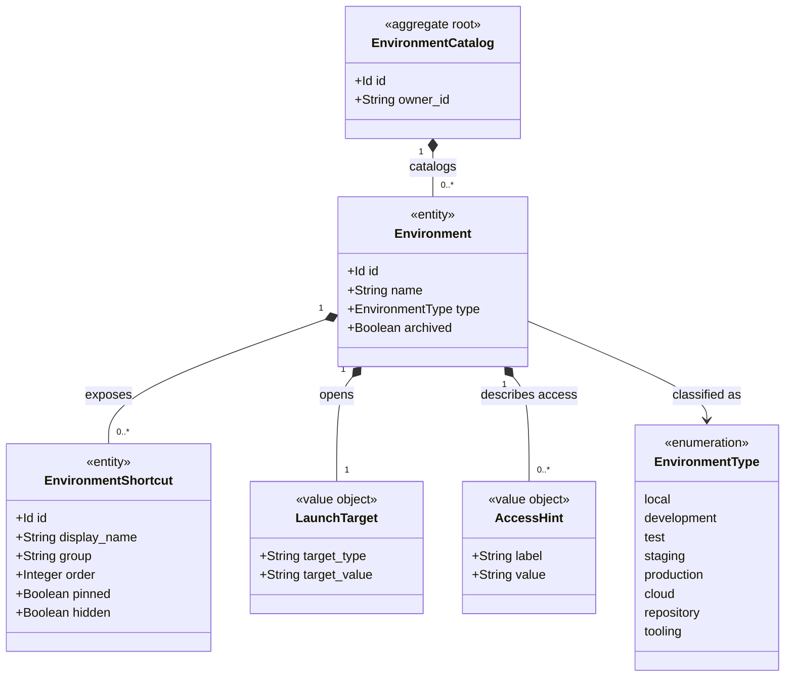

# Domain Model: Environment

```meta
status: draft
```

> Structural view of the domain model for this bounded context: aggregates,
> entities, value objects, and their relationships. Keep this in sync with
> `domain.md` (which describes responsibilities/invariants in prose) - this
> file focuses on structure and relationships.

## Model diagram



## Relationship notes

- `EnvironmentCatalog` owns the user's quick-access configuration.
- `Environment` is an owned entity because it has identity inside the catalog and
  can have multiple shortcuts.
- `LaunchTarget` and `AccessHint` are value objects. `AccessHint` never stores
  secrets, only references or reminders.