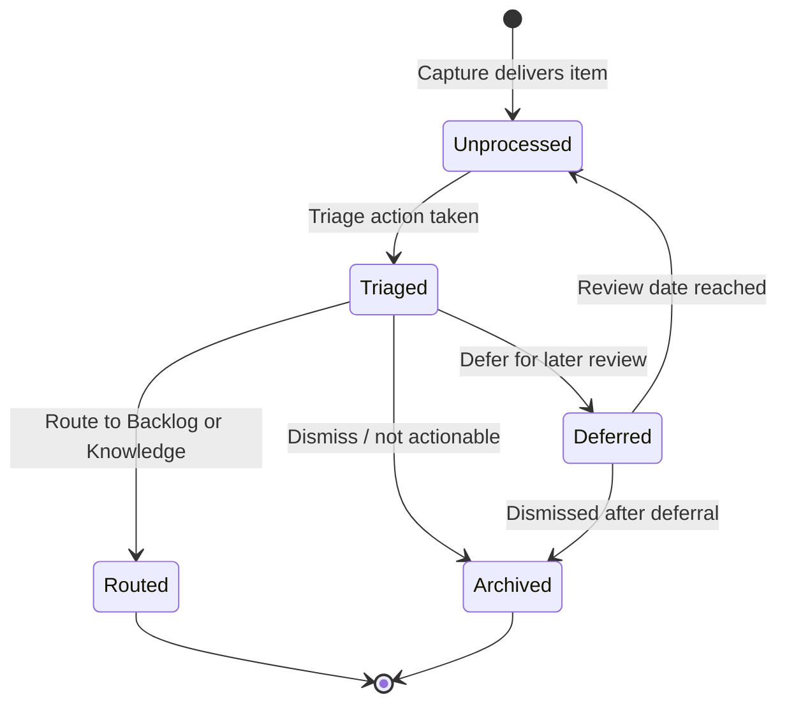

# Flow: Inbox

```meta
status: draft
```

> Lifecycle and process flows for this bounded context. Flows describe how an
> inbox item moves through its states over time — complementary to `model.md`
> (structure) and `domain.md` (responsibilities/invariants).

## Inbox item lifecycle



- `Routed` is not a stored status value — it is the terminal outcome of triage
  represented by the presence of a `RoutingTarget` plus emission of
  `ItemTriaged`; the persisted `status` remains `triaged`.
