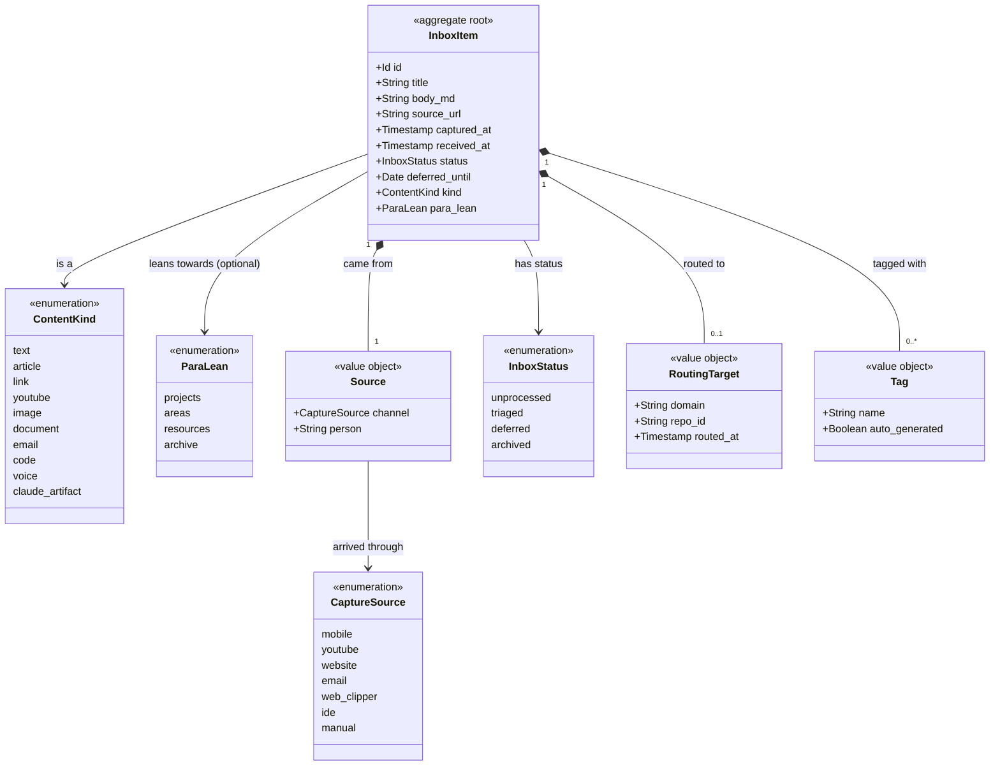

# Inbox

```meta
type: model
status: draft
```

> Structural view of the domain model for this bounded context: aggregates,
> entities, value objects, and their relationships. Keep this in sync with
> `domain.md` (which describes responsibilities/invariants in prose) — this
> file focuses on structure and relationships.

## Model diagram



## Relationship notes

- `InboxItem` is the aggregate root; `Tag`, `RoutingTarget` and `Source` are
  owned value objects.
- `Source` carries the `CaptureSource` channel (mirrored from Capture) and the
  optional person who shared the item; the channel is no longer a bare field on
  the root.
- `ContentKind` says what the content is; `CaptureSource` says how it arrived.
  The two are independent — the same video can arrive through any channel.
- `ParaLean` is optional and is a reading aid over the unprocessed queue; it
  never stands in for `RoutingTarget`.
- `captured_at` is set by Capture and preserved; `received_at` is set by the
  Inbox on intake — the two are kept distinct on purpose.
- Routing does not embed the target aggregate; it records the destination
  (`domain`, optional `repo_id`) and hands off via `ItemTriaged`. Tasks and
  Second Brain own the created entities.
