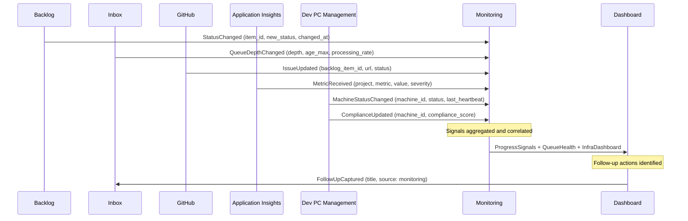

# Flow: Monitoring & Dashboard

```meta
status: draft
```

> Lifecycle and process flows for this bounded context. Flows describe how
> signals move across contexts over time — complementary to `model.md`
> (structure) and `domain.md` (responsibilities/invariants).

## Signal flow



- The only write Monitoring makes into another context is `FollowUpCaptured` to
  the Inbox, closing the observe → act loop.
