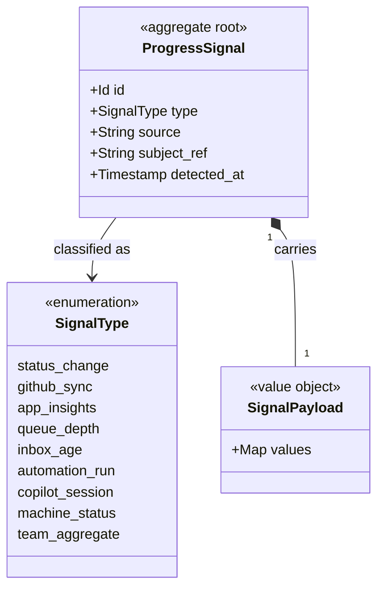
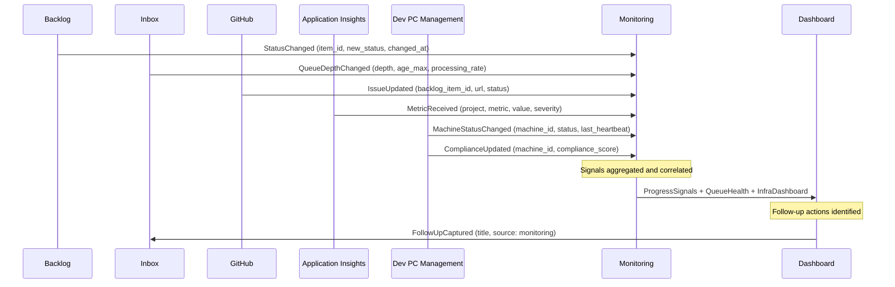

# Domain Model: Monitoring & Dashboard

> Structural view of the domain model for this bounded context: aggregates,
> entities, value objects, and their relationships. Keep this in sync with
> `domain.md` (which describes responsibilities/invariants in prose) — this
> file focuses on structure and relationships.

## Model diagram

## Signal flow

## Relationship notes

- `ProgressSignal` is an immutable aggregate root; `SignalPayload` is its owned
  value object whose keys depend on `SignalType`. Corrections are new signals,
  never mutations.
- Signals reference their subject by id/URL (`subject_ref`) only — Monitoring
  never holds foreign aggregates, so it stays a read/observer context.
- Dashboards and rollups are produced by the Signal Aggregation and Dashboard
  services from the signal stream; they are not persisted aggregates here.
- The only write Monitoring makes into another context is `FollowUpCaptured` to
  the Inbox, closing the observe → act loop.
