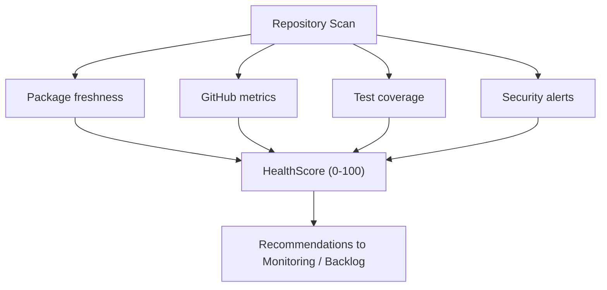

# Repository Management

```meta
type: flow
status: draft
```

> Lifecycle and process flows for this bounded context. Flows describe how a
> repository scan turns into a health score and downstream actions —
> complementary to `model.md` (structure) and `domain.md`
> (responsibilities/invariants).

## Health scoring flow


