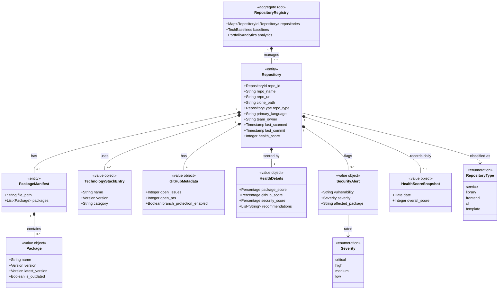

# Repository Management

```meta
type: model
status: draft
```

> Structural view of the domain model for this bounded context: aggregates,
> entities, value objects, and their relationships. Keep this in sync with
> `domain.md` (which describes responsibilities/invariants in prose) — this
> file focuses on structure and relationships.

## Model diagram



## Relationship notes

- `RepositoryRegistry` is the single aggregate root (global singleton).
  `Repository` and `PackageManifest` are owned entities; the rest are value
  objects. `PackageManifest` identity is `(repo_id, file_path)`.
- Daily history value objects (`PackageFreshnessMetric`, `HealthScoreSnapshot`,
  `GitHubHealthMetric`, `TechnologySnapshot`, see `domain.md`) roll up into
  `PortfolioAnalytics`; only the root writes them.
- `TechBaselines` is a local copy consumed from Technology Stack; repos are
  validated against it without holding the foreign aggregate.
- `repo_id` aligns with the Backlog `repo_ids` and the workspace `repos.json`
  registry so a repo resolves consistently across contexts.
