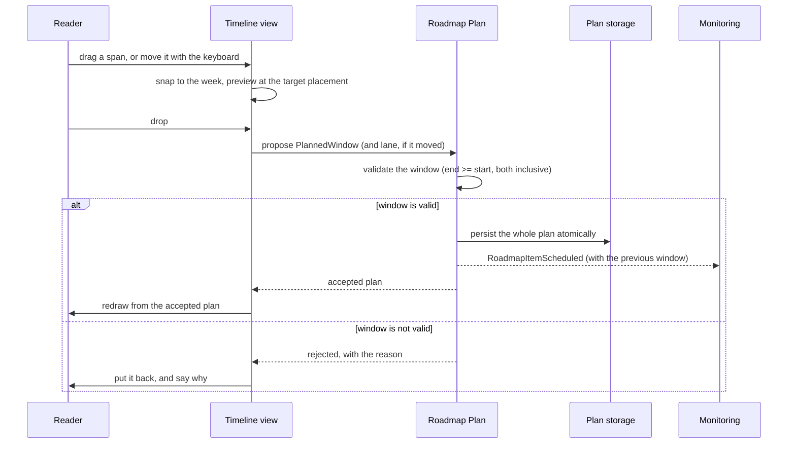
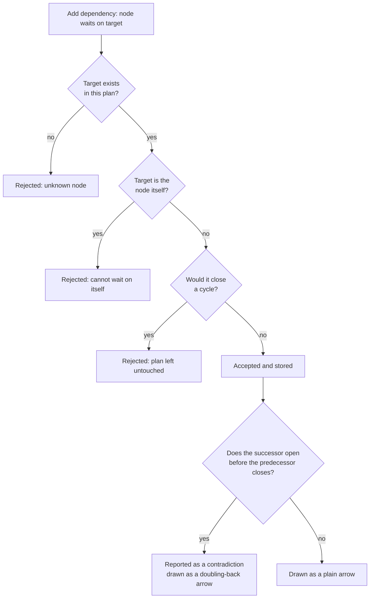
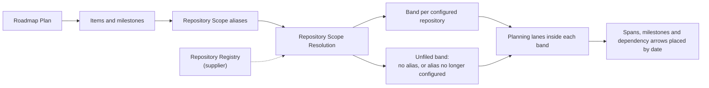

# Flow: Roadmap Planning

```meta
status: draft
related: [.domain/roadmap/domain.md#aggregate-roadmap-plan, .domain/roadmap/domain.md#domain-service-plan-sequencing]
```

> Lifecycle and process flows for this bounded context: how a plan changes and
> how a proposed change is accepted or refused. Complementary to `model.md`
> (structure) and `domain.md` (responsibilities/invariants).

## Rescheduling flow

A reschedule starts as a *proposal*, not a change. The view that draws the plan
never edits it: it reports where something was dropped, the plan decides whether
that placement stands, and the view redraws from what it gets back. Nothing is
persisted until the plan has accepted it.



- A drop that moves nothing — less than half a week travelled, or an edge clamped
  against the opposite edge — produces **no proposal at all**. Picking something
  up and putting it down must not rewrite a plan the reader only wanted to look
  at.
- A reschedule never touches dependencies. Dependent work is *not* dragged along:
  the plan is allowed to contradict itself, and that contradiction is the reader's
  cue (see below).
- The event carries the previous window, so a consumer can tell a first plan from
  a change without keeping its own history.

## Dependency validation flow



- The three rejections are refusals to store, not warnings. The plan is unchanged
  and the reason is returned to the caller.
- The contradiction check is the opposite: it never refuses anything. Dates that
  do not fit are a normal, temporary state of a plan being worked out, and the
  arrow that has to double back through the gutter is how the reader sees it.
- Cycle detection walks the whole graph reachable from the target. It is an
  invariant of the plan rather than of a node, which is why it is checked on the
  root before the edge is accepted.

## Reading the plan by repository



- Resolution happens on the **read** path only. Nothing in the plan is rewritten
  when the registry changes, so a repository removed today and configured again
  tomorrow leaves the plan exactly as it was.
- An item naming several repositories is drawn **once**, under the first of its
  repositories that is configured, and stays findable under any of them because
  the filter is built from what it names rather than from where it was drawn.
  Drawing it in every band it belongs to was the first intention and is the wrong
  one: one piece of work with one set of dates would appear as several bars, and
  dragging one of them would move work the reader was not looking at — a plan that
  seems to disagree with itself because of how it was drawn.
