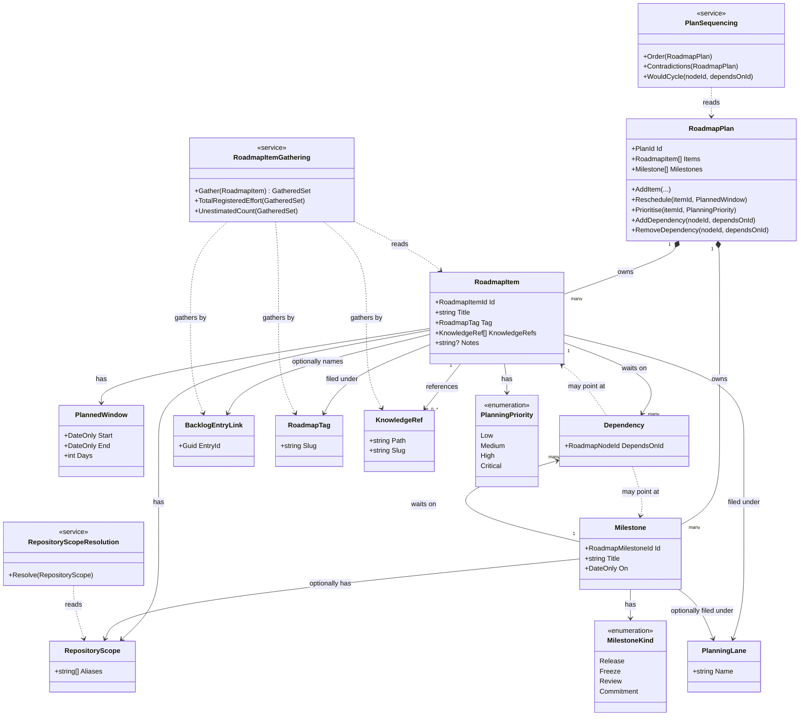

# Domain Model: Roadmap Planning

```meta
status: draft
related: [.domain/roadmap/domain.md#aggregate-roadmap-plan]
```

> Structural view of the domain model for this bounded context: aggregates,
> entities, value objects, and their relationships. Keep this in sync with
> `domain.md` (which describes responsibilities/invariants in prose) — this file
> focuses on structure and relationships. Lifecycle and process flows live in
> `flow.md`.

## Model diagram



## Relationship notes

- `RoadmapPlan` is a **singleton per workspace** — one plan per storage location,
  not one per repository or per project. There is no `Plan` selector in the model
  because a person has one set of intentions, read in different groupings.
- `RoadmapItem` and `Milestone` are owned entities, not aggregates. They are drawn
  with composition because they have no life outside the plan: deleting the plan
  deletes them, and neither can be loaded, validated, or saved on its own.
- `Dependency` points at a **Roadmap Node** — the union of `RoadmapItem` and
  `Milestone` — which is why both dotted associations leave the same class. There
  is no inheritance between item and milestone: they share an id space and a role
  as a dependency endpoint, and nothing else. Modelling a common base class would
  suggest a shared lifecycle they do not have.
- The dependency association is **one-way, and held by the waiting side**. The
  plan can answer "what depends on this" by scanning, and does; storing the
  reverse edge as well would create two places for one fact to be wrong.
- `RepositoryScope` holds aliases as **plain strings, by value** — never a
  reference to a `Repository` from
  [Repository Management](../repository-management/model.md). That is what keeps
  the two contexts independent, and it is why resolution is a service on the read
  path rather than a navigation in the model.
- `BacklogEntryLink` is likewise **an id, not an association**. There is no line
  from `RoadmapItem` to `BacklogEntry` in this diagram, and there deliberately
  cannot be: they are separate aggregates in separate contexts, related by
  Partnership (see `dependencies.md`).
- `RoadmapTag` is a **value object held by the item, not a shared registry**. Every
  item has exactly one; there is no `Tag` table the items point into, because two
  items are allowed to carry the same slug and a shared row would imply a
  uniqueness the model refuses. It is derived from the title at creation and then
  independent of it — the diagram shows no relationship from `Title` to `Tag`,
  which is the point: renaming the title does not touch the tag.
- `KnowledgeRef` is **an id-shaped reference, not an association**, for the same
  reason as `BacklogEntryLink`: the chapter it names lives in
  [Second Brain](../second-brain/model.md), so there is no line to it and no
  navigation through it. Both foreign references may dangle and neither is
  validated.
- `RoadmapItemGathering` is drawn as a service because the thing it computes is not
  in any node's own state. It reads the item's tag and named references, then reads
  **foreign** data — Backlog Entries and knowledge chapters — to gather and total.
  The dotted lines to `RoadmapTag`, `BacklogEntryLink`, and `KnowledgeRef` are the
  two threads it follows; the foreign entries and chapters themselves are not on
  this diagram because they are not this context's model.
- `PlanSequencing` and `RepositoryScopeResolution` are drawn as services for the
  same reason — neither answer belongs to a single node's own state: the first
  needs the whole graph, the second a foreign registry.
- Both enumerations are the plan's own. `PlanningPriority` shares its four values
  with Backlog Management's `Priority` on purpose, but the two are distinct types;
  there is no association between them and no conversion in either direction.
