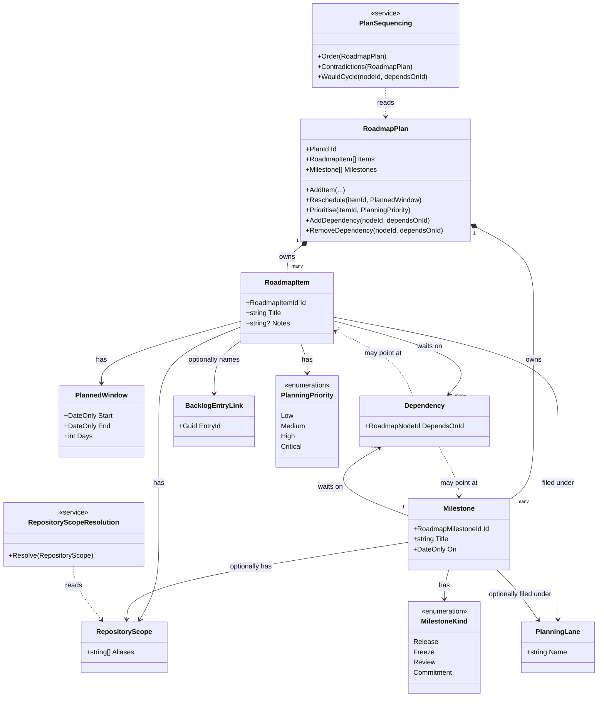

# Domain Model: Roadmap Planning

```meta
status: draft
related: [.domain/roadmap/domain.md#aggregate-roadmap-plan]
```

> Structural view of the domain model for this bounded context: aggregates,
> entities, value objects, and their relationships. Keep this in sync with
> `domain.md` (which describes responsibilities/invariants in prose) — this file
> focuses on structure and relationships. Lifecycle and process flows live in
> `flow.md`.

## Model diagram



## Relationship notes

- `RoadmapPlan` is a **singleton per workspace** — one plan per storage location,
  not one per repository or per project. There is no `Plan` selector in the model
  because a person has one set of intentions, read in different groupings.
- `RoadmapItem` and `Milestone` are owned entities, not aggregates. They are drawn
  with composition because they have no life outside the plan: deleting the plan
  deletes them, and neither can be loaded, validated, or saved on its own.
- `Dependency` points at a **Roadmap Node** — the union of `RoadmapItem` and
  `Milestone` — which is why both dotted associations leave the same class. There
  is no inheritance between item and milestone: they share an id space and a role
  as a dependency endpoint, and nothing else. Modelling a common base class would
  suggest a shared lifecycle they do not have.
- The dependency association is **one-way, and held by the waiting side**. The
  plan can answer "what depends on this" by scanning, and does; storing the
  reverse edge as well would create two places for one fact to be wrong.
- `RepositoryScope` holds aliases as **plain strings, by value** — never a
  reference to a `Repository` from
  [Repository Management](../repository-management/model.md). That is what keeps
  the two contexts independent, and it is why resolution is a service on the read
  path rather than a navigation in the model.
- `BacklogEntryLink` is likewise **an id, not an association**. There is no line
  from `RoadmapItem` to `BacklogEntry` in this diagram, and there deliberately
  cannot be: they are separate aggregates in separate contexts, related by
  Partnership (see `dependencies.md`).
- `PlanSequencing` and `RepositoryScopeResolution` are drawn as services because
  neither answer belongs to a single node's own state — the first needs the whole
  graph, the second needs a foreign registry.
- Both enumerations are the plan's own. `PlanningPriority` shares its four values
  with Backlog Management's `Priority` on purpose, but the two are distinct types;
  there is no association between them and no conversion in either direction.
