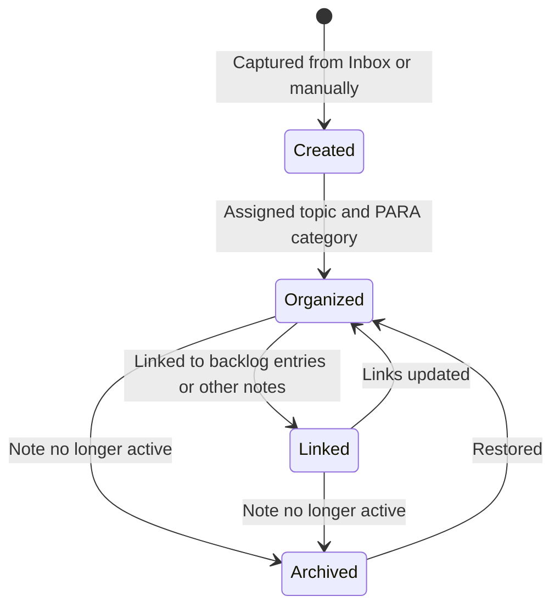

# Flow: Second Brain

```meta
status: draft
```

> Lifecycle and process flows for this bounded context. Flows describe how a
> knowledge note moves through its workflow phases over time — complementary to
> `model.md` (structure) and `domain.md` (responsibilities/invariants).

## Knowledge note lifecycle



- The lifecycle states (Created/Organized/Linked/Archived) are workflow phases,
  not a stored enum field; `PARA Category` = `archive` is the persisted archived
  state.
