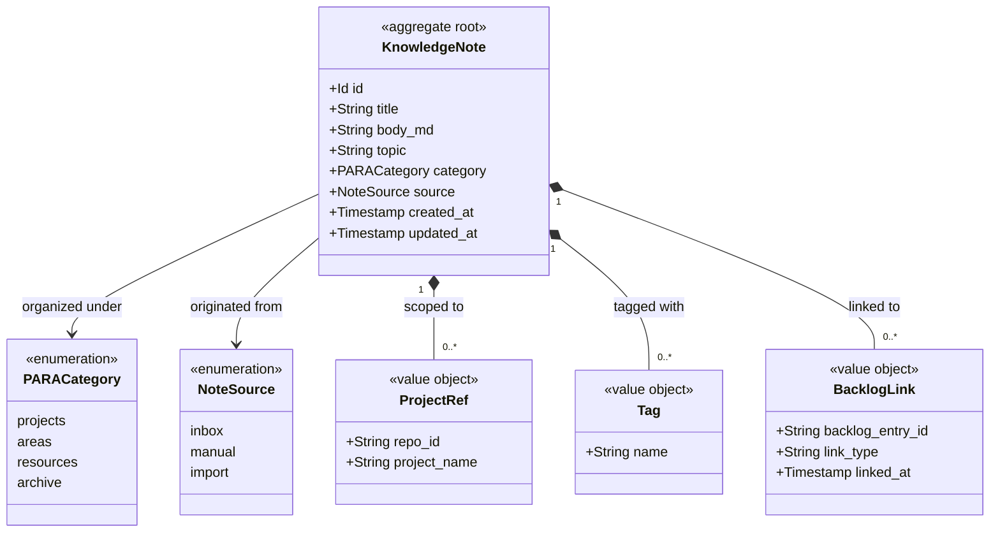

# Domain Model: Second Brain

```meta
status: draft
```

> Structural view of the domain model for this bounded context: aggregates,
> entities, value objects, and their relationships. Keep this in sync with
> `domain.md` (which describes responsibilities/invariants in prose) — this
> file focuses on structure and relationships.

## Model diagram



## Relationship notes

- `KnowledgeNote` is the aggregate root; `ProjectRef`, `Tag`, and `BacklogLink`
  are owned value objects. There are no separately identified child entities.
- `BacklogLink` references a Backlog Entry by id only, never by object reference,
  so the two contexts stay decoupled; the Cross-Linking service keeps both
  directions consistent.
