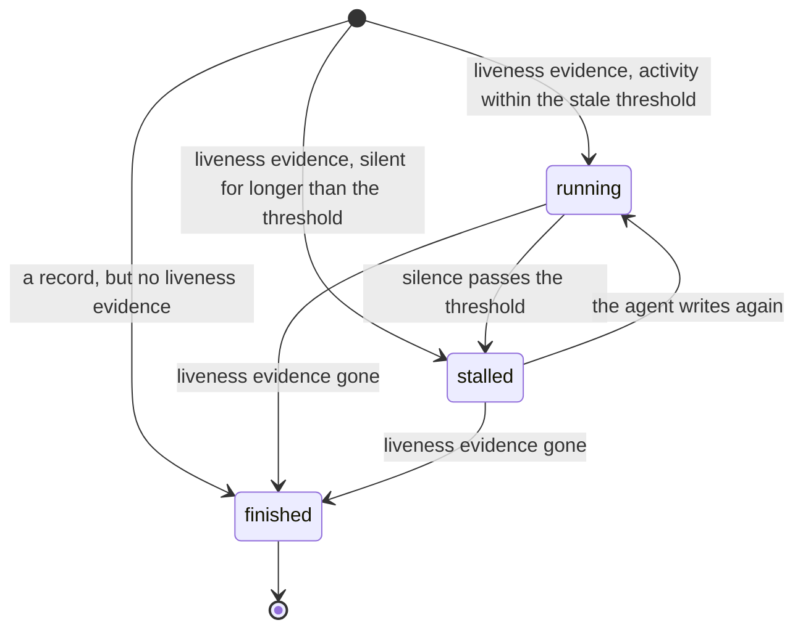
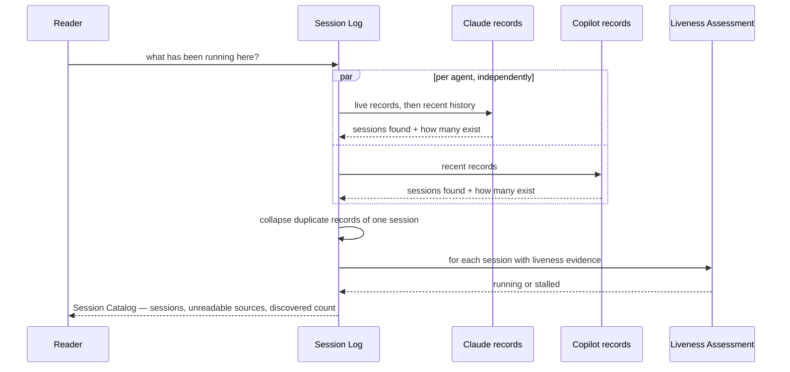

# Flow: Sessions

```meta
status: active
related: [.domain/sessions/domain.md#domain-service-liveness-assessment]
```

> Lifecycle and process flows for this bounded context: how aggregates move through
> their states and how work moves across the context over time. Complementary to
> `model.md` (structure) and `domain.md` (responsibilities/invariants).

## How a session reads

The states below are **the result of a reading, not a stored lifecycle.** Nothing in
this context transitions a session; each reading looks at the evidence available at
that moment and says what it means. That is why the edges are labelled with what the
evidence shows rather than with events, and why every state can be reached directly
from a fresh reading.



- `running` and `stalled` are the same evidence read against a different clock, which
  is why the pair can move back and forth: a session that goes quiet for an hour and
  then resumes was never anything but running.
- `finished` is terminal **for a given identity**. Nothing brings a session back from
  it, because the thing that would have to reappear — the agent's liveness record — is
  written per process and a resumed session is a new process, not a revived one.
- There is no `failed`. A record that stops says nothing about whether the session was
  answered, abandoned or crashed, and this context does not guess between them.

## How an environment's sessions are read



- **The agents are asked independently and their failures are collected, not
  thrown.** An environment with only one agent installed is the ordinary case, and one
  source being unreadable must not cost the reader the other's sessions. Each source
  either contributes its sessions or contributes its name to `unreadable`.
- **Duplicates are collapsed before anything else.** One session can leave more than
  one record — a live marker per process and a transcript — and the aggregate's first
  invariant is that it appears once. The most recent evidence wins, because that is the
  process actually running.
- **Liveness is assessed last, per session, against one clock.** A single clock per
  reading is what makes two sessions in the same list comparable; assessing each
  against its own would let one row be stale relative to another.
- **How many exist travels back with what was described.** The reading may stop at the
  most recent sessions per agent, so the count of what it found is part of the answer
  rather than something the reader has to go and check.
